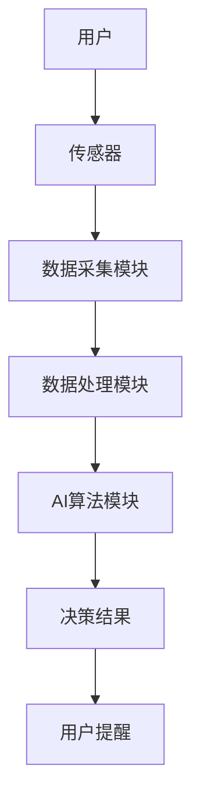
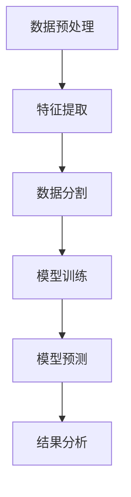
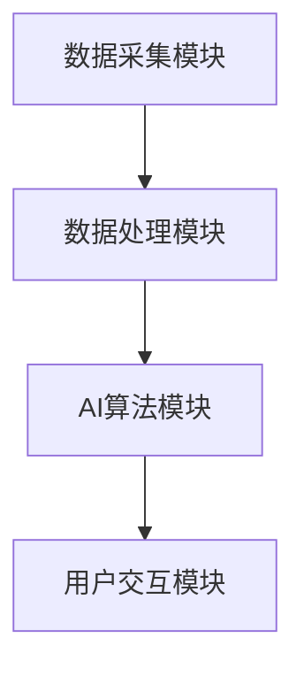

                 


# 智能厨房置物架：AI Agent的食材新鲜度监控

## 关键词：智能厨房，AI Agent，食材新鲜度，物联网，传感器技术，数据挖掘

## 摘要：  
随着智能家居的快速发展，厨房的智能化成为现代生活的趋势。本文将介绍一种基于AI Agent的智能厨房置物架系统，该系统能够实时监控食材的新鲜度，帮助用户更好地管理食材。通过传感器数据采集、AI算法分析和智能提醒，该系统能够有效延长食材的保鲜时间，提升用户体验。本文将从背景、技术原理、系统架构到实际应用进行全面分析，为智能厨房的未来发展提供参考。

---

# 第1章: 智能厨房置物架的背景与需求

## 1.1 智能厨房的发展与现状  
智能家居的普及为现代生活带来了诸多便利，厨房作为家庭中最重要的功能区域之一，也在逐步实现智能化。传统的厨房置物架仅具备存储功能，无法满足现代用户对食材管理的智能化需求。随着物联网（IoT）和人工智能（AI）技术的快速发展，智能厨房置物架开始逐渐进入市场，成为智能家居领域的新宠。

## 1.2 食材管理中的问题与挑战  
在日常生活中，食材的新鲜度管理是一个常见的问题。传统的方式依赖于用户的主观判断，容易出现食材过期或浪费的情况。具体挑战包括：  
1. **食材存储条件多样化**：不同食材对温度、湿度等条件的要求不同。  
2. **食材新鲜度的实时监测**：传统方法无法实时反馈食材的状态。  
3. **用户行为的多样性**：不同用户的食材购买习惯和使用习惯差异较大，需要系统具备灵活性和适应性。  

## 1.3 AI Agent在食材监控中的解决方案  
AI Agent（智能体）是一种能够感知环境、自主决策并执行任务的智能系统。通过AI Agent技术，智能厨房置物架可以实现以下功能：  
1. **实时感知**：通过传感器采集食材的状态数据（如温度、湿度、气体浓度等）。  
2. **智能决策**：基于数据进行分析，判断食材的新鲜度并提出建议（如及时使用或丢弃）。  
3. **用户交互**：通过手机APP或语音助手向用户发送提醒信息。  

## 1.4 本章小结  
本章介绍了智能厨房的发展现状，分析了食材管理中存在的问题与挑战，并提出了基于AI Agent的解决方案。AI Agent技术的应用为智能厨房置物架提供了强大的技术支持，能够有效提升食材管理的效率和用户体验。

---

# 第2章: AI Agent的核心概念与实现

## 2.1 AI Agent的定义与核心要素  
AI Agent是一种能够感知环境、自主决策并执行任务的智能实体。其核心要素包括：  
1. **感知模块**：通过传感器或其他信息源获取环境数据。  
2. **决策模块**：基于感知数据进行分析和推理，制定行动方案。  
3. **执行模块**：根据决策结果执行具体操作（如发送提醒、调节环境参数等）。  

## 2.2 实体关系分析  
为了更好地理解AI Agent在食材监控中的应用，我们通过ER图（实体关系图）来展示系统的各个组件及其关系：  

```mermaid
erdiagram
actor 用户 {
    id 用户ID
    名称 名称
}
actor 系统管理员 {
    id 管理员ID
    名称 名称
}
actor 传感器 {
    id 传感器ID
    类型 类型
}
actor 数据存储 {
    id 数据ID
    数据内容 内容
}
```

## 2.3 数据流分析  
以下是AI Agent在食材监控中的数据流分析图：  



## 2.4 本章小结  
本章详细介绍了AI Agent的核心概念，并通过ER图和数据流图展示了系统中各个组件的关系和数据流动过程。这些分析为后续的系统设计和实现奠定了基础。

---

# 第3章: 基于AI Agent的食材新鲜度监控算法原理

## 3.1 数据采集与特征提取  
### 3.1.1 数据采集模块  
传感器是AI Agent获取食材状态信息的关键设备。常用的传感器包括：  
- 温度传感器：监测食材的存储温度。  
- 湿度传感器：监测食材的存储湿度。  
- 气体传感器：监测食材释放的气体（如乙烯）。  

### 3.1.2 数据预处理  
为了提高算法的准确性，需要对采集到的数据进行预处理，包括：  
1. **去噪处理**：去除传感器噪声。  
2. **归一化处理**：将数据标准化到统一范围内。  

### 3.1.3 特征提取  
从原始数据中提取特征是分类算法的关键步骤。常见的特征包括：  
- 温度：食材的存储温度。  
- 湿度：食材的存储湿度。  
- 气体浓度：食材释放的气体浓度。  

## 3.2 分类算法实现  
### 3.2.1 支持向量机（SVM）  
支持向量机是一种常用的分类算法，适用于高维数据的分类问题。其数学模型如下：  

$$ \text{目标函数}：\min_{w,b,\xi} \frac{1}{2}||w||^2 + C\sum_{i=1}^n \xi_i $$  
$$ \text{约束条件}：y_i(w \cdot x_i + b) \geq 1 - \xi_i, \xi_i \geq 0 $$  

其中，$w$是权重向量，$b$是偏置项，$\xi_i$是松弛变量，$C$是惩罚系数。  

### 3.2.2 算法流程图  
以下是支持向量机的算法流程图：  



## 3.3 本章小结  
本章介绍了食材新鲜度监控的核心算法——支持向量机（SVM），并详细描述了算法的实现流程。通过传感器数据的采集、预处理和特征提取，结合SVM算法，可以实现对食材新鲜度的准确分类和预测。

---

# 第4章: 系统架构与实现方案

## 4.1 系统功能模块划分  
智能厨房置物架系统主要包括以下几个功能模块：  
1. **数据采集模块**：负责采集食材的状态数据。  
2. **数据处理模块**：对采集到的数据进行预处理和特征提取。  
3. **AI算法模块**：基于特征数据进行分类和预测。  
4. **用户交互模块**：向用户发送食材新鲜度提醒信息。  

## 4.2 系统架构设计  
以下是系统的整体架构图：  



## 4.3 系统接口设计  
系统主要接口包括：  
1. **传感器接口**：与温度、湿度和气体传感器连接。  
2. **用户接口**：通过手机APP或语音助手与用户交互。  
3. **数据存储接口**：与云端数据库或本地数据库连接。  

## 4.4 本章小结  
本章详细描述了智能厨房置物架系统的架构设计和功能模块划分，为系统的实现提供了清晰的指导。

---

# 第5章: 项目实战与案例分析

## 5.1 环境安装  
要实现基于AI Agent的食材新鲜度监控系统，首先需要安装以下环境：  
- **硬件**：温度传感器、湿度传感器、气体传感器、Raspberry Pi等。  
- **软件**：Python编程语言、机器学习库（如scikit-learn）、数据可视化库（如Matplotlib）。  

## 5.2 系统核心实现  
以下是系统的Python实现代码：  

```python
import numpy as np
from sklearn import svm

# 数据预处理
def preprocess(data):
    # 归一化处理
    normalized_data = (data - np.mean(data)) / np.std(data)
    return normalized_data

# 特征提取
def extract_features(data):
    features = []
    for sample in data:
        # 提取温度、湿度和气体浓度特征
        features.append([sample['temperature'], sample['humidity'], sample['gas_concentration']])
    return features

# 模型训练
def train_model(features, labels):
    clf = svm.SVC()
    clf.fit(features, labels)
    return clf

# 模型预测
def predict Freshness(model, features):
    return model.predict(features)

# 示例数据
data = [
    {'temperature': 4, 'humidity': 60, 'gas_concentration': 100},  # 新鲜
    {'temperature': 8, 'humidity': 70, 'gas_concentration': 150},  # 不新鲜
    # 更多数据...
]

features = extract_features(data)
labels = ['新鲜', '不新鲜']

model = train_model(features, labels)
result = predict(model, extract_features([{'temperature': 5, 'humidity': 65, 'gas_concentration': 120}]))
print(result)
```

## 5.3 案例分析  
假设我们有以下两组数据：  
1. **样本1**：温度=5℃，湿度=65%，气体浓度=120ppm。  
2. **样本2**：温度=8℃，湿度=70%，气体浓度=150ppm。  

通过模型预测，样本1的食材是新鲜的，而样本2的食材已经不新鲜。  

## 5.4 本章小结  
本章通过实际案例展示了如何使用Python代码实现食材新鲜度监控系统。通过代码实现和案例分析，读者可以更好地理解系统的实际应用。

---

# 第6章: 最佳实践与注意事项

## 6.1 小结  
智能厨房置物架通过AI Agent技术实现了食材新鲜度的实时监控，为用户提供了智能化的食材管理解决方案。  

## 6.2 注意事项  
1. **传感器选择**：不同食材对传感器的要求不同，需要选择合适的传感器类型。  
2. **数据处理**：数据预处理和特征提取是影响算法准确性的关键步骤。  
3. **系统扩展性**：随着用户需求的增加，系统需要具备良好的扩展性。  

## 6.3 拓展阅读  
1. **机器学习**：深入学习支持向量机（SVM）和其他分类算法。  
2. **物联网技术**：了解更多传感器和物联网设备的集成方法。  

## 6.4 本章小结  
本章总结了智能厨房置物架项目的最佳实践，并提出了注意事项和拓展阅读建议，帮助读者更好地理解和应用相关技术。

---

# 结语  
智能厨房置物架结合了AI Agent和物联网技术，为食材管理提供了智能化的解决方案。通过本文的详细分析和案例展示，读者可以了解到如何利用技术手段提升生活品质。未来，随着人工智能和物联网技术的不断发展，智能厨房置物架将具备更多功能，为用户带来更便捷的生活体验。  

--- 

希望这篇文章能为您提供有价值的参考！

