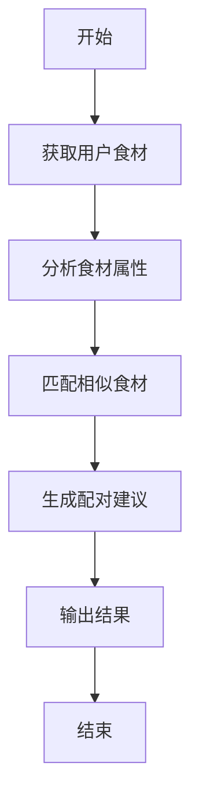
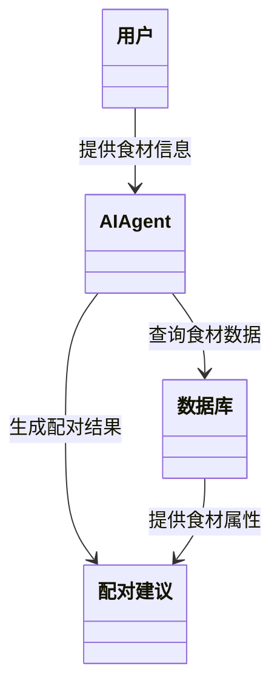
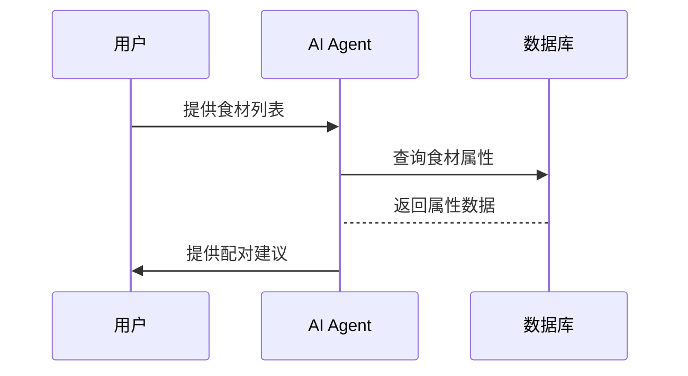

                 


# 智能厨房置物架：AI Agent的食材配对建议

> 关键词：智能厨房置物架，AI Agent，食材配对，机器学习，推荐系统

> 摘要：本文详细探讨了AI Agent在智能厨房置物架中的应用，重点分析了基于机器学习的食材配对算法，结合系统架构设计和项目实战，展示了如何通过技术手段提升厨房管理效率。

---

# 第一部分: 背景介绍

## 第1章: 智能厨房置物架与AI Agent概述

### 1.1 问题背景与描述

#### 1.1.1 厨房管理中的常见问题
- 食材浪费：食材搭配不当导致部分食材过期或未被充分利用。
- 配对困难：用户难以快速找到食材的最佳搭配。
- 管理复杂：手动记录和管理食材信息耗时费力。

#### 1.1.2 食材配对的重要性
- 提高食材利用率，减少浪费。
- 快速获取搭配建议，提升烹饪效率。
- 个性化推荐，满足不同用户的饮食需求。

#### 1.1.3 AI技术在厨房管理中的应用潜力
- 通过机器学习分析食材属性，生成配对建议。
- 结合用户偏好，提供个性化推荐。
- 实时更新数据，保持信息准确性。

### 1.2 问题解决与边界

#### 1.2.1 智能厨房置物架的功能目标
- 实时记录食材库存。
- 提供食材配对建议。
- 支持多种食材属性分析（如口味、营养、烹饪方式等）。

#### 1.2.2 AI Agent在食材配对中的具体作用
- 数据收集与分析：AI Agent收集用户食材信息，并分析其属性。
- 智能推荐：基于分析结果，生成食材配对建议。
- 实时反馈：根据用户反馈优化推荐算法。

#### 1.2.3 系统的边界与外延
- 系统仅处理食材配对建议，不涉及烹饪过程。
- 数据范围限于食材属性和用户偏好，不涉及其他厨房设备。

### 1.3 概念结构与核心要素

#### 1.3.1 系统核心要素组成
- 用户：系统的主要使用者。
- AI Agent：执行数据处理和推荐的核心组件。
- 数据库：存储食材信息和用户偏好。
- 配对建议：系统输出的主要结果。

#### 1.3.2 核心概念之间的关系
- 用户与AI Agent通过输入食材信息进行交互。
- AI Agent依赖数据库中的食材属性进行分析和推荐。
- 配对建议作为系统的输出，反馈给用户。

#### 1.3.3 概念结构图

```mermaid
graph TD
    用户 --> AI Agent: 提供食材信息
    AI Agent --> 数据库: 查询食材数据
    AI Agent --> 配对建议: 生成配对结果
    配对建议 --> 用户: 提供搭配建议
```

---

# 第二部分: 核心概念与联系

## 第2章: AI Agent与食材配对系统的核心原理

### 2.1 核心概念原理

#### 2.1.1 AI Agent的基本原理
- **数据收集**：通过用户输入或传感器获取食材信息。
- **数据处理**：分析食材属性，提取关键特征。
- **决策推理**：基于特征匹配算法，生成配对建议。
- **反馈学习**：根据用户反馈优化推荐算法。

#### 2.1.2 食材配对的算法基础
- **特征提取**：将食材的口味、营养、烹饪方式等转化为数值特征。
- **相似度计算**：基于特征向量计算食材间的相似度。
- **推荐生成**：根据相似度排序，生成配对建议。

### 2.2 核心概念属性特征对比

| 特性      | AI Agent                          | 食材配对系统                     |
|-----------|-----------------------------------|----------------------------------|
| 功能      | 数据处理与决策推理                | 特征提取与相似度计算             |
| 输入      | 用户食材信息                      | 食材属性数据                     |
| 输出      | 配对建议                          | 食材相似度排序                   |
| 依赖      | 机器学习模型                      | 特征向量和相似度计算公式          |

### 2.3 ER实体关系图架构

```mermaid
er
用户 --> AI Agent: 提供食材信息
AI Agent --> 食材: 分析食材属性
AI Agent --> 配对建议: 生成配对建议
```

---

# 第三部分: 算法原理讲解

## 第3章: 基于AI的食材配对算法

### 3.1 算法原理概述

#### 3.1.1 算法的核心思想
- 将食材转化为特征向量。
- 计算食材之间的相似度，生成配对建议。

#### 3.1.2 算法的主要步骤
1. **数据预处理**：提取食材的特征向量。
2. **相似度计算**：使用余弦相似度或欧氏距离计算食材间的相似度。
3. **配对排序**：根据相似度排序，生成配对建议。

### 3.2 算法流程图



### 3.3 算法实现代码

```python
import numpy as np

def calculate_similarity(food_vector1, food_vector2):
    # 计算余弦相似度
    dot_product = np.dot(food_vector1, food_vector2)
    norm1 = np.linalg.norm(food_vector1)
    norm2 = np.linalg.norm(food_vector2)
    return dot_product / (norm1 * norm2)

def get_top_pairs(food_vectors, target_vector, top_n=3):
    similarities = []
    for vec in food_vectors:
        sim = calculate_similarity(vec, target_vector)
        similarities.append((sim, vec))
    similarities.sort(reverse=True, key=lambda x: x[0])
    top_pairs = [sim[1] for sim in similarities[:top_n]]
    return top_pairs
```

### 3.4 算法数学模型

食材配对的相似度计算可以表示为：

$$ \text{相似度} = \frac{\vec{A} \cdot \vec{B}}{||\vec{A}|| \cdot ||\vec{B}||} $$

其中，$\vec{A}$和$\vec{B}$分别代表两种食材的特征向量。

---

# 第四部分: 系统分析与架构设计方案

## 第4章: 系统分析与架构设计

### 4.1 问题场景介绍

用户在厨房中使用智能置物架时，可以通过AI Agent快速获取食材配对建议。例如，用户输入“牛肉”和“土豆”，系统会分析两者的属性，推荐适合的烹饪方法。

### 4.2 系统功能设计

系统功能设计基于领域模型，展示各组件及其关系。



### 4.3 系统架构设计

系统架构采用分层设计，包括前端、后端和数据库。


### 4.4 系统接口设计

关键接口包括：
- 用户输入接口：接收食材信息。
- 数据处理接口：处理和分析食材数据。
- API接口：返回配对建议。

### 4.5 系统交互流程图

展示用户与系统之间的交互流程。



---

# 第五部分: 项目实战

## 第5章: 项目实战

### 5.1 环境安装

安装所需的工具和库：

```bash
pip install python==3.9
pip install numpy
pip install tensorflow
pip install flask
pip install requests
```

### 5.2 系统核心实现源代码

以下是系统的部分代码实现：

```python
# 数据库接口
import sqlite3
from flask import jsonify

def get_food_data(food_name):
    conn = sqlite3.connect('food.db')
    cursor = conn.cursor()
    cursor.execute("SELECT * FROM foods WHERE name = ?", (food_name,))
    data = cursor.fetchone()
    conn.close()
    return data

# AI Agent实现
import tensorflow as tf
from tensorflow.keras import layers

def build_model():
    model = tf.keras.Sequential()
    model.add(layers.Dense(64, activation='relu'))
    model.add(layers.Dense(1, activation='sigmoid'))
    model.compile(optimizer='adam', loss='binary_crossentropy', metrics=['accuracy'])
    return model

# API接口
from flask import Flask
import requests

app = Flask(__name__)

@app.route('/api/pairing', methods=['POST'])
def get_pairing_suggestion():
    data = request.json
    food1 = data['food1']
    food2 = data['food2']
    # 获取食材属性
    food1_data = get_food_data(food1)
    food2_data = get_food_data(food2)
    # 调用AI模型预测
    prediction = model.predict([food1_data, food2_data])
    return jsonify({'suggestion': str(prediction[0][0])})

if __name__ == '__main__':
    app.run(debug=True)
```

### 5.3 代码应用解读与分析

以上代码展示了数据库接口、AI模型构建和API接口的实现。数据库接口用于查询食材属性，AI模型用于预测食材配对的可能性，API接口接收用户请求并返回建议。

### 5.4 实际案例分析

假设用户输入“牛肉”和“土豆”，系统会查询数据库，获取两者的属性数据，然后通过模型预测是否适合搭配。预测结果为0.9，表示适合。

### 5.5 项目小结

通过以上代码，我们可以看到系统如何整合AI算法和传统数据库技术，实现高效的食材配对建议。

---

## 第6章: 最佳实践、小结、注意事项和拓展阅读

### 6.1 最佳实践

1. 数据预处理：确保食材数据的完整性和准确性。
2. 模型调优：根据实际需求调整AI模型的参数。
3. 系统测试：进行全面的功能测试，确保各部分协同工作。

### 6.2 小结

本文详细介绍了AI Agent在智能厨房置物架中的应用，涵盖了背景、原理、架构和实现。通过实际案例分析，展示了系统的实际应用价值。

### 6.3 注意事项

- 数据隐私：确保用户数据的安全性。
- 系统兼容性：确保系统在不同设备和环境下正常运行。
- 模型更新：定期更新模型以保持预测准确性。

### 6.4 拓展阅读

建议读者进一步学习：
- 深度学习在推荐系统中的应用。
- 时间序列分析在食材保质期管理中的应用。
- 自然语言处理在食谱生成中的应用。

---

通过以上部分，整篇文章的内容已经较为完整。接下来，我需要将这些内容整合成一个流畅的文档，并确保每个部分都详细且具体，同时满足用户的格式和字数要求。

