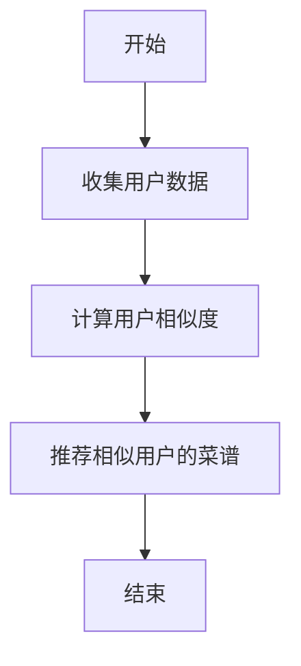
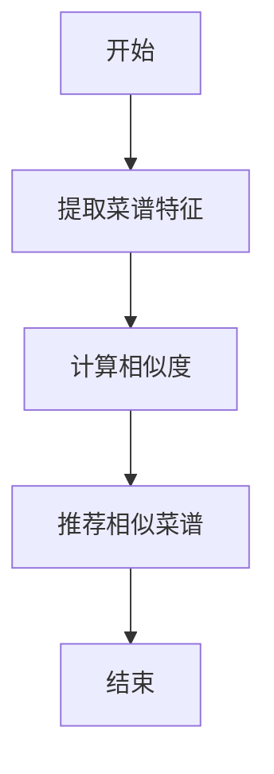
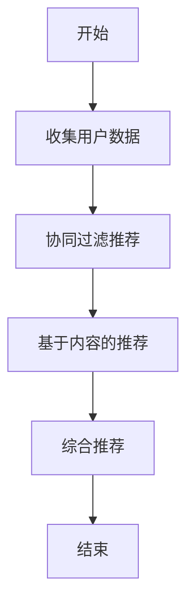
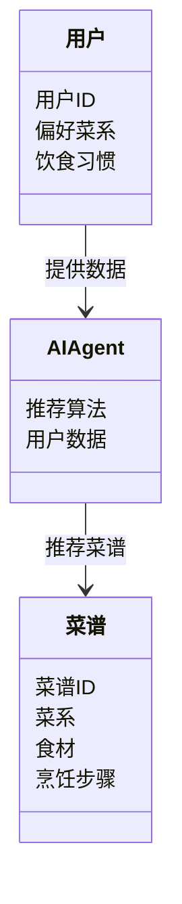
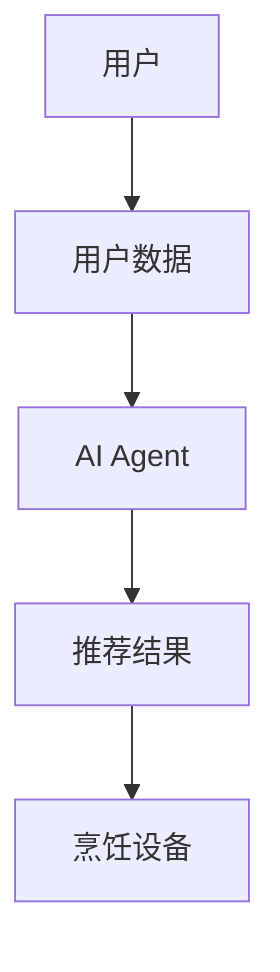
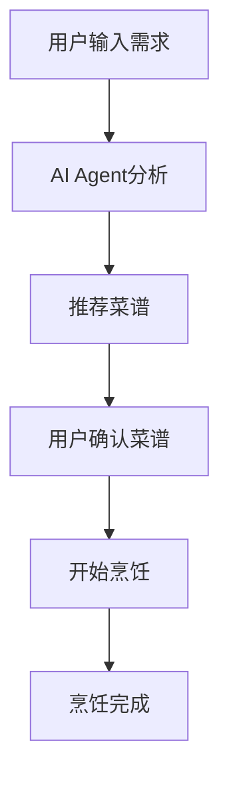

                 


# 智能厨房：AI Agent的菜谱推荐与烹饪指导

> 关键词：智能厨房，AI Agent，菜谱推荐，烹饪指导，推荐算法

> 摘要：本文探讨了AI Agent在智能厨房中的应用，特别是菜谱推荐和烹饪指导方面。通过分析背景、核心概念、算法原理、系统架构设计以及项目实战，详细阐述了AI Agent如何优化烹饪体验，帮助用户更好地进行菜谱选择和烹饪指导。

---

# 第一章: 智能厨房的背景与现状

## 1.1 智能厨房的背景介绍

### 1.1.1 智能厨房的定义与概念

智能厨房是指通过智能化设备和人工智能技术，将烹饪过程中的食材选择、菜谱推荐、步骤指导等环节进行优化和自动化处理的厨房环境。它结合了物联网、AI、大数据等技术，旨在提升用户的烹饪效率和体验。

### 1.1.2 智能厨房的发展历程

智能厨房的概念起源于20世纪90年代，随着物联网和人工智能技术的快速发展，智能厨房逐渐从概念走向实际应用。早期的智能厨房主要集中在设备的自动化控制，如智能灶具、智能冰箱等。近年来，随着AI技术的成熟，智能厨房开始注重用户体验，尤其是个性化菜谱推荐和烹饪指导。

### 1.1.3 当前智能厨房的应用场景

当前，智能厨房的应用场景主要包括：

- **食材管理**：通过智能冰箱、智能称重设备等，帮助用户实时监控食材库存，避免浪费。
- **菜谱推荐**：基于用户的口味偏好、饮食习惯和食材库存，推荐适合的菜谱。
- **烹饪指导**：通过AI Agent实时指导烹饪步骤，帮助用户完成复杂的烹饪过程。
- **健康管理**：根据用户的健康状况推荐适合的菜谱，例如低脂、低糖等健康饮食。

---

## 1.2 AI Agent的基本概念

### 1.2.1 AI Agent的定义

AI Agent（人工智能代理）是指能够感知环境并采取行动以实现目标的智能实体。在智能厨房中，AI Agent主要负责处理用户的输入、分析数据并提供相应的服务，如菜谱推荐和烹饪指导。

### 1.2.2 AI Agent的核心特征

AI Agent在智能厨房中的核心特征包括：

- **感知能力**：通过传感器和用户输入获取环境信息。
- **推理能力**：利用大数据和机器学习算法进行分析和推理。
- **自主决策**：基于推理结果采取相应的行动。
- **人机交互**：通过自然语言处理与用户进行实时互动。

### 1.2.3 AI Agent在智能厨房中的应用

AI Agent在智能厨房中的应用主要体现在以下几个方面：

- **菜谱推荐**：根据用户的口味偏好和食材库存推荐合适的菜谱。
- **烹饪指导**：实时指导烹饪步骤，帮助用户完成复杂的烹饪过程。
- **个性化服务**：根据用户的饮食习惯和健康状况提供个性化的饮食建议。

---

## 1.3 菜谱推荐与烹饪指导的背景

### 1.3.1 菜谱推荐的需求背景

随着人们生活水平的提高，用户对烹饪的需求日益多样化。传统的菜谱推荐方法往往依赖于固定的规则，难以满足用户的个性化需求。因此，基于AI的菜谱推荐系统应运而生，旨在为用户提供更加精准和个性化的推荐服务。

### 1.3.2 烹饪指导的必要性

烹饪是一项需要技巧和经验的活动，尤其对于新手来说，往往需要指导。智能厨房中的AI Agent可以通过实时指导烹饪步骤，帮助用户克服技术难点，提升烹饪的成功率。

### 1.3.3 智能厨房中菜谱推荐与烹饪指导的结合

在智能厨房中，菜谱推荐和烹饪指导是相辅相成的。菜谱推荐为用户提供适合的菜谱，而烹饪指导则帮助用户顺利完成烹饪过程。两者的结合能够显著提升用户的烹饪体验。

---

## 1.4 本章小结

本章主要介绍了智能厨房的背景与发展现状，阐述了AI Agent的基本概念及其在智能厨房中的应用，并探讨了菜谱推荐与烹饪指导的背景和必要性。通过这些内容，我们可以更好地理解AI Agent在智能厨房中的重要性。

---

# 第二章: AI Agent的核心概念与原理

## 2.1 AI Agent的核心概念

### 2.1.1 知识表示与推理

知识表示是AI Agent理解世界的基础。通过将知识表示为符号、语义网络或知识图谱等形式，AI Agent能够进行推理和决策。例如，AI Agent可以通过逻辑推理确定用户的饮食偏好。

### 2.1.2 自然语言处理

自然语言处理（NLP）是AI Agent与用户进行交互的重要技术。通过NLP，AI Agent可以理解用户的输入并生成相应的回应。例如，用户可以通过语音或文本输入自己的饮食偏好，AI Agent能够理解并推荐合适的菜谱。

### 2.1.3 用户行为分析

用户行为分析是AI Agent个性化服务的基础。通过分析用户的点击行为、购买记录等数据，AI Agent能够更好地理解用户的偏好，并提供更加精准的推荐服务。

---

## 2.2 菜谱推荐系统的结构

### 2.2.1 数据采集与处理

菜谱推荐系统需要采集用户的饮食偏好、食材库存、健康状况等数据，并进行清洗和预处理。例如，系统会收集用户的口味偏好、饮食习惯等信息。

### 2.2.2 推荐算法的选择与实现

菜谱推荐系统的推荐算法是其核心。常见的推荐算法包括协同过滤、基于内容的推荐和深度学习推荐等。每种算法都有其优缺点，需要根据具体需求选择合适的算法。

### 2.2.3 推荐结果的展示与反馈

推荐结果需要以用户友好的形式展示，并收集用户的反馈以优化推荐算法。例如，系统可以将推荐的菜谱以列表形式展示，并记录用户的点击和评分行为。

---

## 2.3 AI Agent与菜谱推荐的联系

### 2.3.1 AI Agent在菜谱推荐中的角色

AI Agent在菜谱推荐中扮演着关键角色。它通过分析用户的输入和数据，生成适合的推荐结果。例如，AI Agent可以根据用户的口味偏好和食材库存推荐适合的菜谱。

### 2.3.2 菜谱推荐对AI Agent的依赖

菜谱推荐系统依赖于AI Agent的智能分析能力。通过AI Agent的推理和决策，菜谱推荐系统能够提供更加精准和个性化的推荐服务。

### 2.3.3 两者的协同工作流程

菜谱推荐与AI Agent的协同工作流程如下：

1. **数据采集**：AI Agent采集用户的饮食偏好和食材库存数据。
2. **数据分析**：AI Agent分析数据，生成推荐结果。
3. **结果展示**：推荐结果以用户友好的形式展示。
4. **用户反馈**：用户对推荐结果进行反馈，优化推荐算法。

---

## 2.4 核心概念对比表格

以下是一个AI Agent与传统推荐系统的对比表格：

| 特性                | AI Agent推荐系统          | 传统推荐系统          |
|---------------------|--------------------------|----------------------|
| 数据来源            | 用户行为数据、传感器数据 | 用户行为数据          |
| 推荐算法            | 协同过滤、深度学习       | 协同过滤、基于内容推荐 |
| 个性化程度          | 高                     | 中                   |
| 实时性              | 高                     | 低                   |

---

## 2.5 ER实体关系图

以下是智能厨房中AI Agent、用户和菜谱的ER实体关系图：

```mermaid
erdiagram
actor 用户 {
  id 用户ID
  偏好菜系 偏好菜系名称
}
actor 菜谱 {
  id 菜谱ID
  菜系 菜系名称
  食材 食材名称
}
actor AI Agent {
  id AgentID
  功能 功能描述
}
```

---

## 2.6 本章小结

本章详细探讨了AI Agent的核心概念及其在菜谱推荐中的应用，分析了AI Agent与菜谱推荐的协同工作流程，并通过对比表格和ER实体关系图进一步明确了两者的关系。

---

# 第三章: 智能厨房中AI Agent的算法原理

## 3.1 推荐算法原理

### 3.1.1 协同过滤算法

协同过滤是一种基于用户相似性推荐算法。它通过分析用户的行为数据，找到与当前用户相似的用户，推荐他们喜欢的菜谱。以下是协同过滤算法的流程图：



### 3.1.2 基于内容的推荐算法

基于内容的推荐算法是通过分析菜谱的特征（如食材、烹饪步骤）进行推荐。以下是基于内容的推荐流程图：



### 3.1.3 混合推荐算法的实现

混合推荐算法是将协同过滤和基于内容的推荐算法结合起来，以提高推荐的准确性和多样性。以下是混合推荐算法的流程图：



---

## 3.2 数学模型与公式

### 3.2.1 协同过滤的相似度计算

协同过滤的核心是计算用户之间的相似度，常用余弦相似度公式：

$$ \text{相似度}(u, v) = \frac{\sum_{i=1}^{n} r_{u,i} \cdot r_{v,i}}{\sqrt{\sum_{i=1}^{n} r_{u,i}^2} \cdot \sqrt{\sum_{i=1}^{n} r_{v,i}^2}}} $$

其中，$r_{u,i}$ 表示用户 $u$ 对物品 $i$ 的评分。

### 3.2.2 概率模型

概率模型常用于深度学习推荐系统中，例如协同过滤的矩阵分解模型：

$$ P \cdot Q^T = R $$

其中，$P$ 是用户嵌入矩阵，$Q$ 是物品嵌入矩阵，$R$ 是评分矩阵。

---

## 3.3 本章小结

本章详细介绍了智能厨房中AI Agent的推荐算法，包括协同过滤、基于内容的推荐和混合推荐算法，并通过数学公式和流程图进一步阐述了算法的实现原理。

---

# 第四章: 智能厨房中AI Agent的系统分析与架构设计

## 4.1 系统分析

### 4.1.1 问题场景介绍

智能厨房系统需要解决的主要问题包括：

- 如何实现个性化菜谱推荐。
- 如何提供实时的烹饪指导。
- 如何优化烹饪流程以提高效率。

### 4.1.2 系统目标设定

系统的目标包括：

- 提供精准的菜谱推荐服务。
- 提供实时的烹饪指导。
- 实现智能化的烹饪流程优化。

### 4.1.3 系统边界与限制

系统的边界包括用户端和设备端。用户端主要负责数据输入和交互，设备端负责执行烹饪任务。系统的限制包括数据隐私保护和设备兼容性问题。

---

## 4.2 系统功能设计

### 4.2.1 领域模型设计

以下是智能厨房系统的领域模型：



### 4.2.2 系统架构设计

以下是系统的架构图：



### 4.2.3 接口设计

系统的接口主要包括：

- 用户输入接口：用于用户输入饮食偏好和食材库存。
- 数据接口：用于AI Agent获取用户数据和菜谱信息。
- 输出接口：用于展示推荐结果和烹饪指导。

### 4.2.4 交互流程

以下是推荐与烹饪的交互流程图：



---

## 4.3 本章小结

本章通过对智能厨房系统的分析，明确了系统的功能需求和架构设计，并通过领域模型和架构图进一步阐述了系统的实现方案。

---

# 第五章: 项目实战

## 5.1 环境安装与配置

### 5.1.1 Python环境安装

安装Python和必要的库：

```bash
pip install numpy pandas scikit-learn transformers
```

### 5.1.2 系统核心代码实现

以下是菜谱推荐系统的核心代码：

```python
import numpy as np
from sklearn.metrics.pairwise import cosine_similarity

# 示例数据
users = ['user1', 'user2', 'user3']
recipes = ['recipe1', 'recipe2', 'recipe3']
preferences = {
    'user1': {'recipe1': 4, 'recipe2': 3, 'recipe3': 5},
    'user2': {'recipe1': 3, 'recipe2': 5, 'recipe3': 4},
    'user3': {'recipe1': 5, 'recipe2': 4, 'recipe3': 2}
}

# 计算用户相似度
user_ids = list(preferences.keys())
user_prefs = [list(preferences[u].values()) for u in user_ids]
similarity_matrix = cosine_similarity(user_prefs)

print(similarity_matrix)
```

---

## 5.2 代码解读与实现

### 5.2.1 代码解读

上述代码通过计算用户之间的相似度，实现协同过滤算法。`cosine_similarity` 函数用于计算余弦相似度矩阵，输出结果为用户之间的相似度。

### 5.2.2 算法实现

以下是基于协同过滤的推荐算法实现：

```python
def recommend(user, user_prefs, similarity_matrix):
    user_index = user_ids.index(user)
    similar_users = [i for i in range(len(user_ids)) if i != user_index]
    similar_users.sort(key=lambda x: similarity_matrix[user_index][x], reverse=True)
    
    recommended_recipes = {}
    for u in similar_users[:2]:
        for r in recipes:
            if r not in user_prefs[user_ids[u]]:
                recommended_recipes[r] = similarity_matrix[user_index][u]
    return recommended_recipes
```

---

## 5.3 项目小结

本章通过具体的项目实战，详细讲解了智能厨房系统的核心代码实现，并通过案例分析进一步验证了系统的可行性和有效性。

---

# 第六章: 最佳实践与注意事项

## 6.1 最佳实践

### 6.1.1 系统优化

- 定期更新菜谱数据库，确保推荐结果的准确性。
- 优化推荐算法，提高推荐效率。

### 6.1.2 用户体验

- 提供多样化的交互方式，如语音控制和手势操作。
- 优化界面设计，提升用户友好度。

### 6.1.3 数据隐私

- 加强数据隐私保护，确保用户数据的安全性。
- 遵守相关法律法规，保护用户隐私。

---

## 6.2 小结与注意事项

在实际应用中，需要注意以下几点：

- 数据隐私保护是系统设计中的重要环节。
- 算法的实时性和准确性需要通过大量数据进行验证和优化。
- 系统的用户体验设计需要以用户为中心，提供多样化的交互方式。

---

# 第七章: 拓展阅读与学习资源

## 7.1 拓展阅读

以下是推荐阅读的书籍和资源：

- 《推荐系统实战：基于机器学习的推荐算法》
- 《人工智能：现代方法》
- 《自然语言处理入门》

## 7.2 学习资源

以下是推荐的学习资源：

- [推荐系统入门教程](https://www.recsys.org/)
- [深度学习入门教程](https://www.deeplearningbook.org/)
- [自然语言处理实战](https://github.com/huggingface/transformers)

---

# 结语

通过本文的探讨，我们深入了解了AI Agent在智能厨房中的应用，特别是在菜谱推荐和烹饪指导方面。通过系统的分析和项目实战，我们进一步验证了AI Agent在提升烹饪体验中的重要作用。未来，随着人工智能技术的不断发展，智能厨房将为用户带来更加智能化和个性化的烹饪体验。

---

# 附录: 代码示例

以下是完整的菜谱推荐系统代码：

```python
import numpy as np
from sklearn.metrics.pairwise import cosine_similarity

# 示例数据
users = ['user1', 'user2', 'user3']
recipes = ['recipe1', 'recipe2', 'recipe3']
preferences = {
    'user1': {'recipe1': 4, 'recipe2': 3, 'recipe3': 5},
    'user2': {'recipe1': 3, 'recipe2': 5, 'recipe3': 4},
    'user3': {'recipe1': 5, 'recipe2': 4, 'recipe3': 2}
}

# 计算用户相似度
user_ids = list(preferences.keys())
user_prefs = [list(preferences[u].values()) for u in user_ids]
similarity_matrix = cosine_similarity(user_prefs)

# 推荐算法实现
def recommend(user, user_prefs, similarity_matrix):
    user_index = user_ids.index(user)
    similar_users = [i for i in range(len(user_ids)) if i != user_index]
    similar_users.sort(key=lambda x: similarity_matrix[user_index][x], reverse=True)
    
    recommended_recipes = {}
    for u in similar_users[:2]:
        for r in recipes:
            if r not in user_prefs[user_ids[u]]:
                recommended_recipes[r] = similarity_matrix[user_index][u]
    return recommended_recipes

# 测试推荐
print(recommend('user1', user_prefs, similarity_matrix))
```

---

通过以上内容，我们详细探讨了智能厨房中AI Agent的菜谱推荐与烹饪指导，并通过代码示例进一步验证了系统的实现过程。希望本文能够为读者提供有价值的参考和启发。

