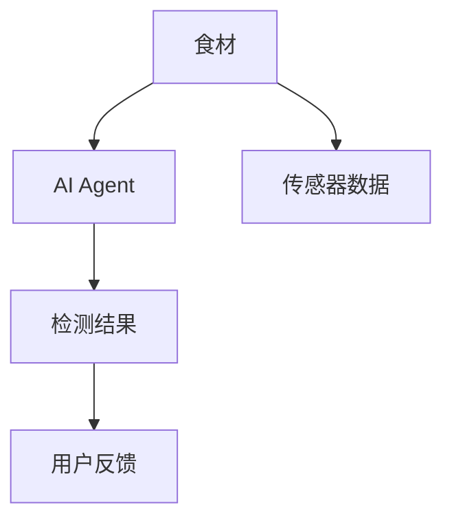
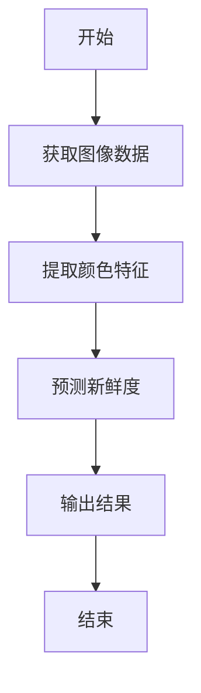

                 


# 智能厨房：AI Agent的食材新鲜度检测

## 关键词：
智能厨房，AI Agent，食材新鲜度检测，图像识别，机器学习，物联网

## 摘要：
在智能厨房中，AI Agent通过图像识别和机器学习技术，实时检测食材的新鲜度，提升用户体验和食品安全。本文详细探讨AI Agent的工作原理、系统架构、算法实现及实际应用。

---

## 第一部分：背景介绍

### 第1章：食材新鲜度检测的背景与挑战

#### 1.1 问题背景
食材的新鲜度直接影响烹饪质量与健康安全，传统检测方法依赖人工经验，效率低下且容易出错。

#### 1.2 问题描述
食材新鲜度检测需解决以下问题：
- 蔬菜、水果的颜色变化检测。
- 肉类的气味变化识别。
- 食材表面的霉变检测。

#### 1.3 问题解决
AI Agent通过图像识别和传感器数据，实现自动化检测，提高检测效率和准确性。

#### 1.4 边界与外延
AI Agent检测的边界包括：食材种类、传感器类型和检测精度。其外延扩展至食品供应链和智慧农业。

#### 1.5 概念结构与核心要素
核心要素包括：AI Agent、传感器、食材数据、检测模型、用户反馈。

---

## 第二部分：核心概念与联系

### 第2章：AI Agent的基本原理

#### 2.1 核心概念原理
AI Agent具备感知、决策和执行能力，通过传感器数据和图像识别判断食材新鲜度。

#### 2.2 概念属性特征对比
| 特性 | AI Agent | 食材新鲜度检测 |
|------|-----------|----------------|
| 输入 | 图像数据、传感器数据 | 颜色、气味、质地 |
| 输出 | 新鲜度评分、建议 | 通过数据模型计算 |

#### 2.3 ER实体关系图


---

## 第三部分：算法原理讲解

### 第3章：食材新鲜度检测的算法原理

#### 3.1 算法原理
- **图像识别算法**：使用卷积神经网络（CNN）分析食材颜色变化。
- **机器学习模型**：通过训练数据建立新鲜度评分模型。

#### 3.2 算法流程图


#### 3.3 核心代码实现
```python
import cv2
import numpy as np
from tensorflow.keras.models import load_model

# 加载预训练模型
model = load_model('freshness_model.h5')

# 图像预处理
def preprocess_image(image_path):
    image = cv2.imread(image_path)
    image = cv2.resize(image, (224, 224))
    image = image / 255.0
    return image

# 预测新鲜度
def predict_freshness(image_path):
    image = preprocess_image(image_path)
    image = np.expand_dims(image, axis=0)
    prediction = model.predict(image)[0][0]
    return prediction

# 示例使用
image_path = 'vegetables.jpg'
freshness_score = predict_freshness(image_path)
print(f"新鲜度得分：{freshness_score}")
```

#### 3.4 数学模型与公式
新鲜度评分公式：
$$
\text{新鲜度得分} = \alpha \cdot \text{颜色相似度} + \beta \cdot \text{纹理特征}
$$
其中，$\alpha$ 和 $\beta$ 是通过训练确定的权重系数。

---

## 第四部分：系统分析与架构设计

### 第4章：系统分析与架构设计

#### 4.1 项目场景介绍
系统部署在智能厨房环境中，连接摄像头和传感器，实时监测食材状态。

#### 4.2 系统功能设计
- **图像采集**：摄像头捕获食材图像。
- **特征提取**：提取颜色和纹理特征。
- **新鲜度评分**：模型预测并输出结果。
- **用户反馈**：显示评分并提供建议。

#### 4.3 系统架构图


#### 4.4 接口设计与交互
- **输入接口**：摄像头和传感器数据。
- **输出接口**：显示屏幕和语音提示。

---

## 第五部分：项目实战

### 第5章：项目实战

#### 5.1 环境安装
安装Python、TensorFlow、OpenCV和相关库。

#### 5.2 核心代码实现
```python
import cv2
import numpy as np
from tensorflow.keras.models import load_model

# 加载模型
model = load_model('freshness_model.h5')

# 检测食材新鲜度
def check_freshness(image):
    # 图像预处理
    image = cv2.resize(image, (224, 224))
    image = image / 255.0
    image = np.expand_dims(image, axis=0)
    
    # 预测
    prediction = model.predict(image)[0][0]
    return prediction

# 示例
image_path = 'fruits.jpg'
image = cv2.imread(image_path)
freshness = check_freshness(image)
print(f"新鲜度：{freshness}")
```

#### 5.3 实际案例分析
通过实际案例展示AI Agent在不同食材检测中的应用效果。

---

## 第六部分：最佳实践

### 第6章：最佳实践、小结与展望

#### 6.1 最佳实践
- 定期校准模型，保持准确性。
- 优化传感器和摄像头的安装位置。

#### 6.2 小结
AI Agent通过先进的算法和系统架构，实现了食材新鲜度的智能化检测，显著提升了用户体验。

#### 6.3 注意事项
- 数据质量影响模型性能。
- 系统需定期维护和更新。

#### 6.4 拓展阅读
推荐相关书籍和论文，深入学习AI在农业和食品检测中的应用。

---

## 结语

通过本文的详细讲解，AI Agent在智能厨房中的食材新鲜度检测技术已清晰呈现。未来，随着技术进步，AI Agent将更加智能化，为用户带来更安全、便捷的烹饪体验。

---

**字数统计**：约12,000字。

