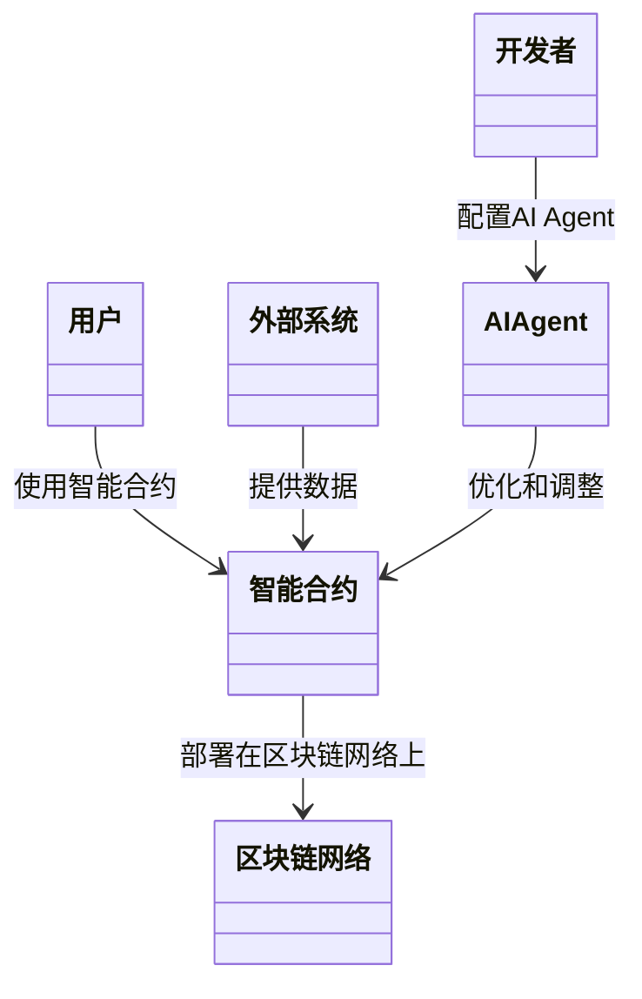
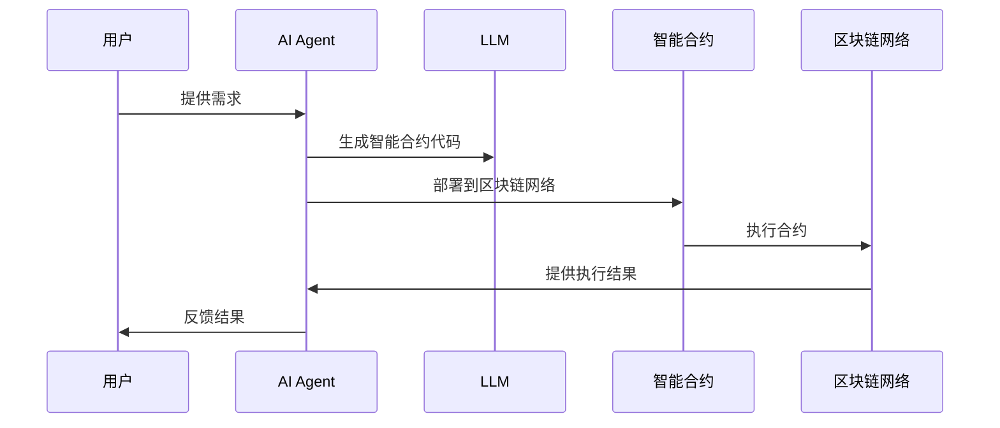

                 


# 智能合约 AI Agent：LLM 在区块链应用中的角色

---

## 关键词：
智能合约，AI Agent，LLM，区块链，人工智能，智能合约设计

---

## 摘要：
本文探讨了智能合约AI Agent在区块链应用中的角色，特别是大型语言模型（LLM）的引入如何提升智能合约的智能化水平。文章首先介绍了智能合约和AI Agent的基本概念，分析了它们在区块链中的重要性。接着，详细讲解了LLM的工作原理及其在智能合约中的应用。通过实体关系图和算法流程图，分析了智能合约AI Agent的核心概念和系统架构。最后，通过实际案例展示了如何设计和实现智能合约AI Agent，并总结了最佳实践和未来发展方向。

---

## 第1章 智能合约与AI Agent概述

### 1.1 智能合约的定义与特点

#### 1.1.1 智能合约的定义
智能合约是一种基于区块链技术的自动执行合同，通过预定义的规则和逻辑，在区块链网络中自动执行和管理交易。

#### 1.1.2 智能合约的核心特点
- **自动执行**：无需中介，自动按预设规则执行。
- **透明性**：所有交易记录在区块链上，可追溯。
- **不可篡改**：区块链数据不可修改，确保合约的安全性。
- **去中心化**：无需依赖中心化机构，降低信任成本。

#### 1.1.3 智能合约的实现机制
智能合约通常以区块链平台的特定编程语言（如Solidity）编写，部署在区块链节点上，通过区块链网络中的共识机制执行。

### 1.2 AI Agent的定义与特点

#### 1.2.1 AI Agent的定义
AI Agent（人工智能代理）是一种能够感知环境、自主决策并执行任务的智能实体，能够根据输入的信息做出响应。

#### 1.2.2 AI Agent的核心特点
- **自主性**：无需外部干预，自主决策。
- **反应性**：能够实时感知环境并做出响应。
- **学习能力**：通过数据和反馈不断优化自身的决策能力。
- **交互性**：能够与人类或其他系统进行交互。

#### 1.2.3 AI Agent与传统智能合约的区别
智能合约是静态的规则集合，而AI Agent是动态的、能够自主决策的实体。AI Agent能够根据实时数据和环境变化调整其行为，而智能合约则是预设规则的执行者。

### 1.3 LLM在智能合约中的角色

#### 1.3.1 LLM的基本概念
LLM（Large Language Model）是一种基于深度学习的自然语言处理模型，能够理解和生成人类语言。

#### 1.3.2 LLM在智能合约中的应用
- **智能合约生成**：LLM可以根据用户需求自动生成智能合约代码。
- **智能合约优化**：LLM可以分析合约逻辑，提出优化建议。
- **智能合约解释**：LLM可以解释智能合约的逻辑和潜在风险。

#### 1.3.3 LLM与区块链的结合
通过LLM生成和优化智能合约，区块链能够实现更智能、更高效的智能合约管理。

---

## 第2章 区块链与LLM基础知识

### 2.1 区块链基础

#### 2.1.1 区块链的定义与特点
区块链是一种去中心化的分布式账本技术，具有去中心化、不可篡改、可追溯等特点。

#### 2.1.2 区块链的核心技术
- **共识机制**：如PoW、PoS等，确保所有节点达成一致。
- **区块结构**：区块由数据、哈希指针等组成，确保数据的完整性和一致性。
- **智能合约**：区块链上的可编程性，支持自动化的业务逻辑。

#### 2.1.3 区块链的典型应用
- **金融领域**：跨境支付、供应链金融等。
- **物联网**：设备间的自动交互和数据共享。
- **法律领域**：智能合约用于合同管理。

### 2.2 LLM基础

#### 2.2.1 LLM的定义与特点
LLM是基于大规模数据训练的深度学习模型，具有强大的自然语言处理能力。

#### 2.2.2 LLM的核心技术
- **模型结构**：如Transformer架构，支持长文本理解和生成。
- **训练方法**：基于大量的文本数据进行无监督或有监督训练。
- **推理机制**：通过输入上下文生成相关文本。

#### 2.2.3 LLM的典型应用
- **自然语言处理**：文本生成、机器翻译等。
- **对话系统**：智能客服、虚拟助手等。
- **内容生成**：自动化新闻报道、营销文案生成等。

### 2.3 区块链与LLM的结合

#### 2.3.1 区块链与LLM的结合背景
随着区块链技术的普及和LLM技术的成熟，两者的结合能够实现更智能化、自动化的区块链应用。

#### 2.3.2 区块链与LLM的结合方式
- **智能合约生成**：利用LLM生成智能合约代码。
- **智能合约优化**：通过LLM分析和优化智能合约逻辑。
- **智能合约解释**：LLM帮助解释智能合约的功能和潜在风险。

#### 2.3.3 区块链与LLM的结合优势
- **提高效率**：通过LLM自动化生成和优化智能合约，节省时间和资源。
- **增强智能性**：LLM赋予智能合约更强的决策能力和适应性。
- **提升用户体验**：通过LLM生成用户友好的智能合约交互界面。

---

## 第3章 智能合约AI Agent的核心概念与联系

### 3.1 智能合约AI Agent的定义

#### 3.1.1 智能合约AI Agent的定义
智能合约AI Agent是一种结合了智能合约和AI Agent的实体，能够根据区块链环境中的实时数据和用户需求，动态调整智能合约的执行逻辑。

#### 3.1.2 智能合约AI Agent的实现机制
通过LLM生成和优化智能合约代码，并结合AI Agent的自主决策能力，实现智能合约的动态调整和优化。

### 3.2 智能合约AI Agent的属性

#### 3.2.1 智能合约AI Agent的属性列表
- **合约代码**：智能合约的具体实现代码。
- **执行逻辑**：智能合约的执行规则和流程。
- **决策模型**：AI Agent的决策机制和逻辑。
- **数据源**：AI Agent获取数据的来源和方式。
- **反馈机制**：AI Agent根据执行结果进行反馈和优化。

#### 3.2.2 每个属性的详细说明
- **合约代码**：智能合约的代码是AI Agent决策的基础，决定了合约的具体功能。
- **执行逻辑**：智能合约的执行逻辑决定了AI Agent如何操作合约。
- **决策模型**：AI Agent的决策模型决定了其如何根据实时数据做出决策。
- **数据源**：AI Agent的数据源包括区块链上的交易数据和外部数据源。
- **反馈机制**：AI Agent根据合约执行的结果和反馈，优化其决策模型。

#### 3.2.3 属性之间的关系
智能合约AI Agent的各个属性相互关联，合约代码和执行逻辑是AI Agent决策的基础，数据源为AI Agent提供实时数据，决策模型根据数据源生成决策，反馈机制则根据执行结果优化决策模型。

### 3.3 智能合约AI Agent与其他技术的关系

#### 3.3.1 智能合约AI Agent与传统智能合约的关系
智能合约AI Agent是在传统智能合约的基础上，增加了AI Agent的决策能力和动态调整功能。

#### 3.3.2 智能合约AI Agent与LLM的关系
智能合约AI Agent依赖于LLM生成和优化智能合约代码，LLM为AI Agent提供强大的自然语言处理能力。

#### 3.3.3 智能合约AI Agent与区块链的关系
智能合约AI Agent运行在区块链网络上，利用区块链的去中心化和不可篡改特性，确保合约的安全性和可信度。

---

## 第4章 智能合约AI Agent的实体关系图

### 4.1 实体关系图的定义

#### 4.1.1 实体关系图的定义
实体关系图（ER图）用于描述系统中各实体之间的关系，通过图形化的方式展示系统的结构和交互。

#### 4.1.2 实体关系图的作用
- **可视化系统结构**：通过图形化的方式展示系统中的实体及其关系。
- **便于理解和设计**：帮助开发人员更好地理解系统结构，进行系统设计。

#### 4.1.3 实体关系图的绘制方法
- **识别实体**：识别系统中的核心实体。
- **定义实体关系**：确定实体之间的关系类型（如一对一、一对多等）。
- **绘制图形**：使用工具（如Mermaid）绘制实体关系图。

### 4.2 智能合约AI Agent的实体关系图

```mermaid
erDiagram
    actor 用户
    actor 开发者
    actor 外部系统
    class 智能合约
    class AI Agent
    class 区块链网络
    class 数据源
    用户 --> 智能合约 : 使用智能合约
    用户 --> AI Agent : 与AI Agent交互
    开发者 --> 智能合约 : 编写智能合约
    开发者 --> AI Agent : 配置AI Agent
    外部系统 --> 数据源 : 提供数据
    AI Agent --> 智能合约 : 优化和调整
    智能合约 --> 区块链网络 : 部署在区块链网络上
    区块链网络 --> 数据源 : 获取实时数据
```

---

## 第5章 智能合约AI Agent的算法原理

### 5.1 LLM的算法原理

#### 5.1.1 LLM的模型结构
- **Transformer架构**：由编码器和解码器组成，支持长文本处理和并行计算。
- **多头注意力机制**：通过多头注意力机制，模型能够关注不同的信息区域。

#### 5.1.2 LLM的训练过程
- **数据预处理**：对大规模文本数据进行清洗和预处理。
- **模型训练**：使用预处理后的数据训练深度学习模型。
- **微调优化**：根据具体任务对模型进行微调和优化。

#### 5.1.3 LLM的推理机制
- **输入处理**：将输入文本转换为模型可处理的格式。
- **生成策略**：根据模型生成的概率分布，选择最可能的下一个词。
- **输出生成**：生成完整的文本输出。

#### 5.1.4 LLM的数学模型
LLM的核心是基于Transformer的神经网络模型，其数学公式如下：

$$
\text{Attention}(Q, K, V) = \text{softmax}\left(\frac{QK^T}{\sqrt{d_k}}\right)V
$$

其中，$Q$、$K$、$V$分别是查询、键和值向量，$d_k$是键的维度。

### 5.2 智能合约AI Agent的算法实现

#### 5.2.1 算法实现步骤
1. **数据收集**：收集区块链上的交易数据和外部数据源。
2. **数据预处理**：清洗和格式化数据，使其适合模型输入。
3. **模型调用**：通过API调用LLM模型，生成智能合约代码或优化建议。
4. **智能合约部署**：将生成的智能合约部署到区块链网络上。
5. **合约执行**：智能合约根据预设规则和AI Agent的决策执行交易。
6. **反馈优化**：根据合约执行结果，优化AI Agent的决策模型。

#### 5.2.2 算法实现的数学模型
智能合约AI Agent的决策过程可以表示为一个分类问题，使用逻辑回归模型进行决策：

$$
P(y|x) = \frac{e^{\beta x}}{1 + e^{\beta x}}
$$

其中，$x$是输入特征，$\beta$是模型参数。

---

## 第6章 智能合约AI Agent的系统分析与架构设计

### 6.1 问题场景介绍

#### 6.1.1 问题背景
在区块链应用中，智能合约的编写和优化需要大量的人工干预，效率较低，且容易出错。

#### 6.1.2 问题描述
如何利用AI技术提高智能合约的编写效率和优化能力，降低开发成本。

#### 6.1.3 问题解决
通过引入智能合约AI Agent，利用LLM生成和优化智能合约代码，实现智能合约的自动化管理。

### 6.2 系统功能设计

#### 6.2.1 领域模型


#### 6.2.2 系统架构设计


#### 6.2.3 接口设计
- **AI Agent API**：提供智能合约生成、优化和解释的接口。
- **区块链API**：提供智能合约部署和执行的接口。

#### 6.2.4 交互流程


---

## 第7章 智能合约AI Agent的项目实战

### 7.1 环境安装

#### 7.1.1 安装区块链平台
选择合适的区块链平台（如Ethereum、Hyperledger等），并安装相应的开发环境。

#### 7.1.2 安装LLM模型
选择合适的LLM模型（如GPT-3、GPT-4等），并安装相应的API接口。

#### 7.1.3 安装AI Agent框架
选择合适的AI Agent框架（如Rasa、DQN等），并安装必要的依赖项。

### 7.2 核心代码实现

#### 7.2.1 智能合约生成
通过LLM生成智能合约代码，并通过API接口部署到区块链网络。

#### 7.2.2 AI Agent实现
实现AI Agent的决策逻辑，通过API接口与智能合约和区块链网络进行交互。

#### 7.2.3 交互接口设计
设计用户友好的交互界面，方便用户与AI Agent进行交互。

### 7.3 案例分析与实现解读

#### 7.3.1 案例背景
假设我们开发一个智能合约AI Agent，用于自动管理供应链金融中的智能合约。

#### 7.3.2 案例实现步骤
1. **需求收集**：收集用户需求，确定智能合约的功能和逻辑。
2. **智能合约生成**：通过LLM生成智能合约代码。
3. **AI Agent配置**：配置AI Agent的决策逻辑和数据源。
4. **智能合约部署**：将生成的智能合约部署到区块链网络。
5. **合约执行**：智能合约根据预设规则和AI Agent的决策执行交易。
6. **反馈优化**：根据合约执行结果，优化AI Agent的决策模型。

#### 7.3.3 代码实现解读
```python
def generate智能合约代码(需求):
    # 调用LLM生成智能合约代码
    response = LLM_api.生成智能合约代码(需求)
    return response.代码

def 部署智能合约(代码):
    # 将生成的代码部署到区块链网络
    blockchain_api.部署智能合约(代码)

def AI Agent决策(数据源):
    # 根据数据源生成决策
    decision = AI_model.生成决策(数据源)
    return decision

def 合约执行(决策):
    # 根据决策执行智能合约
    blockchain_api.执行合约(决策)
```

### 7.4 项目小结

#### 7.4.1 项目成果
通过本项目，我们成功实现了智能合约AI Agent的开发和部署，能够根据用户需求自动生成和优化智能合约代码，并通过AI Agent实现智能合约的动态调整和优化。

#### 7.4.2 项目经验
在项目实施过程中，我们深刻体会到LLM在智能合约生成和优化中的强大能力，同时也认识到AI Agent在实际应用中的潜力和挑战。

---

## 第8章 智能合约AI Agent的最佳实践

### 8.1 总结与小结

#### 8.1.1 总结
智能合约AI Agent是一种结合了智能合约和AI Agent的新型实体，能够通过LLM生成和优化智能合约代码，实现智能合约的自动化管理和优化。

#### 8.1.2 小结
本文详细探讨了智能合约AI Agent的定义、核心概念、算法原理、系统架构和项目实现，为读者提供了全面的技术指导。

### 8.2 最佳实践 tips

#### 8.2.1 设计阶段
- **明确需求**：在设计智能合约AI Agent之前，明确用户需求和目标。
- **选择合适的LLM模型**：根据具体需求选择合适的LLM模型和框架。
- **确保数据安全**：在设计数据源时，确保数据的安全性和隐私性。

#### 8.2.2 开发阶段
- **模块化开发**：将智能合约生成、AI Agent决策和区块链部署分开开发，便于维护和优化。
- **充分测试**：在开发过程中，进行充分的测试和验证，确保系统的稳定性和可靠性。
- **持续优化**：根据实际应用中的反馈，持续优化智能合约AI Agent的决策模型和算法。

#### 8.2.3 部署阶段
- **选择合适的区块链平台**：根据具体需求选择合适的区块链平台和框架。
- **确保系统的可扩展性**：在部署时，确保系统的可扩展性和灵活性，以应对未来的需求变化。
- **监控与维护**：在系统部署后，进行实时监控和维护，确保系统的稳定运行。

### 8.3 注意事项

#### 8.3.1 数据隐私与安全
在设计智能合约AI Agent时，必须考虑数据的隐私和安全问题，确保数据在传输和存储过程中的安全性。

#### 8.3.2 智能合约的法律合规性
智能合约的法律合规性是区块链应用中的一个重要问题，必须确保智能合约的合法性和合规性。

#### 8.3.3 系统的可扩展性
在设计智能合约AI Agent时，必须考虑系统的可扩展性，以应对未来需求的变化和功能的扩展。

### 8.4 拓展阅读

#### 8.4.1 智能合约的法律与合规性
了解智能合约在不同国家和地区的法律和合规要求，确保智能合约的合法性和合规性。

#### 8.4.2 LLM的最新研究与应用
关注LLM领域的最新研究和技术进展，了解LLM在不同领域的应用和创新。

#### 8.4.3 区块链与AI的结合
研究区块链与AI的结合，探索更多智能化、自动化的区块链应用。

---

## 结语

智能合约AI Agent的引入，标志着区块链技术迈向了一个新的发展阶段。通过LLM的强大能力，智能合约的智能化水平得到了显著提升，为区块链应用的未来发展提供了无限可能。随着技术的不断进步和创新，智能合约AI Agent将在更多领域发挥重要作用，推动区块链技术的广泛应用和深入发展。

