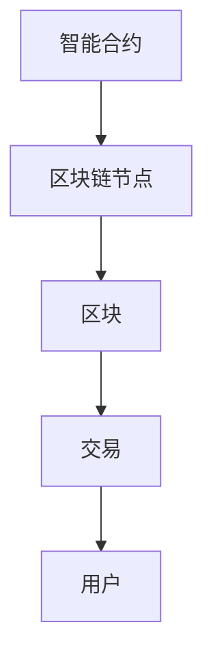
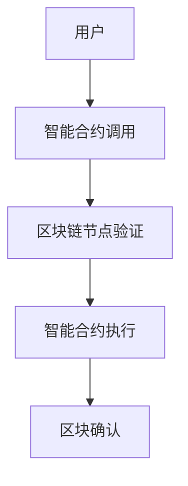
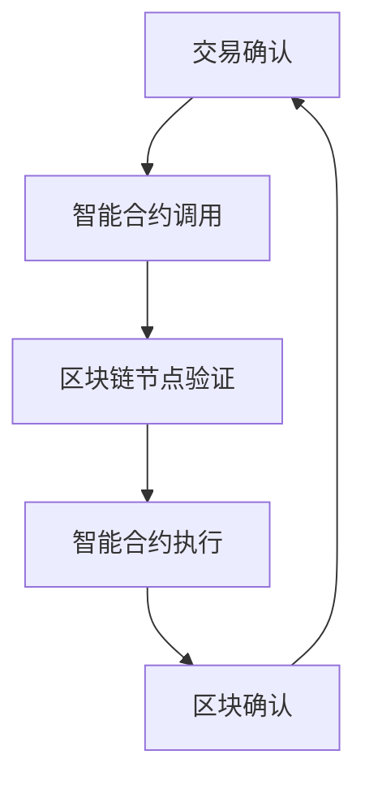

                 


# 智能合约与区块链技术的应用

> 关键词：智能合约，区块链技术，去中心化，分布式 ledger，智能合约执行，区块链应用

> 摘要：智能合约与区块链技术的结合为多个行业带来了革命性的变化，通过区块链的去中心化和不可篡改性，智能合约能够自动执行和管理复杂的交易和协议。本文将深入探讨智能合约的核心原理、区块链技术的算法、系统架构设计以及实际项目实现，帮助读者全面理解智能合约与区块链技术的应用。

---

## 第1章: 智能合约与区块链技术概述

### 1.1 智能合约的定义与特点
智能合约是一种基于区块链的自动执行程序，用于在满足特定条件时自动执行预定义的操作。以下是其核心特点：

- **自动执行性**：智能合约能够在预设条件满足时自动执行操作，无需人工干预。
- **不可篡改性**：部署在区块链上的智能合约代码无法被篡改，确保了合同的法律效力和安全性。
- **去中心化**：智能合约运行在区块链上，不依赖于中心化的机构或信任方。
- **透明性**：合约的执行过程和结果对所有参与者公开透明。

### 1.2 区块链技术的基本概念
区块链是一种分布式账本技术，通过去中心化的方式记录和验证数据，确保数据的安全性和不可篡改性。

- **去中心化**：区块链不依赖于单个中心节点，而是通过多个节点共同维护数据的一致性。
- **不可篡改性**：区块链上的数据通过哈希函数和加密算法保护，确保数据无法被篡改。
- **分布式一致性**：通过共识算法（如PoW、PoS）确保所有节点对数据的一致性达成共识。

### 1.3 智能合约与区块链的关系
智能合约是区块链技术的重要组成部分，通过区块链的特性确保合约的自动执行和安全。

- **智能合约的执行环境**：智能合约运行在区块链的虚拟机（如Ethereum的EVM）中，利用区块链的去中心化特性确保合约的安全执行。
- **区块链的共识机制**：区块链的共识机制（如PoW、PoS）为智能合约的执行提供信任基础，确保合约的执行结果被所有节点接受。

---

## 第2章: 智能合约的核心概念与联系

### 2.1 智能合约的核心原理
智能合约通过区块链的虚拟机环境执行，利用区块链的去中心化和不可篡改性确保合约的自动执行。

- **虚拟机环境**：智能合约运行在区块链的虚拟机中，如Ethereum的EVM（以太坊虚拟机）。
- **编程语言**：智能合约通常使用特定的编程语言（如Solidity）编写，这些语言专为区块链环境设计，支持智能合约的编写和部署。
- **状态管理**：智能合约通过区块链的状态数据库管理合约的状态，确保合约的状态在所有节点上保持一致。

### 2.2 智能合约与区块链的关系对比
以下是智能合约与区块链的对比：

| **特性**        | **智能合约**               | **区块链**                  |
|------------------|----------------------------|-----------------------------|
| **核心功能**     | 自动执行预设条件           | 记录和验证交易               |
| **信任基础**     | 基于区块链的去中心化       | 基于共识机制                |
| **数据存储**     | 区块链的状态数据库         | 区块链的分布式账本           |
| **执行方式**     | 智能合约自动执行           | 区块链节点共同验证交易       |

### 2.3 智能合约与区块链的实体关系图
以下是智能合约与区块链的实体关系图：



---

## 第3章: 区块链技术的算法原理

### 3.1 区块链的共识机制
共识机制是区块链的核心技术，用于确保所有节点对数据的一致性达成共识。

- **工作量证明（PoW）**：通过计算哈希函数的难度来决定记账权，以比特币为例。
- **权益证明（PoS）**：通过持有代币的数量来决定记账权，以太坊2.0采用的机制。
- **共识机制的优缺点**：PoW安全性高但能耗大，PoS能耗低但存在质押不足的风险。

### 3.2 智能合约的执行流程
智能合约的执行流程如下：

1. 用户触发智能合约的调用。
2. 智能合约调用被发送到区块链节点。
3. 区块链节点验证智能合约的合法性。
4. 智能合约在虚拟机中执行。
5. 执行结果被记录到区块链上。

流程图如下：



### 3.3 区块链的加密算法
区块链的加密算法确保数据的安全性和不可篡改性。

- **哈希函数**：用于生成数据的指纹，确保数据的完整性和一致性。
- **加密算法**：用于保护数据的隐私和安全，如RSA、椭圆曲线加密等。

---

## 第4章: 智能合约的数学模型与公式

### 4.1 智能合约的状态转移方程
智能合约的状态转移方程可以表示为：

$$状态 = 状态 + 操作$$

其中，状态表示智能合约当前的状态，操作表示触发智能合约执行的操作。

### 4.2 区块链的哈希函数
哈希函数用于生成数据的指纹，确保数据的完整性和一致性：

$$H(m) = \text{hash}(m)$$

其中，$m$ 表示输入的数据，$H(m)$ 表示数据的哈希值。

### 4.3 智能合约的条件判断逻辑
智能合约的条件判断逻辑可以表示为：

$$\text{if} (条件) \{\text{执行操作}\} \text{else} \{\text{执行其他操作}\}$$

---

## 第5章: 智能合约与区块链的系统分析与架构设计

### 5.1 系统功能设计
智能合约的系统功能设计包括：

- **智能合约编译与部署**：将智能合约代码编译为可执行代码，并部署到区块链上。
- **智能合约执行与监控**：监控智能合约的执行状态，并记录执行结果。
- **区块链节点管理**：管理区块链节点，确保节点的正常运行和数据的一致性。

### 5.2 系统架构设计
以下是智能合约与区块链的系统架构图：


### 5.3 接口设计与交互
智能合约与区块链的接口设计包括：

- **智能合约调用接口**：用户通过调用智能合约的接口触发合约的执行。
- **区块链节点接口**：区块链节点通过接口接收智能合约的调用请求，并进行验证和执行。

### 5.4 交互序列图
以下是智能合约与区块链的交互序列图：



---

## 第6章: 智能合约与区块链技术的项目实战

### 6.1 环境安装
安装智能合约开发环境：

```bash
# 安装以太坊开发环境
npm install -g ethereumjs-testrpc
```

### 6.2 智能合约核心实现
以下是一个简单的智能合约实现：

```solidity
// SPDX-License-Identifier: MIT
pragma solidity ^0.8.0;

contract SimpleContract {
    uint256 public balance;

    function setBalance(uint256 _balance) external {
        balance = _balance;
    }

    function getBalance() external view returns (uint256) {
        return balance;
    }
}
```

### 6.3 代码解读与分析
- **setBalance**：设置合约的余额。
- **getBalance**：获取合约的余额。
- **external**：表示函数只能被外部调用。

### 6.4 实际案例分析
一个简单的供应链管理案例：

1. 供应商通过智能合约记录货物的运输信息。
2. 智能合约自动更新货物的状态。
3. 最终消费者可以通过区块链查询货物的状态。

### 6.5 项目小结
通过实际项目实现，我们可以看到智能合约与区块链技术的强大功能。

---

## 第7章: 智能合约与区块链技术的最佳实践

### 7.1 开发规范
- **代码审查**：确保智能合约代码的安全性。
- **测试用例**：编写全面的测试用例，确保合约的正确性。
- **版本控制**：使用版本控制工具（如Git）管理智能合约代码。

### 7.2 安全注意事项
- **防止重入攻击**：确保智能合约的逻辑安全。
- **避免逻辑漏洞**：审查智能合约的逻辑，防止漏洞被利用。

### 7.3 拓展阅读
- **以太坊智能合约开发文档**：[Ethereum Smart Contract Developer Guide](https://ethereum.org/en/developers/)
- **Solidity编程语言文档**：[Solidity Documentation](https://solidity.readthedocs.io/)

---

## 结论

智能合约与区块链技术的结合为多个行业带来了革命性的变化。通过区块链的去中心化和不可篡改性，智能合约能够自动执行和管理复杂的交易和协议。本文深入探讨了智能合约的核心原理、区块链技术的算法、系统架构设计以及实际项目实现，帮助读者全面理解智能合约与区块链技术的应用。

---

**附录**：如需进一步了解智能合约与区块链技术的实现细节，可以参考相关技术文档和开源项目。

