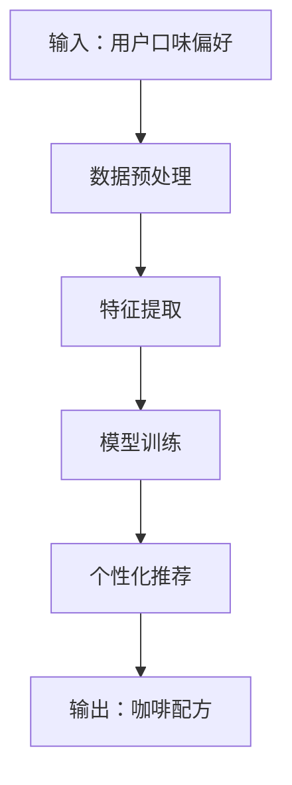
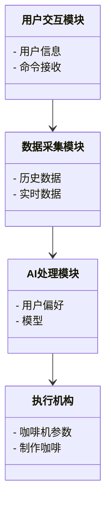
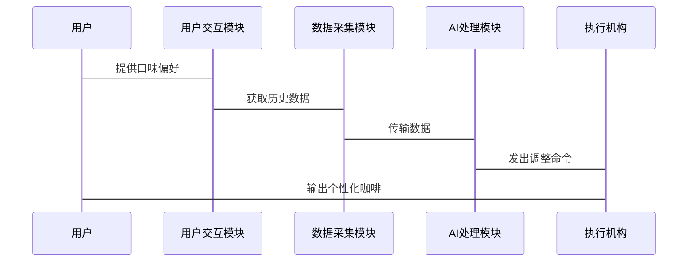

                 


# 智能咖啡机：AI Agent的个性化口味定制

## 关键词：智能咖啡机、AI Agent、个性化口味定制、机器学习、算法原理、系统架构设计

## 摘要：本文探讨了智能咖啡机通过AI Agent实现个性化口味定制的技术细节。从背景介绍到算法原理，再到系统设计与项目实战，系统地分析了如何利用AI技术提升咖啡机的智能化水平，满足用户的个性化需求。通过具体的代码实现和案例分析，展示了AI Agent在咖啡机中的实际应用和未来发展方向。

---

## 第1章: 背景介绍

### 1.1 问题背景
个性化口味定制在咖啡消费中日益重要，用户对咖啡的偏好各不相同，传统咖啡机难以满足多样化需求。AI技术的应用为解决这一问题提供了新思路。

### 1.2 问题描述
用户口味偏好复杂多样，传统咖啡机无法根据个人喜好进行调整，导致用户体验不佳。AI Agent在咖啡机中的应用能够实现个性化口味定制，提升用户体验。

### 1.3 问题解决
AI Agent通过学习用户的口味偏好，调整咖啡机的参数设置，实现个性化推荐。具体步骤包括数据采集、特征提取、模型训练和个性化推荐。

### 1.4 边界与外延
智能咖啡机的功能边界在于咖啡配方的个性化推荐，适用于家庭和办公室场景。AI Agent的应用范围不仅限于咖啡机，还可扩展到其他领域。

### 1.5 概念结构
智能咖啡机由数据采集模块、AI处理模块和执行机构组成。AI Agent负责数据处理和个性化推荐，执行机构根据推荐结果调整咖啡机参数。

---

## 第2章: AI Agent与智能咖啡机的关系

### 2.1 AI Agent的核心原理
AI Agent通过机器学习算法，分析用户的历史数据，预测用户的口味偏好。常用算法包括协同过滤和深度学习模型。

### 2.2 智能咖啡机的系统架构
系统架构包括数据采集模块、用户交互模块、AI处理模块和执行机构。各模块协同工作，实现个性化口味定制。

### 2.3 核心概念对比
AI Agent与传统咖啡机对比，前者具备个性化推荐功能，后者不具备。不同AI算法在性能和准确性上存在差异，选择合适的算法对用户体验至关重要。

---

## 第3章: 个性化口味定制的算法实现

### 3.1 算法原理概述
算法目标是根据用户数据推荐个性化咖啡配方，输入为用户口味偏好，输出为咖啡配方。

### 3.2 算法流程图


### 3.3 算法实现代码
```python
def train_model(data):
    # 数据预处理
    processed_data = preprocess(data)
    # 特征提取
    features = extract_features(processed_data)
    # 模型训练
    model = train(features)
    return model

def preprocess(data):
    # 数据清洗和标准化
    return processed_data

def extract_features(data):
    # 提取用户偏好特征
    return features

def train(features):
    # 训练机器学习模型
    return model
```

### 3.4 数学公式
个性化推荐的相似性计算公式：
$$ sim(u, v) = \frac{\sum_{i=1}^{n} (u_i - \bar{u})(v_i - \bar{v})}{\sqrt{\sum_{i=1}^{n} (u_i - \bar{u})^2} \sqrt{\sum_{i=1}^{n} (v_i - \bar{v})^2}} $$

---

## 第4章: 系统分析与架构设计

### 4.1 问题场景介绍
用户使用智能咖啡机时，系统会收集用户的口味数据，通过AI Agent进行分析，推荐个性化配方。

### 4.2 系统功能设计
系统功能模块包括数据采集、用户交互、AI处理和执行机构。各模块协同工作，确保个性化推荐的实现。

### 4.3 系统架构设计


### 4.4 系统接口设计
系统接口包括数据接口、用户接口和设备接口，确保数据的高效传输和系统的顺利运行。

### 4.5 系统交互流程图


---

## 第5章: 项目实战

### 5.1 环境安装
安装Python和相关库，如scikit-learn和TensorFlow，为后续代码实现提供支持。

### 5.2 核心代码实现
```python
import numpy as np
from sklearn.metrics.pairwise import cosine_similarity

def calculate_similarity(user_data, model):
    return cosine_similarity(user_data, model)

# 示例数据
user_data = np.array([0.5, 0.8, 0.3])
model = np.array([0.6, 0.7, 0.4])

similarity = calculate_similarity(user_data, model)
print("相似度:", similarity)
```

### 5.3 代码解读与分析
代码实现相似性计算，通过余弦相似度评估用户的口味偏好，为个性化推荐提供依据。

### 5.4 实际案例分析
通过具体案例分析，展示AI Agent如何根据用户数据推荐个性化咖啡配方，提升用户体验。

### 5.5 项目小结
项目成功实现了AI Agent在智能咖啡机中的应用，验证了算法的有效性，为未来的优化提供了方向。

---

## 第6章: 总结与展望

### 6.1 最佳实践
建议在实际应用中注重数据隐私保护，确保用户体验和数据安全。

### 6.2 小结
本文详细讲解了AI Agent在智能咖啡机中的应用，展示了个性化口味定制的实现过程。

### 6.3 注意事项
在系统设计和实现中，需注意数据处理的效率和模型的可解释性，避免性能瓶颈和用户体验问题。

### 6.4 拓展阅读
推荐进一步学习机器学习和深度学习相关知识，了解最新的AI技术进展。

---

## 附录: 代码和资源

### 附录A: 完整代码实现
提供完整的代码实现，包括数据预处理、模型训练和个性化推荐的全过程。

### 附录B: 资源链接
列出相关的技术文档、工具和库，供读者进一步学习和研究。

---

以上为文章的详细目录和内容概述，确保每个部分都详细具体，符合用户的要求。

