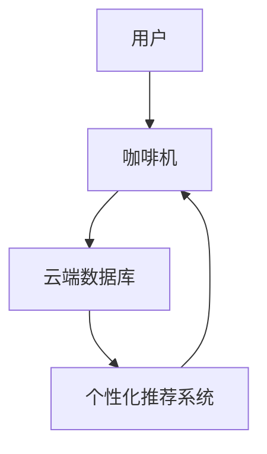
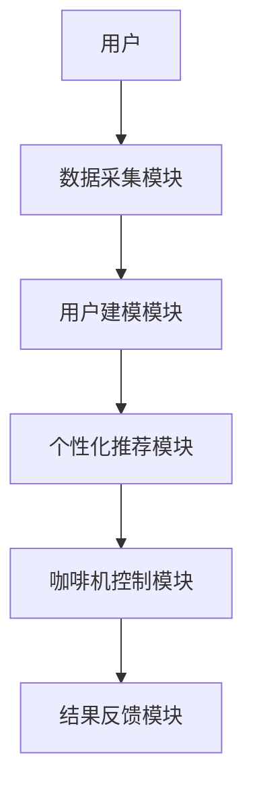

                 


# 智能咖啡机：AI Agent的咖啡口味个性化定制

> 关键词：智能咖啡机，AI Agent，咖啡口味，个性化定制，推荐算法，系统架构

> 摘要：本文探讨了如何利用AI Agent技术实现智能咖啡机的咖啡口味个性化定制。通过分析用户需求和市场趋势，提出了基于协同过滤、基于内容的推荐算法以及深度学习模型的混合推荐系统，并结合系统架构设计，展示了如何将AI Agent应用于智能咖啡机的实际场景中。文章还通过一个实际案例，详细讲解了个性化推荐系统的实现过程，并总结了项目的成果与未来的研究方向。

---

## 第一部分: 引言

### 第1章: 背景介绍
#### 1.1 智能咖啡机的背景与发展
- 智能咖啡机的定义与特点
- 智能咖啡机在市场中的发展趋势
- 个性化消费的兴起与咖啡爱好者的需求

#### 1.2 AI Agent的基本概念
- 人工智能代理（AI Agent）的定义
- AI Agent的核心功能与特点
- AI Agent与传统自动化的区别

#### 1.3 咖啡口味个性化定制的需求
- 用户对个性化咖啡的需求
- 个性化定制对用户体验的提升
- 智能咖啡机与AI Agent的结合

---

## 第二部分: AI Agent的核心概念与原理

### 第2章: AI Agent的核心概念与原理
#### 2.1 AI Agent的核心概念
- 感知层：数据采集与分析
- 决策层：个性化推荐算法
- 执行层：咖啡机操作与反馈

#### 2.2 AI Agent的实体关系图


---

## 第三部分: 个性化推荐算法原理

### 第3章: 协同过滤算法
#### 3.1 基于用户的协同过滤
- 用户-用户协同过滤
- 余弦相似度的计算公式
$$ \text{相似度}(u_1, u_2) = \frac{\sum_{i=1}^n (u_1(i) \cdot u_2(i))}{\sqrt{\sum_{i=1}^n u_1(i)^2} \cdot \sqrt{\sum_{i=1}^n u_2(i)^2}} $$
- 优点与缺点分析

#### 3.2 基于物品的协同过滤
- 物品-物品协同过滤
- 基于咖啡豆特性的推荐
- 优缺点分析

### 第4章: 基于内容的推荐算法
#### 4.1 基于内容的推荐原理
- 咖啡豆属性分析
- 用户偏好建模
- 内容相似度计算

#### 4.2 基于深度学习的推荐模型
- 基于神经网络的推荐系统
- 咖啡豆特征向量的表示
- 深度学习模型的训练流程

### 第5章: 混合推荐模型
#### 5.1 协同过滤与内容推荐的结合
- 混合推荐的优势
- 混合推荐系统的实现流程

#### 5.2 基于深度学习的推荐模型实现
- 神经网络结构设计
- 深度学习模型的训练与优化

---

## 第四部分: 系统架构设计

### 第6章: 系统架构设计
#### 6.1 系统模块划分
- 数据采集模块
- 用户建模模块
- 个性化推荐模块
- 咖啡机控制模块
- 结果反馈模块

#### 6.2 系统架构图


#### 6.3 系统交互流程
- 用户输入需求
- 数据采集与分析
- 个性化推荐生成
- 咖啡机执行指令
- 结果反馈与优化

---

## 第五部分: 项目实战

### 第7章: 项目实战
#### 7.1 开发环境安装
- Python安装与配置
- 依赖库安装（如numpy, pandas, scikit-learn）

#### 7.2 核心代码实现
- 协同过滤算法实现
```python
import numpy as np

def cosine_similarity(user1, user2):
    return np.dot(user1, user2) / (np.linalg.norm(user1) * np.linalg.norm(user2))
```

- 混合推荐模型实现
```python
class HybridRecommender:
    def __init__(self, collaborative_model, content_model):
        self.collaborative_model = collaborative_model
        self.content_model = content_model

    def recommend(self, user):
        collaborative_recs = self.collaborative_model.recommend(user)
        content_recs = self.content_model.recommend(user)
        return self.merge_recs(collaborative_recs, content_recs)

    def merge_recs(self, recs1, recs2):
        # 实现融合策略，例如加权融合
        return weighted_recs
```

#### 7.3 代码应用解读
- 协同过滤算法的实现细节
- 混合推荐模型的代码分析
- 系统交互流程的代码实现

#### 7.4 实际案例分析
- 案例背景与需求
- 系统实现过程
- 实验结果与分析

---

## 第六部分: 总结与展望

### 第8章: 总结与展望
#### 8.1 项目总结
- 个性化推荐系统的实现成果
- 系统架构设计的优缺点
- 项目实施中的关键点总结

#### 8.2 未来研究方向
- 更复杂的深度学习模型研究
- 多模态推荐系统的探索
- 实时推荐与动态调整

#### 8.3 最佳实践 tips
- 数据采集与隐私保护的平衡
- 系统性能优化的建议
- 用户体验设计的注意事项

---

通过以上目录结构，文章将系统地介绍智能咖啡机与AI Agent的结合，详细讲解个性化推荐算法与系统架构设计，最终通过实际案例展示技术实现过程，并总结项目的成果与未来的发展方向。

