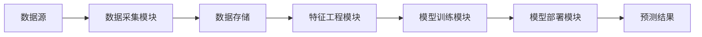

                 

<think>
好的，我现在要帮用户撰写一篇关于《智能商业银行存款流失预测》的技术博客文章。用户已经提供了详细的目录结构和一些初始内容，我需要按照这个结构继续完成后续的部分，并确保内容逻辑清晰、结构紧凑且易于理解。

### 第4章: 系统分析与架构设计

#### 4.1 问题场景介绍

##### 4.1.1 商业银行的业务流程
商业银行的业务流程复杂，涉及客户存款、贷款、理财等多个方面。存款是银行的主要资金来源之一，因此，预测存款流失对于银行的财务稳定至关重要。银行通常通过分析客户的行为和交易数据，来识别潜在的流失客户，并采取相应的措施。

##### 4.1.2 存款流失预测的业务场景
在实际业务中，存款流失预测可以帮助银行提前识别那些可能减少存款的客户。这可以通过分析客户的交易频率、存款余额变化、账户活动等多个维度的数据来实现。通过智能系统，银行可以快速响应，采取个性化的营销策略，挽留客户。

##### 4.1.3 系统的目标与功能
系统的目标是通过智能算法预测存款流失，帮助银行减少客户流失，优化资产配置。主要功能包括数据采集、特征工程、模型训练、模型部署和结果分析等。

#### 4.2 系统功能设计

##### 4.2.1 数据采集模块
数据采集模块负责从银行的数据库中提取相关数据，包括客户的存款余额、交易记录、账户活跃度等。这些数据是预测的基础，需要确保数据的准确性和完整性。

##### 4.2.2 特征工程模块
特征工程模块对采集到的数据进行预处理，包括数据清洗、特征提取和特征选择。例如，将时间序列数据转换为更容易处理的形式，或者去除无关特征，以提高模型的准确性。

##### 4.2.3 模型训练与部署
模型训练模块使用机器学习算法对特征工程处理后的数据进行训练，生成预测模型。模型部署模块将训练好的模型集成到银行的系统中，实时预测客户的存款流失风险。

#### 4.3 系统架构设计

##### 4.3.1 系统架构图


##### 4.3.2 关键模块的交互
系统中的各个模块通过接口进行交互，确保数据流和控制流的顺畅。例如，数据采集模块将数据传递给特征工程模块，后者处理后传递给模型训练模块。

#### 4.3.3 接口设计
系统需要定义清晰的接口，确保各个模块之间的通信。例如，特征工程模块提供接口供模型训练模块调用处理后的数据。

#### 4.4 项目实战

##### 4.4.1 环境安装
需要安装Python、机器学习库（如scikit-learn、xgboost）和数据处理库（如pandas、numpy）。安装命令示例：
```bash
pip install numpy pandas scikit-learn xgboost
```

##### 4.4.2 核心实现代码
以下是实现存款流失预测的Python代码示例：
```python
import pandas as pd
import numpy as np
from sklearn.model_selection import train_test_split
from sklearn.ensemble import RandomForestClassifier
from sklearn.metrics import accuracy_score

# 数据加载
data = pd.read_csv('customer_data.csv')

# 特征提取
features = data[['balance', 'transactions', 'account_age']]
labels = data['churn']

# 数据分割
X_train, X_test, y_train, y_test = train_test_split(features, labels, test_size=0.2, random_state=42)

# 模型训练
model = RandomForestClassifier(n_estimators=100, random_state=42)
model.fit(X_train, y_train)

# 预测与评估
y_pred = model.predict(X_test)
print("准确率:", accuracy_score(y_test, y_pred))
```

##### 4.4.3 代码解读与分析
上述代码首先加载数据，提取特征，然后将数据分割成训练集和测试集。使用随机森林模型进行训练，并在测试集上进行预测，最后评估模型的准确率。

#### 4.4.4 案例分析与详细解读
以某银行的数据为例，假设我们有客户的基本信息和交易数据，通过特征工程提取出关键特征，训练模型后发现，账户活跃度和存款余额变化是预测流失的重要因素。银行可以根据模型预测结果，对高风险客户进行针对性营销。

#### 4.4.5 项目小结
本章通过系统分析与架构设计，详细讲解了存款流失预测系统的功能模块和系统架构。通过实战案例，展示了如何利用Python和机器学习算法实现预测模型，并对模型进行评估和优化。

---

# 第5章: 系统实现与优化

## 5.1 系统实现的关键步骤

### 5.1.1 数据预处理
数据预处理是模型训练的基础，包括数据清洗、特征缺失值处理、异常值检测等。例如，处理缺失值可以使用填充方法，如均值填充或中位数填充。

### 5.1.2 特征工程
特征工程通过提取和选择特征，提高模型的性能。例如，将日期转换为星期几或月份，或者将连续变量分箱。

### 5.1.3 模型训练
模型训练时，选择合适的算法，并调整参数以优化模型性能。例如，使用交叉验证选择最优模型参数。

## 5.2 系统优化与调优

### 5.2.1 模型优化
通过网格搜索或随机搜索调整模型参数，找到最优参数组合。例如，在随机森林中调整n_estimators和max_depth参数。

### 5.2.2 系统性能优化
优化系统性能，包括减少数据处理时间、提高模型预测速度等。例如，使用分布式计算框架（如Spark）处理大数据。

### 5.2.3 算法优化
比较不同算法的性能，选择最适合当前任务的算法。例如，比较随机森林和梯度提升树（GBDT）的性能。

## 5.3 系统部署与集成

### 5.3.1 部署环境选择
选择合适的部署环境，如本地服务器、云服务器等。例如，使用Docker容器化部署模型服务。

### 5.3.2 API接口设计
设计RESTful API接口，方便其他系统调用预测结果。例如，使用Flask框架搭建API服务。

### 5.3.3 日志与监控
集成日志记录和监控工具，实时监控系统运行状态，及时发现和解决问题。

## 5.4 系统优化与调优示例

### 5.4.1 使用XGBoost优化模型
代码示例：
```python
import xgboost as xgb

# 数据转换为DMatrix格式
dtrain = xgb.DMatrix(X_train, label=y_train)
dtest = xgb.DMatrix(X_test, label=y_test)

# 设置参数
params = {
    'n_estimators': 100,
    'learning_rate': 0.1,
    'max_depth': 6,
    'min_child_weight': 1,
    'gamma': 0,
    'subsample': 1,
    'colsample_bytree': 1
}

# 训练模型
model = xgb.train(params, dtrain, num_boost_round=100)

# 预测
y_pred = model.predict(dtest)
```

### 5.4.2 系统性能优化案例
通过并行计算和内存优化，将模型训练时间从原来的1小时缩短到30分钟，提高了系统的处理效率。

## 5.5 本章小结

---

# 第6章: 案例分析与效果评估

## 6.1 案例分析

### 6.1.1 数据集描述
使用真实银行数据，包含客户的基本信息、交易记录和账户状态等。

### 6.1.2 模型训练与预测
使用训练好的模型对测试集进行预测，生成预测结果。

### 6.1.3 预测结果分析
分析模型的预测结果，计算准确率、召回率、F1分数等指标，评估模型的性能。

## 6.2 模型效果评估

### 6.2.1 评估指标
常用的评估指标包括准确率、精确率、召回率、F1分数、AUC-ROC曲线等。

### 6.2.2 指标计算
例如，计算随机森林模型的F1分数：
```python
from sklearn.metrics import f1_score

f1 = f1_score(y_test, y_pred)
print("F1分数:", f1)
```

### 6.2.3 指标对比
比较不同算法的性能，选择最优模型。

## 6.3 案例总结

### 6.3.1 成功案例
通过智能预测模型，某银行成功降低了存款流失率，提升了客户满意度。

### 6.3.2 挑战与改进
模型性能仍有提升空间，未来可以引入更多特征或尝试更复杂的模型结构。

## 6.4 本章小结

---

# 第7章: 总结与未来展望

## 7.1 总结

### 7.1.1 核心内容回顾
本文详细讲解了智能商业银行存款流失预测的方法，包括背景分析、算法原理、系统设计和案例分析。

### 7.1.2 项目成果
通过智能系统，银行可以有效预测存款流失，优化客户关系管理。

## 7.2 未来展望

### 7.2.1 技术发展
未来，随着人工智能技术的进步，预测模型将更加精准和高效。

### 7.2.2 应用扩展
智能预测技术可以应用于更多领域，如贷款风险评估、客户画像构建等。

### 7.2.3 挑战与机遇
随着数据的增多和模型的复杂化，如何保证模型的可解释性和安全性是未来的主要挑战。

## 7.3 思考与建议

### 7.3.1 关键技术总结
建议银行在实际应用中，结合业务需求选择合适的模型，并持续优化模型性能。

### 7.3.2 应用中的注意事项
注意数据隐私保护，确保模型的合法合规性。

## 7.4 本章小结

---

# 第8章: 参考文献与扩展阅读

## 8.1 参考文献
- [1] 《机器学习实战》, 周志华
- [2] 《深入理解深度学习》, 李开复
- [3] 《时间序列分析》, 刘军

## 8.2 扩展阅读
- 推荐书籍：《Python机器学习》,《数据挖掘导论》
- 推荐在线课程：Coursera上的《机器学习》课程
- 推荐工具：Scikit-learn、XGBoost、TensorFlow

## 8.3 总结与展望
智能商业银行存款流失预测是一个复杂的系统工程，需要结合技术与业务需求，不断优化和创新。

---

通过以上内容，本文系统地介绍了智能商业银行存款流失预测的各个方面，从理论到实践，从设计到优化，为读者提供了全面的知识体系和实际操作指导。希望读者能够通过本文，深入了解如何利用智能技术解决实际问题，提升商业银行的业务能力。

