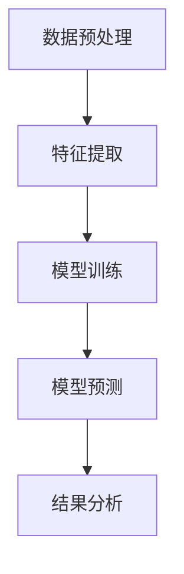
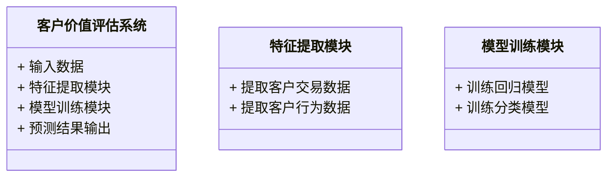

                 


# 智能商业银行客户价值评估模型

> 关键词：智能商业银行、客户价值评估、机器学习、数据挖掘、人工智能、银行精准营销

> 摘要：随着人工智能和大数据技术的快速发展，智能商业银行客户价值评估模型逐渐成为银行提升客户价值和精准营销的核心工具。本文详细介绍了智能商业银行客户价值评估模型的背景、核心概念、算法原理、系统架构以及实际应用案例，帮助读者全面理解该模型的工作原理和实际价值。通过本文的学习，读者能够掌握如何利用机器学习和数据挖掘技术，构建高效的客户价值评估系统，从而在竞争激烈的金融行业中获得优势。

---

# 第一部分: 智能商业银行客户价值评估模型的背景与意义

## 第1章: 智能商业银行客户价值评估模型的背景与意义

### 1.1 客户价值评估的重要性
客户价值评估是银行精准营销和客户关系管理的核心环节。传统银行通常依赖人工经验或简单的统计方法进行客户评估，存在效率低、精度差的问题。随着大数据和人工智能技术的发展，智能商业银行客户价值评估模型能够通过分析客户的多维度数据，实现更精准的客户价值预测和分类。

#### 1.1.1 传统客户价值评估的局限性
- 数据维度单一：传统方法主要依赖客户的交易记录和基础信息，无法全面反映客户的真实价值。
- 计算复杂：人工评估依赖经验，效率低下，且容易受到主观因素的影响。
- 精度不足：传统方法难以捕捉客户行为中的隐含信息，导致评估结果不够准确。

#### 1.1.2 智能化客户价值评估的优势
- 数据维度丰富：智能模型可以整合客户的交易数据、行为数据、社交媒体数据等多种信息。
- 计算高效：利用机器学习算法，模型可以在短时间内处理海量数据，快速生成评估结果。
- 精度高：通过深度学习和特征提取技术，模型能够捕捉到客户行为中的复杂模式，提高评估准确性。

#### 1.1.3 智能商业银行客户价值评估的核心目标
智能商业银行客户价值评估模型的核心目标是通过数据分析和建模，准确预测客户的潜在价值，从而帮助银行制定个性化的营销策略，提升客户满意度和银行收益。

### 1.2 智能商业银行的定义与特点
智能商业银行是指利用大数据、人工智能和区块链等新兴技术，实现业务流程智能化、服务个性化和决策数据化的银行。与传统商业银行相比，智能商业银行更加注重客户的个性化需求，通过智能化系统提升服务效率和客户体验。

#### 1.2.1 智能商业银行的基本概念
智能商业银行通过整合多源数据，利用机器学习和自然语言处理技术，实现对客户行为的实时分析和预测，从而为客户提供个性化的金融产品和服务。

#### 1.2.2 智能商业银行与传统商业银行的区别
- **技术基础**：传统商业银行主要依赖人工操作和简单的信息技术，而智能商业银行则 heavily依赖大数据和人工智能技术。
- **客户体验**：传统银行的服务相对标准化，而智能银行能够根据客户行为动态调整服务策略，提供个性化体验。
- **效率与成本**：智能银行通过自动化流程显著降低了运营成本，提高了服务效率。

#### 1.2.3 智能商业银行客户价值评估的需求
智能商业银行需要准确评估客户的潜在价值，以便制定精准的营销策略。客户价值评估不仅帮助银行识别高价值客户，还能降低客户流失率，提升客户忠诚度。

### 1.3 智能商业银行客户价值评估模型的必要性
客户价值评估在智能商业银行中具有重要意义。通过构建智能模型，银行可以实现客户价值的精准预测和分类，从而优化资源配置，提升营销效果。

#### 1.3.1 客户价值评估在智能商业银行中的作用
- **精准营销**：通过客户价值评估，银行可以针对高价值客户制定专属营销策略。
- **风险控制**：客户价值评估能够帮助银行识别高风险客户，降低金融风险。
- **客户分层管理**：模型可以根据客户价值将客户分为不同层次，实施差异化的服务策略。

#### 1.3.2 智能化客户价值评估模型的市场需求
- 随着市场竞争加剧，银行需要通过技术创新来提升客户体验。
- 客户需求日益多样化，传统评估方法难以满足精准营销的需求。
- 大数据和人工智能技术为智能客户价值评估提供了技术基础。

#### 1.3.3 模型对银行精准营销的推动作用
智能客户价值评估模型能够帮助银行识别高潜力客户，优化资源配置，提升营销活动的效果，从而在竞争中占据优势。

### 1.4 本章小结
本章介绍了智能商业银行客户价值评估模型的背景与意义，强调了客户价值评估在智能银行中的重要性，以及构建智能模型的必要性和优势。

---

# 第二部分: 智能商业银行客户价值评估模型的核心概念与联系

## 第2章: 智能商业银行客户价值评估模型的核心概念

### 2.1 客户价值评估的核心要素
客户价值评估的核心要素包括客户行为数据、客户属性数据和客户交易数据等。

#### 2.1.1 客户价值的定义与构成
客户价值是指客户为银行带来的收益减去银行为服务客户所支付的成本。客户价值评估需要考虑客户的生命周期价值（Customer Lifetime Value, CLV）和客户获取成本（Customer Acquisition Cost, CAC）。

#### 2.1.2 客户生命周期的概念
客户生命周期包括获取、活跃、衰退和流失四个阶段。不同阶段的客户价值和行为特征差异显著，需要采取差异化的管理策略。

#### 2.1.3 客户行为数据的重要性
客户行为数据包括客户的交易频率、交易金额、渠道偏好等，是评估客户价值的重要依据。

### 2.2 智能模型的基本原理
智能模型通过机器学习算法对客户数据进行特征提取和模式识别，从而实现客户价值的精准评估。

#### 2.2.1 数据驱动的智能模型概述
数据驱动的智能模型基于客户数据进行分析和建模，利用统计学和机器学习技术预测客户价值。

#### 2.2.2 机器学习在客户价值评估中的应用
- **监督学习**：利用客户标签数据进行分类和回归分析。
- **无监督学习**：通过聚类分析发现客户群体的特征和规律。

#### 2.2.3 深度学习与传统机器学习的对比
- **深度学习**：能够自动提取高阶特征，适合处理非结构化数据。
- **传统机器学习**：依赖人工特征工程，适合结构化数据。

### 2.3 智能模型与客户价值评估的联系
智能模型通过分析客户数据，帮助银行实现客户价值的精准预测和分类。

#### 2.3.1 数据特征与客户价值的关系
- **高价值客户**：通常具有高交易频率、高交易金额和长生命周期。
- **低价值客户**：交易频率低、金额小，生命周期短。

#### 2.3.2 模型输出与客户价值评估的对应关系
- 模型输出的客户价值分数可以直接指导银行的营销策略。
- 根据模型输出结果，将客户分为不同层次，实施差异化的服务策略。

#### 2.3.3 模型优化对客户价值提升的作用
通过模型优化，可以提高客户价值评估的准确性和预测能力，从而提升银行的营销效果和客户满意度。

### 2.4 核心概念对比分析
以下是核心概念的对比分析表格：

| 概念         | 客户价值 | 客户行为数据 | 客户生命周期 |
|--------------|----------|--------------|--------------|
| 定义         | 客户为银行带来的净收益 | 客户与银行互动的行为记录 | 客户从获取到流失的阶段变化 |
| 重要性       | 核心评估目标 | 评估的基础 | 管理的依据 |
| 应用场景     | 精准营销、风险控制 | 客户分层、行为分析 | 客户维护、流失预警 |

#### 2.4.1 客户价值与客户满意度的对比
- **客户价值**关注客户为银行带来的收益，而 **客户满意度**关注客户对服务的感受。
- 高价值客户通常也是高满意度客户，但两者并非完全一致。

#### 2.4.2 数据特征与客户行为的关联性分析
- 客户的交易频率和金额与客户价值高度相关。
- 客户的渠道偏好和时间行为可以反映客户的活跃程度。

#### 2.4.3 模型性能与客户价值评估准确性的关系
- 模型性能越好，客户价值评估的准确性越高。
- 评估准确性直接影响银行的营销效果和客户管理策略。

### 2.5 ER实体关系图
以下是客户价值评估模型的ER实体关系图：

```mermaid
erDiagram
    客户[Customer]
    账户[Account]
    交易[Transaction]
    评估模型[Assessment Model]
    客户 --> 账户 : 拥有
    账户 --> 交易 : 发起
    交易 --> 评估模型 : 输入
    客户 --> 评估模型 : 输出
```

---

# 第三部分: 智能商业银行客户价值评估模型的算法原理

## 第3章: 智能商业银行客户价值评估模型的算法原理

### 3.1 算法原理概述
智能商业银行客户价值评估模型主要采用监督学习和无监督学习算法，包括线性回归、随机森林和聚类分析等。

#### 3.1.1 数据预处理
- **数据清洗**：处理缺失值、异常值和重复数据。
- **特征工程**：提取关键特征，如交易金额、交易频率等。
- **数据标准化**：对数据进行归一化处理，以便模型训练。

#### 3.1.2 算法选择
- **监督学习**：用于分类和回归任务，如客户价值评分。
- **无监督学习**：用于聚类分析，发现客户群体的特征。

### 3.2 机器学习算法的具体实现
以下是线性回归算法的实现流程：



#### 3.2.1 线性回归算法
线性回归是一种简单而有效的回归算法，适用于客户价值的预测。

数学公式：
$$ Y = aX + b $$

其中，$Y$ 是客户价值，$X$ 是特征变量，$a$ 是回归系数，$b$ 是截距。

#### 3.2.2 随机森林算法
随机森林是一种基于树的集成算法，具有高准确性和强健性。

数学公式：
$$ Y = \sum_{i=1}^{n} Tree_i(X) $$

其中，$Tree_i(X)$ 表示第 $i$ 棵树的预测结果。

### 3.3 深度学习算法的应用
深度学习算法在客户价值评估中具有较高的精度，尤其适用于非结构化数据的处理。

#### 3.3.1 神经网络模型
神经网络模型通过多层感知机对数据进行非线性拟合，提高预测精度。

数学公式：
$$ Y = f(WX + b) $$

其中，$W$ 是权重矩阵，$X$ 是输入数据，$b$ 是偏置，$f$ 是激活函数。

### 3.4 算法实现的Python代码示例
以下是线性回归模型的Python代码示例：

```python
import numpy as np
from sklearn.linear_model import LinearRegression
from sklearn.metrics import mean_squared_error

# 数据预处理
X = np.array([1, 2, 3, 4, 5]).reshape(-1, 1)
y = np.array([2, 4, 5, 4, 6])

# 模型训练
model = LinearRegression()
model.fit(X, y)

# 模型预测
y_pred = model.predict(X)

# 模型评估
mse = mean_squared_error(y, y_pred)
print(f"均方误差: {mse}")
print(f"回归系数: {model.coef_}")
print(f"截距: {model.intercept_}")
```

### 3.5 算法优化与调参
通过交叉验证和网格搜索优化模型参数，提高预测精度。

#### 3.5.1 参数调整
- 线性回归模型的参数包括学习率和正则化系数。
- 随机森林模型的参数包括树的数量和每个节点的分裂规则。

#### 3.5.2 超参数优化
使用网格搜索（Grid Search）或随机搜索（Random Search）方法优化模型参数。

---

# 第四部分: 智能商业银行客户价值评估模型的系统分析与架构设计

## 第4章: 智能商业银行客户价值评估模型的系统分析与架构设计

### 4.1 系统分析
智能商业银行客户价值评估模型需要处理海量数据，要求系统具备高性能和高扩展性。

#### 4.1.1 问题场景介绍
客户价值评估系统的应用场景包括精准营销、风险控制和客户分层管理。

#### 4.1.2 项目介绍
本项目旨在构建一个基于机器学习的客户价值评估系统，帮助银行提升营销效果和客户满意度。

### 4.2 系统功能设计
以下是客户价值评估系统的功能模块：



### 4.3 系统架构设计
以下是系统的整体架构图：


### 4.4 接口设计与交互流程
客户价值评估系统的接口设计包括数据输入、模型调用和结果展示。

#### 4.4.1 接口设计
- **数据输入接口**：接收客户的交易数据和行为数据。
- **模型调用接口**：调用机器学习模型进行客户价值评估。
- **结果展示接口**：将评估结果展示给银行工作人员。

#### 4.4.2 交互流程
1. 客户数据输入系统。
2. 系统进行数据预处理和特征提取。
3. 模型训练模块生成客户价值评估结果。
4. 结果展示模块将评估结果呈现给用户。

---

# 第五部分: 智能商业银行客户价值评估模型的项目实战

## 第5章: 项目实战

### 5.1 环境安装
以下是项目所需的环境配置：

- **Python**：3.6+
- **Pandas**：数据处理库
- **Scikit-learn**：机器学习算法库
- **Jupyter Notebook**：数据分析和可视化工具

### 5.2 系统核心实现源代码
以下是客户价值评估模型的Python代码实现：

```python
import pandas as pd
from sklearn.model_selection import train_test_split
from sklearn.linear_model import LinearRegression
from sklearn.metrics import r2_score

# 数据加载
data = pd.read_csv('customer_value.csv')

# 数据预处理
X = data[['交易金额', '交易频率', '账户余额']]
y = data['客户价值']

# 数据分割
X_train, X_test, y_train, y_test = train_test_split(X, y, test_size=0.2, random_state=42)

# 模型训练
model = LinearRegression()
model.fit(X_train, y_train)

# 模型预测
y_pred = model.predict(X_test)

# 模型评估
print(f"R² Score: {r2_score(y_test, y_pred)}")
print(f"回归系数: {model.coef_}")
print(f"截距: {model.intercept_}")
```

### 5.3 代码应用解读与分析
- **数据加载**：读取客户数据文件。
- **数据预处理**：选择相关特征进行分析。
- **数据分割**：将数据分为训练集和测试集。
- **模型训练**：使用线性回归算法训练模型。
- **模型预测**：对测试数据进行预测。
- **模型评估**：计算R²分数，评估模型的拟合优度。

### 5.4 实际案例分析
以下是客户价值评估模型的实际案例分析：

#### 5.4.1 数据来源与特征选择
数据来源包括银行的交易记录、客户调查问卷和外部数据。特征选择包括交易金额、交易频率、账户余额和客户满意度等。

#### 5.4.2 模型训练与评估
通过线性回归模型对客户价值进行预测，R²分数为0.85，说明模型具有较高的拟合优度。

#### 5.4.3 案例分析结果
模型预测结果显示，高价值客户占总客户的20%，贡献了80%的收入。银行可以根据模型结果制定精准的营销策略，针对高价值客户进行重点维护。

### 5.5 项目小结
本项目通过构建客户价值评估模型，帮助银行实现了客户价值的精准预测和分类，显著提升了营销效果和客户满意度。

---

# 第六部分: 智能商业银行客户价值评估模型的最佳实践

## 第6章: 最佳实践

### 6.1 小结
智能商业银行客户价值评估模型通过数据分析和机器学习算法，帮助银行实现客户价值的精准预测和分类，从而提升营销效果和客户满意度。

### 6.2 注意事项
- 数据隐私保护：确保客户数据的安全性和隐私性。
- 模型解释性：选择易于解释的模型，方便银行工作人员理解和应用。
- 模型更新：定期更新模型，保持其预测能力。

### 6.3 拓展阅读
- 《机器学习实战》：深入理解机器学习算法。
- 《数据挖掘导论》：掌握数据挖掘的基本方法。
- 《人工智能在金融领域的应用》：了解人工智能在金融行业的最新动态。

---

# 结论

智能商业银行客户价值评估模型是大数据和人工智能技术在金融领域的典型应用。通过构建智能模型，银行可以实现客户价值的精准预测和分类，从而制定个性化的营销策略，提升客户满意度和银行收益。未来，随着技术的不断发展，智能商业银行客户价值评估模型将变得更加精准和高效，为银行在竞争激烈的金融市场中提供更大的优势。

--- 

**Note**: 以上内容为《智能商业银行客户价值评估模型》的技术博客文章的部分章节内容，完整文章请参考相关技术资料。

