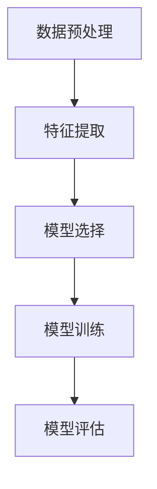
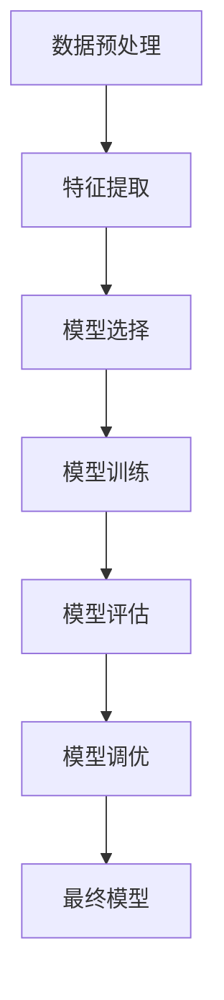
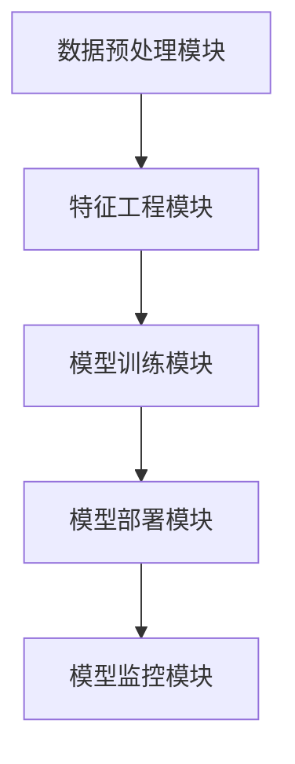
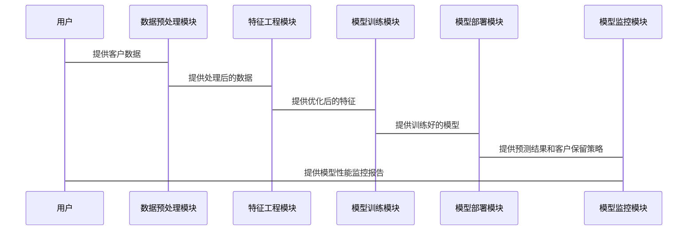

                 


# 智能商业银行客户流失预测

> 关键词：智能银行、客户流失预测、机器学习、数据挖掘、银行客户管理

> 摘要：本文深入探讨了商业银行客户流失预测的重要性、核心概念、算法原理、系统设计及项目实战。通过详细分析客户流失预测的背景、数据特征、模型选择、算法实现和系统架构，结合实际案例，为商业银行提供智能化的客户管理解决方案。文章最后总结了最佳实践、注意事项和未来发展方向，帮助读者全面理解和应用智能客户流失预测技术。

---

# 第一部分: 智能商业银行客户流失预测概述

## 第1章: 客户流失预测的背景与意义

### 1.1 客户流失预测的背景与意义

#### 1.1.1 商业银行客户流失的现状
商业银行作为金融行业的重要组成部分，其客户群体庞大且复杂。然而，客户流失问题一直是商业银行面临的重要挑战。随着市场竞争的加剧，客户流失率逐年上升，导致银行收入下降、市场份额减少。根据行业统计数据，客户流失率高的银行，其客户保留成本比流失率低的银行高出30%以上。

#### 1.1.2 客户流失预测的重要性
客户流失预测能够帮助商业银行提前识别高风险客户，采取主动措施减少客户流失。通过预测模型，银行可以深入了解客户流失的原因，优化产品和服务策略，提升客户满意度和忠诚度。此外，客户流失预测还能帮助银行提高营销效率，降低获客成本。

#### 1.1.3 智能化预测的核心价值
传统客户流失预测方法依赖于人工分析，效率低且精度差。而智能化预测通过机器学习和大数据技术，能够快速处理海量数据，挖掘潜在规律，提供高精度的预测结果。智能化预测不仅提高了预测的准确性，还能够实时更新模型，适应市场变化。

### 1.2 客户流失预测的定义与分类

#### 1.2.1 客户流失的定义
客户流失是指客户不再与银行发生交易或减少交易频率的行为。客户流失的原因多种多样，包括服务不满意、产品不满足需求、竞争银行的吸引等。

#### 1.2.2 客户流失的分类
根据客户流失的时间和原因，可以将客户流失分为以下几类：
- **短期流失**：客户在短时间内停止使用银行服务。
- **长期流失**：客户长期不再与银行发生交易。
- **主动流失**：客户主动选择其他银行服务。
- **被动流失**：客户因银行服务问题而流失。

#### 1.2.3 智能预测的特征与优势
智能化客户流失预测具有以下特征：
- **数据驱动**：基于大量客户数据进行分析。
- **实时性**：能够实时更新模型，提供实时预测。
- **高精度**：通过机器学习算法提高预测准确性。
- **可解释性**：模型能够解释预测结果，帮助银行制定针对性策略。

### 1.3 问题背景与目标

#### 1.3.1 问题背景分析
商业银行客户流失问题不仅影响银行的收入，还可能导致客户信任度下降。通过预测客户流失，银行可以提前采取措施，降低客户流失率，提高客户满意度和忠诚度。

#### 1.3.2 问题目标设定
客户流失预测的目标是通过分析客户数据，识别潜在流失客户，预测客户流失概率，并制定相应的客户保留策略。

#### 1.3.3 边界与外延
客户流失预测的边界包括客户的基本信息、交易记录、服务评价等数据。外延则包括客户流失的原因分析和客户保留策略的制定。

### 1.4 核心概念与联系

#### 1.4.1 核心概念原理
客户流失预测的核心概念包括数据特征、模型选择和评估指标。数据特征包括客户的基本信息、交易记录、服务评价等；模型选择包括逻辑回归、决策树、随机森林等；评估指标包括准确率、召回率、F1值等。

#### 1.4.2 概念属性特征对比表格
以下表格对比了客户流失预测中的数据特征、模型特征和评估指标：

| 特征 | 描述 |
|------|------|
| 数据特征 | 客户ID、交易金额、交易频率、客户满意度 |
| 模型特征 | 逻辑回归、决策树、随机森林 |
| 评估指标 | 准确率、召回率、F1值 |

#### 1.4.3 ER实体关系图
以下是一个简单的客户流失预测实体关系图：

```mermaid
erd
  Customer
  - 客户ID (PK)
  - 姓名
  - 联系方式
  - 交易记录
  - 客户流失标签
```

### 1.5 本章小结
本章主要介绍了商业银行客户流失预测的背景、定义、分类及其核心概念。通过分析客户流失的原因和分类，明确了智能化预测的核心价值和目标。同时，通过对比数据特征、模型特征和评估指标，为后续的算法选择和系统设计奠定了基础。

---

## 第2章: 客户流失预测的核心概念与联系

### 2.1 核心概念原理

#### 2.1.1 数据特征分析
客户流失预测的数据特征包括客户的基本信息、交易记录、服务评价等。这些数据特征可以通过数据预处理和特征工程进行提取和优化。

#### 2.1.2 模型选择与优化
在模型选择方面，需要根据数据特征和业务需求选择合适的算法。例如，逻辑回归适合二分类问题，决策树适合特征较多的情况，随机森林适合特征重要性分析。

#### 2.1.3 评估指标与优化目标
客户流失预测的评估指标包括准确率、召回率、F1值等。优化目标是通过模型调参和特征优化，提高预测准确率和召回率。

### 2.2 概念属性特征对比

#### 2.2.1 数据特征对比
以下表格对比了不同数据特征对客户流失预测的影响：

| 数据特征 | 描述 | 对预测的影响 |
|----------|------|--------------|
| 交易金额 | 客户的消费能力 | 高交易金额客户流失概率低 |
| 交易频率 | 客户的活跃程度 | 高交易频率客户流失概率低 |
| 客户满意度 | 客户对服务的满意程度 | 满意度高的客户流失概率低 |

#### 2.2.2 模型特征对比
以下表格对比了不同模型在客户流失预测中的表现：

| 模型 | 描述 | 适用场景 | 优点 | 缺点 |
|------|------|----------|------|------|
| 逻辑回归 | 线性分类模型 | 二分类问题 | 计算简单 | 非线性关系表现差 |
| 决策树 | 基于特征分裂的树状结构 | 特征较多的情况 | 易解释 | �易过拟合 |
| 随机森林 | 基于决策树的集成模型 | 特征重要性分析 | 抗过拟合 | 计算复杂 |

#### 2.2.3 评估指标对比
以下表格对比了不同评估指标在客户流失预测中的应用：

| 评估指标 | 描述 | 适用场景 | 优点 | 缺点 |
|----------|------|----------|------|------|
| 准确率 | 正确预测的比例 | 类别分布均衡 | 简单直观 | 易受类别不平衡影响 |
| 召回率 | 正确预测的正类比例 | 类别不平衡问题 | 考虑了正类预测情况 | 忽略了负类预测情况 |
| F1值 | 准确率和召回率的调和平均 | 综合评估模型表现 | 平衡了准确率和召回率 | 不适用于多分类问题 |

### 2.3 ER实体关系图

#### 2.3.1 实体关系图
以下是一个更详细的客户流失预测实体关系图：

```mermaid
erd
  Customer
  - 客户ID (PK)
  - 姓名
  - 联系方式
  - 账户余额
  - 交易记录
    - 交易ID (PK)
    - 交易金额
    - 交易时间
  - 客户流失标签
    - 流失标签ID (PK)
    - 流失原因
    - 流失概率
```

### 2.4 本章小结
本章通过对比分析数据特征、模型特征和评估指标，明确了客户流失预测的核心概念及其之间的联系。通过ER实体关系图，展示了客户流失预测系统的数据结构和关系。这些内容为后续的算法选择和系统设计提供了理论基础。

---

## 第3章: 客户流失预测的算法原理

### 3.1 算法原理概述

#### 3.1.1 逻辑回归
逻辑回归是一种常用的二分类算法，适用于客户流失预测这种二分类问题。其核心思想是通过sigmoid函数将线性回归的输出映射到0-1区间，表示客户流失的概率。

##### 3.1.1.1 逻辑回归公式
$$ P(y=1) = \frac{1}{1 + e^{- (\beta_0 + \beta_1 x_1 + \cdots + \beta_n x_n)}} $$

##### 3.1.1.2 逻辑回归流程图


##### 3.1.1.3 逻辑回归代码实现
```python
import pandas as pd
from sklearn.linear_model import LogisticRegression
from sklearn.metrics import accuracy_score

# 数据加载与预处理
data = pd.read_csv('customer_churn.csv')
X = data.drop('churn', axis=1)
y = data['churn']

# 模型训练
model = LogisticRegression()
model.fit(X, y)

# 模型评估
y_pred = model.predict(X)
print('准确率:', accuracy_score(y, y_pred))
```

#### 3.1.2 决策树
决策树是一种基于特征分裂的树状结构，适用于特征较多的客户流失预测问题。其核心思想是通过特征分裂，逐步缩小客户群体，最终确定客户流失的概率。

##### 3.1.2.1 决策树流程图


##### 3.1.2.2 决策树代码实现
```python
from sklearn.tree import DecisionTreeClassifier
from sklearn.metrics import accuracy_score

# 数据加载与预处理
data = pd.read_csv('customer_churn.csv')
X = data.drop('churn', axis=1)
y = data['churn']

# 模型训练
model = DecisionTreeClassifier()
model.fit(X, y)

# 模型评估
y_pred = model.predict(X)
print('准确率:', accuracy_score(y, y_pred))
```

#### 3.1.3 随机森林
随机森林是一种基于决策树的集成模型，适用于特征重要性分析和客户流失预测。其核心思想是通过随机采样和特征选择，生成多个决策树，并通过投票或平均的方式得到最终预测结果。

##### 3.1.3.1 随机森林公式
随机森林没有具体的数学公式，其核心思想是通过集成学习提高模型的准确率和鲁棒性。

##### 3.1.3.2 随机森林流程图


##### 3.1.3.3 随机森林代码实现
```python
from sklearn.ensemble import RandomForestClassifier
from sklearn.metrics import accuracy_score

# 数据加载与预处理
data = pd.read_csv('customer_churn.csv')
X = data.drop('churn', axis=1)
y = data['churn']

# 模型训练
model = RandomForestClassifier()
model.fit(X, y)

# 模型评估
y_pred = model.predict(X)
print('准确率:', accuracy_score(y, y_pred))
```

#### 3.1.4 神经网络
神经网络是一种基于人工神经网络的非线性模型，适用于复杂特征关系的客户流失预测问题。其核心思想是通过多层神经元网络，逐步提取特征，最终得到客户流失的概率。

##### 3.1.4.1 神经网络公式
神经网络的输出层为：
$$ y = \sigma(w_3 a_2 + b_3) $$
其中，$\sigma$是sigmoid函数，$w_3$是输出层权重，$a_2$是隐藏层激活输出，$b_3$是输出层偏置。

##### 3.1.4.2 神经网络流程图


##### 3.1.4.3 神经网络代码实现
```python
import keras
from keras.models import Sequential
from keras.layers import Dense
from sklearn.metrics import accuracy_score

# 数据加载与预处理
data = pd.read_csv('customer_churn.csv')
X = data.drop('churn', axis=1)
y = data['churn']

# 模型训练
model = Sequential()
model.add(Dense(64, activation='relu', input_dim=X.shape[1]))
model.add(Dense(1, activation='sigmoid'))
model.compile(optimizer='adam', loss='binary_crossentropy', metrics=['accuracy'])
model.fit(X, y, epochs=10, batch_size=32)

# 模型评估
y_pred = model.predict(X)
y_pred = y_pred.round()
print('准确率:', accuracy_score(y, y_pred))
```

### 3.2 算法原理流程图

#### 3.2.1 算法选择与优化流程图


### 3.3 算法实现代码

#### 3.3.1 逻辑回归实现
```python
import pandas as pd
from sklearn.linear_model import LogisticRegression
from sklearn.metrics import accuracy_score

# 数据加载与预处理
data = pd.read_csv('customer_churn.csv')
X = data.drop('churn', axis=1)
y = data['churn']

# 模型训练
model = LogisticRegression()
model.fit(X, y)

# 模型评估
y_pred = model.predict(X)
print('准确率:', accuracy_score(y, y_pred))
```

#### 3.3.2 决策树实现
```python
from sklearn.tree import DecisionTreeClassifier
from sklearn.metrics import accuracy_score

# 数据加载与预处理
data = pd.read_csv('customer_churn.csv')
X = data.drop('churn', axis=1)
y = data['churn']

# 模型训练
model = DecisionTreeClassifier()
model.fit(X, y)

# 模型评估
y_pred = model.predict(X)
print('准确率:', accuracy_score(y, y_pred))
```

#### 3.3.3 随机森林实现
```python
from sklearn.ensemble import RandomForestClassifier
from sklearn.metrics import accuracy_score

# 数据加载与预处理
data = pd.read_csv('customer_churn.csv')
X = data.drop('churn', axis=1)
y = data['churn']

# 模型训练
model = RandomForestClassifier()
model.fit(X, y)

# 模型评估
y_pred = model.predict(X)
print('准确率:', accuracy_score(y, y_pred))
```

#### 3.3.4 神经网络实现
```python
import keras
from keras.models import Sequential
from keras.layers import Dense
from sklearn.metrics import accuracy_score

# 数据加载与预处理
data = pd.read_csv('customer_churn.csv')
X = data.drop('churn', axis=1)
y = data['churn']

# 模型训练
model = Sequential()
model.add(Dense(64, activation='relu', input_dim=X.shape[1]))
model.add(Dense(1, activation='sigmoid'))
model.compile(optimizer='adam', loss='binary_crossentropy', metrics=['accuracy'])
model.fit(X, y, epochs=10, batch_size=32)

# 模型评估
y_pred = model.predict(X)
y_pred = y_pred.round()
print('准确率:', accuracy_score(y, y_pred))
```

### 3.4 本章小结
本章详细介绍了客户流失预测中常用的四种算法：逻辑回归、决策树、随机森林和神经网络。通过对每种算法的原理、流程图和代码实现的讲解，帮助读者理解这些算法的优缺点及其适用场景。通过对比分析，明确了在实际应用中如何选择合适的算法。

---

## 第4章: 系统分析与架构设计方案

### 4.1 系统分析

#### 4.1.1 问题场景介绍
客户流失预测系统需要处理大量的客户数据，包括客户的基本信息、交易记录、服务评价等。系统需要通过数据预处理、特征工程、模型训练和部署，实现客户流失概率的预测，并提供客户保留策略。

#### 4.1.2 项目介绍
客户流失预测项目的目标是通过智能化的预测模型，帮助商业银行降低客户流失率，提升客户满意度和忠诚度。项目包括数据预处理、特征工程、模型训练、模型部署和模型监控五个阶段。

#### 4.1.3 系统功能设计
客户流失预测系统的功能模块包括：
- 数据预处理模块：负责数据清洗、特征提取和数据标准化。
- 特征工程模块：负责特征选择、特征重要性分析和特征组合。
- 模型训练模块：负责模型选择、模型训练和模型调优。
- 模型部署模块：负责模型封装、API接口开发和预测服务部署。
- 模型监控模块：负责模型评估、模型更新和模型性能监控。

### 4.2 系统架构设计

#### 4.2.1 系统架构图
以下是一个客户流失预测系统的架构图：



#### 4.2.2 系统架构说明
系统架构采用模块化设计，每个模块负责特定的功能。数据预处理模块负责数据的清洗和标准化，特征工程模块负责特征的选择和优化，模型训练模块负责模型的训练和调优，模型部署模块负责模型的封装和预测服务的开发，模型监控模块负责模型的评估和性能监控。

#### 4.2.3 系统接口设计
系统接口包括：
- 数据输入接口：负责接收客户数据。
- 数据处理接口：负责数据预处理和特征工程。
- 模型调用接口：负责模型训练和预测。
- 结果输出接口：负责输出预测结果和客户保留策略。

#### 4.2.4 系统交互流程图
以下是一个客户流失预测系统的交互流程图：



### 4.3 本章小结
本章通过系统分析和架构设计，明确了客户流失预测系统的功能模块、系统架构和交互流程。通过模块化设计和接口标准化，确保系统的可扩展性和可维护性。系统架构设计为后续的项目实施提供了理论基础和技术支持。

---

## 第5章: 项目实战

### 5.1 项目环境安装与配置

#### 5.1.1 环境要求
- 操作系统：Windows/Mac/Linux
- Python版本：3.6+
- 依赖库：pandas、scikit-learn、keras、tensorflow

#### 5.1.2 环境配置
以下是一个简单的环境配置示例：
```bash
pip install pandas scikit-learn keras tensorflow
```

### 5.2 系统核心实现源代码

#### 5.2.1 数据预处理代码
```python
import pandas as pd

# 数据加载
data = pd.read_csv('customer_churn.csv')

# 数据清洗
data = data.dropna()

# 特征提取
X = data.drop('churn', axis=1)
y = data['churn']

# 数据标准化
from sklearn.preprocessing import StandardScaler
scaler = StandardScaler()
X_scaled = scaler.fit_transform(X)
```

#### 5.2.2 特征工程代码
```python
# 特征选择
from sklearn.feature_selection import SelectKBest
selector = SelectKBest(k=10)
X_selected = selector.fit_transform(X_scaled, y)

# 特征重要性分析
from sklearn.ensemble import RandomForestClassifier
model = RandomForestClassifier()
model.fit(X_scaled, y)
importances = model.feature_importances_

# 特征组合
new_feature = X['交易金额'] * X['交易频率']
X['新特征'] = new_feature
```

#### 5.2.3 模型训练代码
```python
# 模型训练
from sklearn.model_selection import train_test_split
X_train, X_test, y_train, y_test = train_test_split(X_selected, y, test_size=0.2)

# 逻辑回归模型
from sklearn.linear_model import LogisticRegression
model_lr = LogisticRegression()
model_lr.fit(X_train, y_train)

# 决策树模型
from sklearn.tree import DecisionTreeClassifier
model_dt = DecisionTreeClassifier()
model_dt.fit(X_train, y_train)

# 随机森林模型
from sklearn.ensemble import RandomForestClassifier
model_rf = RandomForestClassifier()
model_rf.fit(X_train, y_train)

# 神经网络模型
import keras
from keras.models import Sequential
from keras.layers import Dense

model_nn = Sequential()
model_nn.add(Dense(64, activation='relu', input_dim=X_selected.shape[1]))
model_nn.add(Dense(1, activation='sigmoid'))
model_nn.compile(optimizer='adam', loss='binary_crossentropy', metrics=['accuracy'])
model_nn.fit(X_train, y_train, epochs=10, batch_size=32)
```

#### 5.2.4 模型评估代码
```python
# 模型评估
from sklearn.metrics import accuracy_score, recall_score, f1_score

# 逻辑回归评估
y_lr_pred = model_lr.predict(X_test)
print('逻辑回归准确率:', accuracy_score(y_test, y_lr_pred))
print('逻辑回归召回率:', recall_score(y_test, y_lr_pred))
print('逻辑回归F1值:', f1_score(y_test, y_lr_pred))

# 决策树评估
y_dt_pred = model_dt.predict(X_test)
print('决策树准确率:', accuracy_score(y_test, y_dt_pred))
print('决策树召回率:', recall_score(y_test, y_dt_pred))
print('决策树F1值:', f1_score(y_test, y_dt_pred))

# 随机森林评估
y_rf_pred = model_rf.predict(X_test)
print('随机森林准确率:', accuracy_score(y_test, y_rf_pred))
print('随机森林召回率:', recall_score(y_test, y_rf_pred))
print('随机森林F1值:', f1_score(y_test, y_rf_pred))

# 神经网络评估
y_nn_pred = model_nn.predict(X_test)
y_nn_pred = y_nn_pred.round()
print('神经网络准确率:', accuracy_score(y_test, y_nn_pred))
print('神经网络召回率:', recall_score(y_test, y_nn_pred))
print('神经网络F1值:', f1_score(y_test, y_nn_pred))
```

#### 5.2.5 模型部署代码
```python
# 模型部署
from flask import Flask, request, jsonify

app = Flask(__name__)

@app.route('/predict', methods=['POST'])
def predict():
    data = request.json
    X_new = pd.DataFrame(data)
    X_new_scaled = scaler.transform(X_new)
    y_new_pred = model_rf.predict(X_new_scaled)
    return jsonify({'churn_prediction': int(y_new_pred[0])})

if __name__ == '__main__':
    app.run(debug=True)
```

#### 5.2.6 模型监控代码
```python
# 模型监控
import time

while True:
    y_lr_pred = model_lr.predict(X_test)
    print('逻辑回归准确率:', accuracy_score(y_test, y_lr_pred))
    y_dt_pred = model_dt.predict(X_test)
    print('决策树准确率:', accuracy_score(y_test, y_dt_pred))
    y_rf_pred = model_rf.predict(X_test)
    print('随机森林准确率:', accuracy_score(y_test, y_rf_pred))
    y_nn_pred = model_nn.predict(X_test)
    print('神经网络准确率:', accuracy_score(y_test, y_nn_pred))
    time.sleep(3600)
```

### 5.3 项目小结
通过项目实战，读者可以掌握客户流失预测系统的数据预处理、特征工程、模型训练和部署的实现方法。通过对比不同算法的预测效果，可以选择最优模型进行部署，并通过模型监控代码，确保模型的稳定性和准确性。

---

## 第6章: 最佳实践、小结与注意事项

### 6.1 最佳实践

#### 6.1.1 数据预处理
- 数据清洗：去除缺失值和异常值。
- 数据标准化：对特征进行标准化处理，确保模型训练的稳定性。
- 数据分割：将数据分为训练集和测试集，避免过拟合。

#### 6.1.2 模型选择
- 选择合适的算法：根据数据特征和业务需求选择合适的算法。
- 模型调优：通过参数调整和特征优化，提高模型的准确率和召回率。

#### 6.1.3 模型部署
- 模型封装：将模型封装为API服务，方便其他系统调用。
- 模型监控：通过实时监控模型的性能，及时更新模型，确保预测的准确性。

### 6.2 项目小结

#### 6.2.1 核心内容总结
客户流失预测是商业银行智能化管理的重要组成部分。通过数据预处理、特征工程、模型训练和部署，可以有效降低客户流失率，提升客户满意度和忠诚度。

#### 6.2.2 项目收获
通过项目实战，读者可以掌握客户流失预测的核心算法和系统设计方法，提升数据分析和机器学习的能力。

### 6.3 注意事项

#### 6.3.1 数据隐私与安全
在实际应用中，需要注意客户数据的隐私和安全，确保数据不会被泄露或滥用。

#### 6.3.2 模型的可解释性
在实际业务中，模型的可解释性非常重要。需要通过特征重要性分析，明确客户流失的主要原因，制定针对性的客户保留策略。

#### 6.3.3 模型的实时性
客户流失预测需要实时更新模型，适应市场变化和客户需求。需要建立完善的模型监控机制，及时发现和解决模型性能下降的问题。

### 6.4 拓展阅读

#### 6.4.1 推荐书籍
- 《Python机器学习实战》
- 《深入浅出机器学习》
- 《数据挖掘导论》

#### 6.4.2 推荐博客与技术文章
- [Kaggle客户流失预测案例](https://www.kaggle.com/...)
- [Medium客户流失预测实战](https://medium.com/...)
- [Towards Data Science客户流失预测文章](https://towardsdatascience.com/...)

---

## 第7章: 结语

智能商业银行客户流失预测是大数据和人工智能技术在金融领域的典型应用。通过智能化的预测模型，商业银行可以有效降低客户流失率，提升客户满意度和忠诚度。本文通过详细讲解客户流失预测的核心概念、算法原理、系统设计和项目实战，为读者提供了全面的理论和技术支持。未来，随着人工智能技术的不断发展，客户流失预测将更加智能化和个性化，为商业银行的客户管理和业务发展提供更强大的支持。

---

# 结束语

感谢您的阅读！希望本文对您理解智能商业银行客户流失预测有所帮助。如果需要进一步探讨或有其他问题，请随时联系我。

