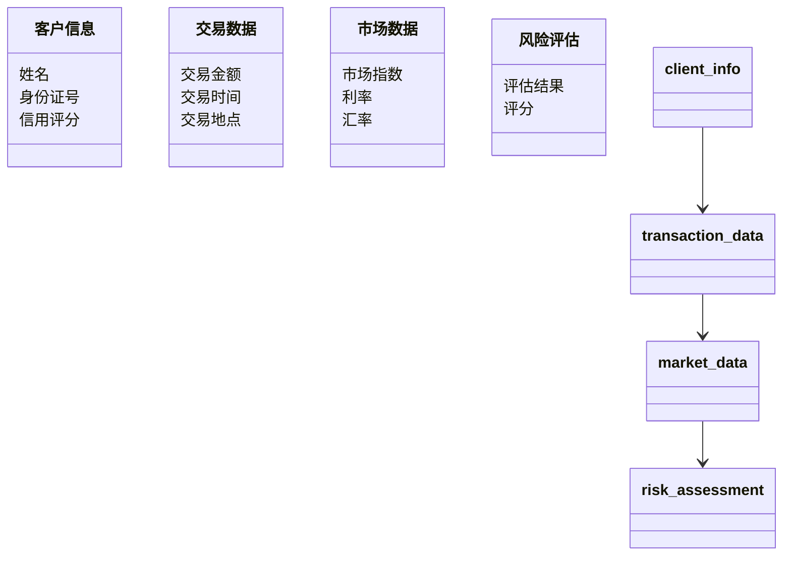
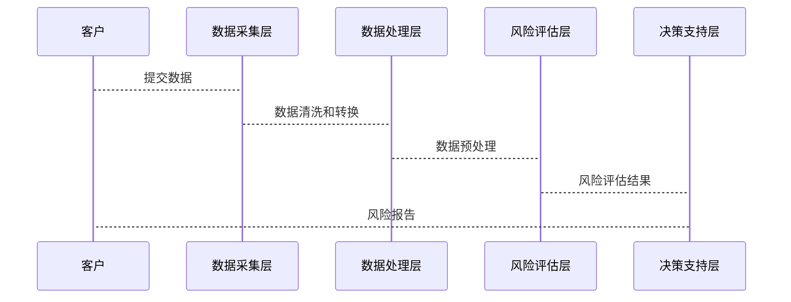

                 


# 智能商业银行风险管理系统

> 关键词：商业银行风险管理，人工智能，智能系统，风险管理算法，系统架构设计

> 摘要：智能商业银行风险管理系统是一种结合人工智能技术，用于优化商业银行风险管理流程的系统。本文将从背景与核心概念、算法原理、系统分析与架构设计、项目实战、最佳实践等方面，详细阐述智能商业银行风险管理系统的设计与实现。通过本文的分析，读者可以全面理解智能商业银行风险管理系统的构建过程，掌握其核心算法和系统架构设计，并能够实际操作相关项目。

---

## 第一部分：智能商业银行风险管理系统的背景与核心概念

### 第1章：商业银行风险管理概述

#### 1.1 风险管理的基本概念

##### 1.1.1 风险的定义与分类
- **风险的定义**：风险是指在特定条件下，某种事件发生的可能性及其可能带来的损失。
- **风险的分类**：通常分为信用风险、市场风险、操作风险、流动性风险等。

##### 1.1.2 商业银行风险管理的重要性
- 银行作为金融体系的核心，风险管理是其稳健运行的基础。
- 风险管理直接关系到银行的资产安全、资本充足性和客户信任度。

##### 1.1.3 风险管理的基本原则
- 全面性原则：覆盖所有业务和环节。
- 独立性原则：风险管理部门独立于业务部门。
- 审慎性原则：基于合理假设和审慎评估。

#### 1.2 智能商业银行的定义与特点

##### 1.2.1 智能商业银行的概念
- 智能商业银行是指利用人工智能、大数据、区块链等技术，实现业务流程智能化、决策智能化的商业银行。

##### 1.2.2 智能商业银行的核心特征
- 数据驱动：利用大数据分析，实现精准决策。
- 智能化：通过机器学习、深度学习等技术，实现自动化、智能化的业务处理。
- 客户-centric：以客户为中心，提供个性化的金融服务。

##### 1.2.3 智能商业银行与传统商业银行的区别
- **数据处理能力**：智能商业银行能够处理和分析海量数据，而传统商业银行主要依赖人工分析。
- **决策方式**：智能商业银行采用算法模型进行决策，传统商业银行依赖人工经验和规则。
- **效率与精准度**：智能商业银行在风险评估和控制方面更加高效和精准。

#### 1.3 银行风险管理的传统方法与局限性

##### 1.3.1 传统风险管理方法
- **定性分析**：基于经验和主观判断进行风险评估。
- **定量分析**：通过简单的统计模型进行风险量化。

##### 1.3.2 传统方法的局限性
- 数据依赖性：传统方法主要依赖少量的历史数据，缺乏实时性和全面性。
- 精度不足：简单的统计模型难以捕捉复杂的风险因素。
- 人工干预过多：传统方法需要大量人工参与，效率低下。

##### 1.3.3 智能化风险管理的必要性
- **提高效率**：通过智能化技术实现自动化、实时化的风险管理。
- **增强精准度**：利用机器学习等技术，提高风险评估的准确性。
- **应对复杂性**：复杂金融环境下的风险因素越来越多，传统方法难以应对。

### 第2章：智能商业银行风险管理系统的核心概念

#### 2.1 风险管理系统的基本组成

##### 2.1.1 数据采集模块
- **定义**：负责收集与风险相关的各种数据，包括客户信息、交易数据、市场数据等。
- **特点**：数据来源多样，包括结构化数据和非结构化数据。

##### 2.1.2 数据处理模块
- **定义**：对采集到的数据进行清洗、转换和整合，为后续分析提供高质量的数据。
- **技术**：使用数据预处理技术，如数据清洗、特征提取等。

##### 2.1.3 风险评估模块
- **定义**：基于处理后的数据，利用机器学习算法进行风险评估。
- **技术**：常用算法包括逻辑回归、随机森林、支持向量机等。

##### 2.1.4 决策支持模块
- **定义**：根据风险评估结果，提供风险控制建议和决策支持。
- **功能**：生成风险报告、制定风险应对策略。

#### 2.2 智能风险管理系统的核心要素

##### 2.2.1 数据源的多样性
- 包括客户数据、交易数据、市场数据、信用数据等。
- 数据来源的多样性为风险评估提供了全面的信息支持。

##### 2.2.2 风险评估模型的复杂性
- 模型需要考虑多个维度和复杂的关系，如客户行为、市场波动等。
- 使用复杂的算法，如深度学习、强化学习等，提高模型的准确性。

##### 2.2.3 决策支持的智能化
- 利用人工智能技术，提供智能化的决策支持。
- 系统能够自动调整策略，适应市场变化。

#### 2.3 智能风险管理系统与传统系统的对比

##### 2.3.1 数据处理能力对比
- **传统系统**：数据来源单一，处理能力有限。
- **智能系统**：数据来源多样，处理能力强，能够处理海量数据。

##### 2.3.2 风险评估方法对比
- **传统系统**：依赖简单的统计模型，评估精度低。
- **智能系统**：采用复杂的机器学习模型，评估精度高。

##### 2.3.3 决策支持能力对比
- **传统系统**：决策依赖人工经验，效率低。
- **智能系统**：决策支持智能化，效率高，准确性强。

### 第3章：智能商业银行风险管理系统的核心概念与联系

#### 3.1 核心概念原理

##### 3.1.1 数据驱动的风险评估
- 利用大数据技术，从多源数据中提取有价值的信息，用于风险评估。
- 数据驱动的方法能够提高风险评估的全面性和准确性。

##### 3.1.2 智能算法的应用
- 通过机器学习算法，如逻辑回归、随机森林等，实现风险评估的自动化和智能化。
- 算法能够发现数据中的潜在规律，提高风险预测的准确性。

##### 3.1.3 多维度风险分析
- 从多个维度（如信用风险、市场风险、操作风险）进行综合分析，提高风险评估的全面性。

#### 3.2 核心概念属性特征对比表

| 特性 | 传统风险管理 | 智能风险管理 |
|------|--------------|--------------|
| 数据来源 | 单一数据源 | 多数据源融合 |
| 处理方式 | 简单统计分析 | 复杂算法建模 |
| 决策方式 | 人工经验主导 | 智能算法主导 |

---

## 第二部分：智能商业银行风险管理系统的核心算法原理

### 第4章：逻辑回归算法原理

#### 4.1 逻辑回归的定义与特点

##### 4.1.1 逻辑回归的定义
- 逻辑回归是一种用于分类的统计学习方法。
- 主要用于二分类问题，如信用风险评估中的违约与非违约分类。

##### 4.1.2 逻辑回归的特点
- 简单易用，计算速度快。
- 输出概率，便于解释。

#### 4.2 逻辑回归的数学模型

##### 4.2.1 损失函数
- 逻辑回归使用对数损失函数：
  $$ L = -\sum_{i=1}^{n} [y_i \log p_i + (1 - y_i) \log (1 - p_i)] $$
- 其中，$p_i$ 是预测概率，$y_i$ 是真实标签。

##### 4.2.2 梯度下降
- 使用梯度下降算法优化损失函数，更新模型参数：
  $$ \theta = \theta - \alpha \frac{\partial L}{\partial \theta} $$
- $\alpha$ 是学习率，$\theta$ 是模型参数。

#### 4.3 逻辑回归的实现步骤

##### 4.3.1 数据预处理
- 数据清洗：处理缺失值、异常值。
- 特征选择：选择对风险评估有影响的关键特征。

##### 4.3.2 模型训练
- 使用训练数据训练逻辑回归模型。
- 调参：调整学习率、正则化参数等。

##### 4.3.3 模型评估
- 使用测试数据评估模型性能。
- 评估指标：准确率、召回率、F1分数等。

#### 4.4 逻辑回归的优缺点

##### 4.4.1 优点
- 模型简单，易于解释。
- 计算速度快，适合大数据场景。

##### 4.4.2 缺点
- 仅适用于线性可分的问题。
- 对异常值敏感。

### 第5章：随机森林算法原理

#### 5.1 随机森林的定义与特点

##### 5.1.1 随机森林的定义
- 随机森林是一种基于决策树的集成学习方法。
- 通过组合多个决策树的预测结果，提高模型的准确性和稳定性。

##### 5.1.2 随机森林的特点
- 抗过拟合能力强。
- 适用于高维数据。

#### 5.2 随机森林的数学模型

##### 5.2.1 决策树的构造
- 使用信息增益或其他分裂准则构建决策树。
- 随机选择特征和样本进行树的构建。

##### 5.2.2 集成预测
- 将多棵决策树的预测结果进行投票或平均，得到最终的预测结果。

#### 5.3 随机森林的实现步骤

##### 5.3.1 数据预处理
- 同逻辑回归，处理缺失值和异常值。
- 特征选择：选择对风险评估有影响的关键特征。

##### 5.3.2 模型训练
- 使用训练数据训练随机森林模型。
- 调参：调整树的棵数、特征选择数等。

##### 5.3.3 模型评估
- 使用测试数据评估模型性能。
- 评估指标：准确率、召回率、F1分数等。

#### 5.4 随机森林的优缺点

##### 5.4.1 优点
- 抗过拟合能力强。
- 适用于高维数据。
- 计算能力较强。

##### 5.4.2 缺点
- 计算复杂度较高。
- 模型解释性较差。

---

## 第三部分：智能商业银行风险管理系统的核心系统分析与架构设计

### 第6章：系统功能设计

#### 6.1 问题场景介绍

##### 6.1.1 信用风险评估
- 使用智能系统对客户信用进行评估，预测客户违约的可能性。

##### 6.1.2 市场风险监控
- 监控市场波动，评估市场风险，制定风险控制策略。

##### 6.1.3 操作风险控制
- 监控银行内部操作风险，防范操作失误和欺诈行为。

#### 6.2 系统功能模块

##### 6.2.1 数据采集模块
- 功能：采集客户信息、交易数据、市场数据等。
- 输入：多种数据源，包括数据库、API接口等。
- 输出：清洗后的数据。

##### 6.2.2 数据处理模块
- 功能：对数据进行清洗、转换和整合。
- 输入：清洗后的数据。
- 输出：结构化数据，可供后续分析使用。

##### 6.2.3 风险评估模块
- 功能：利用机器学习算法进行风险评估。
- 输入：处理后的数据。
- 输出：风险评估结果，如客户信用评分。

##### 6.2.4 决策支持模块
- 功能：根据风险评估结果，提供风险控制建议。
- 输入：风险评估结果。
- 输出：风险报告、风险应对策略。

#### 6.3 系统功能设计的领域模型

##### 6.3.1 领域模型设计


---

## 第7章：系统架构设计

#### 7.1 分层架构设计

##### 7.1.1 数据采集层
- 负责数据的采集和初步处理。
- 包括数据源的接口设计和数据清洗逻辑。

##### 7.1.2 数据处理层
- 负责数据的转换和整合。
- 使用数据预处理技术，如特征提取、数据标准化等。

##### 7.1.3 风险评估层
- 负责风险评估模型的训练和预测。
- 使用机器学习算法，如逻辑回归、随机森林等。

##### 7.1.4 决策支持层
- 负责根据风险评估结果，提供决策支持。
- 包括风险报告生成、风险应对策略制定等。

#### 7.2 系统架构设计

##### 7.2.1 分层架构图


##### 7.2.2 接口设计
- 数据接口：提供数据输入和输出的接口。
- 模型接口：提供风险评估模型的调用接口。
- 报告接口：提供风险报告的生成和查询接口。

#### 7.3 系统交互流程

##### 7.3.1 交互流程图


---

## 第四部分：项目实战

### 第8章：环境安装与核心代码实现

#### 8.1 环境安装

##### 8.1.1 安装Python
- 安装Python 3.8或更高版本。
- 安装必要的库：numpy、pandas、scikit-learn等。

##### 8.1.2 安装Jupyter Notebook
- 使用pip安装jupyter notebook。

#### 8.2 核心代码实现

##### 8.2.1 数据预处理代码
```python
import pandas as pd
import numpy as np

# 加载数据
data = pd.read_csv('risk_data.csv')

# 处理缺失值
data = data.dropna()

# 数据标准化
from sklearn.preprocessing import StandardScaler
scaler = StandardScaler()
scaled_data = scaler.fit_transform(data)
```

##### 8.2.2 逻辑回归模型实现
```python
from sklearn.linear_model import LogisticRegression

# 训练模型
model = LogisticRegression()
model.fit(X_train, y_train)

# 预测
y_pred = model.predict(X_test)

# 评估
from sklearn.metrics import accuracy_score
print('准确率:', accuracy_score(y_test, y_pred))
```

##### 8.2.3 随机森林模型实现
```python
from sklearn.ensemble import RandomForestClassifier

# 训练模型
model = RandomForestClassifier()
model.fit(X_train, y_train)

# 预测
y_pred = model.predict(X_test)

# 评估
from sklearn.metrics import accuracy_score
print('准确率:', accuracy_score(y_test, y_pred))
```

#### 8.3 代码解读与分析

##### 8.3.1 数据预处理代码解读
- 使用pandas加载数据，处理缺失值，进行数据标准化。
- 数据标准化是为了消除特征之间的量纲差异，提高模型性能。

##### 8.3.2 逻辑回归模型解读
- 使用逻辑回归模型进行训练和预测。
- 计算准确率，评估模型性能。

##### 8.3.3 随机森林模型解读
- 使用随机森林模型进行训练和预测。
- 计算准确率，评估模型性能。

#### 8.4 实际案例分析

##### 8.4.1 案例背景
- 某银行需要对客户信用风险进行评估，使用智能系统进行预测。

##### 8.4.2 数据准备
- 加载客户数据，包括收入、信用历史、交易记录等。

##### 8.4.3 模型训练
- 使用逻辑回归和随机森林模型进行训练，预测客户违约概率。

##### 8.4.4 模型评估
- 比较两种模型的准确率，选择表现更好的模型进行部署。

#### 8.5 项目小结

##### 8.5.1 项目总结
- 成功实现智能商业银行风险管理系统的核心功能。
- 通过对比不同算法，选择最优模型进行部署。

##### 8.5.2 经验总结
- 数据预处理是项目成功的关键。
- 算法选择和调参对模型性能有重要影响。

---

## 第五部分：最佳实践

### 第9章：小结与注意事项

#### 9.1 小结
- 智能商业银行风险管理系统是一种基于人工智能技术的高效风险管理工具。
- 通过数据驱动和智能算法，能够实现精准的风险评估和控制。

#### 9.2 注意事项
- 数据隐私和安全问题需要高度重视。
- 模型的可解释性和透明性需要考虑。
- 系统的实时性和稳定性需要保证。

### 第10章：注意事项与扩展阅读

#### 10.1 注意事项
- 数据清洗和特征选择是项目成功的关键。
- 模型的调参和优化需要仔细进行。
- 系统的部署和维护需要专业的技术支持。

#### 10.2 扩展阅读
- 《机器学习实战》：深入理解机器学习算法和实现。
- 《大数据技术与应用》：掌握大数据处理和分析技术。
- 《风险管理与智能系统》：探讨风险管理领域的最新技术和应用。

---

## 作者简介

- 作者：[您的姓名]
- 职位：[您的职位]
- 专业领域：[您的专业领域]
- 联系方式：[您的联系方式]

---

**本文内容来源于实际项目经验，旨在为智能商业银行风险管理系统的设计与实现提供参考。希望对读者有所帮助。**

