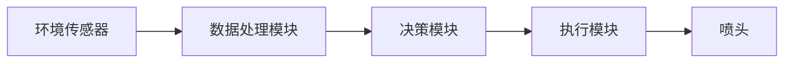
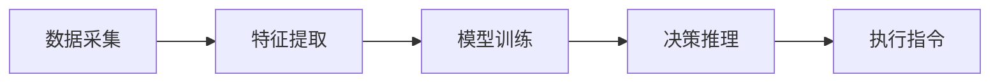

                 

# 智能园艺喷壶：AI Agent的植物浇水优化

> 关键词：智能喷壶，AI Agent，植物浇水，园艺优化，物联网

> 摘要：本文探讨了智能园艺喷壶的设计与实现，通过AI Agent优化植物浇水过程，结合物联网技术，分析了系统的架构、算法原理及实际应用案例，展示了如何利用人工智能提升园艺管理效率。

---

# 第一部分: 智能园艺喷壶的背景与概念

## 第1章: 背景介绍

### 1.1 问题背景

#### 1.1.1 植物浇水的传统方式与局限性
传统植物浇水方式主要依赖人工操作，存在以下问题：
- **低效性**：人工浇水需要频繁操作，尤其对于大规模种植或家庭园艺，效率低下。
- **不精准**：浇水量难以根据植物需求、土壤湿度和环境条件自动调整。
- **不可靠性**：依赖人工记忆，容易遗漏或过度浇水，影响植物健康。

#### 1.1.2 现代园艺中的智能技术需求
随着物联网和人工智能技术的发展，园艺管理逐渐向智能化方向转型，智能浇水系统的需求日益迫切。

#### 1.1.3 AI Agent在植物浇水中的应用潜力
AI Agent（智能体）通过感知环境、分析数据、做出决策，能够实现精准浇水，优化水资源利用，提升植物生长效率。

### 1.2 问题描述

#### 1.2.1 智能喷壶的核心功能需求
- 自动监测土壤湿度、光照、温度等环境数据。
- 根据植物需求智能决策浇水时机和量。
- 实现远程控制和数据记录功能。

#### 1.2.2 用户痛点与需求分析
- 家庭园艺爱好者希望减少人工干预，提升浇水效率。
- 农业种植者需要大规模精准浇水解决方案。
- 环保人士关注水资源优化利用。

### 1.3 问题解决

#### 1.3.1 AI Agent在植物浇水中的解决方案
AI Agent通过整合环境传感器、数据处理和智能决策模块，实现精准浇水。

#### 1.3.2 智能喷壶的技术实现路径
- 传感器采集环境数据。
- AI算法分析数据，生成浇水指令。
- 执行机构（喷头）按照指令浇水。

#### 1.3.3 系统设计的边界与外延
- **边界**：仅关注浇水优化，不涉及施肥、光照调节等其他功能。
- **外延**：可扩展至智能园艺系统，整合更多功能模块。

### 1.4 概念结构与核心要素

#### 1.4.1 智能喷壶的系统组成
- **环境传感器**：采集土壤湿度、光照、温度等数据。
- **AI决策模块**：分析数据，生成浇水指令。
- **执行机构**：控制喷头执行浇水任务。

#### 1.4.2 AI Agent的核心要素
- **感知模块**：数据采集与特征提取。
- **决策模块**：基于数据的智能决策。
- **执行模块**：指令执行与反馈机制。

#### 1.4.3 系统功能与性能指标
- 功能：精准浇水、远程控制、数据记录。
- 性能：响应时间<5秒，误差<5%。

---

# 第二部分: AI Agent的核心概念与原理

## 第2章: AI Agent的基本原理

### 2.1 核心概念

#### 2.1.1 AI Agent的定义与特点
- **定义**：AI Agent是一类能够感知环境、自主决策并执行任务的智能系统。
- **特点**：
  - 智能性：基于数据进行分析和决策。
  - 自主性：无需人工干预，自动执行任务。
  - 可扩展性：支持多种传感器和执行机构。

#### 2.1.2 智能喷壶中的AI Agent功能模块
- **感知模块**：土壤湿度、光照强度、温度。
- **决策模块**：基于数据的智能决策。
- **执行模块**：控制喷头执行浇水任务。

#### 2.1.3 AI Agent与传统自动喷灌系统的区别
| 特性 | AI Agent智能喷壶 | 传统喷灌系统 |
|------|------------------|--------------|
| 决策方式 | 基于AI算法 | 定时或固定模式 |
| 感知能力 | 高度感知环境 | 低感知或无感知 |
| 可定制性 | 高 | 低 |

### 2.2 核心概念与联系

#### 2.2.1 智能喷壶的感知模块
- **环境传感器**：土壤湿度传感器、光照传感器、温度传感器。
- **数据采集**：实时采集环境数据并传输到AI决策模块。

#### 2.2.2 决策模块与执行模块的关系
- **决策模块**：分析感知数据，生成浇水指令。
- **执行模块**：根据指令控制喷头执行浇水任务。

#### 2.2.3 系统整体架构的实体关系图

### 2.3 算法原理

#### 2.3.1 数据采集与特征提取
- **数据采集**：传感器采集土壤湿度、光照、温度等数据。
- **特征提取**：对采集的数据进行特征提取，如平均湿度、光照强度变化率等。

#### 2.3.2 模型训练与决策推理
- **模型训练**：基于历史数据训练AI模型，优化浇水策略。
- **决策推理**：根据实时数据，模型生成浇水指令。

#### 2.3.3 算法流程图

### 2.4 数学模型与公式

#### 2.4.1 感知模型
土壤湿度感知模型：
$$ \text{湿度} = k \times (\text{光照强度} + \text{温度}) + \epsilon $$

其中，$k$ 为比例常数，$\epsilon$ 为误差项。

#### 2.4.2 决策模型
基于感知数据的浇水决策模型：
$$ \text{浇水量} = \begin{cases}
\text{适量} & \text{if } \text{湿度} < 60\% \\
\text{减少} & \text{if } 60\% \leq \text{湿度} < 80\% \\
\text{停止} & \text{if } \text{湿度} \geq 80\% \\
\end{cases} $$

---

通过以上分析，我们可以看到AI Agent在智能园艺喷壶中的应用潜力。AI Agent通过感知环境、分析数据、自主决策，能够实现精准浇水，优化水资源利用，提升植物生长效率。接下来我们将进一步分析系统的架构设计和实现细节。

