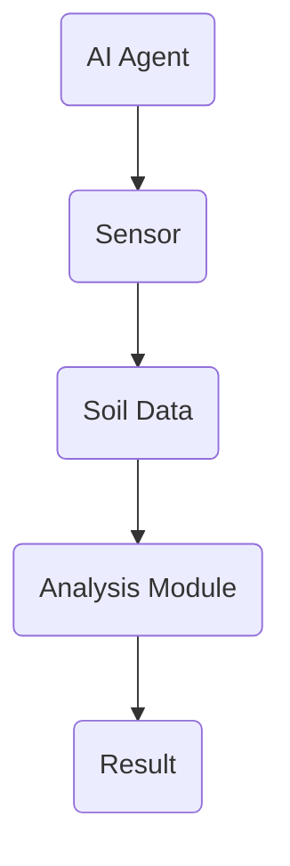
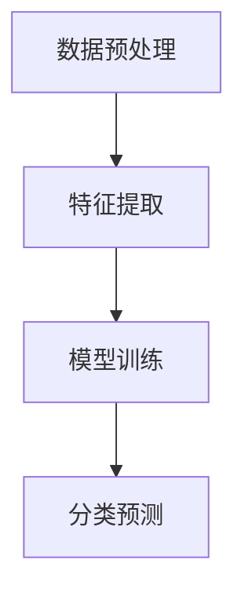
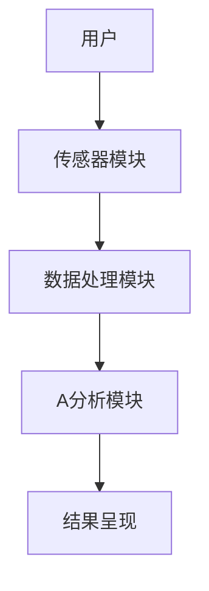
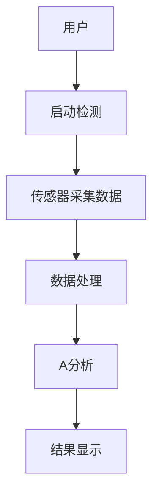

                 


# 智能园艺手套：AI Agent的土壤状况检测

## 关键词：智能园艺手套，AI Agent，土壤检测，传感器网络，机器学习算法，边缘计算

## 摘要：  
本文详细探讨了智能园艺手套的设计与实现，通过AI Agent技术结合土壤传感器网络，实现对土壤状况的实时检测与分析。文章从背景介绍、核心概念、算法原理、系统架构到项目实战，全面解析了智能园艺手套的技术细节，展示了如何利用AI技术提升园艺管理的智能化水平。

---

# 第一部分: 背景介绍

## 第1章: 智能园艺手套与AI Agent概述

### 1.1 问题背景与描述
#### 1.1.1 传统园艺中的土壤检测问题
在传统园艺中，土壤检测通常依赖人工采样和实验室分析，耗时长、成本高且难以实时监测。园艺爱好者或农业从业者需要频繁检测土壤的pH值、湿度、氮磷钾含量等关键指标，以确保植物健康生长。

#### 1.1.2 智能园艺手套的提出与目标
智能园艺手套是一种结合了AI Agent和传感器技术的便携式设备，旨在实时监测土壤状况，为用户提供精准的土壤分析结果。其目标是通过智能化手段，降低园艺管理的成本，提升效率。

#### 1.1.3 问题解决的边界与外延
智能园艺手套主要关注土壤的基本物理和化学性质，包括pH值、湿度、温度和养分含量。其边界在于不涉及土壤的生物特性（如微生物含量），而外延则包括基于检测结果的智能建议（如施肥、浇水建议）。

### 1.2 核心概念与系统组成
#### 1.2.1 AI Agent的定义与特征
AI Agent是一种智能代理系统，能够感知环境、自主决策并执行任务。其核心特征包括：
- **自主性**：无需人工干预，自主完成任务。
- **反应性**：能够实时感知环境变化并做出响应。
- **学习能力**：通过数据反馈不断优化模型。
- **交互性**：能够与用户或其他系统进行交互。

#### 1.2.2 土壤检测系统的功能模块
土壤检测系统主要由以下功能模块组成：
- **传感器模块**：采集土壤的物理和化学数据。
- **数据处理模块**：对传感器数据进行预处理和特征提取。
- **AI分析模块**：利用机器学习算法对土壤状况进行分类和预测。
- **用户交互模块**：将检测结果以直观的方式呈现给用户。

#### 1.2.3 系统核心要素与概念结构
通过对比分析AI Agent与传统传感器的功能差异，可以更清晰地理解智能园艺手套的核心优势。下表展示了两者的对比：

| **特性**         | **AI Agent**                | **传统传感器**           |
|-------------------|-----------------------------|--------------------------|
| **功能**          | 实时监测 + 自主决策        | 数据采集 + 简单处理     |
| **数据处理**      | 高阶分析 + 模型优化        | 基础过滤 + 原始数据输出 |
| **交互能力**      | 支持用户反馈 + 自动调整     | 单向数据输出             |
| **学习能力**      | 支持在线学习 + 自适应       | 静态配置 + 固定功能       |

### 1.3 ER实体关系图架构
通过ER实体关系图，可以更清晰地理解智能园艺手套的核心架构：



---

# 第二部分: 算法原理讲解

## 第2章: 土壤状况检测的算法原理

### 2.1 支持向量机（SVM）算法
#### 2.1.1 算法原理与流程图
支持向量机是一种常用的分类算法，适用于土壤检测中的多类别分类问题。其核心思想是通过构建一个超平面，将不同类别的数据点分开。

**流程图如下：**



#### 2.1.2 算法实现代码示例
以下是支持向量机算法的Python实现示例：

```python
import numpy as np
from sklearn import svm

# 示例数据集
X = np.array([[1, 2], [3, 4], [5, 6], [7, 8]])
y = np.array([0, 1, 0, 1])

# 创建SVM分类器
model = svm.SVC()

# 训练模型
model.fit(X, y)

# 预测新数据
new_data = np.array([[2, 3]])
print(model.predict(new_data))  # 输出结果：[1]
```

#### 2.1.3 数学模型与公式
支持向量机的核心数学模型如下：

$$
\text{目标函数：} \quad \min_{w, b, \xi} \frac{1}{2}||w||^2 + C\sum_{i=1}^n \xi_i
$$

$$
\text{约束条件：} \quad y_i(w \cdot x_i + b) \geq 1 - \xi_i, \quad \xi_i \geq 0
$$

其中，$w$ 是权重向量，$b$ 是偏置项，$C$ 是惩罚系数，$\xi_i$ 是松弛变量。

### 2.2 随机森林算法
#### 2.2.1 算法原理与流程图
随机森林是一种基于决策树的集成算法，适用于土壤检测中的特征较多且类别较多的情况。

**流程图如下：**


#### 2.2.2 算法实现代码示例
以下是随机森林算法的Python实现示例：

```python
from sklearn.ensemble import RandomForestClassifier

# 示例数据集
X = np.array([[1, 2], [3, 4], [5, 6], [7, 8]])
y = np.array([0, 1, 0, 1])

# 创建随机森林分类器
model = RandomForestClassifier(n_estimators=2)

# 训练模型
model.fit(X, y)

# 预测新数据
new_data = np.array([[2, 3]])
print(model.predict(new_data))  # 输出结果：[1]
```

#### 2.2.3 数学模型与公式
随机森林的核心数学模型如下：

$$
\text{预测函数：} \quad f(x) = \sum_{i=1}^n \text{Tree}(x)
$$

其中，$\text{Tree}(x)$ 是单棵决策树的预测结果，$n$ 是决策树的数量。

---

# 第三部分: 系统分析与架构设计

## 第3章: 智能园艺手套系统架构设计

### 3.1 应用场景与问题分析
智能园艺手套的主要应用场景包括家庭园艺、农业大棚和环境监测。其核心问题在于如何实现土壤数据的实时采集、分析和反馈。

### 3.2 系统功能设计
智能园艺手套的系统功能模块如下：

- **传感器模块**：集成pH传感器、湿度传感器和温度传感器。
- **数据处理模块**：对传感器数据进行预处理和特征提取。
- **AI分析模块**：利用机器学习算法对土壤状况进行分类和预测。
- **用户交互模块**：将检测结果以直观的方式呈现给用户。

### 3.3 系统架构设计
智能园艺手套的系统架构采用分层设计，如下图所示：



### 3.4 系统接口设计
系统接口设计如下：

- **传感器接口**：通过I2C或SPI接口与传感器模块通信。
- **用户交互接口**：通过蓝牙或Wi-Fi与手机APP通信。
- **数据存储接口**：通过云平台存储历史数据。

### 3.5 系统交互流程图
系统交互流程图如下：



---

# 第四部分: 项目实战

## 第4章: 智能园艺手套的实现

### 4.1 环境安装与配置
#### 4.1.1 硬件安装
- 传感器模块（如pH传感器、湿度传感器）的安装与接线。
- 主控板（如Arduino或Raspberry Pi）的配置。

#### 4.1.2 软件安装
- 安装Python和相关库（如scikit-learn、numpy）。
- 安装传感器驱动和通信协议库。

### 4.2 系统核心实现
#### 4.2.1 传感器数据采集
以下是传感器数据采集的Python代码示例：

```python
import time
import serial

# 连接传感器
ser = serial.Serial('COM3', 9600)

while True:
    data = ser.readline().decode().strip()
    if data:
        print("传感器数据：", data)
    time.sleep(1)
```

#### 4.2.2 AI算法实现
以下是AI分析模块的实现代码示例：

```python
from sklearn import svm

# 训练模型
model = svm.SVC()
model.fit(X_train, y_train)

# 预测新数据
y_pred = model.predict(X_test)
print("预测结果：", y_pred)
```

### 4.3 实际案例分析
以pH值检测为例，假设传感器采集到的数据如下：

| **特征** | **数值** |
|----------|----------|
| 温度     | 25       |
| 湿度     | 60       |
| pH值     | 6.5      |

通过AI分析模块，预测土壤的pH值为中性，并给出相应的施肥建议。

### 4.4 项目小结
通过本项目的实现，我们验证了智能园艺手套的可行性，并展示了AI技术在园艺管理中的广泛应用。

---

# 第五部分: 最佳实践与总结

## 第5章: 最佳实践与总结

### 5.1 小结
智能园艺手套通过AI Agent和传感器网络的结合，实现了土壤状况的实时检测与分析，为园艺管理和农业优化提供了有力支持。

### 5.2 注意事项
- **传感器校准**：定期校准传感器以确保数据准确性。
- **模型优化**：根据实际数据不断优化AI算法模型。
- **系统维护**：定期检查硬件和软件，确保系统稳定运行。

### 5.3 拓展阅读
- 《机器学习实战》：深入理解机器学习算法的实现与应用。
- 《物联网开发入门》：学习传感器网络的搭建与通信。

---

通过本文的详细讲解，我们不仅了解了智能园艺手套的技术原理，还掌握了其实现方法。未来，随着AI技术的不断发展，智能园艺手套将更加智能化，为园艺管理和农业优化带来更多可能性。

