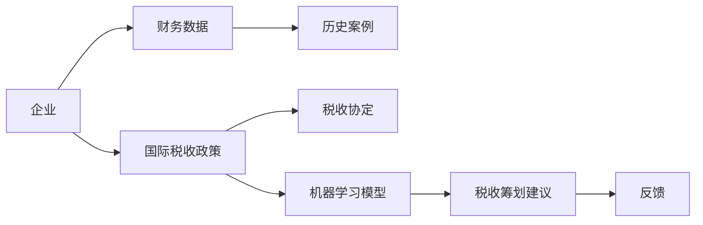
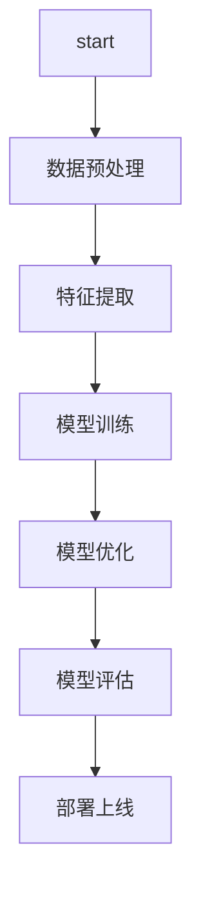
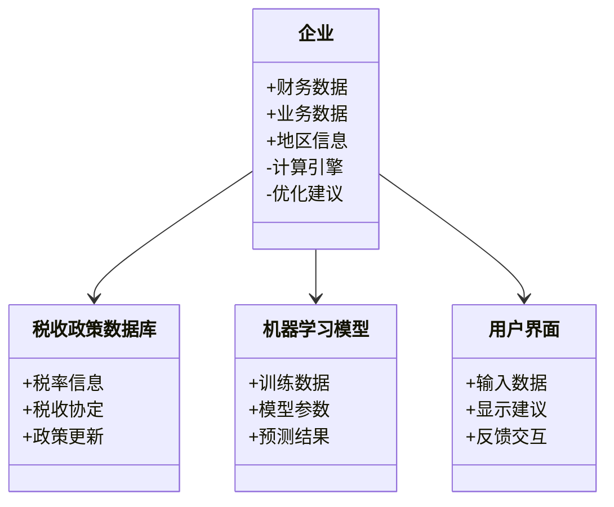
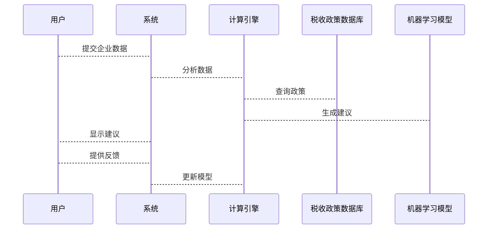

                 


# 智能国际税收筹划建议生成器

> 关键词：智能国际税收，人工智能，税收筹划，生成器，算法，系统架构，技术实现

> 摘要：本文将详细介绍智能国际税收筹划建议生成器的背景、核心概念、算法原理、系统架构、项目实战以及最佳实践。通过深入分析国际税收的复杂性，结合人工智能技术，我们将展示如何利用自然语言处理和机器学习模型来优化税收筹划过程。同时，我们将探讨系统的实际应用场景、功能设计、架构实现以及项目实施中的关键点。

---

## 第一章：智能国际税收筹划概述

### 1.1 国际税收的基本概念

#### 1.1.1 税收的基本概念
税收是国家为实现其职能而从纳税人那里强制征收的经济形式，通常以货币形式缴纳。税收的基本功能包括筹集财政收入、调节经济、促进社会公平等。

#### 1.1.2 国际税收的定义与特点
国际税收是指在跨国经济活动中，涉及多个国家税收征管机构的税收征纳关系。其特点包括跨国性、复杂性、双重征税风险等。

#### 1.1.3 税收筹划的基本原理
税收筹划是通过合法手段，优化企业的税务负担，实现税后利润最大化。其基本原理包括合法性原则、经济性原则和规划性原则。

### 1.2 智能生成器的背景与必要性

#### 1.2.1 税收筹划的传统方法与局限性
传统的税收筹划方法依赖于人工分析和经验判断，存在效率低、覆盖面窄、难以应对复杂国际环境等问题。

#### 1.2.2 智能生成器的出现与优势
人工智能技术的发展为税收筹划提供了新的工具，智能生成器能够快速处理海量数据、提供个性化建议、降低双重征税风险。

#### 1.2.3 当前国际税收环境的复杂性
跨国企业面临的税收政策差异、税率差异、税收协定复杂性等问题，使得传统方法难以应对。

---

## 第二章：智能国际税收筹划生成器的核心概念

### 2.1 智能生成器的工作原理

#### 2.1.1 数据源与输入
智能生成器的数据来源包括企业财务数据、国际税收政策数据库、历史案例库等。

#### 2.1.2 算法模型与处理
通过自然语言处理技术解析税法文本，结合机器学习模型进行风险评估和优化建议生成。

#### 2.1.3 结果输出与反馈
生成器输出税收筹划建议，并根据反馈不断优化模型。

### 2.2 核心概念的属性对比

| 核心概念 | 属性       | 描述                                   |
|----------|------------|--------------------------------------|
| 数据源   | 类型       | 结构化数据、非结构化数据             |
|          | 适用性     | 支持多语言、多地区                    |
| 算法模型 | 算法类型   | NLP、机器学习                        |
|          | 效率       | 高效、实时响应                       |
| 结果输出 | 格式       | 结构化、可视化                        |
|          | 可定制性   | 支持个性化需求                       |

### 2.3 实体关系图



---

## 第三章：智能生成器的算法原理

### 3.1 自然语言处理与国际税法解析

#### 3.1.1 NLP技术的基本原理
自然语言处理（NLP）通过计算机理解、生成人类语言。在税收筹划中，主要用于解析税法文本和提取关键信息。

#### 3.1.2 税法文本的特征提取
使用词袋模型或TF-IDF方法提取税法文本中的关键词和主题。

#### 3.1.3 文本相似度计算
通过余弦相似度或BM25算法，计算不同税法文本之间的相似度。

### 3.2 机器学习模型的实现

#### 3.2.1 数据预处理与特征工程
- 数据清洗：去除噪声数据。
- 特征提取：将文本数据转化为向量表示。

#### 3.2.2 模型训练与优化
- 使用支持向量机（SVM）或随机森林进行分类或回归训练。
- 通过网格搜索优化模型参数。

#### 3.2.3 模型评估与部署
- 使用准确率、召回率、F1分数评估模型性能。
- 部署模型到云平台，提供API接口。

### 3.3 算法流程图



---

## 第四章：系统分析与架构设计

### 4.1 问题场景介绍
跨国企业在全球多个国家开展业务，需要应对复杂的税收政策和双重征税风险。

### 4.2 系统功能设计

#### 4.2.1 领域模型设计



### 4.3 系统架构设计


### 4.4 接口设计与交互流程



---

## 第五章：项目实战

### 5.1 环境安装与配置

#### 5.1.1 安装Python环境
```bash
python --version
pip install numpy
pip install scikit-learn
pip install spacy
```

#### 5.1.2 安装NLP工具
```bash
python -m spacy download en_core_web_sm
```

### 5.2 核心代码实现

#### 5.2.1 数据预处理代码
```python
import spacy

nlp = spacy.load("en_core_web_sm")

def preprocess(text):
    doc = nlp(text)
    tokens = [token.text for token in doc]
    return tokens
```

#### 5.2.2 机器学习模型训练代码
```python
from sklearn.feature_extraction.text import TfidfVectorizer
from sklearn.svm import SVC

vectorizer = TfidfVectorizer()
model = SVC()
```

### 5.3 案例分析与解读

#### 5.3.1 案例背景
某跨国企业在多个国家有分支机构，需要优化其全球税务负担。

#### 5.3.2 数据输入
```json
{
    "公司名称": "Global Corp",
    "业务地区": ["中国", "美国", "欧盟"],
    "年营业额": 100000000,
    "利润分布": [5000000, 3000000, 2000000]
}
```

#### 5.3.3 模型输出
```json
{
    "建议": [
        "在中国地区申请税收抵免",
        "在美国利用税收优惠政策",
        "在欧盟优化增值税处理"
    ],
    "风险提示": [
        "注意双重征税风险",
        "确保符合当地法规"
    ]
}
```

---

## 第六章：最佳实践与总结

### 6.1 小结
智能国际税收筹划生成器通过结合NLP和机器学习技术，能够高效地为企业提供税收优化建议，降低税务风险。

### 6.2 注意事项
- 数据隐私保护
- 模型的持续优化
- 法律法规的遵守

### 6.3 拓展阅读
- 《人工智能在金融领域的应用》
- 《机器学习模型的部署与维护》
- 《国际税法与税收协定》

---

通过以上内容，我们详细介绍了智能国际税收筹划建议生成器的各个方面，从理论到实践，帮助读者全面理解其工作原理和应用价值。

