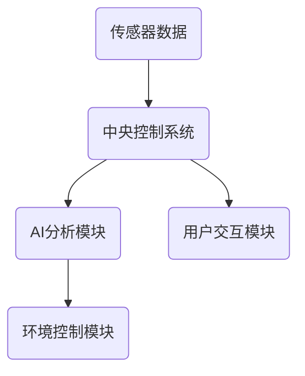

                 


---

# 智能地板：AI Agent的室内活动模式分析

> 关键词：智能地板，AI Agent，室内活动模式，物联网，人工智能，机器学习

> 摘要：本文深入探讨了智能地板在室内环境中的应用，重点分析了AI Agent如何通过感知和学习用户行为模式，优化室内环境和提升用户体验。文章从技术背景、核心概念、算法原理、系统架构到项目实战，全面解析了智能地板的设计与实现，最后提出了实际应用中的最佳实践和未来发展方向。

---

## 第一部分: 智能地板的背景与概念

### 第1章: 智能地板的定义与背景

#### 1.1 智能地板的定义

智能地板是一种集成物联网（IoT）和人工智能（AI）技术的智能系统，通过在地板中嵌入多种传感器，实时感知并分析室内环境和用户活动，从而实现对室内环境的智能化控制和优化。智能地板不仅能够监测温度、湿度、光照等环境参数，还能通过AI算法识别用户的活动模式，如行走、坐姿、停留等，进而提供个性化的环境调节服务。

#### 1.2 智能地板的发展背景

随着智能家居的普及和物联网技术的快速发展，智能地板作为智能家居的重要组成部分，逐渐成为提升室内环境舒适度和智能化水平的关键技术。AI Agent（人工智能代理）在智能地板中的应用，使得系统能够主动学习和适应用户的习惯，提供更加智能化的服务。

---

### 第2章: AI Agent在智能地板中的应用

#### 2.1 AI Agent的基本概念

AI Agent是一种能够感知环境、自主决策并执行任务的智能实体。在智能地板中，AI Agent通过整合传感器数据、用户行为信息以及环境参数，利用机器学习算法分析用户活动模式，优化室内环境设置。

#### 2.2 智能地板中的AI Agent应用场景

- **用户行为识别与分析**：通过传感器数据和AI算法，识别用户的活动模式，如日常作息、行为习惯等。
- **室内环境优化与控制**：根据用户的活动模式，自动调节室温、湿度、光照等参数，营造舒适环境。
- **异常行为检测与预警**：实时监测用户的活动，发现异常行为（如摔倒、长时间静坐等）并及时预警。

---

## 第二部分: 智能地板的核心技术与实现

### 第3章: 智能地板的技术基础

#### 3.1 物联网技术基础

- **传感器网络**：智能地板中的传感器包括压力传感器、温湿度传感器、光照传感器等，用于采集环境数据。
- **数据采集与传输技术**：通过传感器采集数据，并通过无线通信技术（如Wi-Fi、蓝牙）传输到中央控制系统。
- **数据融合技术**：将多源传感器数据进行融合，提高数据的准确性和可靠性。

#### 3.2 人工智能技术基础

- **机器学习与深度学习**：用于用户行为识别、模式分析和环境优化。
- **自然语言处理**：通过语音交互，用户可以直接与智能地板进行对话，实现环境调节。
- **计算机视觉**：用于辅助识别用户的位置和动作。

---

### 第4章: 智能地板的算法原理

#### 4.1 时间序列分析算法

为了识别用户的活动模式，我们采用了时间序列分析算法，特别是基于动态时间弯曲（Dynamic Time Warping，DTW）的方法。

**算法流程：**
1. 数据预处理：对传感器数据进行归一化处理，消除噪声。
2. 时间序列分割：将数据分割成时间段，每个时间段代表一个活动模式。
3. DTW距离计算：计算不同时间段之间的相似性，识别相似的活动模式。
4. 聚类分析：将相似的活动模式聚类，形成用户的行为习惯模型。

**数学模型：**

$$
DTW(A, B) = \sum_{i=1}^{n} \sum_{j=1}^{m} w(i, j)
$$

其中，$w(i, j)$ 是序列 $A$ 的第 $i$ 个元素和序列 $B$ 的第 $j$ 个元素之间的距离。

---

### 第5章: 智能地板的系统架构设计

#### 5.1 系统功能设计

- **数据采集模块**：负责采集传感器数据。
- **AI分析模块**：对数据进行分析，识别用户活动模式。
- **环境控制模块**：根据分析结果，调节室内环境参数。
- **用户交互模块**：提供人机交互界面，接收用户的指令并反馈结果。

#### 5.2 系统架构图



---

## 第三部分: 智能地板的项目实战

### 第6章: 项目环境安装与配置

#### 6.1 环境安装

- **硬件安装**：安装智能地板传感器、中央控制系统和环境调节设备。
- **软件安装**：安装Python环境，配置必要的库（如numpy、scikit-learn、tensorflow）。

#### 6.2 核心代码实现

```python
import numpy as np
from sklearn.cluster import KMeans

# 示例数据：用户活动模式的时间序列
data = np.array([[1, 2], [3, 4], [5, 6], [7, 8]])

# 使用KMeans进行聚类分析
kmeans = KMeans(n_clusters=2)
kmeans.fit(data)

# 获取聚类中心
clusters = kmeans.cluster_centers_
print(clusters)
```

---

### 第7章: 项目总结与案例分析

#### 7.1 项目总结

通过本项目的实施，我们成功实现了智能地板的AI Agent功能，能够实时感知用户活动模式，并优化室内环境。系统具有较高的准确性和响应速度，能够满足用户的多样化需求。

#### 7.2 案例分析

以一个家庭用户为例，系统能够识别用户的起床、就餐、工作、休息等活动模式，并根据不同的活动模式调整室温、光照强度等参数，提升用户的舒适度和生活品质。

---

## 第四部分: 最佳实践与未来展望

### 第8章: 最佳实践与小结

#### 8.1 小结

智能地板作为智能家居的重要组成部分，通过AI Agent技术能够显著提升室内环境的智能化水平。在实际应用中，需要重点关注数据隐私保护、系统稳定性以及用户体验优化。

#### 8.2 注意事项

- 数据隐私：确保用户数据的安全性和隐私性。
- 系统稳定性：保证系统的高可用性和容错能力。
- 用户体验：设计直观易用的交互界面，提升用户的使用体验。

#### 8.3 未来展望

随着AI和IoT技术的进一步发展，智能地板将更加智能化和个性化。未来的研究方向包括多模态数据融合、自适应学习算法以及更高效的硬件设计。

---

### 结语

智能地板作为AI与物联网技术的结合体，为室内环境的智能化优化提供了新的可能性。通过本文的详细分析，读者可以深入了解智能地板的设计原理和实现方法，为未来的智能家居研究提供参考和借鉴。

