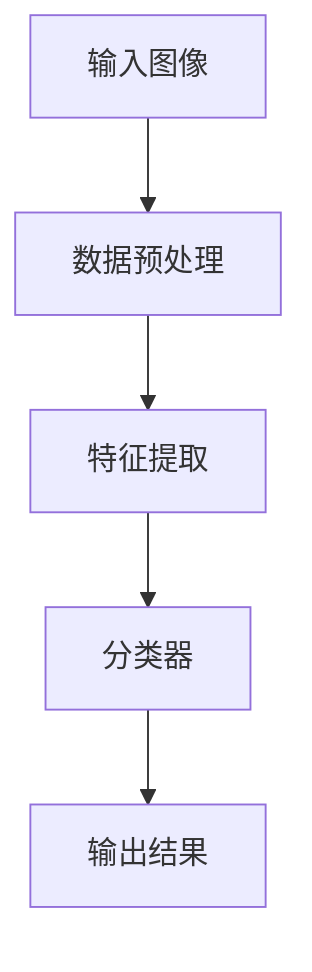
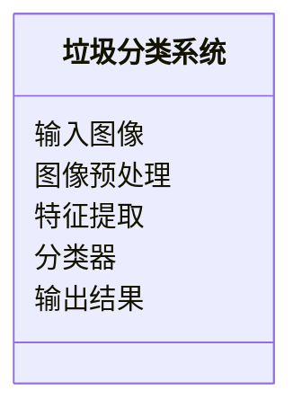
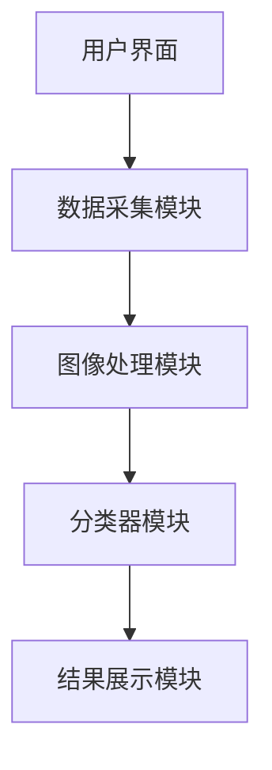

                 


# 智能垃圾分类器：AI Agent的回收指导

> 关键词：智能垃圾分类器, AI Agent, 图像识别, 机器学习, 垃圾分类, 人工智能, 环境保护

> 摘要：  
本文系统地探讨了智能垃圾分类器的设计与实现，重点介绍了AI Agent在垃圾分类中的应用，结合图像识别与机器学习技术，深入分析了垃圾分类的算法原理、系统架构以及实际应用场景。文章通过详细的技术分析和案例解读，为读者提供了从理论到实践的全面指导，旨在帮助读者理解并掌握智能垃圾分类器的核心技术与实现方法。

---

# 目录大纲

## 第一部分：智能垃圾分类器的背景与概念

### 第1章：智能垃圾分类器的背景介绍

#### 1.1 问题背景与描述
- 1.1.1 当前垃圾分类的现状与挑战
- 1.1.2 垃圾分类的重要性与意义
- 1.1.3 传统垃圾分类方式的局限性

#### 1.2 智能垃圾分类器的定义与目标
- 1.2.1 智能垃圾分类器的定义
- 1.2.2 智能垃圾分类器的核心目标
- 1.2.3 智能垃圾分类器的边界与外延

#### 1.3 智能垃圾分类器的概念结构与核心要素
- 1.3.1 核心概念组成
- 1.3.2 智能垃圾分类器的系统架构
- 1.3.3 系统功能模块划分

### 第2章：AI Agent在垃圾分类中的作用

#### 2.1 AI Agent的基本概念与原理
- 2.1.1 AI Agent的定义
- 2.1.2 AI Agent的核心原理
- 2.1.3 AI Agent在智能垃圾分类中的应用

#### 2.2 AI Agent与智能垃圾分类的结合
- 2.2.1 AI Agent在垃圾分类中的角色
- 2.2.2 AI Agent如何指导垃圾分类
- 2.2.3 AI Agent的决策机制与流程

#### 2.3 AI Agent与图像识别技术的协同作用
- 2.3.1 图像识别技术的基本原理
- 2.3.2 AI Agent与图像识别的结合方式
- 2.3.3 基于AI Agent的图像识别流程

### 第3章：智能垃圾分类器的核心技术

#### 3.1 图像识别技术在垃圾分类中的应用
- 3.1.1 图像识别的基本原理
- 3.1.2 图像识别在垃圾分类中的具体应用
- 3.1.3 图像识别的优缺点分析

#### 3.2 机器学习与深度学习在垃圾分类中的作用
- 3.2.1 机器学习的基本概念
- 3.2.2 深度学习在图像分类中的应用
- 3.2.3 垃圾分类中的主流算法介绍

#### 3.3 算法原理与数学模型
- 3.3.1 垃圾分类的算法流程


- 3.3.2 基于卷积神经网络的垃圾分类模型
```python
import tensorflow as tf
from tensorflow.keras import layers

model = tf.keras.Sequential([
    layers.Conv2D(32, (3,3), activation='relu', input_shape=(128, 128, 3)),
    layers.MaxPooling2D((2,2)),
    layers.Conv2D(64, (3,3), activation='relu'),
    layers.MaxPooling2D((2,2)),
    layers.Flatten(),
    layers.Dense(128, activation='relu'),
    layers.Dense(10, activation='softmax')
])
```

## 第二部分：算法原理与数学模型

### 第4章：图像处理与特征提取

#### 4.1 图像预处理技术
- 4.1.1 图像缩放与归一化
- 4.1.2 图像增强技术
- 4.1.3 图像分割与区域检测

#### 4.2 基于卷积神经网络的特征提取
- 4.2.1 卷积层与池化层的作用
- 4.2.2 常见卷积核的选择与应用
- 4.2.3 特征图的可视化与分析

### 第5章：分类器设计与优化

#### 5.1 分类器的选择与比较
- 5.1.1 常见分类器的优缺点对比
- 5.1.2 基于支持向量机（SVM）的分类器
- 5.1.3 基于随机森林的分类器

#### 5.2 垃圾分类模型的训练与优化
- 5.2.1 数据集的划分与交叉验证
- 5.2.2 模型训练的参数调优
- 5.2.3 模型评估与性能优化

#### 5.3 基于深度学习的分类器优化
- 5.3.1 增加 dropout 层防止过拟合
- 5.3.2 使用预训练模型进行迁移学习
- 5.3.3 模型压缩与轻量化设计

## 第三部分：系统分析与架构设计方案

### 第6章：系统架构设计

#### 6.1 问题场景介绍
- 6.1.1 垃圾分类系统的使用场景
- 6.1.2 系统的用户角色与权限划分
- 6.1.3 系统的输入输出流程

#### 6.2 系统功能设计
- 6.2.1 功能模块划分


- 6.2.2 系统架构设计


- 6.2.3 系统接口设计
- 6.2.4 系统交互流程

### 第7章：系统实现与代码解读

#### 7.1 环境搭建与工具安装
- 7.1.1 开发环境的选择
- 7.1.2 依赖库的安装与配置
- 7.1.3 开发工具的使用

#### 7.2 系统核心实现
- 7.2.1 数据预处理代码实现
```python
import cv2

def preprocess_image(image_path):
    img = cv2.imread(image_path)
    img = cv2.resize(img, (128, 128))
    img = img / 255.0
    return img
```

- 7.2.2 分类器训练代码实现
```python
model.compile(optimizer='adam', loss='sparse_categorical_crossentropy', metrics=['accuracy'])
model.fit(train_images, train_labels, epochs=10, validation_data=(test_images, test_labels))
```

- 7.2.3 系统交互代码实现
```python
def classify_image(image_path):
    preprocessed_image = preprocess_image(image_path)
    prediction = model.predict(np.array([preprocessed_image]))
    return prediction
```

## 第四部分：项目实战与案例分析

### 第8章：项目实战

#### 8.1 项目背景与目标
- 8.1.1 项目背景介绍
- 8.1.2 项目目标设定
- 8.1.3 项目范围与约束

#### 8.2 项目实施步骤
- 8.2.1 需求分析与系统设计
- 8.2.2 数据采集与预处理
- 8.2.3 模型训练与优化
- 8.2.4 系统实现与测试
- 8.2.5 系统部署与上线

#### 8.3 实际案例分析
- 8.3.1 案例背景与数据集介绍
- 8.3.2 模型训练与结果分析
- 8.3.3 系统运行与性能测试

### 第9章：项目总结与优化建议

#### 9.1 项目成果与经验总结
- 9.1.1 项目成果展示
- 9.1.2 实施过程中的经验与教训
- 9.1.3 系统性能与稳定性分析

#### 9.2 系统优化与改进方向
- 9.2.1 算法优化建议
- 9.2.2 系统架构的优化方向
- 9.2.3 功能扩展与未来发展

## 第五部分：最佳实践与未来展望

### 第10章：最佳实践与注意事项

#### 10.1 开发过程中的注意事项
- 10.1.1 数据预处理的关键点
- 10.1.2 模型训练的常见问题与解决方法
- 10.1.3 系统部署与维护的注意事项

#### 10.2 使用AI Agent优化垃圾分类的建议
- 10.2.1 选择合适的AI Agent框架
- 10.2.2 数据集的采集与管理
- 10.2.3 系统的可扩展性设计

### 第11章：总结与展望

#### 11.1 项目总结
- 11.1.1 项目目标的实现情况
- 11.1.2 系统功能的完整性与实用性
- 11.1.3 项目的创新点与亮点

#### 11.2 未来展望
- 11.2.1 垃圾分类技术的发展趋势
- 11.2.2 AI Agent在垃圾分类中的未来应用
- 11.2.3 智能垃圾分类器的优化与升级方向

---

## 附录

### 附录A：相关技术术语解释

### 附录B：代码实现细节

### 附录C：参考文献与拓展阅读

---

### 后记：AI与环保的结合，未来无限可能

