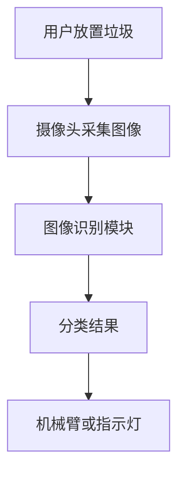
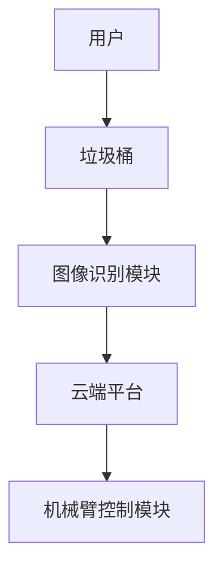

                 


# 智能垃圾分类桶：AI Agent的废物识别与分类指导

> **关键词**：智能垃圾分类桶，AI Agent，废物识别，图像识别，物联网，垃圾分类算法

> **摘要**：  
智能垃圾分类桶是人工智能技术在环保领域的典型应用之一。本文从背景、技术原理、系统架构到实际实现，全面解析AI Agent如何通过图像识别、物联网技术实现废物的智能分类。文章结合实际案例，详细探讨了YOLO目标检测算法、系统架构设计、项目实战等核心内容，并给出了最佳实践和未来展望。

---

# 第一部分: 背景与概述

## 第1章: 智能垃圾分类桶的背景与问题

### 1.1 问题背景
#### 1.1.1 垃圾分类的重要性  
随着城市化进程的加快，垃圾量急剧增加，垃圾分类成为解决环境污染和资源浪费的关键问题。智能垃圾分类桶通过AI技术，能够高效识别和分类垃圾，减少人工干预，提高分类效率。

#### 1.1.2 当前垃圾分类的痛点  
- 人工分类效率低、成本高。  
- 垃圾种类多样，分类标准复杂。  
- 用户垃圾分类意识不足，分类错误率高。  

#### 1.1.3 AI Agent在垃圾分类中的作用  
AI Agent能够通过图像识别技术快速识别垃圾种类，并结合物联网技术实现智能分类，解决传统垃圾分类的痛点。

### 1.2 技术背景
#### 1.2.1 AI技术的发展与应用  
人工智能技术的快速发展为垃圾分类提供了技术支持，尤其是深度学习算法在图像识别领域的应用。

#### 1.2.2 物联网技术在智能设备中的应用  
物联网技术通过传感器和通信模块，实现设备与云端的数据交互，为智能垃圾分类桶提供了实时数据处理的能力。

#### 1.2.3 图像识别技术的现状  
图像识别技术在垃圾分类中的应用日益广泛，基于深度学习的目标检测算法（如YOLO）成为主流解决方案。

### 1.3 应用背景
#### 1.3.1 智能垃圾桶的市场现状  
智能垃圾桶市场逐渐成熟，应用场景包括家庭、社区、公共场所等。

#### 1.3.2 智能垃圾分类的社会价值  
减少环境污染、提高资源利用率、降低人工成本。

#### 1.3.3 未来发展趋势  
AI Agent与物联网技术的深度融合，垃圾分类算法的优化，以及用户交互体验的提升。

---

## 第2章: AI Agent的核心概念与原理

### 2.1 AI Agent的基本定义
#### 2.1.1 AI Agent的定义  
AI Agent是一种能够感知环境、自主决策并执行任务的智能体。

#### 2.1.2 AI Agent的核心特征  
- **感知能力**：通过传感器或摄像头感知环境数据。  
- **决策能力**：基于感知数据进行分类、识别和决策。  
- **执行能力**：通过执行机构完成任务。  

#### 2.1.3 AI Agent与传统AI的区别  
AI Agent具有更强的自主性和实时性，能够适应动态环境。

### 2.2 AI Agent在垃圾分类中的应用
#### 2.2.1 AI Agent的功能模块  
- 数据采集模块：摄像头、传感器。  
- 图像识别模块：目标检测、分类。  
- 决策控制模块：分类结果输出、设备控制。  

#### 2.2.2 AI Agent的决策机制  
- 基于图像识别的结果进行分类决策。  
- 根据分类结果驱动机械臂或指示灯完成分类操作。  

#### 2.2.3 AI Agent的学习与优化  
- 使用深度学习模型进行训练和优化。  
- 在实际使用中持续收集数据，提升分类准确率。

---

## 第3章: 图像识别技术在垃圾分类中的应用

### 3.1 图像识别技术概述
#### 3.1.1 图像识别的基本原理  
图像识别通过算法分析图像特征，实现对物体的识别和分类。

#### 3.1.2 垃圾分类中的图像识别需求  
- 实时性要求高。  
- 垃圾种类多样，需要高精度识别。  

#### 3.1.3 图像识别技术的优缺点  
| 技术 | 优点 | 缺点 |  
|------|------|------|  
| YOLO | 实时性高，部署简单 | 对小目标识别效果较差 |  
| Faster R-CNN | 精度高 | 速度较慢 |  

### 3.2 垃圾分类中的图像识别算法
#### 3.2.1 常见的图像分类算法  
- YOLO系列：YOLOv3、YOLOv4、YOLOv5。  
- Faster R-CNN系列：Faster R-CNN、Mask R-CNN。  

#### 3.2.2 垃圾分类中的目标检测  
目标检测用于识别垃圾的位置和类型，是智能垃圾桶的核心功能之一。

#### 3.2.3 图像分割在垃圾分类中的应用  
图像分割能够更精确地识别垃圾的形状和轮廓。

---

## 第4章: 物联网技术在智能垃圾桶中的应用

### 4.1 物联网技术概述
#### 4.1.1 物联网的基本概念  
物联网通过传感器、通信技术和云端平台实现设备与设备、设备与人之间的连接。

#### 4.1.2 物联网在智能设备中的应用  
- 数据采集：传感器采集垃圾桶的状态信息。  
- 数据传输：通过Wi-Fi或4G上传数据。  
- 数据处理：云端平台分析数据并下发指令。  

### 4.2 智能垃圾桶中的物联网架构
#### 4.2.1 物联网架构设计  
- 传感器：垃圾桶的满载状态、重量、气味等。  
- 通信模块：Wi-Fi、蓝牙或NB-IoT。  
- 云端平台：存储数据、分析数据并下发指令。  

#### 4.2.2 智能垃圾桶的数据采集  
- 垃圾类型：通过图像识别模块识别。  
- 垃圾量：通过重量传感器检测。  

#### 4.2.3 物联网通信协议的选择  
- 选择低功耗协议（如LoRa、NB-IoT）用于远程通信。  
- 选择高带宽协议（如Wi-Fi）用于本地数据传输。  

---

# 第二部分: 算法原理与实现

## 第5章: 垃圾分类算法的数学模型与实现

### 5.1 垃圾分类的数学模型
#### 5.1.1 分类器的数学模型  
分类器通过输入特征向量，输出垃圾的类别标签。  

#### 5.1.2 分类器的损失函数  
交叉熵损失函数：  
$$ L = -\sum_{i=1}^{n} y_i \log p_i + (1-y_i) \log (1-p_i) $$  

#### 5.1.3 分类器的优化算法  
Adam优化器：  
$$ \theta_{t+1} = \theta_t - \eta \frac{\rho_1}{\rho_2} \cdot g_t $$  

### 5.2 垃圾分类的算法实现
#### 5.2.1 YOLO目标检测算法的实现  
YOLOv5的实现流程：  
1. 输入图像经过主干网络提取特征。  
2. 特征图经过解码生成边界框和类别概率。  
3. 非极大值抑制（NMS）筛选出最终的检测结果。  

#### 5.2.2 垃圾分类的图像处理代码  
```python
import cv2
import torch
import numpy as np

# 加载预训练模型
model = torch.hub.load('ultralytics/yolov5', 'yolov5s')

# 读取图像
image = cv2.imread('test.jpg')
height, width = image.shape[:2]

# 图像预处理
input_image = cv2.resize(image, (640, 480))
input_image = input_image / 255.0
input_image = torch.from_numpy(input_image).float().permute(2, 0, 1).unsqueeze(0)

# 推理
output = model(input_image)
result = output[0]

# 解析结果
for i, det in enumerate(result.boxes):
    label = int(det.label)
    print(f'检测到垃圾类型：{label}')
```

#### 5.2.3 算法优化与调优  
- 使用数据增强技术提升模型鲁棒性。  
- 调整模型超参数（学习率、批量大小）优化训练效果。  

---

## 第6章: 垃圾分类系统的架构设计与实现

### 6.1 系统功能设计
#### 6.1.1 系统功能模块  
- 数据采集模块：摄像头、传感器。  
- 图像处理模块：目标检测、分类。  
- 决策控制模块：分类结果输出、机械臂控制。  

#### 6.1.2 系统功能流程图  


### 6.2 系统架构设计
#### 6.2.1 系统架构图  


#### 6.2.2 系统接口设计  
- 用户与垃圾桶的交互接口：LCD屏幕、指示灯。  
- 垃圾桶与云端的通信接口：HTTP API。  

---

## 第7章: 项目实战与优化

### 7.1 项目实战
#### 7.1.1 环境搭建  
- 安装Python、深度学习框架（PyTorch、Keras）。  
- 安装物联网开发板（如Raspberry Pi）。  

#### 7.1.2 核心代码实现  
```python
import cv2
import torch
import numpy as np

# 加载预训练模型
model = torch.hub.load('ultralytics/yolov5', 'yolov5s').to('cuda')

# 读取图像
image = cv2.imread('test.jpg')

# 推理
result = model(image)

# 解析结果
for i, det in enumerate(result.boxes):
    label = int(det.label)
    print(f'检测到垃圾类型：{label}')
```

#### 7.1.3 测试与优化  
- 测试不同光照条件下的识别效果。  
- 优化模型参数，提升分类准确率。  

### 7.2 最佳实践
#### 7.2.1 小结  
智能垃圾分类桶的核心是AI Agent和图像识别技术的结合，通过优化算法和系统架构，可以实现高效的垃圾分类。

#### 7.2.2 注意事项  
- 数据质量和标注准确性直接影响分类效果。  
- 系统的实时性和稳定性需要重点关注。  

#### 7.2.3 未来展望  
- 推动AI Agent与物联网技术的深度融合。  
- 提升垃圾分类算法的精度和效率。  
- 推广智能垃圾桶的应用，助力环保事业。

---

# 第三部分: 结论与展望

## 第8章: 结论与未来发展方向

### 8.1 本文总结  
智能垃圾分类桶通过AI Agent和图像识别技术，实现了高效的垃圾分类，减少了人工成本，提升了分类准确率。

### 8.2 未来发展方向  
- 研究更高效的垃圾分类算法。  
- 推动智能垃圾桶的普及和应用。  
- 结合边缘计算技术，提升系统的实时性和稳定性。  

---

## 参考文献  
[1] YOLOv5官方文档.  
[2] 物联网技术入门与应用.  
[3] 深度学习与图像识别.  

---

通过本文的详细讲解，读者可以全面了解AI Agent在智能垃圾分类桶中的应用，从理论到实践，掌握垃圾分类的核心技术与实现方法。

