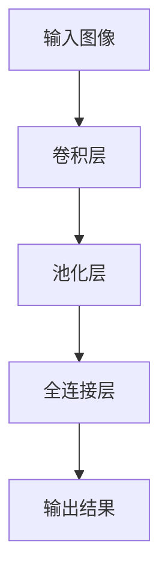
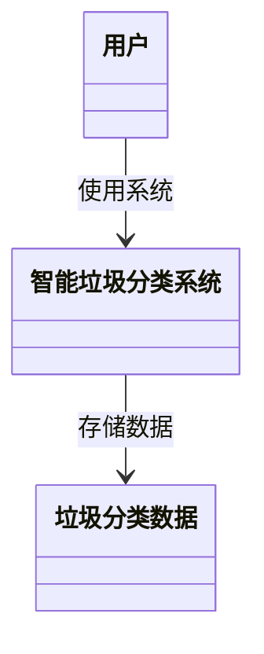
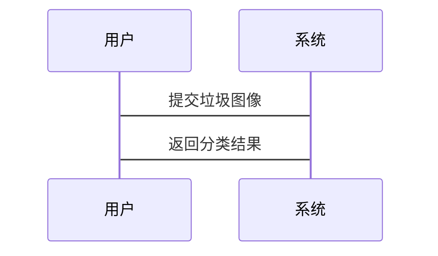

                 


```markdown
# 智能垃圾分类系统：AI Agent的环保教育助手

> 关键词：智能垃圾分类、AI Agent、环保教育、机器学习、图像识别、系统架构

> 摘要：本文探讨了智能垃圾分类系统在环保教育中的应用，重点介绍了AI Agent在垃圾分类中的角色。通过分析系统的算法原理、架构设计及项目实战，展示了如何利用AI技术提升垃圾分类效率，并通过环保教育促进可持续发展。

---

## 第一部分: 智能垃圾分类系统背景与概述

### 第1章: 智能垃圾分类系统的背景与意义

#### 1.1 智能垃圾分类的背景

##### 1.1.1 垃圾分类的重要性
- 垃圾分类是资源回收和环境保护的关键步骤。
- 不当处理垃圾会导致环境污染和资源浪费。

##### 1.1.2 传统垃圾分类的局限性
- 依赖人工分类，效率低且成本高。
- 容易出错，影响资源回收质量。

##### 1.1.3 AI技术在垃圾分类中的应用潜力
- AI技术能够提高分类效率和准确性。
- 通过学习和优化，AI可以不断改进分类效果。

#### 1.2 AI Agent在环保中的角色

##### 1.2.1 AI Agent的基本概念
- AI Agent是具有自主决策能力的智能体。
- 在垃圾分类中，AI Agent能够识别和分类垃圾。

##### 1.2.2 AI Agent在垃圾分类中的优势
- 高效性：快速处理大量数据。
- 准确性：减少人为错误。
- 自适应性：能够根据反馈优化分类策略。

##### 1.2.3 AI Agent与环保教育的结合
- AI Agent可以作为教育工具，帮助用户学习垃圾分类知识。
- 通过互动和反馈，增强用户的环保意识。

---

### 第2章: 智能垃圾分类系统的核心概念

#### 2.1 智能垃圾分类系统的定义与特点

##### 2.1.1 系统定义
- 智能垃圾分类系统是利用AI技术实现自动分类的系统。

##### 2.1.2 系统核心特点
- 自动化：无需人工干预。
- 高效性：快速处理大量垃圾。
- 智能性：能够学习和优化分类策略。

##### 2.1.3 系统与传统分类的区别
| 特性       | 传统分类         | 智能分类         |
|------------|------------------|------------------|
| 分类速度     | 较慢             | 快               |
| 准确率       | 低               | 高               |
| 成本         | 高               | 低               |

#### 2.2 AI Agent的功能与属性

##### 2.2.1 AI Agent的核心功能
- 数据采集：通过摄像头或传感器获取垃圾信息。
- 数据处理：利用算法识别垃圾类型。
- 分类决策：根据识别结果进行分类。

##### 2.2.2 AI Agent的属性特征对比表
| 属性       | 传统分类系统       | AI Agent         |
|------------|--------------------|------------------|
| 可扩展性     | 低                 | 高               |
| 自适应性     | 无                 | 有               |
| 智能性       | 无                 | 有               |

#### 2.3 ER实体关系图
```mermaid
erd
actor 用户
system 智能垃圾分类系统
base 垃圾分类数据

用户 --> 垃圾分类系统: 使用系统
智能垃圾分类系统 --> 垃圾分类数据: 存储数据
```

---

## 第二部分: 智能垃圾分类系统的算法原理

### 第3章: 智能垃圾分类系统的算法原理

#### 3.1 算法选择与原理

##### 3.1.1 卷积神经网络（CNN）的选择
- CNN适合图像识别任务。
- 适用于垃圾图像的分类。

##### 3.1.2 CNN的基本原理
- 输入：垃圾图像。
- 输出：垃圾类别。

##### 3.1.3 CNN的数学模型与公式
$$ \text{损失函数} = -\frac{1}{n}\sum_{i=1}^{n} y_i \log p_i + (1 - y_i)\log(1 - p_i) $$
$$ \text{优化器} = \text{Adam} $$

#### 3.2 算法流程图


#### 3.3 算法实现代码
```python
import torch
import torch.nn as nn
import torch.optim as optim

class Net(nn.Module):
    def __init__(self):
        super(Net, self).__init__()
        self.conv1 = nn.Conv2d(3, 6, 5)
        self.pool = nn.MaxPool2d(2, 2)
        self.conv2 = nn.Conv2d(6, 16, 5)
        self.fc1 = nn.Linear(16 * 5 * 5, 120)
        self.fc2 = nn.Linear(120, 10)

    def forward(self, x):
        x = self.pool(F.relu(self.conv1(x)))
        x = self.pool(F.relu(self.conv2(x)))
        x = x.view(-1, 16 * 5 * 5)
        x = F.relu(self.fc1(x))
        x = F.log_softmax(self.fc2(x), dim=1)
        return x

criterion = nn.NLLLoss()
optimizer = optim.Adam(net.parameters(), lr=0.001)
```

---

## 第三部分: 智能垃圾分类系统的系统架构设计

### 第4章: 系统分析与架构设计方案

#### 4.1 系统功能设计

##### 4.1.1 领域模型


#### 4.2 系统架构设计

##### 4.2.1 系统架构图


#### 4.3 系统接口设计

##### 4.3.1 接口描述
- 用户输入垃圾图像。
- 系统返回分类结果。

#### 4.4 系统交互流程图


---

## 第四部分: 智能垃圾分类系统的项目实战

### 第5章: 项目实战

#### 5.1 环境搭建

##### 5.1.1 安装Python
- 安装Python 3.8以上版本。

##### 5.1.2 安装依赖
- 使用pip安装torch、numpy等库。

#### 5.2 系统核心实现

##### 5.2.1 数据加载
```python
import torch
from torchvision import datasets, transforms

transform = transforms.Compose([
    transforms.Resize(224),
    transforms.ToTensor(),
])

train_set = datasets.CIFAR10(root='./data', train=True, download=True, transform=transform)
```

##### 5.2.2 模型定义
```python
class Net(nn.Module):
    def __init__(self):
        super(Net, self).__init__()
        self.conv1 = nn.Conv2d(3, 6, 5)
        self.pool = nn.MaxPool2d(2, 2)
        self.conv2 = nn.Conv2d(6, 16, 5)
        self.fc1 = nn.Linear(16 * 5 * 5, 120)
        self.fc2 = nn.Linear(120, 10)

    def forward(self, x):
        x = self.pool(F.relu(self.conv1(x)))
        x = self.pool(F.relu(self.conv2(x)))
        x = x.view(-1, 16 * 5 * 5)
        x = F.relu(self.fc1(x))
        x = F.log_softmax(self.fc2(x), dim=1)
        return x
```

##### 5.2.3 模型训练
```python
criterion = nn.NLLLoss()
optimizer = optim.Adam(net.parameters(), lr=0.001)

for epoch in range(10):
    running_loss = 0.0
    for inputs, labels in dataloader:
        outputs = net(inputs)
        loss = criterion(outputs, labels)
        loss.backward()
        optimizer.step()
        running_loss += loss.item()
```

#### 5.3 实际案例分析

##### 5.3.1 案例描述
- 用户上传一张垃圾图像，系统识别并分类。

##### 5.3.2 分析过程
1. 用户输入图像。
2. 系统进行图像识别。
3. 返回分类结果。

#### 5.4 项目小结
- 通过本项目，展示了AI在垃圾分类中的应用。
- 提供了环保教育的交互界面。

---

## 第五部分: 智能垃圾分类系统的最佳实践

### 第6章: 总结与展望

#### 6.1 小结
- AI Agent在垃圾分类中的应用前景广阔。
- 系统的设计和实现为环保教育提供了新思路。

#### 6.2 注意事项
- 数据质量和多样性影响分类准确性。
- 系统维护和更新需及时。

#### 6.3 拓展阅读
- 《深度学习实战》
- 《Python机器学习》
- 《环保技术与可持续发展》

---

## 附录

### 附录A: 垃圾分类数据集

- CIFAR-10数据集：10个类别，50000张训练图像。

### 附录B: 完整代码

```python
import torch
import torch.nn as nn
import torch.optim as optim
from torchvision import datasets, transforms

transform = transforms.Compose([
    transforms.Resize(224),
    transforms.ToTensor(),
])

train_set = datasets.CIFAR10(root='./data', train=True, download=True, transform=transform)

class Net(nn.Module):
    def __init__(self):
        super(Net, self).__init__()
        self.conv1 = nn.Conv2d(3, 6, 5)
        self.pool = nn.MaxPool2d(2, 2)
        self.conv2 = nn.Conv2d(6, 16, 5)
        self.fc1 = nn.Linear(16 * 5 * 5, 120)
        self.fc2 = nn.Linear(120, 10)

    def forward(self, x):
        x = self.pool(F.relu(self.conv1(x)))
        x = self.pool(F.relu(self.conv2(x)))
        x = x.view(-1, 16 * 5 * 5)
        x = F.relu(self.fc1(x))
        x = F.log_softmax(self.fc2(x), dim=1)
        return x

criterion = nn.NLLLoss()
optimizer = optim.Adam(net.parameters(), lr=0.001)

for epoch in range(10):
    running_loss = 0.0
    for inputs, labels in dataloader:
        outputs = net(inputs)
        loss = criterion(outputs, labels)
        loss.backward()
        optimizer.step()
        running_loss += loss.item()

print('完成训练！')
```

---

## 参考文献

- LeCun, Y., Bengio, Y., & Hinton, G. (2015). Deep learning.
- Torch官方文档: https://pytorch.org
- Mermaid图表工具: https://mermaid-js.github.io/mermaid

---

## 结语

通过本文的详细讲解，读者可以深入了解智能垃圾分类系统的核心概念、算法原理和系统架构。同时，通过项目实战部分，读者可以掌握系统的实现方法，并将其应用于实际的环保教育中。未来，随着AI技术的不断发展，智能垃圾分类系统将更加智能化和高效化，为环境保护做出更大的贡献。
```

