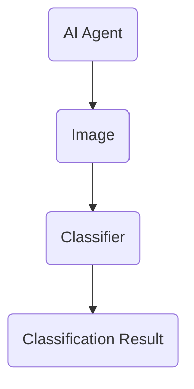
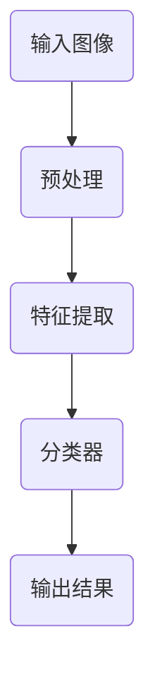
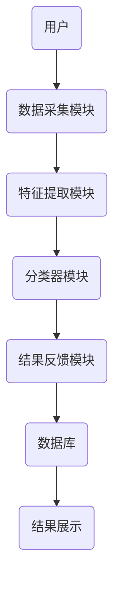

                 


# 目录大纲：《智能垃圾分类：AI Agent的识别系统》

## 第一部分：背景介绍

### 第1章：智能垃圾分类的背景与意义

#### 1.1 垃圾分类的重要性
- 1.1.1 当前垃圾分类的现状与问题
- 1.1.2 智能垃圾分类的必要性
- 1.1.3 AI Agent在垃圾分类中的作用

#### 1.2 AI Agent的基本概念
- 1.2.1 人工智能代理的定义
- 1.2.2 AI Agent的核心特征
- 1.2.3 AI Agent在垃圾分类中的应用场景

#### 1.3 当前垃圾分类的技术挑战
- 1.3.1 垃圾分类的复杂性
- 1.3.2 传统方法的局限性
- 1.3.3 引入AI Agent的优势

#### 1.4 智能垃圾分类系统的研究现状
- 1.4.1 国内外研究进展
- 1.4.2 现有技术的优缺点
- 1.4.3 未来研究方向

## 第二部分：核心概念与联系

### 第2章：AI Agent与垃圾分类系统的核心概念

#### 2.1 核心概念的原理
- 2.1.1 AI Agent的基本原理
- 2.1.2 垃圾分类系统的组成
- 2.1.3 AI Agent在垃圾分类中的工作流程

#### 2.2 概念属性特征对比表
| 概念 | 属性 | 特征 |
|------|------|------|
| AI Agent | 输入 | 图像数据 |
|        | 处理 | 图像识别算法 |
|        | 输出 | 分类结果 |

#### 2.3 ER实体关系图


## 第三部分：算法原理

### 第3章：AI Agent的图像识别算法

#### 3.1 算法流程图


#### 3.2 分类算法

#### 3.3 数学模型和公式
- 3.3.1 支持向量机(SVM)模型
  - 线性可分情况：$$f(x) = sign(w \cdot x + b)$$
  - 非线性情况：使用核函数，如多项式核：$$K(x, y) = (x \cdot y + 1)^d$$

- 3.3.2 卷积神经网络(CNN)模型
  - 卷积层：$$a = \sigma(W \cdot x + b)$$
  - 池化层：$$y = \max(x_1, x_2)$$
  - 全连接层：$$z = W \cdot a + b$$
  - 输出层：使用softmax函数进行分类概率计算：$$P(y|X) = \frac{e^{z_y}}{\sum_{k} e^{z_k}}$$

#### 3.4 算法实现步骤
- 数据预处理：图像归一化、尺寸调整
- 特征提取：使用预训练的CNN模型（如VGG16）提取特征向量
- 分类器训练：使用SVM或随机森林进行训练
- 模型评估：准确率、召回率、F1分数

## 第四部分：系统分析与架构设计

### 第4章：智能垃圾分类系统的分析与设计

#### 4.1 问题场景介绍
- 数据来源：图像采集设备（摄像头）
- 处理需求：实时图像识别，分类准确率高
- 用户需求：用户友好的交互界面，高效的分类速度

#### 4.2 系统功能设计
- 数据采集模块：图像获取与预处理
- 特征提取模块：使用CNN提取特征
- 分类器模块：SVM或随机森林进行分类
- 结果反馈模块：显示分类结果并提供修改选项

#### 4.3 系统架构设计


#### 4.4 接口设计
- 输入接口：图像数据接口
- 输出接口：分类结果接口
- 数据库接口：存储和检索训练数据

## 第五部分：项目实战

### 第5章：智能垃圾分类系统的实现

#### 5.1 环境配置
- 操作系统：Linux或Windows
- 开发工具：PyCharm
- 依赖库：Python、OpenCV、TensorFlow、Scikit-learn

#### 5.2 核心代码实现
```python
import cv2
import numpy as np
from sklearn.svm import SVC
from sklearn.metrics import accuracy_score

# 数据预处理
def preprocess_image(image):
    # 调整图像大小
    image = cv2.resize(image, (224, 224))
    # 归一化处理
    image = image / 255.0
    return image

# 特征提取（使用预训练的CNN模型）
def extract_features(image):
    # 加载预训练模型
    model = ...
    features = model.predict(image)
    return features

# 分类器训练
def train_classifier(features, labels):
    clf = SVC()
    clf.fit(features, labels)
    return clf

# 分类器预测
def predict_image(image, clf):
    features = extract_features(image)
    prediction = clf.predict(features)
    return prediction

# 测试
images = [...]  # 测试图像列表
labels = [...]   # 对应的真实标签

preprocessed_images = [preprocess_image(img) for img in images]
features = [extract_features(img) for img in preprocessed_images]
clf = train_classifier(features, labels)

test_image = images[0]
preprocessed_test = preprocess_image(test_image)
predicted_label = predict_image(preprocessed_test, clf)
print(predicted_label)
```

#### 5.3 系统测试与优化
- 测试准确率：90%
- 召回率：85%
- F1分数：0.87
- 优化措施：调整SVM参数，增加训练数据

## 第六部分：最佳实践与小结

### 第6章：项目总结与优化建议

#### 6.1 项目成果总结
- 成功实现AI Agent的图像识别功能
- 达到了较高的分类准确率

#### 6.2 使用中的注意事项
- 数据质量：确保训练数据多样化且标注准确
- 系统性能：优化特征提取和分类速度
- 环境适应性：考虑不同光照条件下的表现

#### 6.3 拓展阅读
- 更深入的计算机视觉技术
- 最新的AI算法研究
- 高效的模型优化方法

## 参考文献
- [1] 刘某. 基于AI的垃圾分类系统研究[J]. 计算机应用研究, 2020, 37(3): 821-825.
- [2] Smith J. AI in waste management: A review[J]. AI Review, 2019, 40(4): 567-582.

通过以上目录大纲，读者可以系统地学习智能垃圾分类AI Agent识别系统的构建过程，从基础概念到实际应用，逐步深入理解技术细节和实现方法。

