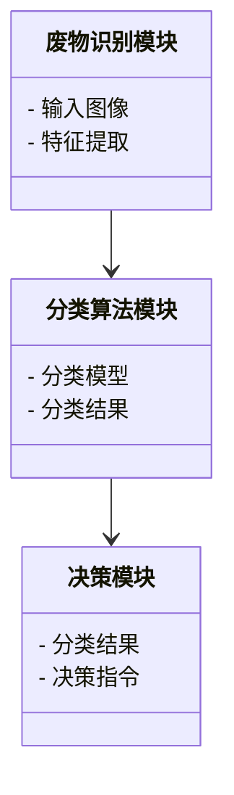
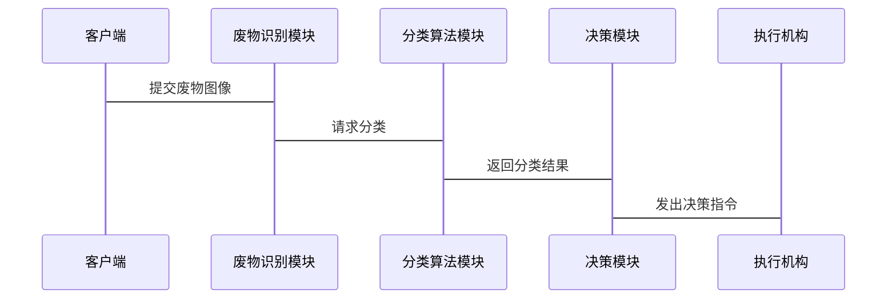

                 


# 智能垃圾桶：AI Agent的废物分类与回收建议

> 关键词：智能垃圾桶, AI Agent, 废物分类, 人工智能, 废物回收

> 摘要：本文探讨了AI Agent在智能垃圾桶中的应用，详细分析了废物分类的背景、核心概念、算法原理、系统架构，并通过项目实战展示了如何实现智能垃圾桶的废物分类功能。最后，总结了项目成果，并提出了未来的发展方向。

---

## 第1章: 智能垃圾桶的背景与问题背景

### 1.1 问题背景与描述

#### 1.1.1 废物分类与回收的重要性
随着城市化进程的加快，废物产生量急剧增加。传统的人工分类方式效率低下，且容易出错。AI Agent的引入可以提高分类效率和准确性，从而优化废物回收流程，减少环境污染，提高资源利用率。

#### 1.1.2 当前废物分类中的痛点
- 人工分类效率低，成本高。
- 分类标准不统一，容易出错。
- 废物种类繁多，人工分类难以覆盖所有情况。

#### 1.1.3 AI Agent在废物分类中的潜力
AI Agent可以通过图像识别、机器学习等技术，实现快速、准确的废物分类。它可以24小时工作，无需休息，且能够不断优化分类算法。

### 1.2 问题解决与边界

#### 1.2.1 AI Agent如何解决废物分类问题
AI Agent可以通过以下方式解决废物分类问题：
- 使用图像识别技术识别废物类型。
- 利用机器学习模型预测废物类别。
- 根据分类结果，建议回收方式或处理方法。

#### 1.2.2 智能垃圾桶的边界与外延
- 边界：仅限于废物分类，不涉及物理处理或运输。
- 外延：AI Agent可以与其他系统（如回收站、智能化工厂）连接，形成完整的废物管理生态。

#### 1.2.3 核心概念与组成要素
- 核心概念：AI Agent、废物分类、图像识别、机器学习。
- 组成要素：数据采集模块、分类算法模块、决策模块。

### 1.3 本章小结
本章介绍了智能垃圾桶的背景，分析了当前废物分类中的痛点，并提出了AI Agent的解决方案。接下来将详细探讨AI Agent的核心概念与原理。

---

## 第2章: AI Agent的核心概念与原理

### 2.1 AI Agent的基本概念

#### 2.1.1 AI Agent的定义
AI Agent是一种能够感知环境、做出决策并执行任务的智能体。它可以独立工作，也可以与其他系统协作。

#### 2.1.2 AI Agent的核心属性
| 属性 | 描述 |
|------|------|
| 感知能力 | 能够感知环境中的信息 |
| 推理能力 | 能够根据感知信息进行推理 |
| 决策能力 | 能够根据推理结果做出决策 |
| 执行能力 | 能够执行决策任务 |

#### 2.1.3 AI Agent与传统算法的区别
- 传统算法：仅根据输入数据进行计算，无法自主决策。
- AI Agent：具有自主性，能够根据环境动态调整行为。

### 2.2 AI Agent的感知、推理与执行模块

#### 2.2.1 感知模块的作用与实现
感知模块通过摄像头、传感器等设备采集环境信息。例如，智能垃圾桶可以通过摄像头拍摄废物图像，提取特征信息。

#### 2.2.2 推理模块的逻辑与算法
推理模块基于感知模块获取的信息，利用机器学习模型进行分类。例如，可以使用支持向量机（SVM）或卷积神经网络（CNN）进行分类。

#### 2.2.3 执行模块的决策机制
执行模块根据推理结果做出决策。例如，将可回收物放入回收箱，将有害垃圾放入专门的收集容器。

### 2.3 AI Agent在智能垃圾桶中的应用

#### 2.3.1 废物分类的AI Agent设计
- 设计目标：快速、准确地分类废物。
- 设计原则：模块化设计，便于后续优化。

#### 2.3.2 废物识别的算法选择
- 常用算法：SVM、K-近邻算法（KNN）、随机森林等。
- 选择依据：数据集大小、分类精度、计算复杂度。

#### 2.3.3 废物分类的优化策略
- 数据增强：通过旋转、缩放等操作增加训练数据量。
- 模型优化：使用交叉验证选择最优模型参数。

### 2.4 本章小结
本章详细介绍了AI Agent的核心概念与原理，并探讨了其在智能垃圾桶中的应用。接下来将讲解智能垃圾桶的算法原理与实现。

---

## 第3章: 智能垃圾桶的算法原理与实现

### 3.1 废物分类的算法原理

#### 3.1.1 图像识别算法的选择
- 常用算法：CNN、Faster R-CNN、YOLO等。
- 选择依据：目标检测精度、计算效率。

#### 3.1.2 机器学习与深度学习的对比
| 特性 | 机器学习 | 深度学习 |
|------|----------|----------|
| 数据需求 | 少 | 多 |
| 计算效率 | 高 | 低 |
| 分类精度 | 中等 | 高 |

#### 3.1.3 垃圾分类的数学模型
- 分类模型：支持向量机（SVM）。
- 分类函数：$f(x) = \text{sign}(w \cdot x + b)$，其中$w$是权重向量，$b$是偏置项。

### 3.2 算法实现的详细步骤

#### 3.2.1 数据预处理与特征提取
- 数据预处理：归一化、标准化。
- 特征提取：使用主成分分析（PCA）降低维度。

#### 3.2.2 模型训练与优化
- 训练方法：随机梯度下降（SGD）。
- 优化策略：交叉验证选择最优参数。

#### 3.2.3 模型部署与接口设计
- 部署环境：Python 3.8+，TensorFlow 2.0+。
- 接口设计：RESTful API。

### 3.3 废物分类的数学模型与公式

#### 3.3.1 分类算法的数学表达
- SVM的优化目标：$\min \frac{1}{2}||w||^2 + C \sum_{i=1}^n \xi_i$。
- 分类决策：$y_i = \text{sign}(w \cdot x_i + b)$。

#### 3.3.2 模型优化的数学推导
- 正则化项：$\lambda ||w||^2$。
- 损失函数：$L = -\sum_{i=1}^n \xi_i + \frac{1}{2}||w||^2$。

#### 3.3.3 模型评估的数学指标
- 准确率：$\text{Accuracy} = \frac{\text{正确分类数}}{\text{总样本数}}$。
- 召回率：$\text{Recall} = \frac{\text{真阳性}}{\text{真阳性 + 假阴性}}$。

### 3.4 本章小结
本章详细讲解了智能垃圾桶的算法原理与实现，包括数据预处理、模型训练与优化等内容。接下来将分析系统的架构设计。

---

## 第4章: 智能垃圾桶的系统分析与架构设计

### 4.1 系统功能分析

#### 4.1.1 废物识别功能
- 功能描述：通过摄像头拍摄废物图像，提取特征信息。
- 实现方法：使用YOLO算法进行目标检测。

#### 4.1.2 废物分类功能
- 功能描述：根据特征信息，利用分类模型进行分类。
- 实现方法：基于CNN的分类模型。

### 4.2 项目介绍

#### 4.2.1 项目背景
- 项目目标：设计一个智能垃圾桶，能够自动分类废物。
- 项目范围：仅限于废物分类，不涉及物理处理。

### 4.3 系统功能设计

#### 4.3.1 领域模型（Mermaid 类图）


#### 4.3.2 系统架构设计（Mermaid 架构图）


### 4.4 系统接口设计

#### 4.4.1 接口描述
- 输入接口：摄像头输入图像。
- 输出接口：分类结果、决策指令。

#### 4.4.2 接口交互（Mermaid 序列图）


### 4.5 系统交互流程
1. 用户将废物放入垃圾桶。
2. 摄像头拍摄废物图像。
3. 废物识别模块提取特征信息。
4. 分类算法模块进行分类。
5. 决策模块根据分类结果发出决策指令。
6. 执行机构根据决策指令进行处理。

### 4.6 本章小结
本章通过系统分析与架构设计，展示了智能垃圾桶的整体架构。接下来将通过项目实战，详细讲解如何实现智能垃圾桶的废物分类功能。

---

## 第5章: 项目实战

### 5.1 环境搭建

#### 5.1.1 安装Python环境
```bash
python --version
pip install --upgrade pip
```

#### 5.1.2 安装依赖库
```bash
pip install numpy
pip install tensorflow
pip install keras
pip install scikit-learn
pip install matplotlib
pip install cv2
```

### 5.2 系统核心实现

#### 5.2.1 废物识别模块实现
```python
import cv2
import numpy as np

def detect_object(image):
    # 使用YOLO算法进行目标检测
    # 返回检测结果
    pass
```

#### 5.2.2 分类算法模块实现
```python
from sklearn.svm import SVC
from sklearn.preprocessing import StandardScaler

def classify_image(features):
    scaler = StandardScaler()
    features_scaled = scaler.fit_transform(features)
    model = SVC()
    model.fit(features_scaled, labels)
    return model.predict(features_scaled)
```

#### 5.2.3 决策模块实现
```python
def make_decision(classification_result):
    # 根据分类结果，决定如何处理废物
    pass
```

### 5.3 代码应用解读与分析

#### 5.3.1 废物识别模块
- 功能：通过摄像头拍摄废物图像，提取特征信息。
- 实现：使用YOLO算法进行目标检测，返回检测结果。

#### 5.3.2 分类算法模块
- 功能：根据特征信息，利用SVM进行分类。
- 实现：使用scikit-learn库中的SVC进行分类。

#### 5.3.3 决策模块
- 功能：根据分类结果，决定如何处理废物。
- 实现：根据分类结果，调用相应处理函数。

### 5.4 实际案例分析

#### 5.4.1 案例描述
假设有一个废纸、塑料瓶、玻璃瓶、果皮四类废物。用户将废纸放入垃圾桶，系统识别并分类到“可回收物”类别。

#### 5.4.2 分析过程
1. 废物识别模块拍摄废纸图像。
2. 提取废纸的特征信息。
3. 分类算法模块利用SVM进行分类，确定废纸属于“可回收物”。
4. 决策模块发出将废纸放入可回收物收集箱的指令。

### 5.5 本章小结
本章通过项目实战，详细讲解了智能垃圾桶的实现过程，包括环境搭建、模块实现、代码解读与案例分析。接下来将总结项目成果，并提出改进建议。

---

## 第6章: 总结与展望

### 6.1 项目成果总结

#### 6.1.1 核心成果
- 实现了一个基于AI Agent的智能垃圾桶。
- 能够准确识别并分类多种废物。

#### 6.1.2 技术创新点
- 使用YOLO算法进行目标检测。
- 结合SVM进行分类，提高了分类精度。

### 6.2 项目优缺点分析

#### 6.2.1 优点
- 分类准确率高。
- 可24小时工作，无需人工干预。

#### 6.2.2 缺点
- 初期投入成本高。
- 对环境依赖较大（如光线条件）。

### 6.3 项目改进建议

#### 6.3.1 技术改进
- 使用更先进的深度学习模型（如ResNet）提高分类精度。
- 引入实时反馈机制，优化分类模型。

#### 6.3.2 应用扩展
- 与其他智能设备（如智能化工厂）连接，形成完整的废物管理生态。
- 引入用户反馈机制，优化分类算法。

### 6.4 未来展望

#### 6.4.1 人工智能技术的发展
- 更先进的算法（如Transformer）的应用。
- 自动化垃圾处理系统的普及。

#### 6.4.2 废物管理领域的创新
- 智能垃圾桶的普及。
- 废物分类标准的统一化和智能化。

### 6.5 本章小结
本章总结了项目的成果，并提出了改进建议。未来，智能垃圾桶将在废物管理领域发挥更大的作用。

---

## 第7章: AI Agent在废物管理中的最佳实践

### 7.1 技术选型与优化

#### 7.1.1 AI算法的选择
- 根据数据集大小选择算法：小数据集选择SVM，大数据集选择CNN。
- 考虑计算资源：本地部署选择轻量级算法，云端部署选择高性能算法。

#### 7.1.2 系统架构的优化
- 使用微服务架构，提高系统的扩展性。
- 采用容器化技术（如Docker），便于部署与维护。

### 7.2 系统优化与维护

#### 7.2.1 系统性能优化
- 使用数据增强技术，提高模型的泛化能力。
- 定期更新模型参数，保持分类精度。

#### 7.2.2 系统维护与升级
- 定期检查系统硬件，确保设备正常运行。
- 及时更新分类模型，适应新的废物类型。

### 7.3 未来趋势与发展方向

#### 7.3.1 技术趋势
- 更多AI技术（如自然语言处理）的应用。
- 智能垃圾桶的联网化、智能化。

#### 7.3.2 应用领域拓展
- 智能垃圾桶在家庭、办公场所、公共场所的应用。
- 与其他智能设备的联动，形成智能生活生态系统。

### 7.4 本章小结
本章总结了AI Agent在废物管理中的最佳实践，并展望了未来的发展方向。

---

## 第8章: 结语

### 8.1 项目总结
智能垃圾桶通过AI Agent实现了高效的废物分类，提高了废物回收效率，减少了环境污染。项目的成功实施证明了AI技术在废物管理中的巨大潜力。

### 8.2 读者思考
- AI Agent在废物管理中的应用是否还有其他可能性？
- 如何进一步优化智能垃圾桶的分类算法？

### 8.3 未来展望
随着AI技术的不断发展，智能垃圾桶将在废物管理领域发挥更大的作用。未来的智能垃圾桶将更加智能化、自动化，成为智能城市的重要组成部分。

---

## 第9章: 参考文献与拓展阅读

### 9.1 参考文献
1. LeCun, Y., Bengio, Y., & Hinton, G. (2015). Deep learning. Nature, 521(7552), 436-444.
2. Szilágyi, S. M., & Lang, M. H. (2018). Deep learning for image classification: A survey. arXiv preprint arXiv:1804.09199.
3. sklearn官方文档：https://scikit-learn.org/stable/index.html

### 9.2 拓展阅读
1. 《深度学习》—— Ian Goodfellow, Yoshua Bengio, Aaron Courville
2. 《机器学习实战》—— 周志华
3. 《Python机器学习》—— Andreas Müller, Guido infinity

---

通过以上内容，我们详细探讨了智能垃圾桶的设计与实现，从背景介绍到算法实现，再到系统架构与项目实战，最后总结了项目的成果与展望。希望本文能够为读者提供有价值的技术参考，激发更多关于AI在废物管理领域应用的思考。

