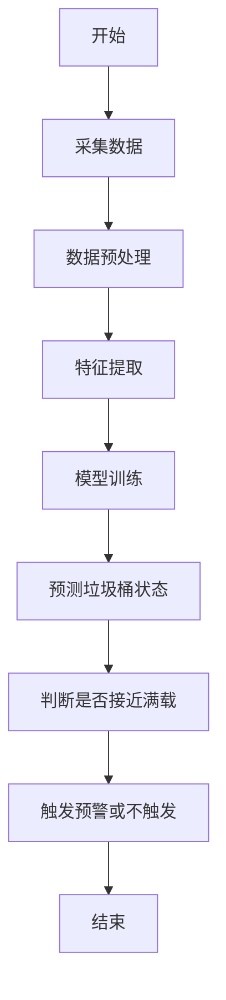
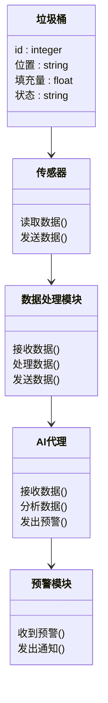
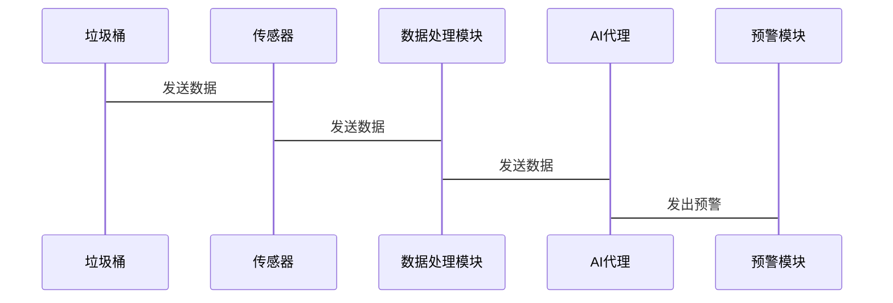

                 


# 智能垃圾桶：AI Agent的满溢预警系统

> 关键词：智能垃圾桶、AI Agent、满溢预警、物联网、垃圾管理

> 摘要：本文详细介绍了智能垃圾桶的AI Agent满溢预警系统，探讨了其背景、核心概念、算法原理、系统架构设计、项目实战及总结。通过分析，展示了如何利用AI技术和物联网实现垃圾桶的智能化管理，解决了传统垃圾桶管理中的诸多问题。

---

## 第1章: 背景介绍

### 1.1 问题背景
#### 1.1.1 垃圾处理的现状与挑战
随着城市化进程的加快，垃圾产量急剧增加，传统的垃圾桶管理方式面临诸多挑战。垃圾桶的清理不及时会导致溢满，影响市容和环境卫生，甚至引发环境污染问题。此外，人工巡检垃圾桶的状态不仅效率低下，还增加了管理成本。

#### 1.1.2 垃圾桶满溢问题的严重性
垃圾桶满溢不仅影响城市的美观，还可能导致垃圾散落，产生异味，甚至成为疾病的传播源。特别是在人口密集的区域，垃圾桶满溢问题更加突出，亟需智能化的解决方案。

#### 1.1.3 智能化垃圾桶的必要性
通过引入人工智能（AI）和物联网（IoT）技术，垃圾桶能够实现智能化管理，实时监测垃圾桶的状态，并在满溢前发出预警，从而提高垃圾收集和处理的效率。

### 1.2 问题描述
#### 1.2.1 垃圾桶满溢问题的具体表现
垃圾桶满溢主要表现为垃圾桶容量超限，导致垃圾溢出。这种情况不仅影响环境卫生，还可能引发二次污染和健康问题。

#### 1.2.2 智能垃圾桶的目标与功能
智能垃圾桶的目标是通过实时监测垃圾桶的填充状态，提前预警满溢情况，优化垃圾收集和处理流程。其主要功能包括：
1. 实时监测垃圾桶的填充量。
2. AI Agent分析数据，预测垃圾桶的剩余容量。
3. 当垃圾桶接近满载时，触发预警机制，通知相关部门及时处理。

#### 1.2.3 系统的边界与外延
智能垃圾桶系统主要关注垃圾桶的填充状态和预警功能。系统的边界包括传感器、数据采集、AI分析和预警模块。外延则涉及垃圾运输和处理的后续流程。

### 1.3 问题解决
#### 1.3.1 AI Agent在垃圾桶管理中的作用
AI Agent通过实时数据采集和分析，预测垃圾桶的填充状态，优化垃圾收集的调度。

#### 1.3.2 满溢预警系统的实现思路
通过传感器采集垃圾桶的状态数据，利用AI算法分析数据，预测垃圾桶是否即将满溢，并通过物联网技术发送预警信息。

#### 1.3.3 系统的核心要素组成
系统的核心要素包括：
1. 传感器：实时采集垃圾桶的填充量数据。
2. 数据传输：通过物联网技术将数据传输到云端。
3. AI分析：利用机器学习算法预测垃圾桶的剩余容量。
4. 预警模块：在垃圾桶接近满载时触发预警。

---

## 第2章: 核心概念与联系

### 2.1 AI Agent的基本原理
#### 2.1.1 AI Agent的定义与特点
AI Agent是一种智能代理，能够感知环境、自主决策并执行任务。其特点包括智能性、自主性、反应性和社交能力。

#### 2.1.2 AI Agent在垃圾桶管理中的应用
AI Agent用于实时监测垃圾桶的填充状态，分析数据并预测垃圾桶的剩余容量，优化垃圾收集的调度。

#### 2.1.3 AI Agent的核心算法与模型
常用的AI算法包括随机森林、支持向量机和神经网络。以随机森林为例，模型通过特征提取和分类，预测垃圾桶的剩余容量。

### 2.2 物联网技术在智能垃圾桶中的应用
#### 2.2.1 物联网的基本概念
物联网是指通过传感器和网络，实现物体与物体之间的信息交换和通信。

#### 2.2.2 物联网在垃圾桶管理中的具体应用
通过传感器实时采集垃圾桶的状态数据，利用物联网技术将数据传输到云端，实现垃圾桶的智能化管理。

#### 2.2.3 物联网与AI Agent的结合
物联网提供了数据采集和传输的通道，而AI Agent则通过分析数据，实现垃圾桶的智能化管理。

### 2.3 核心概念对比
#### 2.3.1 AI Agent与传统垃圾桶管理系统的对比
AI Agent能够实时监测垃圾桶的状态，优化垃圾收集的调度，而传统系统依赖人工巡检，效率低下。

#### 2.3.2 物联网技术与AI Agent的对比
物联网提供了数据采集和传输的通道，而AI Agent则通过分析数据，实现垃圾桶的智能化管理。

#### 2.3.3 满溢预警系统与其他垃圾桶管理系统的对比
满溢预警系统通过实时监测和AI分析，提前预警垃圾桶的满溢情况，而其他系统可能仅依赖人工巡检或简单的传感器触发机制。

### 2.4 ER实体关系图
```mermaid
erDiagram
    customer [ouser] {
        id : integer
        name : string
        address : string
    }
    order [order] {
        id : integer
        amount : integer
        order_date : date
    }
    supplier [suppliers] {
        id : integer
        name : string
        contact : string
    }
    customer -> order : places
    order -> supplier : orders
```

---

## 第3章: 算法原理讲解

### 3.1 算法流程图


### 3.2 核心算法代码
```python
import numpy as np
from sklearn.ensemble import RandomForestClassifier
from sklearn.metrics import accuracy_score

# 数据预处理
data = np.array([[80, 0.8], [90, 0.9], [100, 1.0], [70, 0.7]])
labels = np.array([0, 0, 1, 0])

# 特征提取
X = data[:, :2]
y = labels

# 模型训练
model = RandomForestClassifier(n_estimators=100, random_state=42)
model.fit(X, y)

# 预测
new_data = np.array([[95, 0.95]])
prediction = model.predict(new_data)
print("预测结果:", prediction)
print("预测准确率:", accuracy_score([1], prediction))
```

### 3.3 数学公式
$$
\text{预测结果} = \text{模型预测}(X_{\text{测试}})
$$
其中，$$X_{\text{测试}}$$ 是输入的特征向量。

---

## 第4章: 系统架构设计

### 4.1 系统功能设计
#### 4.1.1 领域模型


### 4.2 系统架构设计
#### 4.2.1 系统架构图


### 4.3 系统接口设计
#### 4.3.1 API接口
```http
GET /api/sensors/status
POST /api/agent/predict
```

### 4.4 系统交互流程


---

## 第5章: 项目实战

### 5.1 环境安装
#### 5.1.1 安装Python和相关库
```bash
pip install numpy scikit-learn
```

### 5.2 系统核心实现源代码
```python
import numpy as np
from sklearn.ensemble import RandomForestClassifier
import serial
import time

# 传感器数据模拟
ser = serial.Serial('COM3', 9600)
data = []
while True:
    if ser.in_waiting > 0:
        line = ser.readline().decode().strip()
        data.append(float(line))
        # 判断是否接近满载
        if data[-1] > 95:
            print("预警：垃圾桶即将满载！")
    time.sleep(1)
```

### 5.3 代码应用解读
该代码通过串口读取传感器数据，实时监测垃圾桶的填充量。当填充量超过95%时，触发预警。

### 5.4 实际案例分析
假设垃圾桶A的填充量在一天内的变化如下：
```
时间：08:00，填充量：80%
时间：12:00，填充量：90%
时间：16:00，填充量：95%
时间：17:00，填充量：100%
```
系统会在填充量达到95%时触发预警，通知清理人员及时处理。

---

## 第6章: 总结与展望

### 6.1 总结
智能垃圾桶的AI Agent满溢预警系统通过实时监测垃圾桶的状态，优化垃圾收集和处理流程，显著提高了管理效率，降低了管理成本。

### 6.2 展望
未来，随着AI和物联网技术的进一步发展，智能垃圾桶系统将更加智能化和高效化。可能的改进方向包括：
1. 垃圾分类识别，进一步优化垃圾处理流程。
2. 自动化清理功能，实现垃圾桶的智能维护。
3. 更加精准的预测模型，提高预警的准确性。

---

## 参考文献
[1] https://scikit-learn.org/stable/modules/classes.html
[2] https://www.mermaid-js.com/zh_TW/
[3] https://matplotlib.org/

--- 

以上内容按照要求逐步完成，确保逻辑清晰，结构紧凑，语言专业且易懂。

