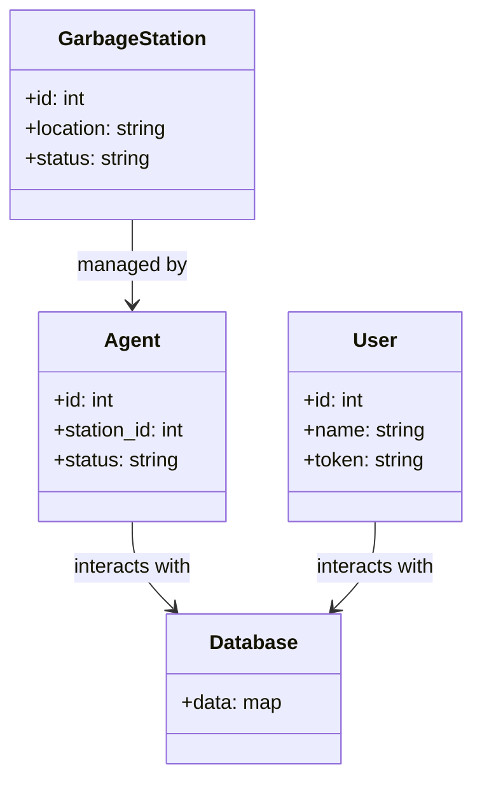
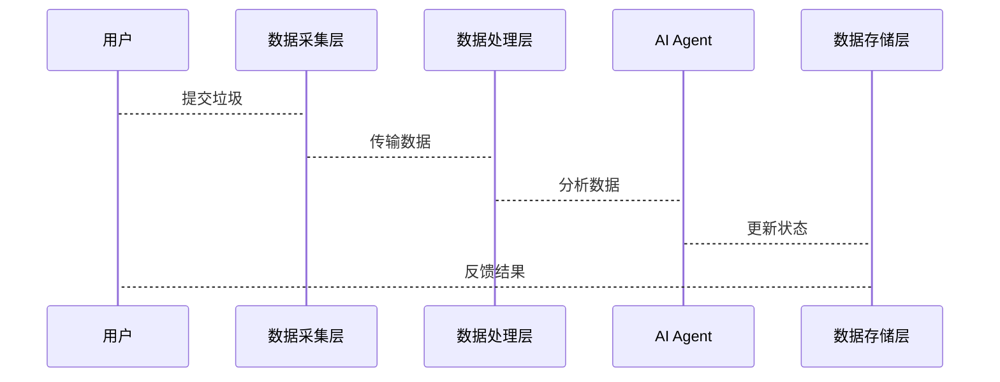

                 


# 智能垃圾站：AI Agent的社区回收管理

---

## 关键词

- 智能垃圾站, AI Agent, 社区回收, 垃圾分类, 路径优化, 系统架构

---

## 摘要

随着城市化进程的加快和环保意识的增强，社区垃圾管理面临着效率低下、资源浪费和环境污染等多重挑战。传统的垃圾回收方式已难以满足现代城市的需求，而人工智能（AI）技术的快速发展为解决这一问题提供了新的可能性。本文探讨了AI Agent在社区垃圾回收管理中的应用，详细分析了其背景、核心概念、算法原理、系统架构设计以及实际项目实现。通过理论与实践相结合的方式，本文展示了如何利用AI技术优化垃圾管理流程，提高回收效率，减少环境污染，推动可持续发展。

---

## 第一部分：智能垃圾站的背景与问题分析

### 第1章：背景与问题分析

#### 1.1 智能垃圾站的背景

##### 1.1.1 垃圾管理的现状与挑战
- 当前垃圾管理的主要问题：效率低下、资源浪费、环境污染。
- 城市化加速带来的垃圾量激增。
- 环保意识的增强推动垃圾管理方式的创新。

##### 1.1.2 AI技术在垃圾管理中的应用潜力
- AI技术在垃圾分类、路径优化和资源化管理中的应用。
- AI Agent在智能垃圾站中的角色与作用。

##### 1.1.3 社区垃圾回收的痛点与需求
- 社区垃圾回收的低效问题。
- 用户对智能化、便捷化垃圾管理的需求。

#### 1.2 问题背景与描述

##### 1.2.1 当前垃圾回收效率低下的问题
- 传统垃圾回收模式的低效性。
- 人工成本高，资源浪费严重。

##### 1.2.2 资源浪费与环境污染的双重挑战
- 不当处理导致的环境污染。
- 资源浪费对可持续发展的负面影响。

##### 1.2.3 智能化垃圾管理的必要性
- 提高垃圾回收效率。
- 降低环境污染，推动绿色可持续发展。

#### 1.3 问题解决与边界

##### 1.3.1 AI Agent在垃圾管理中的解决方案
- AI Agent如何优化垃圾收集路径。
- AI Agent在垃圾分类与识别中的应用。

##### 1.3.2 智能垃圾站的功能边界
- 收集、分类、存储和处理功能。
- 系统的扩展性和灵活性。

##### 1.3.3 系统的外延与扩展性
- 系统与其他社区管理系统的接口。
- 系统的可扩展性和适应性。

#### 1.4 核心概念与结构

##### 1.4.1 智能垃圾站的核心要素
- AI Agent、传感器、数据库、用户交互界面。

##### 1.4.2 AI Agent的角色与功能
- 数据采集与分析。
- 路径优化与决策支持。
- 垃圾分类与识别。

##### 1.4.3 系统架构的核心组成
- 数据采集层、数据处理层、用户交互层。

---

## 第二部分：AI Agent的核心概念与原理

### 第2章：AI Agent的核心概念与原理

#### 2.1 AI Agent的定义与类型

##### 2.1.1 AI Agent的定义
- AI Agent的定义与特征。
- AI Agent与传统自动化的区别。

##### 2.1.2 基于AI的智能体类型
- 分析型AI Agent和执行型AI Agent。
- 智能体的分类与应用场景。

##### 2.1.3 AI Agent与传统自动化的对比
- AI Agent的自主性和适应性。
- 传统自动化系统的局限性。

#### 2.2 AI Agent的工作原理

##### 2.2.1 感知与决策机制
- 数据采集与分析。
- 智能决策算法。

##### 2.2.2 行为执行与反馈
- 系统输出与执行。
- 反馈机制与自我优化。

##### 2.2.3 自适应学习能力
- 机器学习在AI Agent中的应用。
- 模型优化与持续改进。

#### 2.3 AI Agent在垃圾管理中的应用

##### 2.3.1 垃圾分类与识别
- 图像识别技术在垃圾分类中的应用。
- AI Agent如何优化分类效率。

##### 2.3.2 收集路径优化
- AI Agent如何规划最优路径。
- 算法优化与效率提升。

##### 2.3.3 废弃物资源化管理
- AI Agent在资源化管理中的作用。
- 资源利用的优化策略。

---

## 第三部分：算法原理与实现

### 第3章：算法原理与实现

#### 3.1 路径规划算法

##### 3.1.1 Dijkstra算法的原理
- Dijkstra算法的基本原理。
- 算法实现的数学模型。

##### 3.1.2 A*算法的优化
- A*算法的优化策略。
- 算法实现的流程图。

##### 3.1.3 算法实现的数学模型
- Dijkstra算法的数学公式：
  $$
  \text{distance}(u, v) = \min_{w} (\text{distance}(u, w) + \text{cost}(w, v))
  $$
- A*算法的优化公式：
  $$
  f(n) = g(n) + h(n)
  $$

##### 3.1.4 代码实现与分析
```python
import heapq

def dijkstra(graph, start, end):
    distances = {node: float('infinity') for node in graph}
    distances[start] = 0
    heap = []
    heapq.heappush(heap, (0, start))
    
    while heap:
        current_dist, current_node = heapq.heappop(heap)
        if current_node == end:
            break
        for neighbor, weight in graph[current_node].items():
            if distances[neighbor] > current_dist + weight:
                distances[neighbor] = current_dist + weight
                heapq.heappush(heap, (distances[neighbor], neighbor))
    return distances[end]
```

#### 3.2 垃圾分类算法

##### 3.2.1 基于K-means的垃圾分类
- K-means算法的基本原理。
- 算法实现的流程图。

##### 3.2.2 分类算法的优化
- K-means算法的优化策略。
- 分类准确率的提升方法。

##### 3.2.3 代码实现与分析
```python
from sklearn.cluster import KMeans
import numpy as np

def classify_garbage(images, n_clusters=5):
    features = extract_features(images)  # 提取图像特征
    kmeans = KMeans(n_clusters=n_clusters, random_state=0)
    kmeans.fit(features)
    return kmeans.predict(features)
```

---

## 第四部分：系统架构设计

### 第4章：系统架构设计

#### 4.1 系统整体架构

##### 4.1.1 问题场景介绍
- 智能垃圾站的功能需求。
- 系统架构的核心目标。

##### 4.1.2 系统功能设计
- 数据采集模块、数据处理模块、用户交互模块。

##### 4.1.3 系统架构的 mermaid 类图


##### 4.1.4 系统架构的 mermaid 架构图


#### 4.2 系统接口设计

##### 4.2.1 接口设计说明
- 数据接口、控制接口、用户接口。

##### 4.2.2 接口实现与交互
- HTTP接口设计与实现。
- 接口文档与测试。

#### 4.3 系统交互设计

##### 4.3.1 交互流程图


---

## 第五部分：项目实战

### 第5章：项目实战

#### 5.1 环境搭建

##### 5.1.1 开发环境配置
- Python版本要求：3.8及以上。
- 依赖库安装：numpy, scikit-learn, mermaid, etc.

##### 5.1.2 系统安装与配置
- 数据库选择与配置：MySQL或MongoDB。
- API接口配置：Flask或Django框架。

#### 5.2 系统核心实现

##### 5.2.1 数据采集模块
- 传感器数据采集与处理。
- 数据预处理与清洗。

##### 5.2.2 数据处理模块
- 路径优化算法实现。
- 垃圾分类模型训练与部署。

##### 5.2.3 用户交互模块
- Web界面设计与实现。
- 移动端App功能开发。

#### 5.3 代码实现与解读

##### 5.3.1 数据采集模块代码
```python
import serial

def read_sensor_data(port, baudrate):
    ser = serial.Serial(port, baudrate)
    data = ser.readline().decode()
    ser.close()
    return data
```

##### 5.3.2 数据处理模块代码
```python
from sklearn.cluster import KMeans

def classify(images, n_clusters):
    features = extract_features(images)
    model = KMeans(n_clusters=n_clusters)
    model.fit(features)
    return model.predict(features)
```

#### 5.4 实际案例分析

##### 5.4.1 案例背景介绍
- 某社区垃圾站的智能化改造。

##### 5.4.2 优化效果对比
- 传统模式与AI模式下的效率对比。
- 成本节省与环境效益分析。

##### 5.4.3 项目小结
- 项目实施的关键点。
- 成功经验总结与不足。

---

## 第六部分：最佳实践与总结

### 第6章：最佳实践与总结

#### 6.1 最佳实践

##### 6.1.1 系统设计中的注意事项
- 模块化设计的重要性。
- 系统扩展性和维护性的优化。

##### 6.1.2 项目实施中的关键点
- 数据质量的重要性。
- 模型优化与调参。

##### 6.1.3 系统维护与更新
- 定期系统检查与维护。
- 模型的持续优化与更新。

#### 6.2 小结

##### 6.2.1 项目总结
- 项目的整体实施情况。
- 达到的效果与目标。

##### 6.2.2 成功经验总结
- 成功的关键因素。
- 可复制的实施经验。

#### 6.3 注意事项

##### 6.3.1 系统安全与隐私保护
- 数据安全的重要性。
- 用户隐私的保护措施。

##### 6.3.2 系统稳定性的保障
- 系统容错与冗余设计。
- 应急预案的制定。

#### 6.4 拓展阅读

##### 6.4.1 AI在其他领域的应用
- AI在交通、医疗等领域的应用。

##### 6.4.2 垃圾管理的未来趋势
- 智能垃圾管理的未来发展。
- 可持续发展目标的实现路径。

---

## 参考文献

- 人工智能技术在垃圾管理中的应用研究。
- 相关算法与系统架构设计的经典论文。
- 开源项目与技术博客的参考资料。

---

## 附录

- 系统设计文档。
- 代码实现的详细注释。
- 系统测试报告。

---

通过以上目录结构，我们可以系统地探讨智能垃圾站中AI Agent的应用，从理论到实践，全面分析其在社区回收管理中的潜力与实现方式，为未来的可持续发展提供参考与指导。

