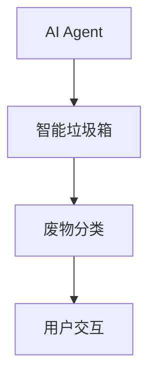
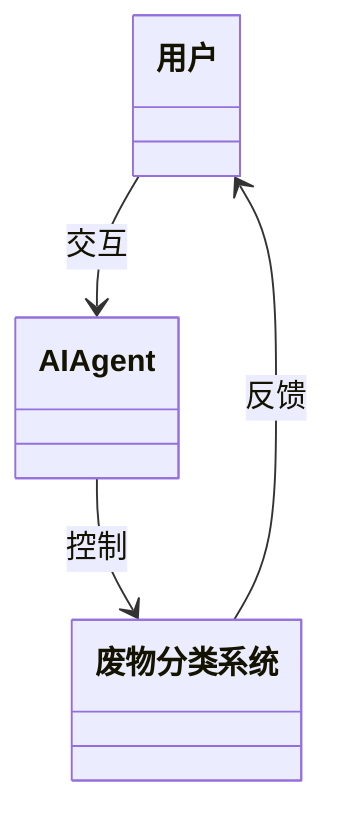
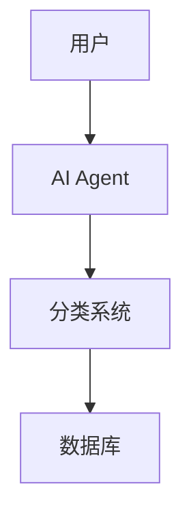

                 


# 智能垃圾箱：AI Agent的废物分类指导

> 关键词：AI Agent, 废物分类, 智能垃圾箱, 算法原理, 系统架构, 项目实战

> 摘要：本文将深入探讨AI Agent在智能垃圾箱中的应用，详细讲解废物分类的背景、核心概念、算法原理、系统架构设计以及实际项目实现。通过逐步分析和详细的技术指导，帮助读者理解如何利用AI技术优化废物分类流程。

---

# 第1章: 智能垃圾箱与AI Agent的背景介绍

## 1.1 问题背景与描述

### 1.1.1 废物分类的重要性
随着城市化进程的加快，垃圾量急剧增加，废物分类成为环保的重要环节。有效的废物分类可以减少环境污染，提高资源利用率，降低垃圾处理成本。

### 1.1.2 当前废物分类的痛点
传统的人工分类效率低、误差高，且工作环境恶劣。现有的自动化分类系统依赖固定规则，难以应对复杂多变的垃圾类型。

### 1.1.3 AI Agent在废物分类中的应用价值
AI Agent能够通过机器学习和视觉识别技术，实现智能分类，提高分类准确率和效率。

## 1.2 问题解决与边界

### 1.2.1 AI Agent如何解决废物分类问题
AI Agent能够实时分析垃圾图像，识别种类，并指导分类操作，实现高效、智能的分类。

### 1.2.2 废物分类的边界与外延
本方案专注于可回收物和厨余垃圾的分类，不涉及危险废物和其他特殊垃圾。

### 1.2.3 AI Agent的局限性与适用场景
AI Agent依赖于数据质量和模型训练，对新型垃圾类型识别能力有限。

## 1.3 智能垃圾箱的概念结构

### 1.3.1 核心要素组成
- 摄像头：采集垃圾图像
- AI Agent：处理图像，识别垃圾类型
- 分类装置：执行分类操作

### 1.3.2 系统架构概述
- 用户交互界面
- 数据采集模块
- 分类决策模块
- 执行机构

### 1.3.3 功能模块划分
- 图像采集
- 数据处理
- 分类决策
- 用户反馈

---

# 第2章: AI Agent的核心概念与联系

## 2.1 核心概念原理

### 2.1.1 AI Agent的基本定义
AI Agent是一种智能实体，能够感知环境并执行任务，具备自主决策能力。

### 2.1.2 AI Agent的分类与特点
- 按智能级别：简单反射型、基于模型的反应型、目标驱动型
- 特点：自主性、反应性、学习能力

### 2.1.3 AI Agent与智能垃圾箱的结合
AI Agent作为智能垃圾箱的核心，负责数据处理和分类决策。

## 2.2 概念属性特征对比

| 概念       | 描述                                                     |
|------------|----------------------------------------------------------|
| AI Agent   | 具备自主决策和学习能力                                   |
| 智能垃圾箱 | 集成AI Agent，实现智能分类                               |

### 2.2.1 ER图架构


---

# 第3章: AI Agent的算法原理与数学模型

## 3.1 算法原理讲解

### 3.1.1 AI Agent的基本算法流程
1. 数据采集
2. 图像预处理
3. 特征提取
4. 分类决策
5. 执行操作

### 3.1.2 垃圾分类的核心算法
- 使用卷积神经网络（CNN）进行图像分类
- 采用交叉熵损失函数优化模型

## 3.2 数学模型与公式

### 3.2.1 分类算法的数学表达
$$ P(y|x) = \frac{P(x|y)P(y)}{P(x)} $$

### 3.2.2 模型训练的优化公式
$$ \theta = \theta - \eta \frac{\partial L}{\partial \theta} $$

---

# 第4章: 智能垃圾箱的系统分析与架构设计

## 4.1 系统功能设计

### 4.1.1 领域模型


## 4.2 系统架构设计

### 4.2.1 系统架构图


---

# 第5章: 项目实战

## 5.1 环境安装

### 5.1.1 安装Python和相关库
```bash
pip install numpy tensorflow keras
```

## 5.2 核心代码实现

### 5.2.1 图像分类模型代码
```python
import tensorflow as tf
from tensorflow.keras import layers

model = tf.keras.Sequential([
    layers.Conv2D(32, (3,3), activation='relu', input_shape=(128,128,3)),
    layers.MaxPooling2D(),
    layers.Flatten(),
    layers.Dense(128, activation='relu'),
    layers.Dense(10, activation='softmax')
])
```

## 5.3 实际案例分析

### 5.3.1 案例分析
用户上传一张瓶子图片，AI Agent识别并指导分类到可回收物。

---

# 第6章: 最佳实践与小结

## 6.1 最佳实践 tips
- 数据质量直接影响分类准确率
- 定期更新模型以应对新垃圾类型

## 6.2 小结
本文详细介绍了AI Agent在智能垃圾箱中的应用，从理论到实践，全面解析了实现过程。

## 6.3 注意事项
- 确保数据多样性和代表性
- 定期维护和更新模型

## 6.4 拓展阅读
推荐阅读《深度学习实战》和《AI系统设计》。

---

通过以上内容，读者可以全面理解AI Agent在智能垃圾箱中的应用，从理论到实践，逐步掌握实现方法。

