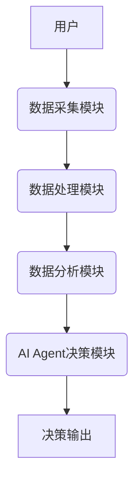
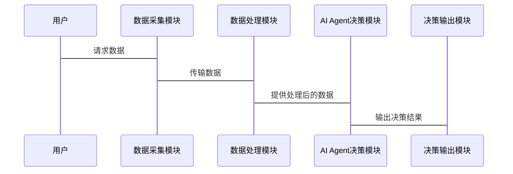

                 


# 智能城市规划中的AI Agent决策支持

> 关键词：智能城市，AI Agent，决策支持，城市规划，多智能体协作

> 摘要：  
随着城市化进程的加快，智能城市规划成为解决城市问题的重要手段。AI Agent（人工智能代理）作为一种智能化的决策支持工具，正在逐步应用于城市规划的各个领域。本文将从AI Agent的基本概念、核心原理、在智能城市规划中的具体应用，以及实际项目案例等方面展开讨论，详细分析AI Agent在智能城市决策支持中的潜力和实现路径。

---

# 第一部分: 智能城市规划中的AI Agent决策支持概述

# 第1章: 智能城市与AI Agent概述

## 1.1 智能城市的基本概念

### 1.1.1 从传统城市规划到智能城市规划的演进

传统的城市规划主要依赖人工分析和经验判断，存在效率低、决策周期长、难以应对复杂动态问题等局限性。随着大数据、人工智能（AI）和物联网（IoT）等技术的发展，智能城市规划应运而生。智能城市规划通过整合城市数据，利用AI技术进行建模、分析和优化，从而实现更高效、更精准的城市管理。

### 1.1.2 智能城市的定义与核心特征

智能城市是指通过数字化技术整合城市资源（如交通、能源、环境、公共安全等），利用数据驱动的决策支持系统，实现城市运行的智能化、高效化和可持续化。其核心特征包括：

1. **数据驱动**：依赖实时数据进行决策。
2. **智能化**：利用AI技术实现自动化分析和优化。
3. **协同性**：多部门、多系统协同工作。
4. **动态适应性**：能够根据变化的环境动态调整决策。

### 1.1.3 智能城市规划的目标与挑战

智能城市规划的目标是优化资源配置、提升居民生活质量、降低城市运行成本。然而，智能城市规划面临以下挑战：

1. **数据孤岛**：各部门数据分散，难以整合。
2. **复杂性**：城市系统高度复杂，涉及多个领域。
3. **实时性**：需要快速响应城市运行中的突发问题。

---

## 1.2 AI Agent的基本概念

### 1.2.1 AI Agent的定义

AI Agent（人工智能代理）是一种能够感知环境、自主决策并执行任务的智能体。它可以理解为一个软件或实体，通过与环境交互，实现特定目标。

### 1.2.2 AI Agent的核心属性与特征

AI Agent具有以下核心属性：

1. **自主性**：能够自主决策，无需外部干预。
2. **反应性**：能够实时感知环境并做出反应。
3. **目标导向性**：具有明确的目标，并为实现目标而行动。
4. **学习能力**：能够通过经验或数据优化自身行为。

### 1.2.3 AI Agent与智能城市规划的联系

AI Agent可以作为智能城市规划中的决策支持工具，帮助城市管理者优化资源配置、预测趋势、制定策略。例如：

- **交通管理**：通过AI Agent实时优化交通流量。
- **环境监测**：通过AI Agent预测空气污染趋势。
- **公共安全**：通过AI Agent进行应急响应决策。

---

## 1.3 AI Agent在智能城市规划中的应用前景

### 1.3.1 AI Agent在城市决策支持中的潜力

AI Agent能够通过大数据分析和机器学习技术，提供更精准的决策支持。例如：

- **城市扩展预测**：通过AI Agent预测城市人口增长，优化土地利用。
- **资源分配优化**：通过AI Agent优化能源、水资源的分配。

### 1.3.2 智能城市规划中的典型应用场景

以下是AI Agent在智能城市规划中的几个典型应用场景：

1. **交通管理**：通过AI Agent实时优化交通信号灯配置，减少交通拥堵。
2. **环境监测与保护**：通过AI Agent预测空气污染趋势，制定减排策略。
3. **公共安全**：通过AI Agent进行火灾、地震等突发事件的应急响应决策。

### 1.3.3 AI Agent技术发展的趋势与挑战

AI Agent技术在智能城市中的应用前景广阔，但也面临一些挑战，例如：

1. **数据隐私问题**：如何保护市民数据隐私？
2. **多智能体协作**：如何实现多个AI Agent的高效协作？
3. **技术标准化**：如何建立统一的技术标准？

---

## 1.4 本章小结

本章介绍了智能城市的基本概念、AI Agent的核心属性，以及AI Agent在智能城市规划中的应用前景。通过分析，我们可以看到AI Agent作为智能化的决策支持工具，在智能城市规划中具有巨大的潜力。

---

# 第二部分: AI Agent的核心原理与城市规划中的应用

# 第2章: AI Agent的核心原理

## 2.1 AI Agent的基本原理

### 2.1.1 感知与数据获取机制

AI Agent需要通过传感器、数据库等途径获取环境数据。例如，在交通管理中，AI Agent可以通过交通摄像头、GPS等设备获取实时交通数据。

### 2.1.2 知识表示与推理逻辑

AI Agent需要将获取的数据转化为知识，并通过推理逻辑进行分析。例如，可以通过逻辑推理预测交通拥堵的可能性。

### 2.1.3 决策与行动机制

AI Agent根据推理结果制定决策，并通过执行器（如交通信号灯控制器）执行动作。

---

## 2.2 AI Agent的分类与特点

### 2.2.1 基于规则的AI Agent

基于规则的AI Agent通过预定义的规则进行决策。例如，在简单的交通管理系统中，可以设置规则：“如果某一路段连续3分钟没有车辆通行，则绿灯延长10秒”。

### 2.2.2 基于机器学习的AI Agent

基于机器学习的AI Agent能够通过数据训练模型，并根据模型进行决策。例如，可以通过训练交通流量预测模型，优化交通信号灯配置。

### 2.2.3 基于强化学习的AI Agent

基于强化学习的AI Agent通过与环境交互，不断优化决策策略。例如，可以通过强化学习训练AI Agent，在复杂的城市交通环境中动态调整信号灯配置。

---

## 2.3 AI Agent的协作与通信机制

### 2.3.1 多智能体协作的基本原理

在智能城市中，通常需要多个AI Agent协作完成任务。例如，在城市交通管理中，可能需要多个AI Agent协作优化整个城市的交通流量。

### 2.3.2 智能体之间的通信协议

AI Agent之间的通信需要遵循特定的协议。例如，可以使用通信协议进行数据交换、指令传递等。

### 2.3.3 协作决策与任务分配

在多智能体协作中，需要通过任务分配算法（如基于角色分配的算法）实现协作决策。

---

## 2.4 本章小结

本章详细介绍了AI Agent的核心原理，包括感知、推理、决策与行动机制，以及多智能体协作的基本原理。这些内容为后续章节在智能城市规划中的应用奠定了理论基础。

---

# 第三部分: 智能城市规划中的关键问题与AI Agent解决方案

# 第3章: 智能城市规划中的关键问题

## 3.1 城市交通规划中的问题

### 3.1.1 交通流量预测与优化

交通流量预测是城市交通规划的重要环节。AI Agent可以通过机器学习模型（如LSTM）进行交通流量预测，并优化交通信号灯配置。

### 3.1.2 智能交通系统的构建

智能交通系统（ITS）通过整合交通数据，实现交通管理的智能化。AI Agent在其中起到核心作用，例如通过实时数据分析优化交通流量。

### 3.1.3 AI Agent在交通管理中的应用

通过AI Agent可以实现交通信号灯的智能控制、交通事故预警等功能。

---

## 3.2 城市环境与能源管理中的问题

### 3.2.1 环境监测与污染控制

AI Agent可以通过环境传感器实时监测空气质量，并预测污染趋势，制定减排策略。

### 3.2.2 可再生能源的优化配置

通过AI Agent优化可再生能源的分配，例如智能分配风能和太阳能的使用。

### 3.2.3 AI Agent在能源管理中的应用

通过AI Agent实现能源消耗预测、优化能源分配等功能。

---

## 3.3 城市公共安全与应急响应中的问题

### 3.3.1 公共安全事件的预测与预防

通过AI Agent预测公共安全事件（如火灾、恐怖袭击）的可能性，并制定预防措施。

### 3.3.2 应急响应的智能化决策

在突发事件发生后，AI Agent可以通过实时数据分析优化应急响应策略，例如优化救援资源的分配。

---

## 3.4 本章小结

本章分析了智能城市规划中的关键问题，包括城市交通、环境与能源管理、公共安全等，并介绍了AI Agent在这些问题中的具体应用。

---

# 第四部分: 智能城市规划中的AI Agent决策支持系统设计

# 第4章: AI Agent在智能城市规划中的系统设计

## 4.1 系统功能设计

### 4.1.1 数据采集与处理

AI Agent需要通过传感器、数据库等途径获取城市运行数据，并进行预处理。

### 4.1.2 数据分析与建模

通过机器学习算法对数据进行建模，例如使用支持向量机（SVM）进行分类任务。

### 4.1.3 决策支持与优化

根据建模结果，AI Agent生成决策建议，并优化决策方案。

---

## 4.2 系统架构设计

### 4.2.1 系统架构图

以下是AI Agent决策支持系统的架构图：



### 4.2.2 接口设计

系统需要设计接口实现数据采集、数据处理、决策支持等功能的模块化。

---

## 4.3 系统交互设计

### 4.3.1 系统交互流程图

以下是系统交互流程图：



---

## 4.4 本章小结

本章从系统设计的角度，详细介绍了AI Agent在智能城市规划中的功能设计、架构设计和交互设计。

---

# 第五部分: 智能城市规划中的AI Agent决策支持系统实现

# 第5章: AI Agent决策支持系统的实现

## 5.1 环境安装与配置

### 5.1.1 安装Python环境

需要安装Python 3.8或更高版本，并安装以下库：

```bash
pip install numpy pandas scikit-learn matplotlib
```

### 5.1.2 安装AI Agent框架

可以选择使用现有的AI框架，例如TensorFlow或PyTorch。

---

## 5.2 核心代码实现

### 5.2.1 数据采集模块

```python
import pandas as pd
import requests

# 从API获取交通数据
def get_traffic_data():
    response = requests.get('http://api.traffic.com/data')
    return response.json()
```

### 5.2.2 数据处理模块

```python
import pandas as pd

def preprocess_data(data):
    df = pd.DataFrame(data)
    # 删除缺失值
    df.dropna(inplace=True)
    return df
```

### 5.2.3 数据分析与建模

```python
from sklearn.model

