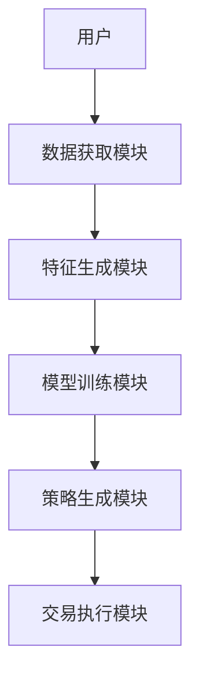
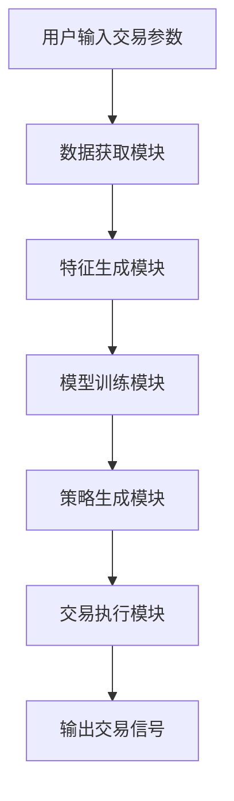
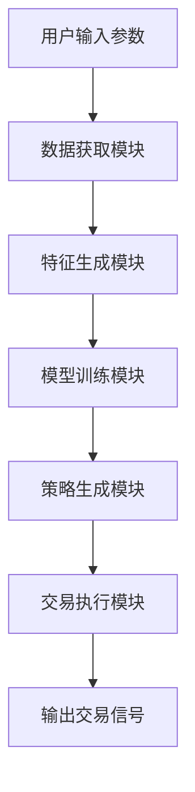

                 


# 智能外汇交易策略生成器

## 关键词：智能外汇交易，策略生成器，人工智能，机器学习，深度学习

## 摘要：  
智能外汇交易策略生成器是一种结合人工智能技术的工具，用于自动生成和优化外汇交易策略。本文将详细探讨其背景、核心概念、算法原理、系统架构设计以及实际项目实现，帮助读者全面理解智能外汇交易策略生成器的开发与应用。

---

## 第一部分: 智能外汇交易策略生成器的背景与目标

### 第1章: 智能外汇交易策略生成器的背景与目标

#### 1.1 外汇交易的背景与现状
##### 1.1.1 外汇交易的基本概念
外汇交易是指在国际外汇市场中，投资者通过买卖不同货币对（如 EUR/USD、GBP/USD 等）来赚取利润的活动。外汇市场是全球最大的金融市场，24 小时不间断运行，市场规模庞大，参与者包括个人投资者、机构、银行等。

##### 1.1.2 传统外汇交易的挑战
传统的外汇交易依赖于人类交易员的经验和直觉，但这种方式存在以下问题：
- **情绪化决策**：交易员容易受到情绪影响，导致错误决策。
- **信息处理能力有限**：市场数据复杂且海量，人类难以在短时间内处理所有信息。
- **交易机会错失**：由于反应速度有限，交易员可能错过最佳交易时机。

##### 1.1.3 AI技术在外汇交易中的应用前景
人工智能（AI）和机器学习（ML）技术的快速发展为外汇交易带来了新的可能性。通过分析历史数据、市场情绪、经济指标等，AI 可以帮助交易员发现潜在的交易机会，优化交易策略，并实现自动化交易。

#### 1.2 智能交易策略生成器的核心目标
##### 1.2.1 提高交易效率
通过自动化分析和生成交易策略，智能外汇交易策略生成器可以显著提高交易效率，减少人工操作的时间成本。

##### 1.2.2 降低人为错误
AI 技术可以消除人为情绪和判断错误的影响，从而降低交易中的错误率。

##### 1.2.3 实现自动化决策
智能策略生成器可以实时监控市场动态，自动调整策略，从而实现快速、精准的交易决策。

#### 1.3 本章小结
本章介绍了外汇交易的基本概念、传统交易的挑战以及 AI 技术在外汇交易中的应用前景。智能外汇交易策略生成器的核心目标是通过自动化和智能化的方式，提高交易效率、降低错误率并实现自动化决策。

---

## 第二部分: 智能外汇交易策略生成器的核心概念与联系

### 第2章: 核心概念与系统架构

#### 2.1 智能外汇交易策略生成器的核心概念
##### 2.1.1 数据源与特征提取
智能外汇交易策略生成器的数据源包括：
- **历史汇率数据**：如 EUR/USD、GBP/USD 等货币对的开盘价、收盘价、最高价和最低价。
- **市场情绪指标**：如 VIX 指数、新闻情绪分析结果等。
- **经济指标**：如 GDP 增长率、失业率、消费者价格指数（CPI）等。

特征提取是将这些数据转化为模型可以处理的特征，例如移动平均线（MA）、相对强弱指数（RSI）、布林带（Bollinger Bands）等。

##### 2.1.2 策略生成算法
策略生成算法是智能外汇交易策略生成器的核心部分，常用的算法包括：
- **强化学习（Reinforcement Learning）**：通过模拟交易环境，学习最优交易策略。
- **遗传算法（Genetic Algorithm）**：通过模拟自然选择，优化交易策略的参数。
- **神经网络（Neural Networks）**：通过深度学习模型预测市场走势。

##### 2.1.3 风险管理模型
风险管理模型用于控制交易风险，包括：
- **止损策略**：设定最大损失容忍度，避免大幅亏损。
- **头寸大小**：根据账户资金和市场波动性，确定每笔交易的头寸大小。
- **风险分散**：通过多种货币对和时间周期进行分散投资，降低整体风险。

#### 2.2 核心概念对比分析
##### 2.2.1 传统机器学习与深度学习对比
| 对比维度       | 传统机器学习                 | 深度学习                 |
|----------------|------------------------------|--------------------------|
| 数据需求       | 数据量较小，依赖特征工程     | 数据量大，自动提取特征     |
| 模型复杂度     | 模型简单，易于解释           | 模型复杂，难于解释         |
| 性能表现       | 在特征工程良好的情况下表现优秀 | 在大数据情况下表现更优     |

##### 2.2.2 不同特征工程方法的优劣势
| 特征工程方法     | 优劣势                       |
|------------------|----------------------------|
| 基本统计特征（如MA、RSI） | 实现简单，但可能遗漏复杂模式 |
| 高阶统计特征     | 更精确，但计算复杂性增加     |
| 专家规则         | 易受主观因素影响，可能不够灵活 |

##### 2.2.3 策略生成器的性能评估指标
| 评估指标         | 定义                         | 计算公式                 |
|------------------|------------------------------|--------------------------|
| 准确率           | 正确预测的比例               | $\text{准确率} = \frac{\text{正确预测数}}{\text{总预测数}}$ |
| 回撤率           | 最大回撤幅度                 | $-\text{最大利润回撤}$     |
| 夏普比率         | 风险调整后的超额收益         | $\text{夏普比率} = \frac{\text{超额收益}}{\text{收益标准差}}$ |

#### 2.3 系统架构设计
##### 2.3.1 数据流与系统模块划分
系统模块包括：
- **数据获取模块**：从数据源获取历史和实时数据。
- **特征生成模块**：将原始数据转化为模型可处理的特征。
- **模型训练模块**：训练机器学习模型，生成交易策略。
- **策略生成模块**：根据模型输出生成具体的交易信号。

##### 2.3.2 系统实体关系图


##### 2.3.3 系统交互流程图


---

## 第三部分: 策略生成器的算法原理

### 第3章: 基于强化学习的策略生成算法

#### 3.1 强化学习在外汇交易中的应用
##### 3.1.1 Q-Learning算法原理
Q-Learning 是一种经典的强化学习算法，其核心思想是通过试错学习，找到最优策略。算法步骤如下：
1. 初始化 Q 表，所有状态-动作对的初始值为 0。
2. 在每个时间步，选择当前状态下的动作。
3. 执行动作，观察下一个状态，并获得奖励。
4. 更新 Q 表：$$ Q(s, a) = Q(s, a) + \alpha \cdot (r + \gamma \cdot \max_{a'} Q(s', a') - Q(s, a)) $$
   其中，$\alpha$ 是学习率，$\gamma$ 是折扣因子。

##### 3.1.2 策略生成的数学模型
在外汇交易场景中，状态 $s$ 可以定义为当前市场数据（如汇率、技术指标等），动作 $a$ 是买入、卖出或持有。奖励 $r$ 可以定义为交易的收益或损失。

##### 3.1.3 算法实现步骤
```python
import numpy as np

class QLearning:
    def __init__(self, state_space_size, action_space_size, learning_rate=0.1, gamma=0.9):
        self.state_space_size = state_space_size
        self.action_space_size = action_space_size
        self.learning_rate = learning_rate
        self.gamma = gamma
        self.q_table = np.zeros((state_space_size, action_space_size))
    
    def choose_action(self, state, epsilon=0.1):
        if np.random.random() < epsilon:
            return np.random.randint(self.action_space_size)
        else:
            return np.argmax(self.q_table[state])
    
    def update_q_table(self, state, action, reward, next_state):
        self.q_table[state, action] += self.learning_rate * (reward + self.gamma * np.max(self.q_table[next_state]) - self.q_table[state, action])
```

#### 3.2 算法实现细节
##### 3.2.1 状态空间定义
状态空间可以定义为多个技术指标的组合，例如：
- 移动平均线（MA）
- 相对强弱指数（RSI）
- 布林带宽度（Bollinger Bands）

##### 3.2.2 动作空间设计
动作空间包括买入、卖出和持有三种动作。

##### 3.2.3 奖励函数设计
奖励函数可以定义为交易的收益，例如：
$$ r = \text{收盘价}_{t+1} - \text{收盘价}_t $$

#### 3.3 算法优化与改进
##### 3.3.1 策略网络的优化
通过引入深度神经网络（DNN）替代传统的 Q 表，可以提高算法的表达能力和泛化能力。

##### 3.3.2 算法收敛性分析
通过调整学习率 $\alpha$ 和折扣因子 $\gamma$，可以控制算法的收敛速度和稳定性。

##### 3.3.3 算法的鲁棒性测试
通过在不同市场条件下测试算法的性能，验证其稳定性和收益能力。

---

## 第四部分: 系统分析与架构设计

### 第4章: 系统分析与架构设计方案

#### 4.1 问题场景分析
##### 4.1.1 高频交易场景
高频交易需要系统具备极高的处理速度和响应能力，这对算法和架构提出了更高的要求。

##### 4.1.2 风险管理场景
风险管理是智能外汇交易策略生成器的核心功能之一，需要实时监控和调整交易头寸。

##### 4.1.3 策略优化场景
策略优化需要不断测试和调整模型参数，以适应市场变化。

#### 4.2 系统功能设计
##### 4.2.1 数据处理模块
- 数据清洗：处理缺失值和异常值。
- 数据转换：将原始数据转换为适合模型输入的格式。

##### 4.2.2 特征生成模块
- 技术指标计算：计算 MA、RSI 等技术指标。
- 市场情绪分析：基于新闻和社交媒体数据生成情绪指标。

##### 4.2.3 策略训练模块
- 模型训练：使用历史数据训练机器学习模型。
- 策略优化：通过回测和模拟交易优化策略参数。

##### 4.2.4 策略生成模块
- 策略输出：生成具体的交易信号，如买入、卖出或持有。
- 策略评估：评估策略的收益和风险指标。

#### 4.3 系统架构设计
##### 4.3.1 分层架构设计
系统采用分层架构，包括数据层、业务逻辑层和表现层。

##### 4.3.2 微服务架构设计
系统采用微服务架构，每个模块独立运行，便于扩展和维护。

##### 4.3.3 系统交互流程设计


---

## 第五部分: 项目实战与实现

### 第5章: 项目实战与实现

#### 5.1 环境安装
需要安装的工具和库包括：
- Python
- TensorFlow/PyTorch（深度学习框架）
- Pandas（数据处理）
- Matplotlib（数据可视化）

#### 5.2 系统核心实现源代码
##### 5.2.1 数据获取模块
```python
import pandas as pd
import requests

def get_exchange_rate(pair, start_date, end_date):
    url = f"https://api.exchangerate-api.com/v3/{start_date}/{end_date}/{pair}"
    response = requests.get(url)
    data = response.json()
    return pd.DataFrame(data['rates'])
```

##### 5.2.2 特征生成模块
```python
def generate_technical_indicators(data):
    # 计算移动平均线
    data['MA_20'] = data['close'].rolling(20).mean()
    # 计算相对强弱指数
    data['RSI'] = data['close'].rolling(14).apply(lambda x: (x[-1] - x[0])/x[0])
    return data
```

##### 5.2.3 模型训练模块
```python
from tensorflow.keras import layers

def build_model(input_shape):
    model = layers.Sequential()
    model.add(layers.Dense(64, activation='relu', input_shape=input_shape))
    model.add(layers.Dense(32, activation='relu'))
    model.add(layers.Dense(1, activation='sigmoid'))
    model.compile(optimizer='adam', loss='binary_crossentropy', metrics=['accuracy'])
    return model
```

##### 5.2.4 策略生成模块
```python
def generate_strategy(data, model):
    X_test = data.drop(columns=['label']).values
    y_pred = model.predict(X_test)
    return y_pred
```

#### 5.3 代码应用解读与分析
通过上述代码，我们可以实现从数据获取、特征生成到模型训练和策略生成的整个流程。数据获取模块负责从 API 获取历史汇率数据，特征生成模块计算技术指标，模型训练模块使用深度学习模型训练策略生成器，最后策略生成模块根据模型输出生成交易信号。

#### 5.4 实际案例分析和详细讲解剖析
以 EUR/USD 货币对为例，假设我们使用过去 30 天的数据训练模型，生成交易策略。模型输出的预测结果可以用于指导实际交易，如当模型预测价格会上涨时，发出买入信号。

#### 5.5 项目小结
通过本章的项目实战，读者可以掌握智能外汇交易策略生成器的实现过程，包括数据处理、特征生成、模型训练和策略生成等步骤。实际案例分析帮助读者更好地理解如何将理论应用于实践。

---

## 第六部分: 总结与展望

### 第6章: 总结与展望

#### 6.1 本章总结
智能外汇交易策略生成器是一种结合人工智能技术的工具，能够自动生成和优化外汇交易策略。本文详细探讨了其背景、核心概念、算法原理、系统架构设计以及实际项目实现。

#### 6.2 未来展望
未来，智能外汇交易策略生成器将朝着以下方向发展：
- **多策略组合**：结合多种算法生成更优策略。
- **实时数据分析**：利用流数据处理技术实时生成交易信号。
- **风险管理优化**：引入更复杂的风险管理模型，降低交易风险。

---

## 附录

### 附录A: 数据源与接口
- **API 接口**：提供数据获取的 API 接口。
- **数据格式**：说明数据的存储格式和字段定义。

### 附录B: 参考文献
- 建议列出相关技术文献和参考资料，供读者进一步学习。

---

通过本文的详细讲解，读者可以全面理解智能外汇交易策略生成器的开发与应用，掌握其核心技术和实现方法。

