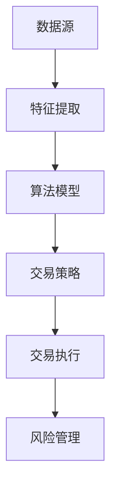
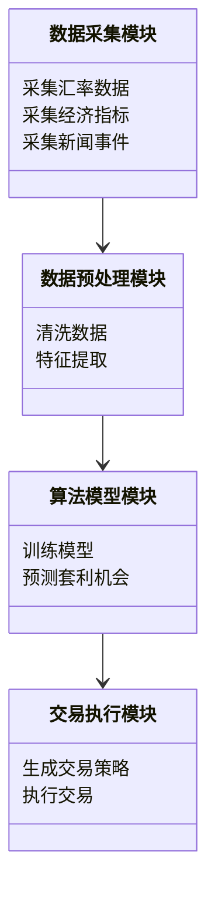
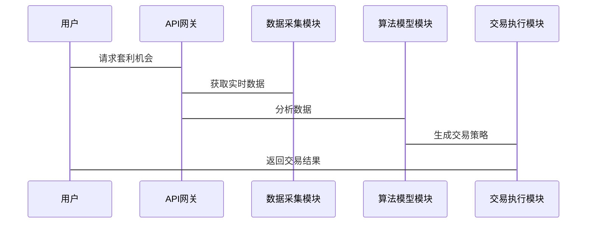

                 


# 智能外汇套利机会识别系统

## 关键词：智能外汇套利，套利机会识别，机器学习，外汇市场，算法交易

## 摘要：本文介绍了一种基于现代技术的智能外汇套利机会识别系统。通过分析外汇市场的复杂性和传统套利方法的局限性，提出了一套结合机器学习和算法交易的解决方案。系统涵盖了数据采集、特征提取、算法模型构建、交易策略生成等关键环节，结合实际案例和代码实现，深入探讨了智能外汇套利的实现方法和应用前景。

---

# 第一部分: 智能外汇套利机会识别系统概述

## 第1章: 外汇套利机会识别的背景与问题

### 1.1 外汇市场的基本运作机制

#### 1.1.1 外汇市场的定义与运作模式

- 外汇市场的定义
- 主要参与者：银行、企业、个人、央行
- 市场类型：即期市场、远期市场、掉期市场
- 市场特点：24小时交易、高流动性、受多种因素影响

#### 1.1.2 套利的基本概念

- 套利的定义
- 套利的基本原理：利用价格差异获利
- 套利的类型：跨市场套利、跨期套利、三角套利等

### 1.2 智能外汇套利识别的背景与问题

#### 1.2.1 当前外汇市场的复杂性

- 全球化带来的市场联动性
- 经济指标、政策变化、突发事件对外汇市场的影响
- 市场深度与流动性的波动

#### 1.2.2 传统套利方法的局限性

- 人工分析的低效性
- 信息获取的延迟性
- 市场变化的快速性
- 交易成本的高企

#### 1.2.3 智能套利系统的需求与目标

- 提高套利机会识别的效率和准确性
- 实现自动化、智能化的交易策略
- 最小化风险，最大化收益

### 1.3 本章小结

- 总结了外汇市场和套利的基本概念
- 分析了传统套利方法的局限性
- 提出了智能外汇套利系统的需求与目标

---

# 第二部分: 智能外汇套利机会识别的核心概念

## 第2章: 智能外汇套利系统的核心概念

### 2.1 数据源与数据类型

#### 2.1.1 常见的数据源

- 汇率数据：即期汇率、远期汇率、交叉汇率
- 经济指标：GDP、通货膨胀率、利率、就业数据
- 新闻事件：政治事件、经济政策变化、市场报告
- 市场情绪数据：基于社交媒体和新闻的情绪分析

#### 2.1.2 数据源的特征对比

| 数据源 | 数据类型 | 描述 | 优缺点 |
|--------|----------|------|--------|
| 汇率数据 | 时间序列 | 市场价格随时间的变化 | 高频率，容易获取 |
| 经济指标 | 数值型 | 宏观经济数据，反映市场趋势 | 低频率，滞后性 |
| 新闻事件 | 文本型 | 影响市场的重要事件 | 需要自然语言处理 |
| 市场情绪 | 情感指标 | 投资者情绪分析 | 不确定性高 |

### 2.2 算法模型与特征提取

#### 2.2.1 算法模型的选择

- 时间序列分析：ARIMA、GARCH、ARCH模型
- 机器学习：随机森林、支持向量机、神经网络
- 自然语言处理：用于分析新闻事件的情绪

#### 2.2.2 特征提取的重要性

- 特征的选择影响模型的准确性和效率
- 多维度特征的融合可以提高模型的预测能力

### 2.3 交易执行与风险管理

#### 2.3.1 自动化交易系统

- 系统化交易策略的实现
- 算法交易的执行机制

#### 2.3.2 风险管理策略

- 风险控制的必要性
- 市场风险、流动性风险、操作风险的管理

### 2.4 核心概念的联系与对比

#### 2.4.1 数据源与算法模型的对比

| 数据源 | 适用算法 | 描述 |
|--------|----------|------|
| 汇率数据 | 时间序列模型 | 适合预测未来汇率 |
| 经济指标 | 机器学习模型 | 适合复杂关系的建模 |
| 新闻事件 | 自然语言处理 | 用于情绪分析和事件驱动交易 |

#### 2.4.2 系统核心要素的ER实体关系图



### 2.5 本章小结

- 介绍了智能外汇套利系统的核心要素
- 分析了数据源的特征和算法模型的选择
- 描述了交易执行和风险管理的重要性

---

# 第三部分: 智能外汇套利机会识别的算法原理

## 第3章: 算法原理与实现

### 3.1 时间序列分析

#### 3.1.1 ARIMA模型

- ARIMA模型的原理
- 算法步骤：数据预处理、参数识别、模型拟合、预测
- 公式表示：$$ARIMA(p, d, q)$$

#### 3.1.2 GARCH模型

- GARCH模型的原理
- 用于估计波动性和风险
- 公式表示：$$GARCH(p, q)$$

### 3.2 机器学习模型

#### 3.2.1 支持向量机（SVM）

- SVM的基本原理
- 用于分类和回归问题
- 优缺点：适用于小数据集，对高维数据处理能力弱

#### 3.2.2 神经网络（RNN、LSTM）

- RNN和LSTM网络的结构
- 适合处理时间序列数据
- 代码示例：

```python
from keras.layers import LSTM, Dense
from keras.models import Sequential

model = Sequential()
model.add(LSTM(64, input_shape=(timesteps, features)))
model.add(Dense(1))
model.compile(loss='mean_squared_error', optimizer='adam')
```

### 3.3 自然语言处理（NLP）

#### 3.3.1 基于词袋模型的新闻事件分析

- 词袋模型的基本原理
- 用于分类新闻事件的情绪
- 代码示例：

```python
from sklearn.feature_extraction.text import TfidfVectorizer

vectorizer = TfidfVectorizer()
X = vectorizer.fit_transform(corpus)
```

### 3.4 本章小结

- 介绍了时间序列分析和机器学习模型的基本原理
- 提供了神经网络和自然语言处理的代码示例
- 强调了算法选择与数据特征的关系

---

# 第四部分: 智能外汇套利机会识别系统的分析与架构设计

## 第4章: 系统分析与架构设计

### 4.1 问题场景介绍

- 外汇市场的复杂性和不确定性
- 交易机会的瞬息万变
- 系统需要实时处理大量数据

### 4.2 系统功能设计

#### 4.2.1 领域模型设计



#### 4.2.2 系统架构设计


### 4.3 接口设计与交互流程

#### 4.3.1 API接口设计

- 数据接口：提供实时数据获取API
- 模型接口：提供套利机会预测API
- 交易接口：提供交易执行API

#### 4.3.2 系统交互流程图



### 4.4 本章小结

- 介绍了系统分析与架构设计的基本思路
- 绘制了领域模型和系统架构图
- 描述了系统接口设计与交互流程

---

# 第五部分: 智能外汇套利机会识别系统的项目实战

## 第5章: 项目实战

### 5.1 环境搭建与数据获取

#### 5.1.1 环境搭建

- 安装必要的Python库：Pandas、NumPy、TensorFlow、Keras、Scikit-learn、NLTK
- 安装依赖：pip install numpy pandas sklearn tensorflow keras nltk

#### 5.1.2 数据获取

- 数据源：Yahoo Finance、Quandl、Twitter API、新闻网站API
- 数据预处理：清洗、转换、标准化

### 5.2 核心代码实现

#### 5.2.1 数据预处理代码

```python
import pandas as pd
import numpy as np

# 示例：加载汇率数据
data = pd.read_csv('exchange_rates.csv')
data['date'] = pd.to_datetime(data['date'])
data.set_index('date', inplace=True)
```

#### 5.2.2 算法模型实现代码

```python
from sklearn.ensemble import RandomForestRegressor
from sklearn.metrics import mean_squared_error

# 示例：训练随机森林模型
model = RandomForestRegressor(n_estimators=100, random_state=42)
model.fit(X_train, y_train)
y_pred = model.predict(X_test)
print(mean_squared_error(y_test, y_pred))
```

#### 5.2.3 交易策略生成代码

```python
from backtrader import Strategy, Indicators

class MyStrategy(Strategy):
    def __init__(self):
        self.add_indicator(Indicators.SMA, period=20)

    def next(self):
        if self indicators crossover:
            self.buy()
        elif self indicators crossover down:
            self.sell()
```

### 5.3 实际案例分析与结果展示

#### 5.3.1 数据分析结果

- 示例分析：利用ARIMA模型预测英镑/美元汇率
- 图表展示：预测值与实际值的对比图

#### 5.3.2 交易策略表现

- 回测结果：策略的收益与风险比
- 绩效指标：夏普比率、最大回撤、年化收益

### 5.4 项目小结

- 总结了项目实施的关键步骤
- 分析了实际案例的实现过程和结果
- 强调了代码实现与数据分析的重要性

---

# 第六部分: 智能外汇套利机会识别系统的最佳实践

## 第6章: 最佳实践与总结

### 6.1 最佳实践

#### 6.1.1 数据源的选择

- 数据的及时性与准确性
- 数据的多样性与相关性

#### 6.1.2 模型的选择与调优

- 模型的适用性与复杂度
- 参数调优与模型评估

#### 6.1.3 风险管理策略

- 交易头寸的控制
- 止损与止盈的设置
- 风险分散与对冲

### 6.2 小结与展望

- 本章总结了智能外汇套利系统的最佳实践
- 展望了未来的研究方向与技术趋势

### 6.3 注意事项

- 市场风险的不可预测性
- 系统运行的稳定性与安全性
- 数据隐私与合规性问题

### 6.4 拓展阅读

- 推荐书籍：《算法交易：机助投资制胜之道》、《机器学习实战》
- 推荐资源：QuantInstinct blog、Quandl数据集、Kaggle相关比赛

### 6.5 本章小结

- 提供了系统实施的最佳实践建议
- 总结了系统的优缺点和适用场景
- 展望了未来的研究方向和应用前景

---

# 结语

智能外汇套利机会识别系统是一项结合了现代技术与金融智慧的创新应用。通过本文的详细介绍，读者可以系统地了解智能外汇套利的核心概念、算法原理、系统架构和项目实战。希望本文能为相关领域的研究者和从业者提供有价值的参考和启示，推动智能外汇套利技术的进一步发展与应用。

---

**感谢您的耐心阅读，期待您的反馈与交流！**

