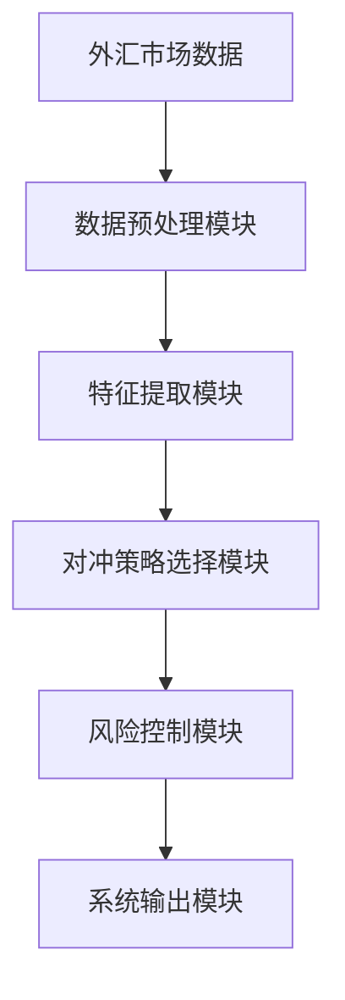
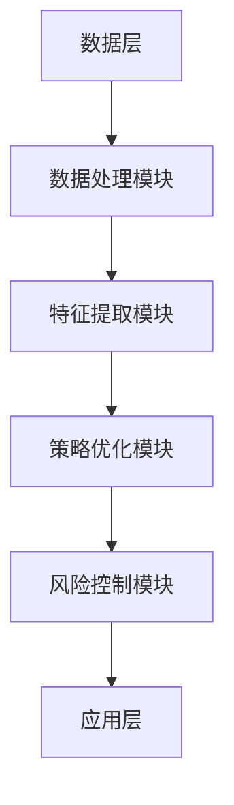

                 


# 智能外汇风险对冲策略优化系统

> 关键词：智能外汇对冲、风险管理、优化算法、系统架构、机器学习

> 摘要：本文探讨了智能外汇风险对冲策略优化系统的核心概念、算法原理、系统架构设计以及实际应用。通过结合金融学与人工智能技术，本文提出了一种基于智能算法的外汇风险对冲优化方法，并详细分析了系统的实现过程和优化策略。文章还通过实际案例展示了该系统的应用效果，并展望了未来的发展方向。

---

## 第一部分: 智能外汇风险对冲策略优化系统概述

### 第1章: 外汇风险对冲的背景与挑战

#### 1.1 外汇风险的基本概念
外汇风险是指由于汇率波动导致的资产价值变化风险。在外币交易中，企业或投资者可能面临汇率波动带来的收益或损失。外汇风险主要分为三类：交易风险、折算风险和经济风险。交易风险是指在不同货币之间的交易可能导致的损失；折算风险是指由于汇率变化导致资产负债表上的价值变化；经济风险则是指由于经济状况变化导致的外汇资产或负债的价值变化。

#### 1.2 智能外汇对冲的背景
传统的外汇对冲方法主要依赖于固定模型和经验判断，存在以下问题：  
1. **模型单一性**：传统模型难以适应复杂多变的外汇市场。  
2. **数据处理能力有限**：传统方法难以处理海量的实时数据。  
3. **人工干预过多**：传统对冲策略需要大量人工操作，效率低下。  

随着人工智能技术的发展，智能外汇对冲逐渐成为趋势。智能算法能够实时分析市场数据，快速调整对冲策略，从而提高对冲效率和准确性。

#### 1.3 智能外汇对冲的需求与趋势
智能外汇对冲的需求主要体现在以下几点：  
1. **实时性**：外汇市场波动频繁，需要实时对冲策略。  
2. **数据驱动**：利用大数据分析技术，提高对冲决策的准确性。  
3. **自动化**：通过智能算法实现自动化的对冲操作，减少人工干预。  

智能外汇对冲的发展趋势包括：深度学习、强化学习、自然语言处理等技术的应用，以及多模型融合优化。

### 第2章: 智能外汇风险对冲的核心概念

#### 2.1 智能对冲系统的基本原理
智能外汇风险对冲系统的基本原理是通过智能算法对市场数据进行分析，生成最优的对冲策略。系统的主要功能模块包括数据采集、数据预处理、特征提取、策略优化和结果输出。

#### 2.2 核心概念与联系
智能外汇对冲系统的核心概念包括：  
1. **外汇市场数据**：包括汇率、成交量、订单簿等数据。  
2. **对冲策略**：通过优化算法生成最优的对冲组合。  
3. **风险控制**：通过风险指标（如VaR、CVaR）对对冲策略进行评估和调整。  

核心概念之间的联系可以通过以下实体关系图表示：



---

## 第二部分: 智能外汇对冲的算法原理

### 第3章: 常见对冲算法概述

#### 3.1 均值-方差优化算法
均值-方差优化是一种经典的资产配置方法，旨在在给定风险水平下最大化收益，或在给定收益下最小化风险。目标函数为：
$$ \text{目标函数} = \min_w \sum_{i=1}^n w_i^2 \sigma_i^2 $$

#### 3.2 风险中性组合算法
风险中性组合是指在预期收益下，组合的风险为零。其数学表达式为：
$$ \sum_{i=1}^n w_i r_i = \sum_{i=1}^n w_i \mu_i $$

#### 3.3 非线性优化算法
非线性优化算法适用于复杂的市场环境，目标函数为：
$$ \text{目标函数} = \min_w \sum_{i=1}^n (w_i r_i - \mu_i)^2 $$

### 第4章: 系统分析与架构设计

#### 4.1 系统功能模块划分
智能外汇对冲系统的功能模块包括：  
1. **数据采集模块**：从外汇市场获取实时数据。  
2. **数据处理模块**：对数据进行清洗和标准化处理。  
3. **特征提取模块**：提取有助于对冲策略的特征。  
4. **策略优化模块**：基于智能算法生成最优对冲策略。  
5. **风险控制模块**：评估和调整对冲策略的风险。  

#### 4.2 系统架构设计
系统的架构设计采用分层结构，包括数据层、逻辑层和应用层。以下是系统的架构图：



---

## 第三部分: 项目实战

### 第5章: 项目环境与核心代码实现

#### 5.1 环境安装
需要安装以下工具和库：  
- Python 3.8+  
- NumPy、Pandas、Scikit-learn  
- Mermaid、LaTeX  

#### 5.2 核心代码实现
以下是均值-方差优化算法的Python代码示例：

```python
import numpy as np
import pandas as pd

def mean_variance_optimization(returns, target_return):
    # 计算协方差矩阵
    cov_matrix = np.cov(returns)
    
    # 计算权重
    inv_cov = np.linalg.inv(cov_matrix)
    weights = inv_cov.dot(np.ones_like(cov_matrix))
    weights = weights / np.sum(weights)
    
    # 计算优化后的收益和风险
    optimized_return = weights.dot(returns.mean())
    optimized_risk = np.sqrt(weights.T.dot(cov_matrix).dot(weights))
    
    return weights, optimized_return, optimized_risk
```

#### 5.3 案例分析
假设我们有三个外汇资产的收益数据，目标是实现一个风险中性组合。通过上述代码，我们可以计算出最优的权重分布，从而实现风险对冲。

---

## 第四部分: 总结与展望

### 第6章: 总结与展望

#### 6.1 最佳实践
- 在实际应用中，建议结合多种优化算法，以提高对冲策略的稳健性。  
- 定期更新市场数据和模型参数，以适应市场变化。  

#### 6.2 项目小结
本文提出了基于智能算法的外汇风险对冲优化系统，通过详细分析系统的各个模块，展示了其在实际应用中的优势和效果。

#### 6.3 展望
未来的研究方向包括：  
1. **深度学习在对冲策略中的应用**：利用神经网络捕捉复杂的市场模式。  
2. **强化学习的对冲策略优化**：通过强化学习实现动态调整。  
3. **多模型融合优化**：结合多种算法提高对冲效果。  

---

通过以上步骤，我们可以构建一个完整的智能外汇风险对冲策略优化系统，实现对外汇风险的有效管理和优化。

