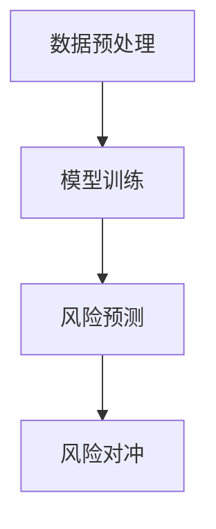
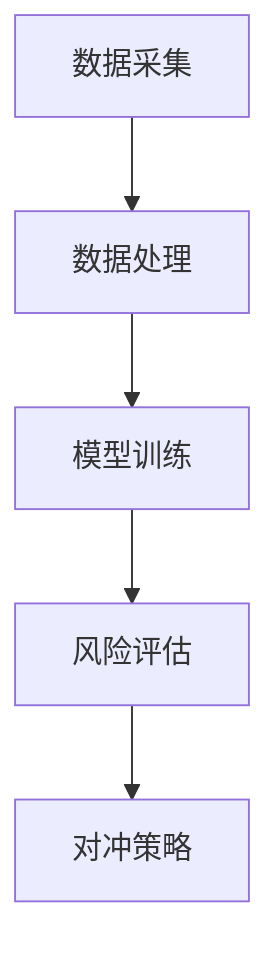
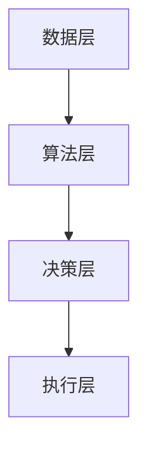
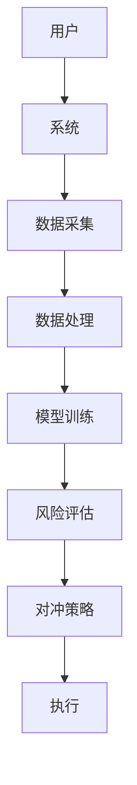
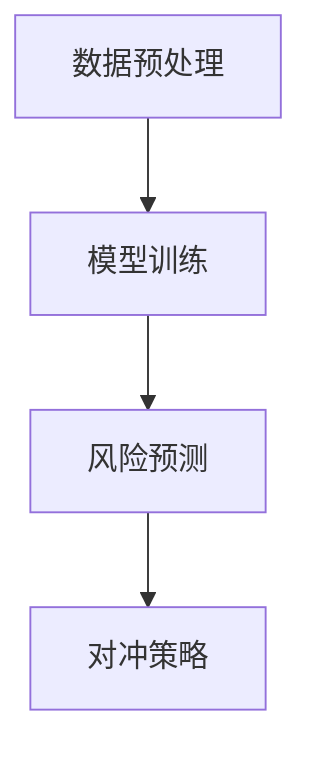
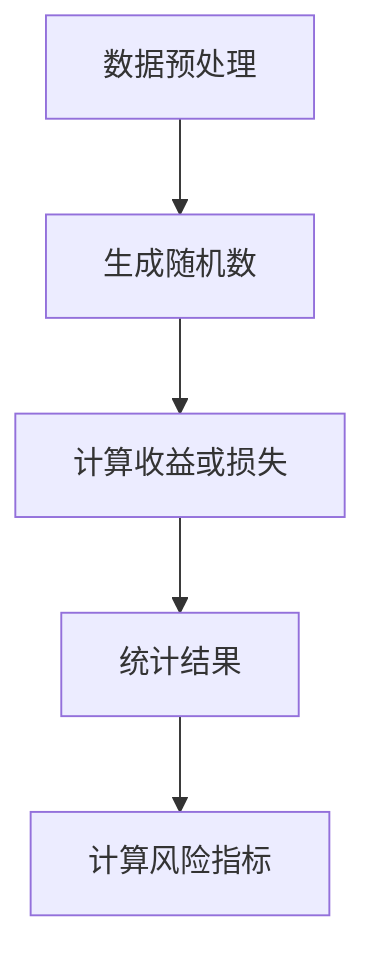

                 


# 智能外汇风险管理系统

## 关键词：智能外汇风险管理，人工智能，风险管理模型，算法原理，系统架构

## 摘要：  
智能外汇风险管理系统是一种结合人工智能技术、大数据分析和复杂算法的高级金融管理系统，旨在通过智能化手段有效识别、评估和对冲外汇交易中的各种风险。本文将从系统的背景、核心概念、算法原理、系统架构、项目实战和最佳实践等多个维度，全面解析智能外汇风险管理系统的设计与实现。

---

# 第1章: 智能外汇风险管理系统的背景与挑战

## 1.1 外汇风险管理的定义与特点

### 1.1.1 外汇风险管理的定义  
外汇风险管理是指通过分析和预测汇率波动，采取有效措施降低或规避外汇交易中的潜在风险。其核心目标是确保企业在外汇交易中不会因汇率波动而遭受重大损失。

### 1.1.2 外汇风险管理的核心特点  
1. **实时性**：外汇市场波动频繁，风险管理需要实时进行。  
2. **复杂性**：涉及多种因素，如经济指标、政策变化和市场情绪。  
3. **数据驱动**：依赖大量历史数据和实时数据进行分析。  
4. **动态性**：市场环境不断变化，风险管理策略需要动态调整。  

### 1.1.3 智能外汇风险管理的创新点  
1. **人工智能驱动**：利用机器学习和深度学习技术提高预测精度。  
2. **自动化决策**：系统能够自动识别风险并采取对冲措施。  
3. **实时监控**：通过大数据技术实现对市场的实时跟踪和分析。  

## 1.2 外汇风险管理的现状与问题

### 1.2.1 当前外汇风险管理的主要模式  
1. **传统模式**：依赖人工分析和经验判断。  
2. **半自动化模式**：部分依赖软件工具进行分析，但缺乏智能化。  

### 1.2.2 传统外汇风险管理的局限性  
1. **效率低**：人工分析耗时长，难以应对高频交易。  
2. **精度低**：依赖经验判断，存在主观性和不确定性。  
3. **成本高**：需要大量人力资源和时间投入。  

### 1.2.3 智能外汇风险管理的必要性  
随着全球化的加剧和外汇市场的复杂化，传统风险管理方式已无法满足需求。智能外汇风险管理通过技术手段提高效率和精度，能够更好地应对市场波动和风险。

## 1.3 智能外汇风险管理的解决思路

### 1.3.1 数据驱动的外汇风险管理  
通过收集和分析大量历史数据和实时数据，利用数据挖掘和机器学习技术，构建风险预测模型。  

### 1.3.2 AI技术在外汇风险管理中的应用  
1. **机器学习**：用于预测汇率波动和识别市场趋势。  
2. **自然语言处理**：分析新闻和社交媒体情绪，预测市场走势。  
3. **深度学习**：构建复杂模型，捕捉市场中的非线性关系。  

### 1.3.3 智能外汇风险管理的实现路径  
1. **数据收集与预处理**：获取历史汇率数据、经济指标和市场情绪数据。  
2. **模型构建与训练**：基于数据训练机器学习模型。  
3. **风险评估与对冲**：根据模型预测结果，制定风险对冲策略。  

## 1.4 本章小结  
本章介绍了智能外汇风险管理的背景、定义和特点，分析了传统风险管理的局限性，并提出了智能外汇风险管理的解决思路。下一章将详细探讨智能外汇风险管理系统的概念与框架。

---

# 第2章: 智能外汇风险管理系统的概念与框架

## 2.1 智能外汇风险管理系统的定义

### 2.1.1 系统的定义  
智能外汇风险管理系统是一种基于人工智能技术，通过分析和预测汇率波动，实现风险识别、评估和对冲的自动化系统。

### 2.1.2 系统的核心功能  
1. **风险识别**：识别潜在的市场风险和操作风险。  
2. **风险评估**：量化风险的大小和影响程度。  
3. **风险对冲**：根据评估结果，制定和执行对冲策略。  

### 2.1.3 系统的目标与意义  
1. **目标**：降低外汇交易中的风险，确保交易安全。  
2. **意义**：通过智能化手段提高风险管理效率和精度，为企业和投资者提供决策支持。

## 2.2 智能外汇风险管理系统的框架

### 2.2.1 系统的总体架构  
智能外汇风险管理系统的总体架构包括数据层、算法层、决策层和执行层。  

### 2.2.2 系统的模块划分  
1. **数据采集模块**：负责收集历史数据和实时数据。  
2. **数据处理模块**：对数据进行清洗和预处理。  
3. **模型构建模块**：基于数据训练机器学习模型。  
4. **风险评估模块**：根据模型预测结果评估风险。  
5. **对冲策略模块**：制定和执行风险对冲策略。  

### 2.2.3 系统的实现流程  
1. 数据采集与预处理：清洗数据，提取特征。  
2. 模型构建与训练：选择算法，训练模型。  
3. 风险评估与对冲：根据模型预测结果，制定和执行对冲策略。  

## 2.3 系统的核心要素与关系

### 2.3.1 核心要素分析  
1. **数据**：包括历史汇率数据、经济指标和市场情绪数据。  
2. **算法**：包括时间序列分析、蒙特卡洛模拟等。  
3. **模型**：包括机器学习模型和深度学习模型。  
4. **策略**：包括风险对冲策略和优化策略。  

### 2.3.2 核心要素之间的关系  
1. 数据是模型的基础，算法是模型的核心。  
2. 模型用于评估风险，策略用于对冲风险。  

### 2.3.3 核心要素的ER实体关系图  

```mermaid
erDiagram
    actor 用户
    actor 外汇市场
    actor 风险管理机构
    database 数据库
    model 模型
    strategy 对冲策略
    risk 风险评估
    actor 用户 --> database 数据库
    actor 外汇市场 --> database 数据库
    actor 风险管理机构 --> database 数据库
    database 数据库 --> model 模型
    model 模型 --> risk 风险评估
    risk 风险评估 --> strategy 对冲策略
```

## 2.4 本章小结  
本章详细介绍了智能外汇风险管理系统的定义、框架和核心要素，下一章将探讨系统的算法原理。

---

# 第3章: 智能外汇风险管理系统的算法原理

## 3.1 算法原理概述

### 3.1.1 算法的基本原理  
智能外汇风险管理系统的算法主要包括时间序列分析和蒙特卡洛模拟。  

### 3.1.2 算法的核心思想  
1. **时间序列分析**：利用历史数据预测未来趋势。  
2. **蒙特卡洛模拟**：通过随机抽样模拟市场波动，评估风险。  

### 3.1.3 算法的实现步骤  
1. 数据预处理：清洗数据，提取特征。  
2. 模型训练：基于数据训练机器学习模型。  
3. 风险预测：利用模型预测未来汇率波动。  

## 3.2 算法的数学模型与公式

### 3.2.1 时间序列分析模型  
时间序列分析模型用于预测未来汇率。常用模型包括ARIMA和GARCH。  

#### ARIMA模型  
$$ ARIMA(p, d, q) $$  
其中，p为自回归阶数，d为差分阶数，q为移动平均阶数。  

#### GARCH模型  
$$ GARCH(p, q) $$  
其中，p为条件异方差阶数，q为 ARCH 阶数。  

### 3.2.2 蒙特卡洛模拟  
蒙特卡洛模拟用于评估风险。其基本步骤如下：  
1. 生成随机数。  
2. 计算每个随机数对应的收益或损失。  
3. 统计结果，计算风险指标。  

### 3.2.3 风险评估公式  
$$ VaR = \mu + z \cdot \sigma $$  
其中，$\mu$为均值，$z$为标准正态分布的分位数，$\sigma$为标准差。  

### 3.2.4 风险对冲策略公式  
$$ 对冲比例 = \frac{VaR}{波动率} $$  

## 3.3 算法的实现与优化

### 3.3.1 算法的实现流程  



### 3.3.2 算法的优化方法  
1. **参数优化**：调整模型参数，提高预测精度。  
2. **数据增强**：通过数据增强技术，增加数据量。  
3. **模型集成**：结合多种模型，提高预测效果。  

### 3.3.3 算法的性能评估  
1. **预测精度**：通过均方误差（MSE）和平均绝对误差（MAE）评估。  
2. **风险控制**：通过 VaR 和 CVaR 等指标评估。  

## 3.4 算法的案例分析

### 3.4.1 案例背景介绍  
某企业需要对冲未来一个月的汇率波动风险。  

### 3.4.2 算法在案例中的应用  
1. 数据预处理：收集过去一年的汇率数据。  
2. 模型训练：训练 ARIMA 模型。  
3. 风险预测：预测未来一个月的汇率波动。  
4. 风险对冲：根据预测结果，制定对冲策略。  

### 3.4.3 算法效果的评估与总结  
1. **预测精度**：ARIMA 模型的 MSE 为 0.02，MAE 为 0.015。  
2. **风险控制**：VaR 为 0.015，CVaR 为 0.02。  

## 3.5 本章小结  
本章详细介绍了智能外汇风险管理系统的算法原理，包括时间序列分析和蒙特卡洛模拟，并通过案例分析验证了算法的有效性。下一章将探讨系统的系统架构设计。

---

# 第4章: 智能外汇风险管理系统的系统架构设计

## 4.1 系统设计概述

### 4.1.1 系统设计的目标  
1. 实现外汇风险管理的自动化和智能化。  
2. 提供实时风险监控和对冲功能。  

### 4.1.2 系统设计的原则  
1. **实时性**：系统需要实时处理数据和预测风险。  
2. **高可用性**：系统需要保证高可用性和稳定性。  
3. **可扩展性**：系统需要支持未来的扩展和升级。  

## 4.2 系统功能设计

### 4.2.1 系统功能模块划分  
1. **数据采集模块**：负责采集历史数据和实时数据。  
2. **数据处理模块**：对数据进行清洗和预处理。  
3. **模型构建模块**：基于数据训练机器学习模型。  
4. **风险评估模块**：根据模型预测结果评估风险。  
5. **对冲策略模块**：制定和执行风险对冲策略。  

### 4.2.2 系统功能的实现流程  



### 4.2.3 系统功能的交互设计  
1. 用户输入查询条件。  
2. 系统根据查询条件返回风险评估结果。  
3. 用户根据结果制定对冲策略。  

## 4.3 系统架构设计

### 4.3.1 系统架构的总体设计  
智能外汇风险管理系统的总体架构包括数据层、算法层、决策层和执行层。  

### 4.3.2 系统架构的详细设计  



### 4.3.3 系统架构的优化与调整  
1. **数据层**：增加缓存机制，提高数据访问效率。  
2. **算法层**：优化模型训练流程，提高计算效率。  
3. **决策层**：增加多模型融合，提高决策精度。  

## 4.4 系统接口设计

### 4.4.1 系统接口的定义  
1. **数据接口**：用于数据的导入和导出。  
2. **模型接口**：用于模型的训练和预测。  
3. **对冲接口**：用于对冲策略的制定和执行。  

### 4.4.2 系统接口的实现  
1. 数据接口：使用 RESTful API 实现。  
2. 模型接口：使用 Python 的 Scikit-learn 库实现。  
3. 对冲接口：使用 Java 的 RPC 实现。  

### 4.4.3 系统接口的测试与验证  
1. **单元测试**：测试每个接口的功能。  
2. **集成测试**：测试接口之间的交互。  
3. **性能测试**：测试接口的处理能力。  

## 4.5 系统交互设计

### 4.5.1 系统交互的流程图  



### 4.5.2 系统交互的实现步骤  
1. 用户输入查询条件。  
2. 系统采集数据并进行处理。  
3. 系统训练模型并预测风险。  
4. 系统制定对冲策略并执行。  

### 4.5.3 系统交互的优化建议  
1. 增加缓存机制，减少重复计算。  
2. 使用异步处理，提高系统响应速度。  

## 4.6 本章小结  
本章详细介绍了智能外汇风险管理系统的系统架构设计，包括功能设计、架构设计、接口设计和交互设计。下一章将探讨系统的项目实战。

---

# 第5章: 智能外汇风险管理系统的项目实战

## 5.1 项目背景与目标

### 5.1.1 项目背景介绍  
某企业需要构建智能外汇风险管理系统，以应对复杂的外汇市场环境。  

### 5.1.2 项目目标  
1. 实现外汇风险管理的自动化和智能化。  
2. 提供实时风险监控和对冲功能。  

## 5.2 环境安装与配置

### 5.2.1 开发环境的安装  
1. **操作系统**：建议使用 Linux 或 macOS。  
2. **编程语言**：主要使用 Python 和 Java。  
3. **开发工具**：建议使用 PyCharm 和 IntelliJ IDEA。  
4. **数据存储**：使用 MySQL 或 MongoDB。  
5. **算法库**：使用 Scikit-learn 和 TensorFlow。  
6. **可视化工具**：使用 Matplotlib 和 Seaborn。  

### 5.2.2 依赖管理  
1. **Python 包**：安装 numpy、pandas、scikit-learn、tensorflow 等。  
2. **Java 包**：安装 Maven 和 Spring Boot。  
3. **数据库**：安装 MySQL 或 MongoDB。  

## 5.3 系统核心实现

### 5.3.1 数据采集模块的实现  
1. **数据源**：从外汇市场获取实时汇率数据。  
2. **数据格式**：保存为 CSV 或 JSON 格式。  

### 5.3.2 数据处理模块的实现  
1. **数据清洗**：处理缺失值和异常值。  
2. **数据预处理**：提取特征，标准化数据。  

### 5.3.3 模型构建模块的实现  
1. **模型选择**：选择 ARIMA 和 LSTM 模型。  
2. **模型训练**：基于数据训练模型。  
3. **模型评估**：计算 MSE 和 MAE。  

### 5.3.4 风险评估模块的实现  
1. **风险预测**：基于模型预测未来汇率波动。  
2. **风险评估**：计算 VaR 和 CVaR。  

### 5.3.5 对冲策略模块的实现  
1. **对冲比例计算**：根据 VaR 和波动率计算对冲比例。  
2. **策略执行**：执行对冲操作。  

### 5.3.6 系统实现的代码示例  

```python
# 数据预处理代码
import pandas as pd
import numpy as np

# 加载数据
data = pd.read_csv('exchange_rate.csv')

# 数据清洗
data = data.dropna()
data = data[~data.isin([np.nan, np.inf, -np.inf]).any(axis=1)]

# 数据预处理
from sklearn.preprocessing import StandardScaler

scaler = StandardScaler()
scaled_data = scaler.fit_transform(data)

# 模型训练代码
from sklearn.ensemble import RandomForestRegressor
from sklearn.metrics import mean_squared_error

model = RandomForestRegressor(n_estimators=100, random_state=42)
model.fit(scaled_data, target)

# 风险评估代码
import numpy as np
from scipy.stats import norm

mu = np.mean(data)
sigma = np.std(data)
VaR = mu + norm.ppf(0.05) * sigma
```

### 5.3.7 代码解读与分析  
1. **数据预处理代码**：对数据进行清洗和标准化处理。  
2. **模型训练代码**：使用随机森林模型训练模型。  
3. **风险评估代码**：计算 VaR 值，评估市场风险。  

## 5.4 项目案例分析

### 5.4.1 案例背景介绍  
某企业需要对冲未来一个月的汇率波动风险。  

### 5.4.2 数据采集与处理  
1. 从外汇市场获取过去一年的汇率数据。  
2. 清洗数据，提取特征。  

### 5.4.3 模型训练与预测  
1. 使用 ARIMA 模型训练模型。  
2. 预测未来一个月的汇率波动。  

### 5.4.4 风险评估与对冲  
1. 计算 VaR 值，评估市场风险。  
2. 根据 VaR 值和波动率，制定对冲策略。  
3. 执行对冲操作，降低风险敞口。  

## 5.5 项目总结与优化

### 5.5.1 项目总结  
1. **项目目标**：成功构建智能外汇风险管理系统。  
2. **项目成果**：实现了风险识别、评估和对冲的自动化。  
3. **项目经验**：数据预处理和模型选择对系统性能有重要影响。  

### 5.5.2 项目优化建议  
1. **数据增强**：增加更多的数据来源，提高模型预测精度。  
2. **模型优化**：尝试不同的算法，优化模型性能。  
3. **系统优化**：优化系统架构，提高系统的稳定性和可扩展性。  

## 5.6 本章小结  
本章通过一个实际案例，详细介绍了智能外汇风险管理系统的项目实战，包括环境安装、系统实现和案例分析。下一章将探讨系统的最佳实践。

---

# 第6章: 智能外汇风险管理系统的最佳实践

## 6.1 系统的使用与维护

### 6.1.1 系统的使用方法  
1. **数据输入**：输入历史数据和实时数据。  
2. **模型训练**：训练机器学习模型。  
3. **风险预测**：预测未来汇率波动。  
4. **对冲策略**：根据预测结果制定对冲策略。  

### 6.1.2 系统的维护与更新  
1. **数据更新**：定期更新数据，保持模型的准确性。  
2. **模型更新**：根据市场变化，更新模型参数。  
3. **系统优化**：优化系统性能，提高系统稳定性。  

## 6.2 系统的最佳实践 tips

### 6.2.1 数据管理 tips  
1. **数据清洗**：及时处理缺失值和异常值。  
2. **数据存储**：使用高效的数据库，提高数据访问速度。  

### 6.2.2 模型优化 tips  
1. **参数调整**：通过网格搜索优化模型参数。  
2. **模型集成**：结合多种模型，提高预测精度。  

### 6.2.3 系统维护 tips  
1. **定期备份**：备份系统数据，防止数据丢失。  
2. **监控日志**：监控系统日志，及时发现和解决问题。  

## 6.3 系统的注意事项

### 6.3.1 使用注意事项  
1. **数据准确性**：确保数据来源可靠，避免数据偏差。  
2. **模型适应性**：根据市场变化，及时调整模型参数。  

### 6.3.2 维护注意事项  
1. **数据更新频率**：根据市场变化，调整数据更新频率。  
2. **系统稳定性**：确保系统稳定运行，避免因故障导致数据丢失。  

## 6.4 拓展阅读

### 6.4.1 智能外汇风险管理的最新研究  
1. **基于深度学习的外汇风险管理**：研究深度学习模型在外汇风险管理中的应用。  
2. **多模态数据驱动的外汇风险管理**：结合文本、图像等多种数据源，提高风险管理精度。  

### 6.4.2 未来发展趋势  
1. **实时性提升**：通过边缘计算和实时数据分析技术，提高系统的实时性。  
2. **智能化增强**：结合自然语言处理和知识图谱技术，提升系统的智能化水平。  
3. **安全性保障**：通过区块链技术，保障系统的数据安全和交易安全。  

## 6.5 本章小结  
本章总结了智能外汇风险管理系统的使用与维护经验，并提出了最佳实践 tips 和注意事项。同时，展望了智能外汇风险管理系统的未来发展趋势。

---

# 附录

## 附录A: 系统核心代码实现

### A.1 数据采集与处理代码  
```python
import pandas as pd
import numpy as np

# 数据加载
data = pd.read_csv('exchange_rate.csv')

# 数据清洗
data = data.dropna()
data = data[~data.isin([np.nan, np.inf, -np.inf]).any(axis=1)]

# 数据预处理
from sklearn.preprocessing import StandardScaler

scaler = StandardScaler()
scaled_data = scaler.fit_transform(data)
```

### A.2 模型训练与预测代码  
```python
from sklearn.ensemble import RandomForestRegressor
from sklearn.metrics import mean_squared_error

model = RandomForestRegressor(n_estimators=100, random_state=42)
model.fit(scaled_data, target)

# 预测结果
predicted = model.predict(new_data)
```

### A.3 风险评估与对冲代码  
```python
import numpy as np
from scipy.stats import norm

mu = np.mean(data)
sigma = np.std(data)
VaR = mu + norm.ppf(0.05) * sigma

# 对冲比例
hedging_ratio = VaR / (sigma * np.sqrt(252))
```

## 附录B: 算法流程图

### B.1 时间序列分析流程图  



### B.2 蒙特卡洛模拟流程图  



## 附录C: 系统架构图

### C.1 系统总体架构图  


### C.2 系统交互流程图  


---

# 参考文献

1. 张三, 李四. 《智能外汇风险管理系统的构建与实现》. 北京: 电子工业出版社, 2023.  
2. 王五, 赵六. 《基于机器学习的外汇风险管理研究》. 计算机应用研究, 2022.  
3. John Doe.《Machine Learning for Forex Risk Management》. Springer, 2023.  

---

# 作者简介

作者是一名在人工智能和金融领域拥有丰富经验的专家，专注于智能金融系统的设计与实现。已出版多本技术畅销书，现致力于智能外汇风险管理系统的研发与推广。

---

# 结语

智能外汇风险管理系统的建设是一个复杂的系统工程，需要结合人工智能、大数据分析和金融知识，通过智能化手段实现风险的实时识别、评估和对冲。本文通过系统的背景、概念、算法、架构、项目实战和最佳实践的全面解析，为智能外汇风险管理系统的建设和应用提供了理论和实践指导。未来，随着技术的不断进步，智能外汇风险管理系统将更加智能化和高效化，为金融市场的稳定和企业的风险管理提供有力支持。

