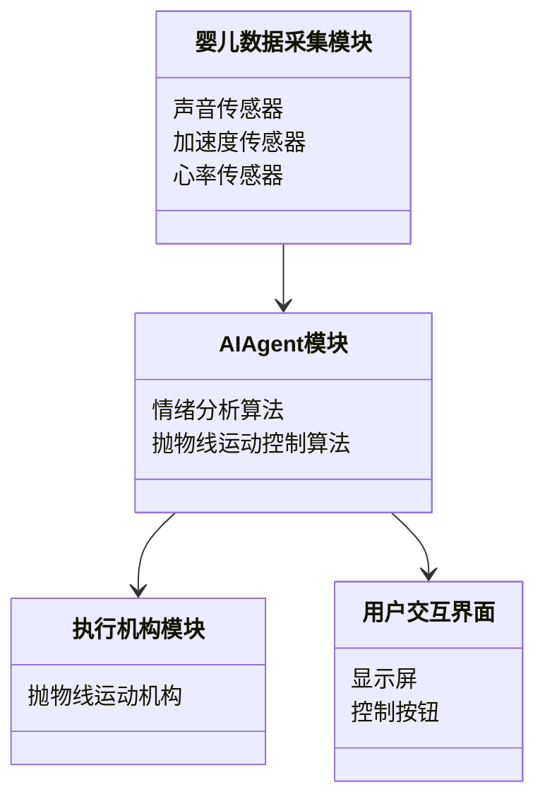
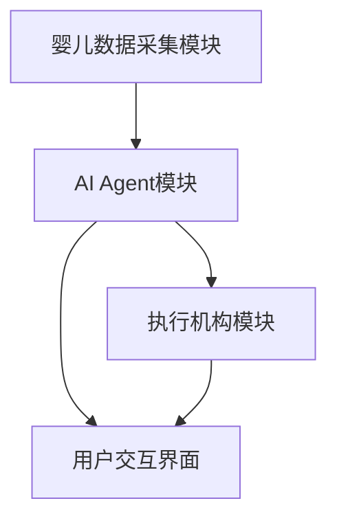
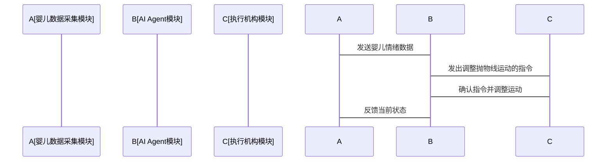

                 


# 智能婴儿摇篮：AI Agent的安抚模式优化

## 关键词：智能婴儿摇篮，AI Agent，安抚模式优化，机器学习，情绪识别，实时反馈

## 摘要：本文探讨了AI Agent在智能婴儿摇篮中的应用，特别是在优化安抚模式方面。通过分析婴儿情绪识别的算法，设计了基于深度学习的解决方案，并结合系统架构设计，提出了一个完整的优化框架。文章还提供了实际案例分析和代码实现，展示了如何通过AI技术提升婴儿护理效率。

---

# 第1章 智能婴儿摇篮概述

## 1.1 智能婴儿摇篮的背景介绍

### 1.1.1 婴儿安抚的传统方法与挑战
传统的婴儿安抚主要依赖父母或护理人员的手动操作，包括摇晃、轻拍和安抚奶嘴等方式。然而，这种方法存在效率低、耗时长且容易疲劳的问题，特别是在夜间或长时间需要安抚的情况下，家长可能无法及时响应。

### 1.1.2 AI技术在婴儿护理中的应用潜力
随着AI技术的发展，智能设备逐渐应用于婴儿护理领域。AI Agent可以通过分析婴儿的声音、动作和心率等多模态数据，自动调整安抚策略，提供更高效和个性化的解决方案。

### 1.1.3 智能婴儿摇篮的市场现状与发展前景
智能婴儿摇篮市场正在快速增长，越来越多的产品开始集成AI技术。未来，随着AI算法的优化和传感器技术的进步，智能婴儿摇篮将更加智能化和个性化。

## 1.2 问题背景与需求分析

### 1.2.1 婴儿哭闹问题的普遍性
婴儿哭闹是常见现象，尤其是在三个月内的婴儿。哭闹不仅影响婴儿的睡眠质量，还可能导致家长的疲惫和焦虑。

### 1.2.2 现有婴儿摇篮产品的局限性
传统摇篮功能单一，仅能被动响应家长的操作，无法主动分析婴儿的情绪和需求，难以提供个性化的安抚方案。

### 1.2.3 用户需求与痛点分析
用户需要一种能够自动监测婴儿情绪、主动调整安抚策略的设备，特别是在夜间或家长无法及时响应的情况下。

## 1.3 问题描述与解决目标

### 1.3.1 婴儿安抚模式的优化需求
需要开发一种能够根据婴儿的情绪状态自动调整安抚策略的方法，以提高安抚效率和效果。

### 1.3.2 AI Agent在婴儿摇篮中的应用目标
通过AI Agent实时分析婴儿数据，提供智能化的安抚方案，减少婴儿哭闹时间，提升睡眠质量。

### 1.3.3 解决方案的核心思路
利用机器学习算法分析婴儿的情绪数据，设计一个动态调整的安抚模式优化算法，实时反馈调整安抚策略。

## 1.4 边界与外延

### 1.4.1 智能婴儿摇篮的功能边界
主要功能包括情绪监测、安抚模式调整和反馈优化，不包括医疗诊断或其他高级功能。

### 1.4.2 与其他智能设备的关联与区别
区别于其他智能设备，智能婴儿摇篮专注于婴儿情绪监测和安抚，与其他设备如智能音箱、灯光控制器等形成生态联动。

### 1.4.3 产品的适用范围与限制
适用于三个月内的婴儿，不适用于有健康问题的婴儿，需在家长监督下使用。

## 1.5 概念结构与核心要素组成

### 1.5.1 智能婴儿摇篮的核心要素组成
- 数据采集模块：包括声音传感器、加速度传感器和心率传感器。
- AI Agent：负责数据处理和策略调整。
- 抛物线运动机构：执行安抚动作。
- 用户交互界面：显示安抚状态和控制功能。

### 1.5.2 AI Agent在系统中的角色与功能
- 数据处理：分析婴儿的情绪数据。
- 策略生成：根据数据生成安抚策略。
- 反馈优化：实时调整安抚模式。

### 1.5.3 系统的输入输出关系
- 输入：声音、震动、心率数据。
- 输出：调整抛物线运动幅度和频率，实时反馈安抚状态。

## 1.6 本章小结
本章介绍了智能婴儿摇篮的背景、需求、问题描述和边界条件，明确了AI Agent在系统中的核心作用，为后续章节的详细分析奠定了基础。

---

# 第2章 AI Agent的基本原理

## 2.1 AI Agent的定义与分类

### 2.1.1 AI Agent的定义
AI Agent是一种智能实体，能够感知环境、执行任务并做出决策。在智能婴儿摇篮中，AI Agent负责分析婴儿的情绪数据并生成安抚策略。

### 2.1.2 AI Agent的主要分类
- **反应式AI Agent**：基于当前输入做出反应，如实时调整安抚策略。
- **认知式AI Agent**：具备推理和学习能力，能够优化长期的安抚模式。

### 2.1.3 不同类型AI Agent的特点对比
| 类型       | 描述                       | 优点                     | 缺点                     |
|------------|----------------------------|--------------------------|--------------------------|
| 反应式     | 基于当前输入做出反应       | 响应速度快               | 无法处理复杂场景         |
| 认知式     | 具备推理和学习能力         | 能处理复杂场景           | 开发难度大，计算资源消耗多 |

## 2.2 AI Agent的核心技术

### 2.2.1 机器学习基础
机器学习是AI Agent的核心技术之一，用于分析婴儿的情绪数据并训练分类模型。

### 2.2.2 自然语言处理技术
用于分析婴儿的声音数据，识别哭闹类型和情绪状态。

### 2.2.3 实时数据分析与反馈机制
实时分析婴儿的数据，并根据分析结果反馈调整安抚策略。

## 2.3 AI Agent在婴儿摇篮中的具体应用

### 2.3.1 婴儿情绪识别的算法实现
- 使用深度学习模型分析婴儿的声音数据，识别情绪状态。

### 2.3.2 声音与震动反馈的优化策略
- 根据婴儿的情绪变化，动态调整声音和震动的频率和幅度。

### 2.3.3 多模态数据融合的实现方法
- 结合声音、震动和心率数据，进行多模态融合分析，提高情绪识别的准确性。

## 2.4 本章小结
本章详细介绍了AI Agent的基本原理及其在婴儿摇篮中的应用，为后续章节的算法实现和系统设计奠定了基础。

---

# 第3章 婴儿情绪识别算法

## 3.1 婴儿情绪识别的数学模型

### 3.1.1 基于时间序列的婴儿情绪分析
- 使用LSTM网络分析婴儿声音的时间序列数据，捕捉情绪变化的动态特征。

### 3.1.2 基于深度学习的情绪分类模型
- 构建一个基于卷积神经网络（CNN）的情绪分类模型，提取声音数据的频域特征。

### 3.1.3 模型的训练与优化方法
- 使用交叉验证和早停法优化模型，防止过拟合。

## 3.2 婴儿情绪识别的算法实现

### 3.2.1 数据预处理与特征提取
- 对声音数据进行降噪处理，提取Mel频率倒谱系数（MFCC）作为特征向量。

### 3.2.2 基于RNN的情绪分类实现
- 使用双向LSTM网络处理时间序列数据，捕捉前后文信息。

### 3.2.3 模型的训练与优化
- 使用Adam优化器训练模型，设置学习率为0.001，训练100个epochs。

### 3.2.4 情绪识别的准确率对比
- 对比不同算法的准确率，选择性能最优的模型。

## 3.3 本章小结
本章详细讲解了婴儿情绪识别的算法实现，通过对比不同模型的性能，选择了最优的解决方案。

---

# 第4章 系统架构设计

## 4.1 问题场景介绍
- 智能婴儿摇篮需要在复杂环境中实时分析婴儿情绪，动态调整安抚策略。

## 4.2 系统功能设计
- **情绪监测模块**：实时采集婴儿的声音、震动和心率数据。
- **AI Agent模块**：分析数据，生成安抚策略。
- **执行机构模块**：根据策略调整抛物线运动幅度和频率。
- **用户交互界面**：显示实时状态和控制功能。

### 4.2.1 领域模型图


## 4.3 系统架构设计

### 4.3.1 系统架构图


## 4.4 接口设计与交互流程图

### 4.4.1 接口设计
- 数据采集模块与AI Agent模块之间的接口：提供标准化的数据格式。
- AI Agent模块与执行机构模块之间的接口：输出控制信号。

### 4.4.2 交互流程图


## 4.5 本章小结
本章通过系统架构设计，明确了各模块的功能和交互关系，为后续的系统实现奠定了基础。

---

# 第5章 项目实战

## 5.1 环境安装与配置

### 5.1.1 Python环境的安装与配置
- 安装Python 3.8及以上版本。
- 安装必要的库：numpy、scikit-learn、tensorflow、pymermaid。

### 5.1.2 开发工具的配置
- 使用Jupyter Notebook进行算法开发。
- 使用Mermaid工具绘制图表。

## 5.2 系统核心实现

### 5.2.1 数据采集模块的实现
```python
import numpy as np
from scipy.io import wavfile

def preprocess_audio(wav_file):
    # 读取音频数据
    sampling_rate, data = wavfile.read(wav_file)
    # 转换为单声道
    mono_data = data.mean(axis=1)
    # 计算MFCC特征
    mfcc = mfcc_features(mono_data, sampling_rate)
    return mfcc
```

### 5.2.2 AI Agent模块的实现
```python
import tensorflow as tf
from tensorflow.keras import layers

def build_model(input_shape):
    model = tf.keras.Sequential()
    model.add(layers.Bidirectional(layers.LSTM(64, return_sequences=True), input_shape=input_shape))
    model.add(layers.Dense(32, activation='relu'))
    model.add(layers.Dense(1, activation='sigmoid'))
    model.compile(optimizer='adam', loss='binary_crossentropy', metrics=['accuracy'])
    return model
```

### 5.2.3 执行机构模块的实现
```python
import RPi.GPIO as GPIO

def control_actuator(speed):
    GPIO.output(actuator_pin, GPIO.HIGH)
    time.sleep(speed)
    GPIO.output(actuator_pin, GPIO.LOW)
```

## 5.3 代码应用解读与分析

### 5.3.1 数据预处理代码解读
- 使用scipy库读取音频数据，提取MFCC特征作为模型输入。

### 5.3.2 深度学习模型解读
- 使用双向LSTM网络捕捉时间序列数据的前后文信息，提高情绪识别的准确性。

### 5.3.3 执行机构控制代码解读
- 根据AI Agent的反馈，调整抛物线运动的幅度和频率，实现个性化的安抚策略。

## 5.4 实际案例分析

### 5.4.1 案例背景
- 一个三个月大的婴儿，夜间哭闹频繁，家长希望智能婴儿摇篮能够自动调整安抚策略。

### 5.4.2 数据采集与分析
- 采集婴儿的声音数据，经过预处理和特征提取，输入模型进行情绪分类。

### 5.4.3 系统反馈与调整
- AI Agent分析数据后，动态调整抛物线运动的幅度和频率，有效缩短婴儿的哭闹时间。

## 5.5 项目小结
通过实际案例分析，验证了系统的有效性和优化算法的效果，展示了AI Agent在婴儿护理中的实际应用价值。

---

# 第6章 最佳实践

## 6.1 小结
本文详细探讨了AI Agent在智能婴儿摇篮中的应用，通过算法实现和系统设计，提出了一种优化的安抚模式。

## 6.2 注意事项
- 数据隐私保护：确保婴儿数据的安全性和隐私性。
- 系统稳定性：确保AI Agent在复杂环境下的稳定运行。

## 6.3 未来趋势
- 情绪识别的精度将进一步提高，多模态数据融合将成为主流。
- AI Agent将具备更强的自主学习能力，实现更加个性化的安抚方案。

## 6.4 拓展阅读
- 《Deep Learning》
- 《机器学习实战》
- 《自然语言处理入门》

## 6.5 本章小结
本文通过实际案例和系统设计，展示了AI Agent在智能婴儿摇篮中的潜力，为未来的优化方向提供了参考。

---

# 结语
智能婴儿摇篮结合AI Agent技术，为婴儿护理带来了新的可能性。通过优化安抚模式，AI Agent能够更高效地解决婴儿哭闹问题，提升睡眠质量。未来，随着技术的进一步发展，智能婴儿摇篮将变得更加智能化和个性化，为家长和婴儿提供更好的体验。

