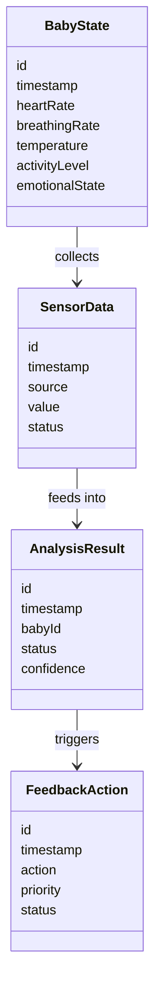
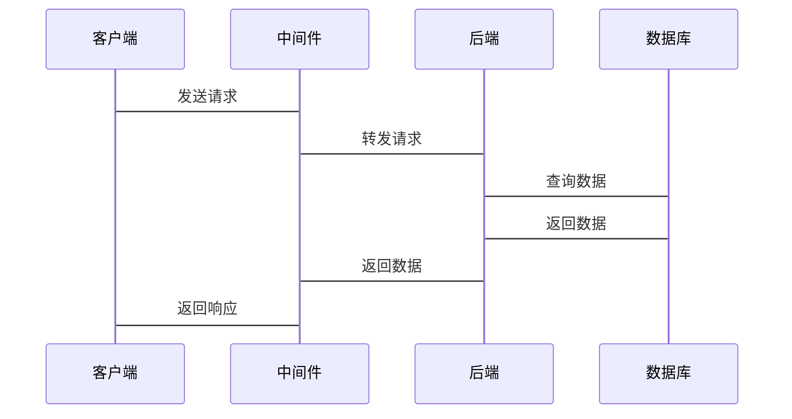

                 


# 第四部分: 系统分析与架构设计

## 第5章: 系统分析与架构设计

### 5.1 问题场景介绍
#### 5.1.1 婴儿监护的主要场景
#### 5.1.2 AI代理在不同场景中的应用
#### 5.1.3 系统需要解决的问题

### 5.2 系统功能设计
#### 5.2.1 领域模型类图



#### 5.2.2 系统架构图

```mermaid
client
    .----.    前端
    |    |
    |    |
    ----.----.  中间件
    |    |
    |    |
    ----.----.  后端
    |    |
    |    |
    ----.----.  数据库
    |    |
    |    |
    ----.----.  传感器
    |    |
    |    |
    ----.----.  AI代理
```

### 5.3 系统架构设计
#### 5.3.1 模块划分
#### 5.3.2 模块之间的交互
#### 5.3.3 关键技术点

### 5.4 系统接口设计
#### 5.4.1 API设计
#### 5.4.2 接口交互流程
#### 5.4.3 接口规范

### 5.5 系统交互流程图



## 第6章: 项目实战与实现

### 6.1 环境安装与配置
#### 6.1.1 安装Python
#### 6.1.2 安装依赖库
#### 6.1.3 配置开发环境

### 6.2 核心功能实现
#### 6.2.1 数据采集模块
#### 6.2.2 数据分析模块
#### 6.2.3 反馈机制模块

### 6.3 代码实现与解读
#### 6.3.1 数据采集代码
#### 6.3.2 数据分析代码
#### 6.3.3 反馈机制代码

### 6.4 案例分析与效果展示
#### 6.4.1 实际案例
#### 6.4.2 实验结果
#### 6.4.3 效果分析

## 第7章: 最佳实践与总结

### 7.1 小结
#### 7.1.1 核心概念回顾
#### 7.1.2 系统设计要点
#### 7.1.3 项目实现总结

### 7.2 注意事项
#### 7.2.1 数据隐私保护
#### 7.2.2 系统稳定性保障
#### 7.2.3 用户体验优化

### 7.3 拓展阅读
#### 7.3.1 相关技术领域
#### 7.3.2 最新研究进展
#### 7.3.3 未来发展方向

# 附录

## 附录A: 术语表
## 附录B: 参考文献
## 附录C: 其他资源

---

# 文章摘要

智能婴儿监护器通过AI代理实时分析婴儿的状态，包括生理指标、行为模式和情绪状态，利用机器学习和深度学习算法进行多模态数据融合和实时反馈。文章详细介绍了系统的架构设计、算法实现和项目实战，为开发者提供理论支持和实践指导。

# 文章关键词

智能婴儿监护器、AI代理、婴儿状态分析、机器学习、深度学习、实时反馈

---

通过以上目录结构，文章系统地介绍了智能婴儿监护器的设计与实现，从背景到技术细节，再到实际应用，为读者提供了全面的知识框架。

