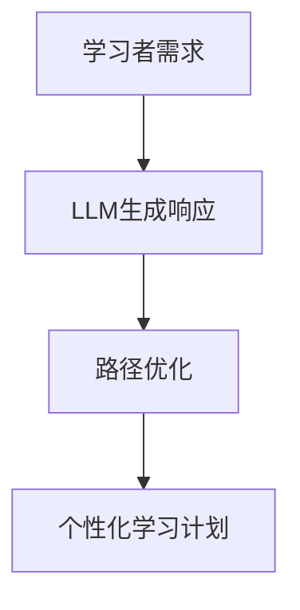
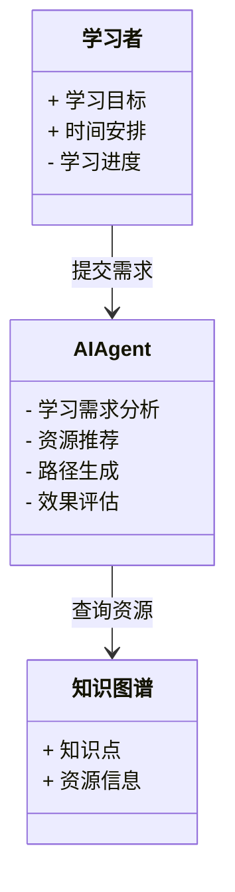
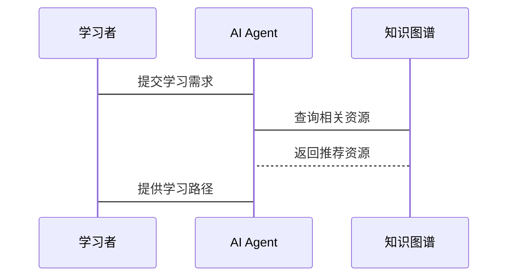

                 


```markdown
# 智能学习路径规划 AI Agent：LLM 辅助个性化学习

> 关键词：智能学习路径规划, AI Agent, LLM, 个性化学习, 人工智能, 教育技术

> 摘要：本文探讨了利用大语言模型（LLM）辅助个性化学习路径规划的AI Agent系统。通过分析学习者的认知特征和学习风格，结合领域知识图谱和知识表示，构建基于LLM的智能学习路径规划模型。详细阐述了系统架构、算法原理、项目实现及优化建议，展示了LLM在教育领域的应用潜力。

---

## 第一部分: 背景介绍与核心概念

### 第1章: 问题背景与概念解析

#### 1.1 学习路径规划的背景
- **学习者需求的多样性**：不同学习者有不同的知识基础、学习目标和时间安排。
- **传统学习路径规划的局限性**：依赖教师经验，难以大规模个性化。
- **AI技术的机遇**：利用AI技术实现个性化、动态调整的学习路径规划。

#### 1.2 问题描述
- **学习路径规划的核心问题**：如何根据学习者的认知特点和学习目标，推荐最优的学习资源和顺序。
- **LLM在学习路径规划中的作用**：通过自然语言处理能力，理解学习者需求，生成个性化学习计划。
- **问题解决的思路**：构建AI Agent，结合LLM进行学习资源推荐和路径优化。

#### 1.3 核心概念与框架
- **AI Agent**：具备感知和决策能力，能够与学习者交互并提供个性化建议。
- **LLM**：作为AI Agent的核心模块，负责理解和生成自然语言内容。
- **学习路径规划系统架构**：包括需求分析、资源推荐、路径生成和效果评估模块。

### 第2章: AI Agent与LLM的核心概念

#### 2.1 AI Agent的基本原理
- **定义与分类**：AI Agent根据智能水平可分为反应式和认知式。
- **LLM在AI Agent中的应用**：作为认知式AI Agent的核心，负责自然语言处理和决策支持。
- **AI Agent与传统算法的区别**：传统算法依赖规则，AI Agent具备自适应和学习能力。

#### 2.2 LLM的原理与特点
- **定义与工作原理**：LLM通过大量数据训练，生成与训练数据匹配的概率分布。
- **LLM的核心特点**：生成式、可解释性低、需要高质量数据。
- **与传统NLP模型的对比**：LLM具备更强的语言理解和生成能力。

#### 2.3 AI Agent与LLM的关系
- **协同工作**：AI Agent通过LLM进行自然语言交互，理解需求并生成响应。
- **LLM作为核心模块**：AI Agent利用LLM进行意图识别和内容生成。
- **学习路径规划的结合**：AI Agent通过LLM生成个性化学习路径。

### 第3章: 智能学习路径规划的系统架构

#### 3.1 系统功能设计
- **学习需求分析模块**：通过问卷和测试收集学习者的基本信息和学习目标。
- **学习资源推荐模块**：基于知识图谱推荐相关资源。
- **学习路径生成模块**：结合学习者特征和资源属性，生成个性化路径。
- **学习效果评估模块**：跟踪学习进度，动态调整路径。

#### 3.2 系统架构设计
- **分层架构**：用户层、业务逻辑层和数据层。
- **模块交互关系**：学习需求分析模块触发资源推荐，推荐结果输入路径生成模块。
- **可扩展性设计**：模块化设计，方便功能扩展。

#### 3.3 系统接口设计
- **用户接口**：图形化界面，方便学习者输入需求和查看路径。
- **模块接口**：REST API，模块间通过JSON数据交互。

---

## 第二部分: 算法原理与系统实现

### 第4章: 算法原理

#### 4.1 LLM的算法原理
- **生成式模型**：如GPT系列，基于Transformer架构。
- **训练过程**：通过大量数据预训练，学习语言模型参数。
- **生成过程**：解码器生成序列，通过贪心搜索或采样得到输出。

#### 4.2 AI Agent的算法原理
- **强化学习**：通过奖励机制优化决策序列。
- **监督学习**：基于标注数据进行模型微调。

#### 4.3 算法流程图


#### 4.4 数学模型
- **概率分布**：LLM生成每个词的概率为$P(y_i|x_{<i})$。
- **损失函数**：交叉熵损失函数$L = -\sum P(y_i|x_{<i}) \log P(y_i|x_{<i})$。

### 第5章: 系统分析与架构设计

#### 5.1 系统功能模块
- **学习需求分析**：用户输入学习目标和时间安排。
- **资源推荐**：基于知识图谱推荐学习材料。
- **路径生成**：生成最优学习顺序。
- **效果评估**：跟踪学习进度并调整路径。

#### 5.2 系统架构图


#### 5.3 系统交互流程


### 第6章: 项目实战

#### 6.1 环境安装
- **Python 3.8+**
- **安装依赖**：`pip install numpy, pandas, transformers`

#### 6.2 核心代码实现
```python
import torch
from transformers import AutoModelWithLMHead, AutoTokenizer

class LLMBasedAgent:
    def __init__(self, model_name):
        self.model = AutoModelWithLMHead.from_pretrained(model_name)
        self.tokenizer = AutoTokenizer.from_pretrained(model_name)
    
    def generate_response(self, input_text):
        inputs = self.tokenizer(input_text, return_tensors="pt")
        outputs = self.model.generate(**inputs, max_length=50)
        return self.tokenizer.decode(outputs[0], skip_special_tokens=True)
```

#### 6.3 案例分析
- **案例1**：学习者希望学习Python编程。
  - AI Agent分析需求，推荐学习路线：基础语法 -> 高级特性 -> 实践项目。
- **案例2**：学习者准备考试。
  - AI Agent根据知识点分布，生成复习计划。

#### 6.4 项目总结
- **代码实现**：展示如何通过Python代码实现AI Agent的交互功能。
- **实际应用**：分析具体案例，说明系统在实际中的应用效果。
- **优化建议**：如何优化模型性能，提升用户体验。

### 第7章: 最佳实践与小结

#### 7.1 最佳实践
- **数据隐私**：确保学习者数据的安全性。
- **模型优化**：定期更新模型，保持推荐的准确性。
- **用户体验**：提供友好的交互界面，提升用户满意度。

#### 7.2 小结
- 本文详细介绍了利用LLM辅助个性化学习路径规划的AI Agent系统。
- 从理论到实践，全面阐述了系统的构建过程和优化方法。
- 展望了未来的发展方向，如多模态学习和更智能的推荐算法。

#### 7.3 注意事项
- 数据质量对推荐效果影响重大，需谨慎处理。
- 模型调参需结合实际场景，避免过度优化。

#### 7.4 拓展阅读
- 推荐相关书籍和论文，如《Deep Learning》和《注意力机制的原理与应用》。

---

## 第三部分: 总结与展望

### 第8章: 总结与展望

#### 8.1 总结
- 本文构建了一个基于LLM的智能学习路径规划系统。
- 详细探讨了系统架构、算法原理和实现方法。

#### 8.2 展望
- **多模态学习**：结合视觉和听觉信息，提供更丰富的学习体验。
- **更智能的推荐算法**：引入强化学习和元学习，提升推荐精准度。
- **教育公平性**：通过技术手段缩小教育资源分配差距。

---

## 第四部分: 附录

### 附录A: 数学公式总结
- **概率分布公式**：$P(y|x) = \frac{P(y,x)}{P(x)}$
- **条件概率公式**：$P(A|B) = \frac{P(A \cap B)}{P(B)}$

### 附录B: 代码片段
```python
def calculate_loss(outputs, labels):
    loss_fn = torch.nn.CrossEntropyLoss()
    loss = loss_fn(outputs, labels)
    return loss
```

### 附录C: 参考文献
- 引用的主要文献和参考资料列表。

---

**END**
```

