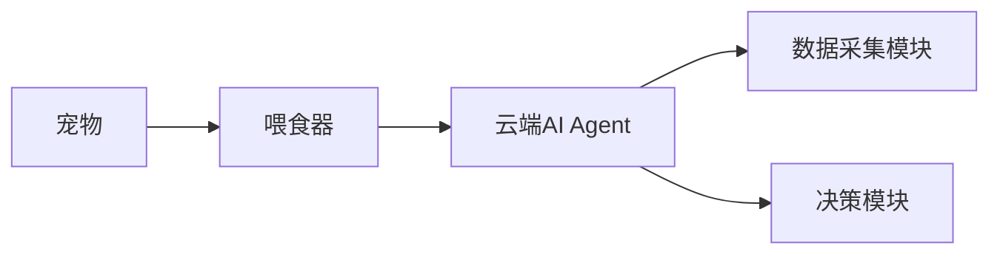
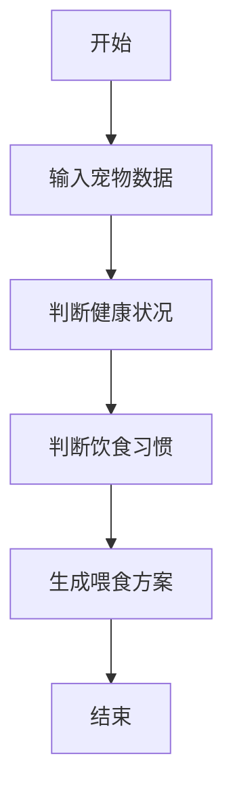
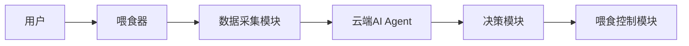
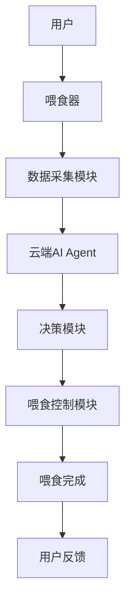

                 


# 智能宠物喂食器：AI Agent的宠物饮食管理系统

> 关键词：智能宠物喂食器，AI Agent，物联网，宠物健康，饮食管理

> 摘要：本文详细探讨了智能宠物喂食器的设计与实现，结合AI Agent技术，构建了一个智能化的宠物饮食管理系统。通过分析系统背景、核心概念、算法原理、系统架构、项目实战及优化维护，展示了如何利用现代技术提升宠物护理效率和效果。

---

# 第一部分：智能宠物喂食器的背景与核心概念

## 第1章：智能宠物喂食器的背景与问题描述

### 1.1 智能宠物喂食器的背景

#### 1.1.1 宠物饲养的智能化趋势
随着科技的发展，越来越多的家庭选择饲养宠物，宠物已经成为许多家庭的重要成员。传统的宠物喂食方式逐渐显现出不足，例如定时喂食的不灵活性、无法根据宠物健康状况调整饮食等。智能化的喂食系统能够解决这些问题，提升宠物护理的效率和质量。

#### 1.1.2 传统喂食器的局限性
传统喂食器通常只能按设定的时间和固定量喂食，无法根据宠物的健康状况、活动量或饮食偏好进行调整。此外，传统喂食器无法与其他智能设备联动，缺乏数据收集和分析能力，难以提供个性化的喂食方案。

#### 1.1.3 AI Agent在宠物管理中的应用潜力
AI Agent（智能代理）是一种能够感知环境、执行任务并做出决策的智能系统。在宠物管理中，AI Agent可以通过分析宠物的行为数据、健康数据等，提供个性化的喂食建议，优化宠物的饮食结构，提升宠物的健康水平。

### 1.2 问题背景与描述

#### 1.2.1 宠物饮食管理的核心问题
宠物的健康状况与饮食密切相关，但传统喂食器无法根据宠物的健康数据调整喂食方案，可能导致宠物营养过剩或不足，影响宠物的健康。

#### 1.2.2 现有解决方案的不足
现有的宠物喂食器主要依赖人工设置，缺乏智能化的调整能力。此外，许多喂食器无法与其他智能设备联动，无法充分利用物联网和云计算等技术。

#### 1.2.3 智能宠物喂食器的目标与范围
智能宠物喂食器的目标是通过AI Agent技术，实现个性化的喂食管理，提升宠物健康水平。其范围包括硬件设备的设计、数据采集与传输、AI算法的实现以及用户界面的交互设计。

### 1.3 解决方案与边界

#### 1.3.1 AI Agent在智能喂食器中的作用
AI Agent负责接收宠物的相关数据，分析数据并生成喂食方案。它能够根据宠物的健康状况、活动量、饮食偏好等因素，动态调整喂食量和时间。

#### 1.3.2 系统边界与功能范围
智能宠物喂食器的功能包括数据采集、喂食控制、数据传输、AI决策和用户交互。系统的边界包括与物联网设备的连接、与云端服务的交互以及与用户的交互。

#### 1.3.3 与外部系统的交互边界
智能宠物喂食器需要与宠物项圈、体重秤等设备联动，采集宠物的健康数据。同时，它还需要与云端AI服务交互，获取决策支持。

## 第2章：智能宠物喂食器的核心概念与联系

### 2.1 核心概念解析

#### 2.1.1 AI Agent的基本概念
AI Agent是一种智能系统，能够感知环境、执行任务并做出决策。在智能宠物喂食器中，AI Agent负责接收宠物的数据，分析数据并生成喂食方案。

#### 2.1.2 物联网技术在智能设备中的应用
物联网技术通过传感器和网络，实现设备间的互联互通。在智能宠物喂食器中，物联网技术用于采集宠物的健康数据，并与喂食器联动。

#### 2.1.3 云计算与大数据在宠物管理中的作用
云计算和大数据技术用于存储和分析宠物的健康数据，为AI Agent提供决策支持。通过大数据分析，可以发现宠物健康与饮食之间的关系，优化喂食方案。

### 2.2 核心概念的属性对比

| 技术 | 定义 | 作用 | 优缺点 |
|------|------|------|--------|
| AI Agent | 智能代理，能感知环境、执行任务 | 分析数据，生成喂食方案 | 高度智能化，但需要大量数据支持 |
| 物联网 | 通过传感器和网络实现设备互联 | 采集数据，设备联动 | 实现实时监控，但需要稳定的网络环境 |
| 云计算 | 提供数据存储和计算服务 | 存储和分析数据 | 高扩展性，但需要较高的技术投入 |

### 2.3 系统实体关系图


---

# 第三部分：AI Agent的算法与数学模型

## 第3章：AI Agent的算法原理

### 3.1 基于规则的决策树算法

#### 3.1.1 决策树的基本原理
决策树是一种基于规则的分类器，通过特征选择构建树结构，最终做出决策。在智能宠物喂食器中，决策树用于根据宠物的健康数据生成喂食方案。

#### 3.1.2 算法流程图


### 3.2 数学模型与公式

#### 3.2.1 健康评估模型
$$健康分数 = 0.3 \times 体重 + 0.4 \times 饮食习惯 + 0.3 \times 运动量$$

#### 3.2.2 喂食量计算公式
$$喂食量 = 基础需求 \times 调整系数$$

### 3.3 代码实现示例

```python
def calculate_health_score(weight, diet, activity):
    return 0.3 * weight + 0.4 * diet + 0.3 * activity

def generate_feeding_plan(weight, diet, activity):
    health_score = calculate_health_score(weight, diet, activity)
    if health_score > 85:
        return "正常喂食"
    elif health_score > 70:
        return "减少喂食量"
    else:
        return "增加喂食量"
```

---

# 第四部分：系统分析与架构设计

## 第4章：智能宠物喂食器的系统架构设计

### 4.1 项目背景与目标
智能宠物喂食器的目标是通过AI Agent技术，实现个性化的宠物饮食管理。系统需要采集宠物的健康数据，分析数据并生成喂食方案。

### 4.2 系统功能设计
系统功能包括数据采集、喂食控制、数据传输、AI决策和用户交互。

### 4.3 系统架构设计


### 4.4 系统接口设计
系统接口包括喂食器与数据采集模块的接口、数据采集模块与云端AI Agent的接口、云端AI Agent与喂食控制模块的接口。

### 4.5 系统交互流程图


---

## 第5章：项目实战与实现

### 5.1 环境安装与配置
需要安装Python、物联网开发板、云服务等。

### 5.2 核心功能实现
实现数据采集、AI决策和喂食控制功能。

### 5.3 代码实现与解读
```python
import requests

def send_data(data):
    response = requests.post("http://cloud_agent.com/api", json=data)
    return response.json()
```

### 5.4 实际案例分析
通过实际案例分析，展示系统的运行效果和优化方向。

### 5.5 项目总结与经验分享
总结项目实施的经验，分享最佳实践。

---

# 第五部分：优化与维护

## 第6章：系统优化与维护

### 6.1 系统优化
优化算法性能，提升数据处理效率。

### 6.2 系统维护
定期更新系统软件，维护硬件设备。

### 6.3 注意事项
注意数据安全，定期备份数据。

---

## 第7章：总结与展望

### 7.1 总结
总结智能宠物喂食器的设计与实现，强调AI Agent技术的重要性。

### 7.2 展望
展望未来的发展方向，提出改进建议。

---

# 结语

智能宠物喂食器通过AI Agent技术，实现了个性化的宠物饮食管理。本文详细探讨了系统的背景、核心概念、算法原理、系统架构、项目实战及优化维护，为读者提供了全面的技术指导。

