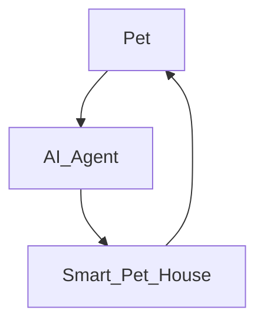
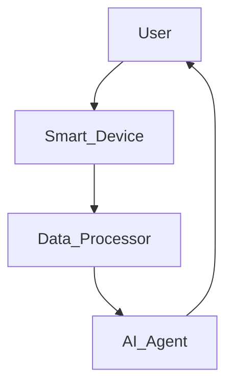
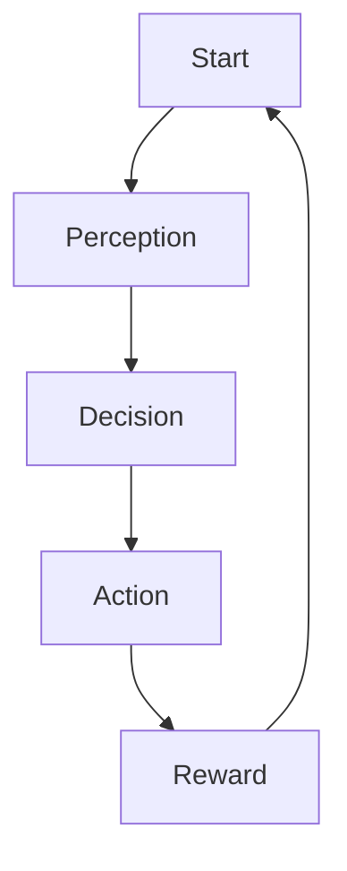
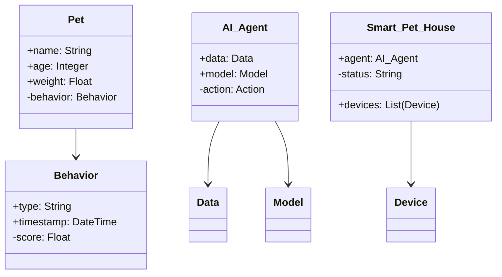
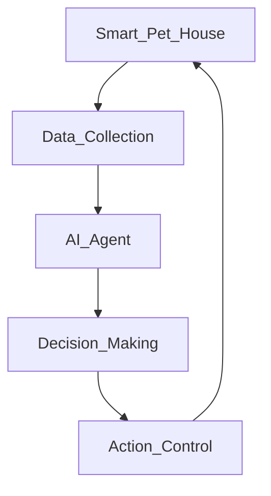
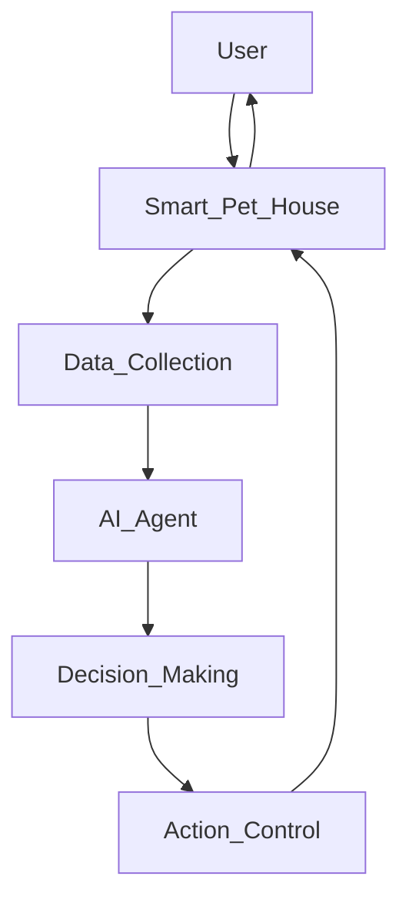

                 


# 《智能宠物屋：AI Agent的宠物行为分析》

> 关键词：智能宠物屋, AI Agent, 宠物行为分析, 强化学习, 物联网, 数据分析

> 摘要：本文将深入探讨AI Agent在智能宠物屋中的应用，分析宠物行为的多种技术手段，从算法原理到系统架构设计，再到实际项目实现，为读者提供全面的视角。通过本文，读者将了解如何利用AI技术实现对宠物行为的智能化分析与管理，从而为宠物提供更优质的生活环境。

---

# 第一部分: 智能宠物屋与AI Agent的背景介绍

## 第1章: 问题背景与描述

### 1.1 问题背景
#### 1.1.1 宠物行为分析的现状与挑战
随着宠物数量的增加，宠物行为分析的需求日益增长。传统的行为分析方法依赖于人工观察，效率低且主观性强。如何通过技术手段实现自动化、精准化的宠物行为分析成为一个重要课题。

#### 1.1.2 AI技术在宠物行为分析中的应用前景
人工智能技术的发展为宠物行为分析提供了新的可能性。通过AI Agent（智能体）的应用，可以实现对宠物行为的实时监测、分析和反馈，从而提升宠物的生活质量。

#### 1.1.3 智能宠物屋的概念与目标
智能宠物屋是一种结合了物联网设备和AI技术的智能设备，旨在通过AI Agent实现对宠物行为的智能化分析与管理，为宠物提供更加舒适和安全的生活环境。

### 1.2 问题描述
#### 1.2.1 宠物行为分析的核心问题
如何准确识别和理解宠物的行为模式，包括动作、情绪、健康状况等。

#### 1.2.2 智能宠物屋的设计目标与功能需求
智能宠物屋需要具备实时监测宠物行为、分析行为数据、提供反馈和建议等功能。

#### 1.2.3 与传统宠物行为分析方法的对比
传统方法依赖人工观察，存在主观性强、效率低的问题。而智能宠物屋通过AI技术可以实现自动化、精准化的分析。

### 1.3 问题解决思路
#### 1.3.1 引入AI Agent的必要性
AI Agent可以通过实时数据采集、分析和决策，实现对宠物行为的智能化管理。

#### 1.3.2 AI Agent在宠物行为分析中的角色
AI Agent作为智能宠物屋的核心，负责数据的采集、分析和决策，为宠物提供个性化的照顾。

#### 1.3.3 智能宠物屋的整体解决方案
通过整合物联网设备、AI算法和用户交互界面，构建一个完整的智能宠物行为分析系统。

### 1.4 问题的边界与外延
#### 1.4.1 智能宠物屋的功能边界
智能宠物屋主要关注宠物行为的分析与管理，不涉及宠物医疗等其他领域。

#### 1.4.2 宠物行为分析的适用范围与限制
适用于家庭宠物，如猫狗等，不适用于野生动物或其他大型动物。

#### 1.4.3 与其他智能设备的协同工作关系
智能宠物屋可以与其他智能家居设备协同工作，例如智能门锁、安防系统等。

### 1.5 核心概念与结构
#### 1.5.1 智能宠物屋的核心要素
- 数据采集设备：摄像头、传感器等。
- AI Agent：负责数据处理和决策。
- 用户交互界面：手机APP或网页界面。

#### 1.5.2 AI Agent的属性与功能模块
- 数据采集与处理：实时采集宠物行为数据。
- 行为识别：通过算法识别宠物的行为类型。
- 决策与反馈：根据行为分析结果提供相应的反馈和建议。

#### 1.5.3 系统整体架构的简要说明
智能宠物屋由硬件设备、AI算法和用户界面三部分组成，通过物联网技术实现数据的传输与处理。

### 1.6 本章小结
本章介绍了智能宠物屋的背景、目标和核心概念，为后续章节的深入分析奠定了基础。

---

## 第2章: 核心概念与联系

### 2.1 AI Agent的核心原理
#### 2.1.1 AI Agent的基本定义
AI Agent是一种能够感知环境、自主决策并采取行动的智能体。

#### 2.1.2 基于强化学习的AI Agent行为决策机制
AI Agent通过与环境的交互，不断优化自身的决策策略，以实现目标。

#### 2.1.3 多智能体系统在宠物行为分析中的应用
在智能宠物屋中，可能需要多个AI Agent协同工作，例如分别负责行为识别、环境监测等任务。

### 2.2 宠物行为分析的关键技术
#### 2.2.1 基于视觉的宠物行为识别
通过摄像头采集宠物的行为数据，利用计算机视觉技术进行行为识别。

#### 2.2.2 基于声音的宠物行为识别
通过麦克风采集宠物的声音，分析其情绪和行为。

#### 2.2.3 基于传感器数据的宠物行为分析
利用加速度计、陀螺仪等传感器，分析宠物的运动状态。

### 2.3 核心概念对比表
#### 2.3.1 AI Agent与传统自动控制系统的对比
| 特性                | AI Agent                   | 传统控制系统               |
|---------------------|-----------------------------|-----------------------------|
| 决策方式            | 基于机器学习模型           | 基于预设规则               |
| 自适应能力          | 强，能够自适应环境变化       | 弱，依赖于预设规则           |
| 数据处理能力        | 强，能够处理复杂数据       | 弱，通常处理简单数据         |

#### 2.3.2 基于视觉与基于传感器的行为分析对比
| 特性                | 基于视觉                   | 基于传感器                 |
|---------------------|-----------------------------|-----------------------------|
| 数据来源            | 图像、视频                 | 加速度、温度等             |
| 优势                | 更直观，能够识别具体动作   | 更便捷，成本低             |
| 限制                | 数据量大，处理复杂         | 信息量有限                 |

### 2.4 系统实体关系图
#### 2.4.1 宠物、AI Agent、智能宠物屋的关系


#### 2.4.2 用户、设备、数据的关系


### 2.5 本章小结
本章通过对比和图解，详细阐述了AI Agent的核心原理以及宠物行为分析的关键技术，帮助读者更好地理解系统的构成和各部分之间的关系。

---

## 第3章: 算法原理与实现

### 3.1 AI Agent的算法原理
#### 3.1.1 基于强化学习的决策流程


#### 3.1.2 状态空间与动作空间的定义
- 状态空间：宠物的行为数据，例如动作、位置、时间等。
- 动作空间：AI Agent可以执行的动作，例如播放音乐、调整温度等。

#### 3.1.3 奖励机制的设计与实现
奖励机制是强化学习的核心，通过定义奖励函数，引导AI Agent做出最优决策。

### 3.2 机器学习模型的训练过程
#### 3.2.1 数据预处理与特征提取
- 数据预处理：去除噪声、归一化等。
- 特征提取：提取关键特征，例如动作的幅度、频率等。

#### 3.2.2 模型训练与优化
- 选择合适的算法，例如随机森林、神经网络等。
- 通过交叉验证优化模型参数。

#### 3.2.3 模型评估与调优
- 使用测试数据评估模型性能。
- 根据评估结果调整模型参数。

### 3.3 算法实现的数学模型
#### 3.3.1 强化学习的数学公式
$$ V(s) = \max_{a} [r + V(s') ] $$

#### 3.3.2 模型训练的损失函数
$$ \text{Loss} = \frac{1}{2} (y - \hat{y})^2 $$

#### 3.3.3 优化器的实现
$$ \theta = \theta - \eta \frac{\partial \text{Loss}}{\partial \theta} $$

### 3.4 本章小结
本章详细讲解了AI Agent的算法原理和实现过程，为后续的系统设计和项目实施奠定了基础。

---

## 第4章: 系统分析与架构设计

### 4.1 问题场景介绍
智能宠物屋需要在复杂的环境中工作，例如不同的光照条件、宠物的个体差异等。

### 4.2 系统功能设计
#### 4.2.1 数据采集模块
- 负责采集宠物的行为数据，例如动作、声音、环境数据等。

#### 4.2.2 行为识别模块
- 基于机器学习模型，识别宠物的行为类型。

#### 4.2.3 决策控制模块
- 根据行为分析结果，控制智能宠物屋的设备，例如调整温度、播放音乐等。

### 4.3 系统架构设计
#### 4.3.1 领域模型（类图）


#### 4.3.2 系统架构图


#### 4.3.3 系统接口设计
- 数据采集接口：摄像头、传感器等设备的数据接口。
- 用户交互接口：手机APP或网页界面。

#### 4.3.4 系统交互流程图


### 4.4 本章小结
本章详细描述了智能宠物屋的系统架构设计，包括功能模块、类图和交互流程图，为项目的实现提供了清晰的指导。

---

## 第5章: 项目实战

### 5.1 环境安装与配置
#### 5.1.1 开发环境
- 操作系统：Windows/Mac/Linux
- 开发工具：Python、PyTorch、OpenCV等。

#### 5.1.2 物联网设备
- 摄像头、传感器等设备的安装与配置。

### 5.2 系统核心实现源代码
#### 5.2.1 数据采集模块
```python
import cv2

def capture_video():
    cap = cv2.VideoCapture(0)
    while cap.isOpened():
        ret, frame = cap.read()
        if not ret:
            break
        # 处理视频帧
        cv2.imshow('Pet Behavior Analysis', frame)
        if cv2.waitKey(1) & 0xFF == ord('q'):
            break
    cap.release()
    cv2.destroyAllWindows()
```

#### 5.2.2 行为识别模块
```python
import torch
import torch.nn as nn

class BehaviorClassifier(nn.Module):
    def __init__(self):
        super(BehaviorClassifier, self).__init__()
        self.conv1 = nn.Conv2d(3, 16, 5)
        self.pool = nn.MaxPool2d(2, 2)
        self.conv2 = nn.Conv2d(16, 32, 5)
        self.pool2 = nn.MaxPool2d(2, 2)
        self.fc1 = nn.Linear(32 * 4 * 4, 128)
        self.fc2 = nn.Linear(128, 10)

    def forward(self, x):
        x = self.pool(F.relu(self.conv1(x)))
        x = self.pool2(F.relu(self.conv2(x)))
        x = x.view(-1, 32 * 4 * 4)
        x = F.relu(self.fc1(x))
        x = self.fc2(x)
        return x
```

#### 5.2.3 决策控制模块
```python
def decision_making(scores):
    max_score = max(scores)
    action = scores.index(max_score)
    if action == 0:
        # 播放音乐
        pass
    elif action == 1:
        # 调整温度
        pass
    # 其他动作...
```

### 5.3 案例分析与详细讲解
#### 5.3.1 数据采集与处理
- 使用摄像头采集宠物的视频数据，通过OpenCV进行图像处理。

#### 5.3.2 行为识别与分析
- 利用预训练的卷积神经网络模型，识别宠物的行为类型。

#### 5.3.3 决策与反馈
- 根据识别结果，控制智能宠物屋的设备，例如播放音乐、调整温度等。

### 5.4 本章小结
本章通过实际案例，详细讲解了智能宠物屋的系统实现过程，包括环境配置、核心代码实现和案例分析。

---

## 第6章: 最佳实践与小结

### 6.1 最佳实践 tips
- 数据质量是关键：确保数据的准确性和完整性。
- 模型优化：根据实际需求调整模型参数，提升性能。
- 系统安全性：确保数据的安全性和系统的稳定性。

### 6.2 小结
本文详细介绍了AI Agent在智能宠物屋中的应用，从算法原理到系统架构设计，再到实际项目实现，为读者提供了全面的视角。

### 6.3 注意事项
- 数据隐私：确保宠物数据的安全和隐私。
- 系统兼容性：确保设备之间的兼容性和互操作性。

### 6.4 拓展阅读
- 《强化学习入门》
- 《机器学习实战》
- 《物联网开发指南》

---

# 结语
通过本文的详细讲解，读者可以深入了解AI Agent在智能宠物屋中的应用，掌握宠物行为分析的核心技术，并能够将其应用于实际项目中。希望本文能够为相关领域的研究和实践提供有价值的参考。

