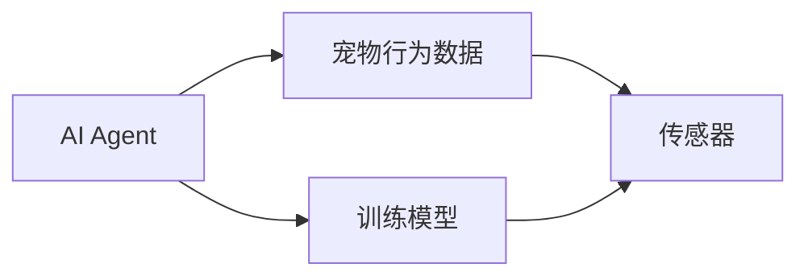
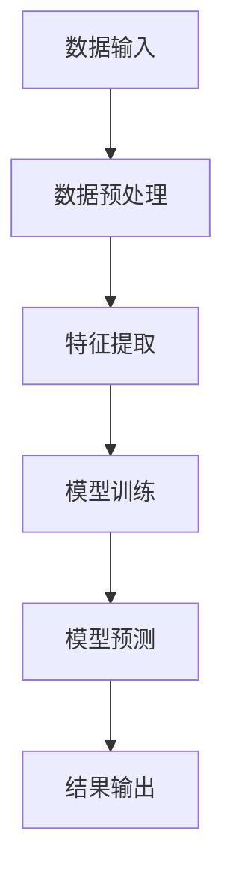
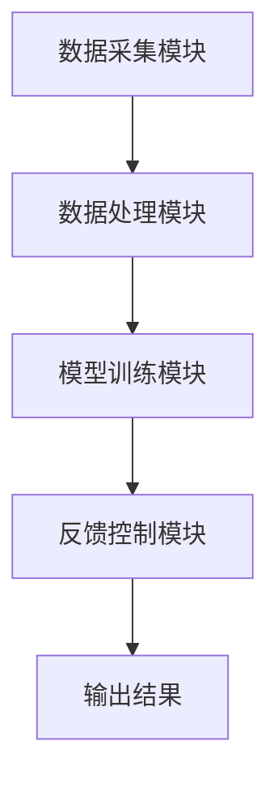

                 


# 智能宠物屋：AI Agent的宠物行为分析与训练

## 关键词：AI Agent，宠物行为分析，智能宠物屋，数据驱动，机器学习，实时分析，系统架构

## 摘要：  
随着人工智能技术的快速发展，宠物行为分析与训练已成为现代宠物养护的重要组成部分。本文将探讨如何利用AI Agent技术实现智能宠物屋的核心功能，包括宠物行为的实时分析、数据驱动的训练策略以及基于机器学习的系统架构设计。通过详细的技术分析和实战案例，本文将为AI开发者、宠物行为研究者及相关技术爱好者提供深度的技术指导。

---

## 正文

---

### 第1章：智能宠物屋的背景介绍

#### 1.1 AI Agent与宠物行为分析的背景
人工智能（AI）技术的快速发展为宠物行为分析带来了新的可能性。传统的宠物训练依赖于人类的经验和观察，而AI Agent（智能代理）能够通过传感器数据、图像识别和机器学习算法，实时分析宠物的行为模式，提供更加精准和高效的训练方案。

**1.1.1 AI Agent的定义与特点**
AI Agent是一种能够感知环境、执行任务并做出决策的智能系统。其特点包括：
- **自主性**：能够在没有外部干预的情况下自主运行。
- **反应性**：能够实时感知环境变化并做出反应。
- **学习能力**：通过机器学习算法不断优化行为模式。
- **可扩展性**：能够适应不同种类和数量的宠物。

**1.1.2 智能宠物屋的定义与背景**
智能宠物屋是一种结合了物联网（IoT）和AI技术的智能设备，能够实时监测宠物的行为、健康状况，并通过AI Agent提供个性化的训练和护理建议。

**1.1.3 宠物行为分析的重要性**
宠物行为分析对于理解宠物的心理状态、预防疾病以及提升训练效果具有重要意义。通过分析宠物的运动轨迹、情绪表达和社交行为，主人可以更好地照顾宠物，提高宠物的生活质量。

---

#### 1.2 智能宠物屋的核心问题
智能宠物屋的核心问题包括：
- **数据采集**：如何高效采集宠物的行为数据。
- **行为识别**：如何准确识别宠物的行为类型。
- **实时反馈**：如何快速响应宠物的行为变化。

AI Agent在宠物行为分析中的作用：
- 提供实时数据分析能力。
- 自动化识别宠物行为模式。
- 优化训练策略。

---

### 第2章：AI Agent与宠物行为分析的核心概念

#### 2.1 核心概念与联系
AI Agent与宠物行为分析的结合，使得智能宠物屋能够实现以下功能：
- **实时监测**：通过传感器和摄像头实时采集宠物的行为数据。
- **行为识别**：利用机器学习算法识别宠物的情绪、动作和健康状态。
- **智能反馈**：根据分析结果，自动调整训练策略。

**2.1.1 AI Agent的原理**
AI Agent通过感知环境、接收数据、分析数据并做出决策，实现对宠物行为的实时监控和干预。其工作流程包括：
1. 数据采集：通过传感器和摄像头获取宠物的行为数据。
2. 数据分析：利用机器学习算法对数据进行处理和分类。
3. 决策反馈：根据分析结果生成相应的训练策略或护理建议。

**2.1.2 宠物行为分析的核心要素**
- **数据来源**：包括传感器数据（如温度、湿度）和图像数据。
- **行为特征**：如宠物的运动轨迹、停留时间、行为频率等。
- **分析模型**：如支持向量机（SVM）、随机森林（Random Forest）等机器学习算法。

**2.1.3 AI Agent与宠物行为分析的关系**
AI Agent作为智能宠物屋的核心模块，通过数据驱动的方式实现宠物行为的实时分析和训练优化。

---

#### 2.2 核心概念对比
| **核心概念** | **AI Agent** | **宠物行为分析** |
|--------------|--------------|------------------|
| **原理**     | 数据驱动     | 统计分析         |
| **目标**     | 实时反馈     | 行为模式识别     |
| **优势**     | 自适应性     | 精准性           |

---

#### 2.3 实体关系图


---

### 第3章：数据预处理与特征提取

#### 3.1 数据预处理
数据预处理是宠物行为分析的关键步骤，主要包括：
- **数据清洗**：去除噪声数据和异常值。
- **数据标准化**：将不同传感器的数据归一化处理。
- **数据增强**：通过数据扩展技术提高模型的泛化能力。

#### 3.2 特征提取
特征提取是将原始数据转化为可用于机器学习的特征向量。常用的方法包括：
- **时间序列特征提取**：如均值、方差、周期性等。
- **图像特征提取**：如颜色直方图、边缘检测等。

---

### 第4章：算法原理与实现

#### 4.1 算法选择与原理
- **支持向量机（SVM）**：适用于分类任务，通过构建超平面实现数据的线性分离。
- **随机森林（Random Forest）**：适用于回归和分类任务，通过集成学习提高模型的准确率。

#### 4.2 算法流程图


#### 4.3 代码实现
```python
import numpy as np
from sklearn.svm import SVC
from sklearn.ensemble import RandomForestClassifier

# 数据预处理
data = np.array([...])
X = data[:, :-1]
y = data[:, -1]

# 模型训练
model = SVC()
model.fit(X, y)

# 模型预测
new_data = np.array([...])
predicted = model.predict(new_data)
```

#### 4.4 数学模型
- **SVM数学模型**：
  $$ \text{目标函数} = \sum_{i=1}^{n} \xi_i + C \sum_{i=1}^{n} \xi_i $$
  其中，$\xi_i$ 是松弛变量，$C$ 是惩罚系数。

- **随机森林数学模型**：
  $$ \text{预测值} = \sum_{i=1}^{n} \text{单棵树预测值} \times \text{权重} $$

---

### 第5章：系统分析与架构设计

#### 5.1 系统功能设计
核心功能包括：
- **数据采集模块**：通过传感器和摄像头采集宠物的行为数据。
- **数据处理模块**：对数据进行预处理和特征提取。
- **模型训练模块**：基于机器学习算法训练行为识别模型。
- **反馈控制模块**：根据分析结果生成训练策略。

#### 5.2 系统架构设计


#### 5.3 接口设计
- **输入接口**：传感器数据输入。
- **输出接口**：训练策略输出。
- **交互接口**：用户与系统之间的交互界面。

---

### 第6章：项目实战

#### 6.1 环境安装
安装所需的Python库：
```bash
pip install numpy scikit-learn matplotlib
```

#### 6.2 核心代码实现
```python
import numpy as np
from sklearn.model_selection import train_test_split
from sklearn.metrics import accuracy_score

# 数据加载
data = np.loadtxt('pet_behavior.csv', delimiter=',')
X = data[:, :-1]
y = data[:, -1]

# 数据划分
X_train, X_test, y_train, y_test = train_test_split(X, y, test_size=0.2)

# 模型训练
model = SVC()
model.fit(X_train, y_train)

# 模型预测
y_pred = model.predict(X_test)

# 结果评估
print("Accuracy:", accuracy_score(y_test, y_pred))
```

#### 6.3 案例分析
以宠物情绪识别为例，分析模型的准确率和召回率，并根据结果优化模型参数。

---

### 第7章：总结与展望

#### 7.1 总结
本文详细介绍了AI Agent在智能宠物屋中的应用，从数据预处理到算法实现，再到系统架构设计，为读者提供了全面的技术指导。

#### 7.2 优势与局限性
- **优势**：提高宠物行为分析的准确性和效率。
- **局限性**：数据依赖性强，模型优化需要大量计算资源。

#### 7.3 未来展望
随着深度学习技术的发展，智能宠物屋将更加智能化和个性化，为宠物养护带来更多的便利。

---

### 附录
- **术语表**：解释文章中涉及的专业术语。
- **参考文献**：列出文章中引用的相关文献和资料。

---

通过以上步骤，您可以系统地理解和实现AI Agent在智能宠物屋中的应用，为宠物行为分析与训练提供技术支持。

