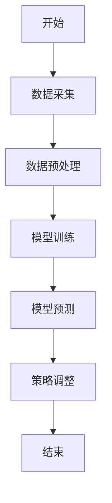
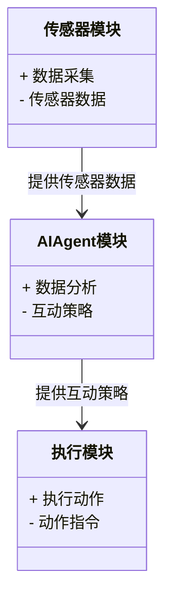

                 


# 智能宠物玩具：AI Agent的互动模式自适应

> 关键词：智能宠物玩具，AI Agent，互动模式自适应，机器学习，物联网，自适应算法

> 摘要：本文探讨了智能宠物玩具中AI Agent的互动模式自适应技术，详细分析了其背景、核心概念、算法原理、系统架构以及实际应用。通过结合传感器数据和机器学习算法，AI Agent能够实时调整互动策略，提升宠物的娱乐体验。

---

# 第一部分: 智能宠物玩具的背景与概念

## 第1章: 问题背景与需求分析

### 1.1 问题背景
#### 1.1.1 宠物互动需求的缺失
宠物作为家庭成员，需要持续的互动和关注，但传统宠物玩具缺乏智能性和自适应性，无法满足宠物的多样化需求。

#### 1.1.2 传统宠物玩具的功能局限
传统宠物玩具通常只能提供单一的互动模式，无法根据宠物的行为和情绪进行实时调整，导致宠物兴趣下降。

#### 1.1.3 宠物主人的需求痛点
宠物主人希望为宠物提供更智能、更个性化的玩具，但市场上缺乏能够自适应宠物行为的产品。

### 1.2 问题描述
#### 1.2.1 宠物互动模式的单一性问题
传统宠物玩具的互动模式固定，无法根据宠物的行为和情绪变化进行调整。

#### 1.2.2 用户需求的多样性
不同宠物有不同的性格和兴趣，需要个性化的互动模式。

#### 1.2.3 产品的目标与核心价值
通过引入AI Agent，实现互动模式的自适应，提升宠物的娱乐体验和主人的满意度。

### 1.3 技术现状与发展趋势
#### 1.3.1 AI技术在智能玩具中的应用
AI技术的进步为智能宠物玩具的发展提供了技术支持，如机器学习和自然语言处理。

#### 1.3.2 物联网技术在宠物玩具中的应用
物联网技术使得宠物玩具能够实时感知环境和宠物行为，并通过云端进行数据处理和分析。

#### 1.3.3 智能宠物玩具的市场趋势
随着人们对宠物关注度的提高，智能宠物玩具市场逐渐增长，AI Agent的应用成为行业趋势。

---

## 第2章: AI Agent与互动模式自适应

### 2.1 AI Agent的基本定义
#### 2.1.1 AI Agent的定义
AI Agent（人工智能代理）是一种能够感知环境、自主决策并执行任务的智能实体。

#### 2.1.2 AI Agent在宠物玩具中的角色
在智能宠物玩具中，AI Agent负责感知宠物行为，分析数据，并调整互动模式。

#### 2.1.3 AI Agent的核心功能模块
- **感知模块**：通过传感器获取宠物的行为数据。
- **分析模块**：利用机器学习算法分析数据，识别宠物的情绪和兴趣。
- **决策模块**：根据分析结果，生成个性化的互动策略。

### 2.2 互动模式自适应的原理
#### 2.2.1 自适应机制的基本概念
自适应机制是指系统能够根据环境和用户行为的变化，动态调整自身的策略和行为。

#### 2.2.2 互动模式的分类与特点
- **固定模式**：预先设定的互动方式，适用于简单场景。
- **自适应模式**：根据宠物行为实时调整互动方式，提供个性化体验。

#### 2.2.3 自适应算法的核心逻辑
自适应算法通过收集和分析宠物行为数据，利用机器学习模型预测宠物的兴趣，并动态调整互动策略。

### 2.3 核心概念的ER实体关系图
```mermaid
er
  actor: 宠物主人
  agent: AI Agent
  interaction_mode: 互动模式
  sensor_data: 传感器数据
  rules: 自适应规则
  actor --> agent: 提供反馈
  agent --> interaction_mode: 选择模式
  sensor_data --> agent: 提供数据
  rules --> interaction_mode: 确定规则
```

---

## 第3章: 算法原理与实现

### 3.1 机器学习算法的选择与实现
#### 3.1.1 机器学习模型的选择
- **监督学习**：用于分类宠物行为类型。
- **无监督学习**：用于发现宠物行为的隐含模式。

#### 3.1.2 算法实现步骤
1. 数据预处理：清洗和标准化传感器数据。
2. 模型训练：使用训练数据训练机器学习模型。
3. 模型评估：通过测试数据验证模型性能。
4. 模型部署：将模型集成到智能宠物玩具中。

#### 3.1.3 机器学习模型的数学表达
- 分类模型：$$ y = f(x) $$
- 回归模型：$$ y = \beta_0 + \beta_1x + \epsilon $$

### 3.2 自适应算法的设计与实现
#### 3.2.1 自适应算法的核心逻辑
1. 数据采集：通过传感器获取宠物的行为数据。
2. 数据分析：利用机器学习模型分析数据，识别宠物的情绪和兴趣。
3. 策略调整：根据分析结果，动态调整互动模式。

#### 3.2.2 自适应算法的流程图


---

## 第4章: 系统架构与设计

### 4.1 系统功能设计
#### 4.1.1 功能模块划分
- **传感器模块**：采集宠物的行为数据。
- **AI Agent模块**：分析数据并生成互动策略。
- **执行模块**：根据策略驱动玩具动作。

#### 4.1.2 功能模块的交互关系


### 4.2 系统架构设计
#### 4.2.1 系统架构图


---

## 第5章: 项目实战与案例分析

### 5.1 环境配置与开发工具
#### 5.1.1 环境配置
- **硬件**：传感器模块、单片机、蓝牙/WiFi模块。
- **软件**：Python编程语言，TensorFlow机器学习库。

#### 5.1.2 开发工具
- **代码编辑器**：Visual Studio Code。
- **数据分析工具**：Jupyter Notebook。

### 5.2 代码实现与分析
#### 5.2.1 传感器数据的采集与处理
```python
import numpy as np
import pandas as pd

# 采集传感器数据
data = pd.read_csv('sensor_data.csv')
# 数据预处理
data_clean = data.dropna()
```

#### 5.2.2 机器学习模型的训练与部署
```python
from sklearn.tree import DecisionTreeClassifier

# 训练决策树模型
model = DecisionTreeClassifier()
model.fit(X_train, y_train)
```

### 5.3 案例分析与效果评估
#### 5.3.1 实际案例分析
通过实际案例分析，验证AI Agent在互动模式自适应中的效果。

#### 5.3.2 系统性能评估
- **准确性**：模型预测的准确率。
- **响应时间**：系统对宠物行为的响应速度。
- **用户体验**：宠物主人和宠物的满意度。

---

## 第6章: 最佳实践与注意事项

### 6.1 最佳实践
#### 6.1.1 数据采集的注意事项
- 数据的完整性和准确性。
- 数据的实时性和连续性。

#### 6.1.2 算法优化的技巧
- 使用更复杂的模型提高准确性。
- 调整超参数优化模型性能。

### 6.2 注意事项
#### 6.2.1 系统安全
保护宠物数据的安全，防止数据泄露。

#### 6.2.2 用户隐私
确保宠物主人的隐私不被侵犯。

### 6.3 小结
通过本文的分析和实践，我们可以看到AI Agent在智能宠物玩具中的巨大潜力，同时也需要注意技术实现中的细节和挑战。

---

## 第7章: 拓展与展望

### 7.1 拓展方向
#### 7.1.1 多模态交互
结合视觉、听觉等多种感官刺激，提升互动体验。

#### 7.1.2 云端协同
利用云计算技术，实现数据的实时分析和模型的持续优化。

### 7.2 未来展望
随着AI和物联网技术的不断发展，智能宠物玩具将更加智能化和个性化，为宠物和主人带来更丰富的互动体验。

---

通过以上目录结构，我们可以全面、系统地探讨智能宠物玩具中AI Agent的互动模式自适应技术，从理论到实践，为相关领域的研究和应用提供有价值的参考。

