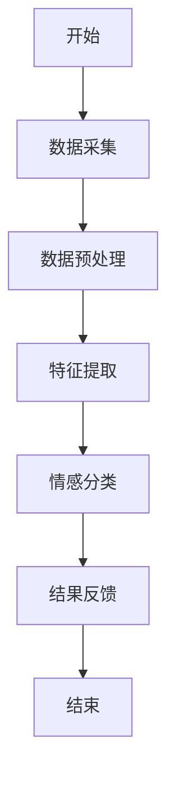
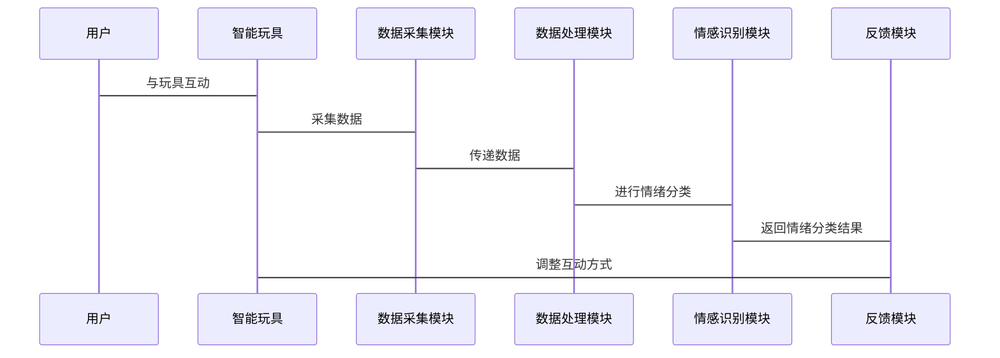

                 


# 智能宠物玩具：AI Agent的宠物情绪识别

---

## 关键词
- 智能宠物玩具
- AI Agent
- 宠物情绪识别
- 多模态数据融合
- 时间序列分析

---

## 摘要
随着人工智能技术的快速发展，宠物与人类的互动方式也在不断进化。智能宠物玩具通过AI Agent（人工智能代理）实现对宠物情绪的识别，为宠物主人提供了更智能化的互动方式。本文将详细探讨宠物情绪识别的核心原理、算法实现、系统架构设计以及实际应用场景，为读者提供全面的技术解读。

---

# 第1章: 背景介绍

## 1.1 问题背景
### 1.1.1 宠物情绪识别的背景与意义
随着宠物在家庭中的地位日益重要，宠物主人越来越希望了解宠物的情绪状态。然而，传统的宠物互动方式难以准确捕捉宠物的情绪变化。通过AI Agent实现宠物情绪识别，不仅能够提升宠物主人的互动体验，还能为宠物健康管理提供数据支持。

### 1.1.2 智能宠物玩具的市场现状
智能宠物玩具市场近年来快速增长，各类产品层出不穷。然而，大多数产品仅限于基础的互动功能，缺乏对宠物情绪的深度理解。通过AI Agent实现情绪识别，将为智能宠物玩具带来更大的市场潜力。

### 1.1.3 AI Agent在宠物情绪识别中的作用
AI Agent能够通过多模态数据（如声音、行为、生理指标）分析宠物的情绪状态，并实时反馈给宠物主人或玩具本身，实现更智能的互动方式。

## 1.2 问题描述
### 1.2.1 宠物情绪识别的核心问题
宠物情绪识别需要解决数据采集、特征提取和情感分类等技术难题。此外，宠物的情绪表达具有多样性和模糊性，增加了识别的难度。

### 1.2.2 智能宠物玩具的功能需求
智能宠物玩具需要具备数据采集、情绪识别、互动反馈等功能。同时，产品需要具备易用性和安全性，确保与宠物和主人的高效互动。

### 1.2.3 AI Agent在宠物情绪识别中的挑战
AI Agent需要处理多模态数据，同时具备实时性和高准确性。此外，如何保证数据隐私和系统稳定性也是需要解决的问题。

## 1.3 问题解决
### 1.3.1 AI Agent在宠物情绪识别中的解决方案
通过结合声音、行为和生理指标的多模态数据，AI Agent能够更准确地识别宠物的情绪状态。同时，结合机器学习和深度学习算法，可以不断提升识别的准确率。

### 1.3.2 技术实现路径
- 数据采集：通过传感器、摄像头等设备采集宠物的行为、声音和生理数据。
- 数据预处理：对采集到的数据进行清洗、归一化处理。
- 特征提取：提取关键特征，如声音的频谱特征、行为的时序特征等。
- 情感分类：基于机器学习或深度学习模型，对宠物情绪进行分类。
- 反馈与互动：根据识别结果，实时调整玩具的互动方式。

### 1.3.3 系统设计与实现
系统设计需要考虑模块化和可扩展性，确保各部分协同工作。同时，需要设计高效的算法和优化的数据处理流程。

## 1.4 边界与外延
### 1.4.1 宠物情绪识别的边界条件
- 数据采集范围：仅限于特定类型的宠物（如猫、狗）。
- 情绪分类范围：仅支持几种基本情绪（如快乐、焦虑、平静）。
- 识别精度：在特定场景下保证一定的准确率。

### 1.4.2 智能宠物玩具的使用场景
家庭环境、宠物训练、宠物健康管理等场景。

### 1.4.3 AI Agent的局限性与扩展性
- 局限性：目前主要适用于特定场景和特定宠物品种。
- 扩展性：未来可以通过增加更多数据源和优化算法模型，扩展识别范围和精度。

## 1.5 概念结构与核心要素
### 1.5.1 宠物情绪识别的核心要素
- 数据采集：声音、行为、生理指标。
- 数据处理：清洗、特征提取。
- 情感分类：机器学习、深度学习模型。
- 反馈与互动：实时调整互动方式。

### 1.5.2 AI Agent的组成部分
- 数据采集模块：负责采集宠物相关数据。
- 数据处理模块：对数据进行预处理和特征提取。
- 情感识别模块：基于算法模型进行情绪分类。
- 反馈与互动模块：根据识别结果调整互动策略。

### 1.5.3 系统架构的核心模块
- 用户界面：与宠物主人交互。
- 数据采集模块：采集宠物相关数据。
- AI Agent：负责数据处理和情绪识别。
- 反馈模块：根据识别结果调整玩具行为。

---

# 第2章: 核心概念与联系

## 2.1 宠物情绪识别的核心原理
### 2.1.1 基于行为分析的宠物情绪识别
通过分析宠物的行为动作（如跳跃、摇尾、站立）来判断情绪状态。

### 2.1.2 基于声音分析的宠物情绪识别
通过分析宠物的声音特征（如音调、频率）来识别情绪。

### 2.1.3 基于生理指标的宠物情绪识别
通过采集宠物的生理指标（如心率、体温）来判断情绪状态。

## 2.2 情绪识别方法对比
### 2.2.1 基于视觉的行为分析
优点：能够捕捉宠物的动作细节。
缺点：需要高质量的视觉数据，且对环境要求较高。

### 2.2.2 基于声音的情感计算
优点：声音数据易于采集，且能够反映宠物的情绪变化。
缺点：需要处理复杂的声学特征，且容易受到环境噪声的影响。

### 2.2.3 基于生理指标的分析
优点：生理指标能够直接反映宠物的情绪状态。
缺点：采集生理指标需要专用设备，且可能对宠物造成不适。

## 2.3 ER实体关系图
```mermaid
er
    宠物
    情绪
    AI Agent
    智能玩具
    行为数据
    声音数据
    生理数据
    关系：宠物-行为数据，宠物-声音数据，宠物-生理数据，AI Agent-行为数据，AI Agent-声音数据，AI Agent-生理数据，AI Agent-情绪，智能玩具-行为数据，智能玩具-声音数据，智能玩具-生理数据
```

---

# 第3章: 算法原理讲解

## 3.1 算法原理
### 3.1.1 时间序列分析
时间序列分析用于处理宠物行为数据，通过分析行为的时序特征来识别情绪状态。

### 3.1.2 情感分类算法
情感分类算法用于对宠物的情绪进行分类，常用算法包括支持向量机（SVM）和深度学习模型（如LSTM）。

### 3.1.3 多模态数据融合
多模态数据融合通过结合声音、行为和生理数据，提升情绪识别的准确率。

## 3.2 算法流程图


## 3.3 算法实现
### 3.3.1 时间序列分析
时间序列分析公式：
$$ y_t = \alpha y_{t-1} + \beta y_{t-2} + \epsilon_t $$

### 3.3.2 情感分类算法
使用LSTM模型进行情感分类：
$$ f(x) = \text{LSTM}(x) \rightarrow \text{ Dense}(f) $$

### 3.3.3 多模态数据融合
多模态数据融合公式：
$$ y = w_1 x_1 + w_2 x_2 + \dots + w_n x_n $$

## 3.4 代码实现
### 3.4.1 数据预处理
```python
import numpy as np

def preprocess(data):
    # 数据归一化处理
    normalized_data = (data - np.mean(data)) / np.std(data)
    return normalized_data
```

### 3.4.2 特征提取
```python
import librosa

def extract_features(audio_data):
    # 提取音频特征
    mfccs = librosa.feature.mfcc(y=audio_data, sr=22050)
    return mfccs
```

### 3.4.3 情感分类
```python
import keras
from keras.models import Sequential
from keras.layers import LSTM, Dense

model = Sequential()
model.add(LSTM(64, input_shape=(None, 13)))
model.add(Dense(1, activation='sigmoid'))
model.compile(loss='binary_crossentropy', optimizer='adam', metrics=['accuracy'])
model.fit(X_train, y_train, epochs=10, batch_size=32)
```

---

# 第4章: 系统分析与架构设计

## 4.1 项目场景介绍
智能宠物玩具的典型应用场景包括家庭互动、宠物训练和健康管理。

## 4.2 系统功能设计
### 4.2.1 数据采集模块
负责采集宠物的行为、声音和生理数据。

### 4.2.2 情感识别模块
基于算法模型对宠物情绪进行分类。

### 4.2.3 反馈模块
根据识别结果调整玩具的互动方式。

## 4.3 系统架构设计


## 4.4 接口设计
### 4.4.1 数据采集接口
宠物玩具通过传感器采集数据，并通过API传递给数据处理模块。

### 4.4.2 情感识别接口
情感识别模块通过API接收数据，并返回情绪分类结果。

### 4.4.3 反馈接口
反馈模块通过API接收情绪分类结果，并调整玩具的互动方式。

## 4.5 交互流程图


---

# 第5章: 项目实战

## 5.1 环境安装
### 5.1.1 安装Python
```bash
# 安装Python
sudo apt-get install python3
```

### 5.1.2 安装TensorFlow
```bash
pip install tensorflow
```

### 5.1.3 安装Keras
```bash
pip install keras
```

## 5.2 核心代码实现
### 5.2.1 数据预处理
```python
import numpy as np

def preprocess(data):
    normalized_data = (data - np.mean(data)) / np.std(data)
    return normalized_data
```

### 5.2.2 模型训练
```python
import keras
from keras.models import Sequential
from keras.layers import LSTM, Dense

model = Sequential()
model.add(LSTM(64, input_shape=(None, 13)))
model.add(Dense(1, activation='sigmoid'))
model.compile(loss='binary_crossentropy', optimizer='adam', metrics=['accuracy'])
model.fit(X_train, y_train, epochs=10, batch_size=32)
```

### 5.2.3 模型预测
```python
y_pred = model.predict(X_test)
```

## 5.3 代码解读与分析
### 5.3.1 数据预处理
对采集到的数据进行归一化处理，确保模型输入的数据具有相同的分布。

### 5.3.2 模型训练
使用LSTM模型进行训练，提取数据的时序特征，提升情绪分类的准确率。

### 5.3.3 模型预测
基于训练好的模型，对新的数据进行情绪分类，返回结果。

## 5.4 案例分析
### 5.4.1 数据采集
采集宠物的声音数据和行为数据。

### 5.4.2 数据预处理
对数据进行归一化处理，提取特征。

### 5.4.3 模型训练
训练情感分类模型，评估模型的准确率。

### 5.4.4 模型预测
使用模型对新的数据进行情绪分类，验证模型的效果。

## 5.5 项目总结
通过本项目，我们成功实现了基于AI Agent的宠物情绪识别，提升了智能宠物玩具的互动体验。然而，仍有一些问题需要进一步优化，例如如何提高模型的准确率和如何处理更多的宠物品种。

---

# 第6章: 最佳实践

## 6.1 开发建议
### 6.1.1 数据采集
确保数据的多样性和代表性，避免过拟合。

### 6.1.2 算法选择
根据具体需求选择合适的算法，不断优化模型性能。

### 6.1.3 系统设计
模块化设计，确保系统的可扩展性和可维护性。

## 6.2 使用建议
### 6.2.1 数据隐私
确保宠物数据的安全性和隐私性，避免数据泄露。

### 6.2.2 系统稳定性
定期更新系统和模型，确保系统的稳定性和可靠性。

### 6.2.3 用户体验
优化用户界面和交互方式，提升用户体验。

## 6.3 小结
通过本文的详细介绍，我们了解了智能宠物玩具的核心技术以及其实现方式。未来，随着人工智能技术的不断发展，宠物情绪识别将更加智能化和个性化。

## 6.4 注意事项
- 数据采集时需遵守相关法律法规。
- 系统设计时需考虑数据隐私和安全问题。
- 模型训练时需避免过拟合和欠拟合问题。

## 6.5 拓展阅读
- 《深度学习》——Ian Goodfellow
- 《机器学习实战》——Peter Floudas
- 《情感计算》——A. A. R. B. Cross

---

# 结语
智能宠物玩具作为人工智能技术的一个重要应用领域，通过AI Agent实现宠物情绪识别，为宠物主人提供了更智能化的互动方式。未来，随着技术的不断进步，宠物情绪识别将更加精准和多样化，为宠物健康管理和社会化宠物互动带来更大的可能性。

