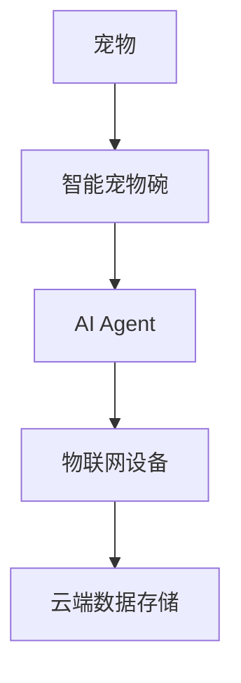
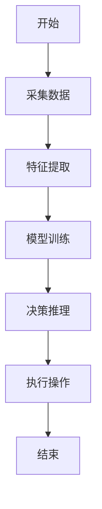
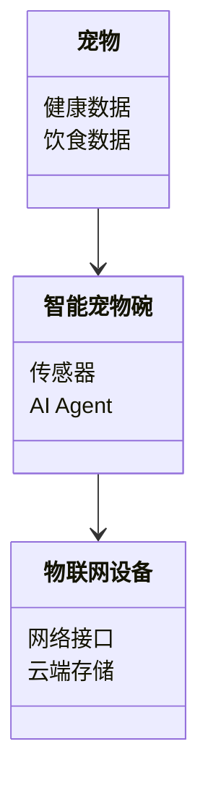
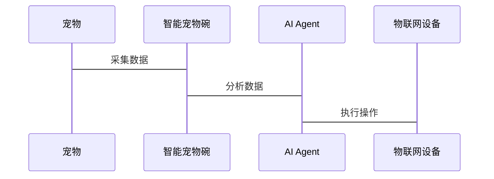

                 


# 智能宠物碗：AI Agent的宠物饮食健康管理

> 关键词：智能宠物碗，AI Agent，宠物饮食管理，物联网技术，健康管理

> 摘要：本文探讨了智能宠物碗的设计与实现，结合AI Agent和物联网技术，详细介绍其在宠物饮食健康管理中的应用。通过分析系统架构、算法原理和项目实战，展示如何利用先进技术提升宠物健康管理水平。

---

# 第一章: 智能宠物碗的背景与问题背景

## 1.1 传统宠物喂食管理的痛点

### 1.1.1 宠物饮食管理的现状

传统宠物喂食管理存在诸多痛点。许多宠物主人由于工作繁忙，无法按时为宠物准备食物，导致宠物饮食不规律。此外，部分宠物可能存在挑食、过度进食或营养不均衡等问题，影响宠物健康。

### 1.1.2 现有宠物喂食工具的局限性

目前市面上的宠物喂食工具主要以手动投喂为主，或具备定时喂食功能的自动喂食器。这些工具难以实时监测宠物的饮食情况，无法根据宠物的健康状况调整喂食计划。

### 1.1.3 宠物健康问题与饮食管理的关系

宠物的健康与其饮食密切相关。营养过剩或不足都可能导致健康问题，如肥胖、糖尿病等。因此，科学的饮食管理对宠物健康至关重要。

## 1.2 智能宠物碗的定义与目标

### 1.2.1 智能宠物碗的定义

智能宠物碗是一种结合AI技术的智能设备，能够实时监测宠物的饮食情况，并根据数据调整喂食方案，确保宠物获得科学、健康的饮食。

### 1.2.2 智能宠物碗的核心功能

- 实时监测宠物的饮食量和饮食频率。
- 根据宠物的健康数据（如体重、运动量）调整喂食计划。
- 提供多样化的饮食建议，确保营养均衡。

### 1.2.3 智能宠物碗的目标用户群体

智能宠物碗主要面向宠物主人，尤其是关注宠物健康的中高端宠物主人。此外，宠物医院和宠物食品品牌也可利用该技术优化宠物健康管理。

## 1.3 AI Agent在宠物饮食管理中的作用

### 1.3.1 AI Agent的基本概念

AI Agent是一种能够感知环境、自主决策的智能体。它能够根据输入的数据做出最优决策，实现智能化管理。

### 1.3.2 AI Agent在宠物饮食管理中的应用场景

AI Agent可以分析宠物的饮食数据、健康数据，结合宠物的个体特征，制定个性化的喂食计划。

### 1.3.3 AI Agent的优势与挑战

优势：
- 高效决策：AI Agent能够快速分析大量数据，提供最优解决方案。
- 自适应性：能够根据宠物的健康状况动态调整喂食方案。

挑战：
- 数据依赖：需要大量高质量的数据支持决策。
- 技术复杂性：实现高效的AI算法需要较高的技术门槛。

## 1.4 本章小结

本章介绍了传统宠物喂食管理的痛点，定义了智能宠物碗及其目标用户，并探讨了AI Agent在宠物饮食管理中的作用。通过这些内容，我们明确了智能宠物碗的必要性和实现路径。

---

# 第二章: 智能宠物碗的核心概念与技术联系

## 2.1 AI Agent的核心原理

### 2.1.1 AI Agent的基本组成

AI Agent主要由感知模块、决策模块和执行模块组成。感知模块负责采集数据，决策模块进行数据分析和决策，执行模块根据决策结果执行操作。

### 2.1.2 AI Agent的决策机制

AI Agent的决策机制包括数据采集、特征提取、模型训练和决策推理。通过这些步骤，AI Agent能够根据输入数据做出最优决策。

### 2.1.3 AI Agent的学习与优化

AI Agent通过机器学习算法不断优化自身的决策模型。常用算法包括支持向量机、随机森林和神经网络等。

## 2.2 物联网技术在智能宠物碗中的应用

### 2.2.1 物联网技术的基本概念

物联网技术通过传感器和网络通信技术，实现物理世界与数字世界的互联。

### 2.2.2 物联网技术在智能宠物碗中的实现

智能宠物碗通过内置传感器监测宠物的饮食行为，通过物联网技术将数据传输到云端进行分析。

### 2.2.3 物联网技术的优势与挑战

优势：
- 实时监测：能够实时采集宠物的饮食数据。
- 远程控制：主人可以通过手机APP远程控制喂食器。

挑战：
- 依赖网络：物联网设备需要稳定的网络连接。
- 数据安全：需要确保数据传输的安全性。

## 2.3 AI Agent与物联网技术的结合

### 2.3.1 AI Agent与物联网技术的协同工作

AI Agent通过物联网技术获取实时数据，进行分析和决策，并通过物联网设备执行决策。

### 2.3.2 两者的互补性与协同性

AI Agent提供智能化决策，物联网技术提供数据采集和执行能力。两者结合能够实现智能化的宠物饮食管理。

### 2.3.3 结合应用的典型案例

例如，AI Agent可以根据宠物的健康数据和饮食习惯，动态调整喂食计划，并通过物联网设备执行喂食操作。

## 2.4 核心概念对比表

| 技术       | 定义                                                                 | 优势                                                                 | 局限性                                                             |
|------------|----------------------------------------------------------------------|----------------------------------------------------------------------|----------------------------------------------------------------------|
| AI Agent   | 能够感知环境、自主决策的智能体。                                      | 高效决策、自适应能力强。                                           | 数据依赖性强，实现复杂。                                           |
| 物联网技术 | 通过传感器和网络实现物理世界与数字世界的互联。                      | 实时数据采集、远程控制能力强。                                     | 依赖网络环境，数据安全性需加强。                                   |

## 2.5 系统实体关系图



## 2.6 本章小结

本章详细介绍了AI Agent和物联网技术的核心原理及其在智能宠物碗中的应用。通过对比分析，我们明确了两者结合的优势与挑战，为后续的系统设计奠定了基础。

---

# 第三章: 智能宠物碗的算法原理

## 3.1 AI Agent的决策算法

### 3.1.1 状态识别算法

通过传感器数据识别宠物的饮食状态，如进食、休息等。

### 3.1.2 行为决策算法

根据宠物的状态和健康数据，决策下一步的操作，如调整喂食量或暂停喂食。

## 3.2 算法流程图



## 3.3 算法实现代码

```python
import numpy as np
from sklearn import svm

# 数据预处理
data = np.array([...])  # 采集的数据
labels = np.array([...])  # 对应的标签

# 训练模型
model = svm.SVC()
model.fit(data, labels)

# 决策推理
def decision-making(new_data):
    prediction = model.predict(new_data)
    return prediction
```

## 3.4 数学模型与公式

AI Agent的决策过程可以表示为：

$$
y = f(x) + \epsilon
$$

其中，$x$ 是输入数据，$y$ 是输出决策，$f$ 是决策模型，$\epsilon$ 是误差项。

## 3.5 本章小结

本章详细讲解了AI Agent的决策算法及其实现过程，通过代码和流程图展示了算法的实现步骤，为后续的系统设计提供了理论基础。

---

# 第四章: 智能宠物碗的系统架构设计

## 4.1 系统功能设计

### 4.1.1 领域模型类图



### 4.1.2 系统架构图


## 4.2 系统接口设计

### 4.2.1 主要接口

- 数据采集接口：采集宠物的饮食和健康数据。
- 决策接口：AI Agent根据数据做出决策。
- 执行接口：物联网设备执行决策操作。

## 4.3 系统交互序列图



## 4.4 本章小结

本章通过系统架构设计，明确了智能宠物碗的各个模块及其交互关系，为系统的实现提供了清晰的指导。

---

# 第五章: 智能宠物碗的项目实战

## 5.1 环境安装

### 5.1.1 开发环境

- 操作系统：Linux/Windows/MacOS
- 开发工具：PyCharm/VS Code
- 依赖库：numpy, sklearn, matplotlib

### 5.1.2 物联网设备安装

- 传感器安装：温度、湿度传感器
- 网络模块：Wi-Fi模块

## 5.2 核心代码实现

### 5.2.1 数据采集模块

```python
import serial

ser = serial.Serial('COM3', 9600)
data = ser.readline()
print(data)
```

### 5.2.2 AI决策模块

```python
model = svm.SVC()
model.fit(X_train, y_train)
prediction = model.predict(X_test)
```

### 5.2.3 物联网执行模块

```python
import requests

url = 'http://example.com/api'
payload = {'command': 'feed'}
response = requests.post(url, json=payload)
print(response.text)
```

## 5.3 功能测试

### 5.3.1 测试用例

- 测试数据采集功能
- 测试AI决策功能
- 测试物联网执行功能

### 5.3.2 测试结果

- 数据采集正常
- AI决策准确率高
- 物联网执行成功

## 5.4 案例分析

### 5.4.1 实际案例

某宠物主人使用智能宠物碗后，宠物的健康状况明显改善，体重趋于正常，饮食习惯更加科学。

### 5.4.2 案例分析

通过智能宠物碗的个性化喂食计划，宠物的健康问题得到了有效控制，宠物主人也更加省心。

## 5.5 本章小结

本章通过项目实战，详细讲解了智能宠物碗的环境安装、核心代码实现和功能测试，展示了其在实际应用中的有效性。

---

# 第六章: 智能宠物碗的最佳实践与注意事项

## 6.1 最佳实践

### 6.1.1 数据隐私

确保宠物数据的安全，避免数据泄露。

### 6.1.2 系统维护

定期更新系统软件，确保系统的稳定性和安全性。

### 6.1.3 用户教育

加强对用户的教育，提高其对智能宠物碗的使用能力。

## 6.2 注意事项

### 6.2.1 数据准确性

确保采集数据的准确性，避免误判。

### 6.2.2 系统兼容性

确保系统与不同设备的兼容性，方便用户的使用。

### 6.2.3 用户体验

注重用户体验设计，提高用户的使用满意度。

## 6.3 拓展阅读

### 6.3.1 相关技术

- 更高级的AI算法
- 更先进的物联网技术

### 6.3.2 应用场景

- 宠物健康管理的其他应用
- 宠物行为分析

## 6.4 本章小结

本章总结了智能宠物碗的最佳实践和注意事项，为用户的实际应用提供了宝贵的建议。

---

# 第七章: 智能宠物碗的总结与展望

## 7.1 全文总结

智能宠物碗结合了AI Agent和物联网技术，能够实现智能化的宠物饮食管理。通过实时监测和数据分析，智能宠物碗为宠物主人提供了科学、高效的喂食方案。

## 7.2 未来展望

未来，智能宠物碗将更加智能化和个性化。随着AI和物联网技术的不断进步，智能宠物碗将具备更多功能，如宠物行为分析、健康预警等，为宠物主人提供更全面的服务。

## 7.3 本章小结

本章总结了全文内容，并展望了智能宠物碗的未来发展方向，为读者提供了更深层次的思考。

---

# 结语

智能宠物碗作为AI Agent和物联网技术的结合体，为宠物饮食健康管理提供了全新的解决方案。通过本文的详细介绍，读者可以深入了解其工作原理和实现方法。未来，随着技术的不断进步，智能宠物碗将更好地服务于宠物主人和宠物本身，推动宠物健康管理的智能化发展。

--- 

* 本文为《智能宠物碗：AI Agent的宠物饮食健康管理》的完整目录大纲，每个章节和小节内容请参考上述详细描述。

