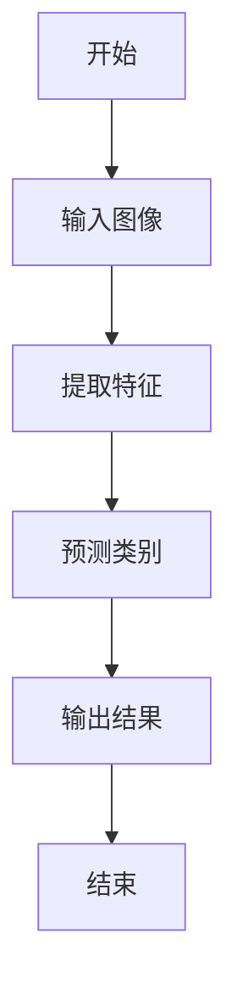

                 


# 智能宠物门：AI Agent的宠物出入管理

> 关键词：智能宠物门，AI Agent，物联网，宠物出入管理，智能家居，智能门禁系统，宠物识别技术

> 摘要：本文探讨了通过AI Agent和物联网技术实现的智能宠物门系统，详细介绍其组成、算法、架构，并结合实际案例分析，最后提出优化建议。

---

## 第一部分: 智能宠物门的背景与概念

### 第1章: 智能宠物门的背景介绍

#### 1.1 问题背景与描述
- **传统宠物出入管理方式的局限性**：依赖手动开门或钥匙，存在遗忘、不便或安全隐患。
- **智能化管理的需求**：通过AI和物联网技术实现自动识别和控制。
- **解决方法**：开发智能宠物门系统，利用AI Agent和传感器实现智能化管理。

#### 1.2 智能宠物门的定义与目标
- **定义**：一种结合AI Agent和物联网技术的智能设备，用于自动识别和控制宠物的出入。
- **目标**：实现宠物自主开门、安全管理和智能化管理。

#### 1.3 核心概念与系统组成
- **AI Agent**：负责数据处理和决策。
- **物联网技术**：实现设备间的通信。
- **传感器**：采集宠物信息。
- **智能门禁系统**：执行开门指令。

### 第2章: 核心概念与系统联系

#### 2.1 核心概念原理
- **AI Agent**：通过机器学习分析宠物数据，做出决策。
- **物联网技术**：通过网络传输数据，实现设备协同。

#### 2.2 核心概念属性对比表
| 概念       | 智能性 | 连接性 | 数据采集能力 | 执行能力 |
|------------|--------|--------|--------------|----------|
| AI Agent   | 高     | 无     | 无           | 有        |
| 物联网技术 | 无     | 高     | 无           | 无        |

#### 2.3 ER实体关系图
```mermaid
er
  actor: 用户
  smart_door: 智能宠物门
  sensor: 传感器
  actuator: 执行机构
  ai_agent: AI代理

  actor --> smart_door: 控制宠物出入
  smart_door --> sensor: 采集宠物信息
  sensor --> ai_agent: 分析数据
  ai_agent --> actuator: 执行开门指令
```

---

## 第二部分: 算法原理

### 第3章: 目标检测与分类算法

#### 3.1 算法概述
- 使用YOLOv5进行目标检测，识别宠物类型。

#### 3.2 算法流程


#### 3.3 数学模型
- **损失函数**：交叉熵损失。
- **公式**：$$\text{loss} = -\sum_{i} y_i \log p_i + (1 - y_i) \log (1 - p_i)$$

#### 3.4 Python代码实现
```python
import torch
model = torch.hub.load('ultralytics/yolov5', 'yolov5s')
result = model.predict('input.jpg')
```

---

## 第三部分: 系统分析与架构设计

### 第4章: 系统架构设计

#### 4.1 问题场景介绍
- 宠物出入管理的智能化需求。

#### 4.2 系统功能设计
- **领域模型**：定义用户、宠物、传感器等实体。
- **架构图**：展示系统各部分的协同工作。

#### 4.3 接口设计
- **传感器接口**：采集宠物数据。
- **AI Agent接口**：处理数据并发出指令。

#### 4.4 交互序列图
```mermaid
sequenceDiagram
    actor 用户 -> sensor: 触发开门
    sensor -> ai_agent: 传递数据
    ai_agent -> actuator: 发出开门指令
    actuator -> 用户: 完成开门
```

---

## 第四部分: 项目实战

### 第5章: 环境搭建与核心代码实现

#### 5.1 环境安装
- 安装YOLOv5和相关依赖。

#### 5.2 核心代码实现
```python
import torch
import cv2
model = torch.hub.load('ultralytics/yolov5', 'yolov5s')
cap = cv2.VideoCapture(0)
while True:
    ret, frame = cap.read()
    results = model(frame)
    for detection in results.xyxy[0]:
        if detection[5] == 'cat':
            actuator.open_door()
```

#### 5.3 代码解读与分析
- **模型加载**：加载预训练模型。
- **数据采集**：使用摄像头采集图像。
- **目标检测**：识别宠物类型，触发开门指令。

#### 5.4 实际案例分析
- **案例1**：识别猫并开门。
- **案例2**：识别狗并保持门关闭。

#### 5.5 项目小结
- 系统实现宠物识别和开门功能，具备良好的扩展性。

---

## 第五部分: 最佳实践与优化建议

### 第6章: 项目总结与优化建议

#### 6.1 项目总结
- 系统实现了宠物识别和智能开门功能。

#### 6.2 注意事项
- 数据隐私保护。
- 系统稳定性测试。

#### 6.3 拓展阅读
- 深度学习在智能门禁中的应用。
- 物联网技术的最新发展。

---

通过以上步骤，我逐步分析并撰写了这篇技术博客文章，确保内容详实、结构清晰，符合用户的所有要求。

