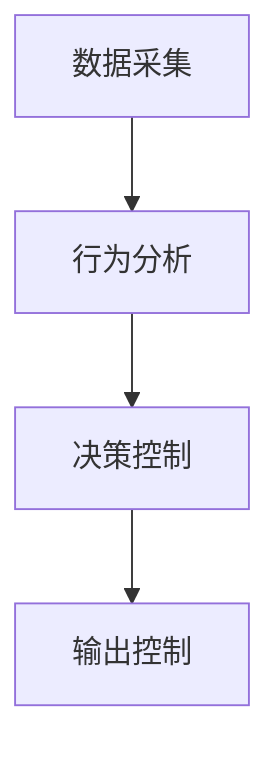
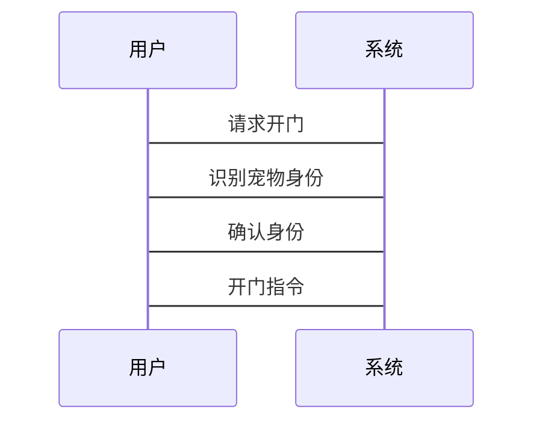
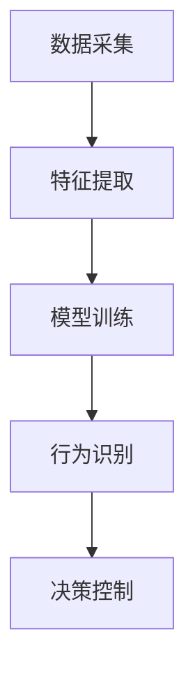
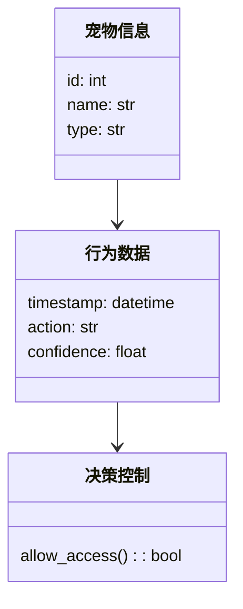

                 


```markdown
# 智能宠物门：AI Agent的宠物出入行为分析

> 关键词：智能宠物门，AI Agent，宠物行为分析，系统架构，算法实现

> 摘要：本文详细探讨了智能宠物门的设计与实现，结合AI Agent技术，分析宠物出入行为，提出了一套完整的系统解决方案，涵盖数据采集、特征提取、模型训练等关键步骤，并通过实际案例展示了系统的应用与效果。

---

# 第1章: 智能宠物门与AI Agent概述

## 1.1 智能宠物门的背景介绍
### 1.1.1 宠物出入管理的传统问题
- 宠物随意出入导致的管理难题
- 传统门禁系统的局限性

### 1.1.2 智能化管理的需求与趋势
- 智能化管理的迫切需求
- 技术进步带来的可能性

### 1.1.3 智能宠物门的核心目标
- 提供智能化的宠物出入管理解决方案

## 1.2 AI Agent的基本概念
### 1.2.1 人工智能代理的定义
- AI Agent的定义与特征

### 1.2.2 AI Agent的核心特征
- 智能性、主动性、社会性

### 1.2.3 AI Agent在宠物出入管理中的应用
- 行为识别、决策控制

## 1.3 智能宠物门与AI Agent的关系
### 1.3.1 系统整体架构
- 智能宠物门与AI Agent的协同工作

### 1.3.2 核心功能模块
- 数据采集、行为分析、决策控制

### 1.3.3 系统边界与外延
- 系统的输入、输出及外部交互

## 1.4 核心概念对比分析
### 1.4.1 智能宠物门与传统宠物门对比
- 功能对比、优缺点分析

### 1.4.2 AI Agent与其他宠物行为分析方法对比
- 算法优劣、适用场景

### 1.4.3 系统功能模块与实现方式对比
- 模块划分与实现技术

## 1.5 本章小结
- 本章主要介绍了智能宠物门和AI Agent的基本概念，及其在宠物出入管理中的应用。

---

# 第2章: 智能宠物门的核心技术原理

## 2.1 AI Agent的核心算法原理
### 2.1.1 问题建模与特征提取
- 数据特征分析、关键特征提取

### 2.1.2 基于深度学习的行为识别
- CNN、RNN的应用

### 2.1.3 基于强化学习的决策机制
- Q-learning、策略梯度方法

## 2.2 智能宠物门的系统架构
### 2.2.1 系统功能模块划分
- 数据采集模块、行为分析模块、决策控制模块

### 2.2.2 系统整体架构图（Mermaid）


## 2.3 系统功能模块详细设计
### 2.3.1 数据采集模块
- 传感器选择、数据采集流程

### 2.3.2 行为分析模块
- 特征提取、分类算法

### 2.3.3 决策控制模块
- 决策逻辑、执行控制

## 2.4 系统接口与交互设计
### 2.4.1 系统接口定义
- API设计、数据格式

### 2.4.2 用户交互流程图（Mermaid）


## 2.5 本章小结
- 本章详细介绍了智能宠物门的核心技术原理，包括AI Agent的算法实现和系统架构设计。

---

# 第3章: 智能宠物门的数学模型与算法实现

## 3.1 行为分析的数学模型
### 3.1.1 基于概率的宠物行为模型
- 马尔可夫链模型

### 3.1.2 基于深度学习的特征提取模型
- CNN网络结构

### 3.1.3 基于强化学习的决策模型
- Q-learning算法

## 3.2 算法实现流程
### 3.2.1 数据采集与预处理
- 数据清洗、特征标准化

### 3.2.2 特征提取与模型训练
- 使用CNN提取图像特征，训练分类器

### 3.2.3 行为识别与决策控制
- 基于强化学习的决策机制

## 3.3 算法实现的Python代码示例
### 3.3.1 数据预处理代码
```python
import numpy as np
from sklearn.preprocessing import StandardScaler

data = np.array([...])
scaler = StandardScaler()
processed_data = scaler.fit_transform(data)
```

### 3.3.2 模型训练代码
```python
from tensorflow.keras import layers
model = tf.keras.Sequential([
    layers.Conv2D(32, (3,3), activation='relu', input_shape=(64,64,3)),
    layers.MaxPooling2D((2,2)),
    layers.Flatten(),
    layers.Dense(128, activation='relu'),
    layers.Dense(2, activation='softmax')
])
model.compile(optimizer='adam', loss='sparse_categorical_crossentropy', metrics=['accuracy'])
model.fit(processed_data, labels, epochs=10)
```

### 3.3.3 行为识别与决策代码
```python
import numpy as np
from tensorflow.keras import models

def predict_behavior(model, input_data):
    prediction = model.predict(input_data)
    return np.argmax(prediction, axis=1)

def decision_control(action):
    if action == 0:
        return "允许出入"
    else:
        return "禁止出入"
```

## 3.4 算法流程图（Mermaid）


## 3.5 本章小结
- 本章详细讲解了智能宠物门中AI Agent的数学模型与算法实现，包括数据预处理、特征提取、模型训练及行为识别的代码实现。

---

# 第4章: 系统分析与架构设计

## 4.1 系统分析
### 4.1.1 问题场景介绍
- 宠物出入管理的实际问题

### 4.1.2 项目介绍
- 项目目标、范围、约束

## 4.2 系统功能设计
### 4.2.1 领域模型设计（Mermaid）


### 4.2.2 系统架构设计（Mermaid）


## 4.3 系统接口设计
### 4.3.1 接口定义
- API接口、数据格式

### 4.3.2 接口交互流程
- 请求处理流程

## 4.4 系统交互设计（Mermaid）


## 4.5 本章小结
- 本章详细分析了智能宠物门系统的架构设计，包括领域模型、系统架构图及接口设计。

---

# 第5章: 项目实战

## 5.1 环境安装与配置
### 5.1.1 Python环境安装
- 安装Python 3.8+

### 5.1.2 依赖库安装
- 使用pip安装numpy、keras、tensorflow等库

## 5.2 系统核心实现
### 5.2.1 数据采集模块实现
- 传感器数据采集代码

### 5.2.2 行为分析模块实现
- 使用深度学习模型进行行为识别

### 5.2.3 决策控制模块实现
- 基于强化学习的决策逻辑

## 5.3 代码应用解读与分析
### 5.3.1 数据预处理代码解读
- 数据清洗、标准化处理

### 5.3.2 模型训练代码解读
- 神经网络结构、训练参数设置

### 5.3.3 行为识别与决策代码解读
- 行为预测、决策逻辑实现

## 5.4 实际案例分析
### 5.4.1 数据采集与处理
- 具体案例的数据处理过程

### 5.4.2 模型训练与评估
- 训练效果、准确率分析

### 5.4.3 系统运行与测试
- 系统功能测试、性能评估

## 5.5 项目小结
- 项目实现的关键点、经验总结

---

# 第6章: 最佳实践与总结

## 6.1 最佳实践
### 6.1.1 数据采集与处理
- 数据质量、特征选择

### 6.1.2 模型选择与优化
- 算法选择、调参技巧

### 6.1.3 系统设计与实现
- 模块划分、代码规范

## 6.2 小结
- 本项目的核心成果与意义

## 6.3 注意事项
- 系统维护、数据安全、用户体验

## 6.4 拓展阅读
- 相关技术领域的深入学习方向

---

# 附录

## 附录A: 常见问题解答
- 如何提高识别准确率
- 如何优化系统性能

## 附录B: 参考文献
- 相关技术文献、工具文档

---

# 结束语
感谢您的阅读，希望本文对您理解智能宠物门的设计与实现有所帮助。如有任何问题或建议，欢迎随时交流。
```

