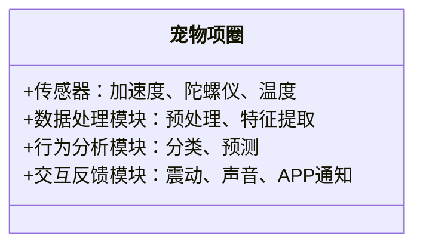
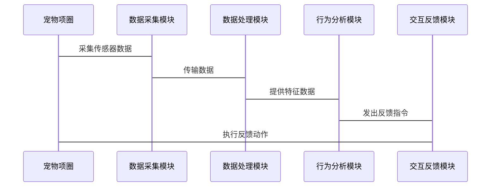

                 


```markdown
# 智能宠物项圈：AI Agent的宠物行为分析

> 关键词：智能宠物项圈，AI Agent，宠物行为分析，机器学习，行为预测，异常检测

> 摘要：智能宠物项圈是一种结合了人工智能技术的新型宠物健康管理设备，通过AI Agent实时感知和分析宠物的行为数据，为宠物主人提供科学的健康管理和互动建议。本文将详细探讨智能宠物项圈的背景、核心概念、算法原理、系统架构设计以及实际应用案例，全面解析AI Agent在宠物行为分析中的作用和价值。

---

## 第一章：智能宠物项圈的发展背景

### 1.1 智能宠物项圈的定义与特点

#### 1.1.1 智能宠物项圈的定义
智能宠物项圈是一种集成了多种传感器和AI技术的 wearable device，能够实时采集宠物的行为数据，如运动状态、心率、体温等，并通过AI算法分析这些数据，为宠物主人提供健康监测、行为分析和互动建议。

#### 1.1.2 智能宠物项圈的核心特点
- **实时监测**：通过传感器持续采集宠物的生理数据和行为数据。
- **AI驱动**：利用AI算法分析数据，识别宠物的行为模式和健康状况。
- **交互功能**：通过震动、声音或APP通知与宠物互动。
- **远程监控**：支持通过手机APP远程查看宠物的状态和历史数据。

#### 1.1.3 智能宠物项圈与传统宠物项圈的区别
| 特性                 | 传统宠物项圈       | 智能宠物项圈       |
|----------------------|-------------------|-------------------|
| 功能                 | 基本定位、防走失   | 实时监测、行为分析 |
| 技术                 | 简单传感器         | 多传感器+AI算法   |
| 交互方式             | 被动响应           | 主动分析与反馈     |
| 数据处理             | 无数据处理         | 数据采集与分析     |

### 1.2 AI Agent的基本概念

#### 1.2.1 人工智能代理的定义
AI Agent（人工智能代理）是一种能够感知环境、自主决策并执行任务的智能实体。它能够通过传感器获取信息，利用算法处理数据，并通过执行器与环境交互。

#### 1.2.2 AI Agent的核心功能与特点
- **感知能力**：通过传感器获取环境数据。
- **推理能力**：利用算法分析数据，识别模式和异常。
- **决策能力**：基于分析结果做出决策并执行动作。

#### 1.2.3 AI Agent在智能宠物项圈中的应用
AI Agent在智能宠物项圈中主要负责数据采集、行为分析和决策反馈。例如，当宠物表现出异常行为（如过度活动或静止不动），AI Agent会触发预警机制，通知宠物主人。

---

## 第二章：智能宠物项圈的现状与意义

### 2.1 智能宠物项圈的市场现状

#### 2.1.1 智能宠物项圈的市场发展
近年来，随着宠物经济的快速发展，智能宠物项圈市场呈现快速增长态势。根据市场调研，预计到2025年，全球智能宠物项圈市场规模将超过50亿美元。

#### 2.1.2 智能宠物项圈的主要应用场景
- **健康监测**：实时监测宠物的生理指标，如心率、体温等。
- **行为分析**：识别宠物的情绪状态和行为模式。
- **防走失**：通过GPS定位功能，帮助宠物主人快速找到走失的宠物。

#### 2.1.3 智能宠物项圈的技术发展趋势
- **多传感器融合**：结合加速度、陀螺仪、温度等多传感器数据，提高行为分析的准确性。
- **AI算法优化**：通过深度学习和强化学习提升行为识别的准确率。
- **物联网集成**：与智能家居设备联动，提供更智能的宠物管理体验。

### 2.2 智能宠物项圈的意义

#### 2.2.1 提升宠物健康管理的效率
通过实时监测宠物的生理数据和行为模式，智能宠物项圈能够帮助主人及时发现健康问题，提供科学的健康管理建议。

#### 2.2.2 优化宠物与主人的互动体验
智能宠物项圈通过分析宠物的情绪状态，提供个性化的互动建议，增强宠物与主人之间的情感交流。

#### 2.2.3 推动AI技术在宠物领域的应用
智能宠物项圈作为AI技术在宠物领域的重要应用之一，推动了AI技术在动物行为研究和健康管理中的应用和发展。

---

## 第三章：AI Agent的基本原理

### 3.1 AI Agent的感知与推理机制

#### 3.1.1 感知层的传感器数据采集
智能宠物项圈通过集成多种传感器（如加速度传感器、陀螺仪、温度传感器等）采集宠物的行为数据。数据采集过程如下：

1. 传感器采集原始数据。
2. 数据预处理（去噪、特征提取）。
3. 数据传输到AI算法模块。

#### 3.1.2 数据融合与特征提取
为了提高数据的准确性和可靠性，需要对多源传感器数据进行融合。常用的数据融合方法包括：
- 时间序列分析
- 主成分分析（PCA）
- 挑战：如何处理传感器数据的延迟和噪声问题？

#### 3.1.3 基于机器学习的推理模型
AI Agent通过机器学习算法对数据进行分析和推理。常用的算法包括：
- 支持向量机（SVM）
- 随机森林（Random Forest）
- 神经网络（CNN、RNN）

### 3.2 宠物行为分析的核心技术

#### 3.2.1 基于传感器的数据分析
通过分析加速度和陀螺仪数据，识别宠物的运动状态（如静止、行走、奔跑）。

#### 3.2.2 基于AI的模式识别
利用深度学习模型（如卷积神经网络）对宠物的行为模式进行分类，例如识别宠物是玩耍、休息还是焦虑。

#### 3.2.3 行为预测与异常检测
基于历史数据，预测宠物未来的行为模式，并检测异常行为（如宠物长时间不动可能表示健康问题）。

---

## 第四章：宠物行为分析的关键技术

### 4.1 数据采集与预处理

#### 4.1.1 传感器数据的采集方法
智能宠物项圈通常集成以下传感器：
- 加速度传感器：测量宠物的运动状态。
- 陀螺仪：测量宠物的旋转角度。
- 温度传感器：测量宠物的体温。

#### 4.1.2 数据清洗与特征提取
数据清洗步骤包括：
1. 去除噪声数据。
2. 标准化数据格式。
3. 填充缺失值。

特征提取可以使用主成分分析（PCA）或小波分析等方法。

#### 4.1.3 数据标注与标注工具
为了训练AI模型，需要对宠物行为进行标注。常用的标注工具包括：
- Label Studio
- CVAT

### 4.2 行为分析模型的构建

#### 4.2.1 基于深度学习的行为识别模型
使用卷积神经网络（CNN）对宠物行为进行分类。模型结构如下：


#### 4.2.2 基于传统机器学习的行为分类模型
使用随机森林对宠物行为进行分类。训练流程如下：

1. 数据预处理：归一化、特征选择。
2. 模型训练：随机森林。
3. 模型评估：准确率、召回率、F1分数。

#### 4.2.3 模型训练与优化
- 使用交叉验证优化模型参数。
- 通过网格搜索选择最佳模型。

---

## 第五章：AI Agent的行为预测与异常检测

### 5.1 基于机器学习的行为预测

#### 5.1.1 时间序列分析
使用LSTM（长短期记忆网络）进行时间序列预测。模型结构如下：


#### 5.1.2 行为分类的数学模型
LSTM的损失函数可以使用交叉熵损失函数：

$$ L = -\frac{1}{N}\sum_{i=1}^{N} y_i \log(p_i) + (1 - y_i)\log(1 - p_i) $$

其中，$y_i$是真实标签，$p_i$是预测概率。

### 5.2 异常检测

#### 5.2.1 基于统计的方法
使用Z-score方法检测异常：

$$ Z = \frac{x - \mu}{\sigma} $$

其中，$\mu$是均值，$\sigma$是标准差。

#### 5.2.2 基于机器学习的方法
使用Isolation Forest算法检测异常。

#### 5.2.3 异常检测的案例分析
假设有一只宠物在正常情况下，心率范围是80-120 bpm。当心率突然下降到70 bpm，AI Agent会触发预警机制。

---

## 第六章：智能宠物项圈的系统设计与实现

### 6.1 系统架构设计

#### 6.1.1 系统功能设计
系统功能模块包括：
- 数据采集模块：采集宠物行为数据。
- 数据处理模块：预处理和特征提取。
- 行为分析模块：分类和预测。
- 交互反馈模块：震动、声音或APP通知。

#### 6.1.2 系统架构图


### 6.2 系统接口设计

#### 6.2.1 系统接口设计
- 数据采集接口：通过蓝牙或Wi-Fi与手机APP通信。
- API接口：提供第三方开发者调用的接口。

#### 6.2.2 系统交互流程


---

## 第七章：项目实战与案例分析

### 7.1 项目实战

#### 7.1.1 环境搭建
- 安装Python、TensorFlow、Keras等工具。
- 下载宠物行为数据集。

#### 7.1.2 核心代码实现
```python
import numpy as np
from tensorflow.keras.models import Sequential
from tensorflow.keras.layers import LSTM, Dense, Dropout

# 构建LSTM模型
model = Sequential()
model.add(LSTM(64, input_shape=(timesteps, features)))
model.add(Dropout(0.2))
model.add(Dense(1, activation='sigmoid'))
model.compile(loss='binary_crossentropy', optimizer='adam', metrics=['accuracy'])
```

#### 7.1.3 测试与优化
- 使用测试数据评估模型性能。
- 调整模型参数，优化准确率和召回率。

### 7.2 案例分析

#### 7.2.1 案例背景
假设有一只宠物猫，其行为数据如下：
- 加速度：静止。
- 体温：正常。
- 心率：异常。

#### 7.2.2 系统分析
AI Agent通过分析数据，识别宠物可能处于健康问题，并通知主人。

### 7.3 优化建议

#### 7.3.1 算法优化
- 使用更复杂的深度学习模型（如Transformer）。
- 引入迁移学习，利用其他任务的数据提升性能。

#### 7.3.2 系统优化
- 优化传感器的采样频率，提高数据的实时性。
- 提高交互反馈的响应速度，增强用户体验。

---

## 第八章：总结与展望

### 8.1 总结
智能宠物项圈通过AI Agent技术，实现了宠物行为的实时监测和分析，为宠物主人提供了科学的健康管理方法。本文详细探讨了智能宠物项圈的背景、技术原理、系统设计和实际应用，展示了AI技术在宠物领域的巨大潜力。

### 8.2 展望
未来，随着AI技术的不断进步，智能宠物项圈的功能将更加智能化和个性化。例如，引入情感识别技术，进一步增强宠物与主人的互动体验。

---

## 参考文献
[此处列出参考文献]

---

## 附录
[此处列出附录内容]
```

以上是根据您的要求撰写的完整文章大纲和部分内容，涵盖了智能宠物项圈的背景、技术原理、系统设计和实际应用等方面，按照要求使用了markdown格式，并包含图表、代码和数学公式。

