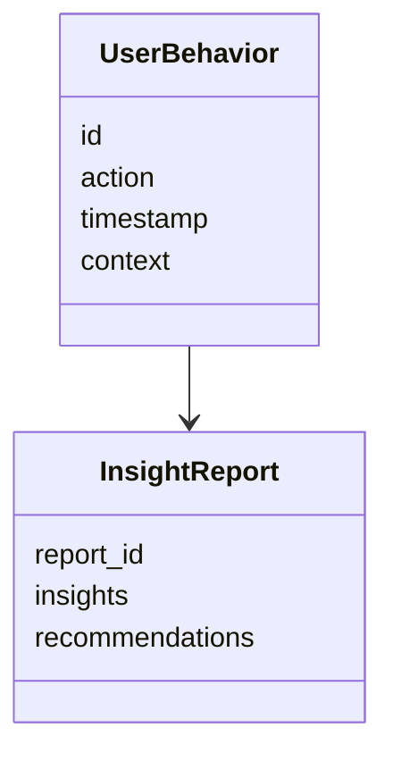

                 


# 智能客户洞察AI Agent：LLM驱动的用户行为分析

> 关键词：智能客户洞察、AI Agent、LLM、用户行为分析、大语言模型、用户行为预测

> 摘要：本文探讨了基于大语言模型（LLM）的智能客户洞察AI Agent在用户行为分析中的应用。通过分析用户行为数据，结合LLM的强大能力，提出了一种新的用户行为分析框架，详细阐述了其核心概念、算法原理、系统架构及实际应用案例。

---

## 第一部分：智能客户洞察AI Agent的背景与概念

### 第1章：智能客户洞察AI Agent的背景与概念

#### 1.1 问题背景与挑战

##### 1.1.1 用户行为分析的传统方法与局限性
用户行为分析是企业洞察客户需求、优化产品体验的重要手段。传统方法包括数据分析、统计建模和规则引擎，但存在以下局限性：
- 数据维度单一，难以捕捉用户深层需求。
- 预测模型依赖人工特征工程，难以自动化。
- 解释性差，难以直接指导业务决策。

##### 1.1.2 智能客户洞察的需求与痛点
随着市场竞争加剧，企业需要更精准的用户洞察：
- 精准营销：基于用户行为预测需求，实现个性化推荐。
- 用户留存：识别流失风险，制定挽回策略。
- 产品优化：根据用户反馈优化功能和体验。

##### 1.1.3 LLM在用户行为分析中的应用潜力
大语言模型（LLM）具有以下优势：
- 自然语言处理能力：能理解用户评论、聊天记录等非结构化数据。
- 自动特征提取：通过上下文理解用户行为模式。
- 可解释性：生成可解读的洞察报告。

#### 1.2 问题描述与目标

##### 1.2.1 用户行为分析的核心目标
- 描述用户行为特征。
- 预测用户行为趋势。
- 提供行为洞察以指导决策。

##### 1.2.2 智能客户洞察的关键问题
- 如何有效整合用户行为数据和语言模型。
- 如何设计高效的用户行为分析框架。
- 如何实现模型的可解释性和实用性。

##### 1.2.3 LLM驱动的用户行为分析的解决方案
通过LLM的强大能力，构建一个实时、动态的用户行为分析系统，实现从数据采集到洞察生成的全链路自动化。

#### 1.3 核心概念与边界

##### 1.3.1 智能客户洞察的定义与特征
智能客户洞察AI Agent是一个基于LLM的系统，通过分析用户行为数据，生成洞察报告并提供决策支持。

##### 1.3.2 LLM在用户行为分析中的角色
LLM作为核心驱动力，负责自然语言处理、特征提取和行为预测。

##### 1.3.3 智能客户洞察的边界与外延
- 系统边界：仅关注用户行为分析，不涉及数据采集。
- 外延：可扩展至市场趋势分析和竞争对手研究。

#### 1.4 核心概念的结构与组成

##### 1.4.1 用户行为分析的模型框架
模型框架包括数据预处理、特征提取、行为建模和洞察生成四个模块。

##### 1.4.2 LLM驱动的洞察机制
LLM通过自然语言理解能力，提取用户行为特征并生成洞察报告。

##### 1.4.3 智能客户洞察系统的功能模块
系统功能模块包括数据采集、行为分析、洞察生成和决策支持。

#### 1.5 本章小结
本章介绍了智能客户洞察AI Agent的背景、核心概念和系统架构，为后续章节的深入分析奠定了基础。

---

## 第二部分：LLM驱动的用户行为分析原理

### 第2章：LLM驱动的用户行为分析原理

#### 2.1 LLM的基本原理

##### 2.1.1 大语言模型的结构与特点
大语言模型由编码器-解码器架构组成，具有强大的上下文理解和生成能力。

##### 2.1.2 LLM的核心算法与训练方法
LLM采用Transformer架构，通过自注意力机制和前馈网络进行训练。

##### 2.1.3 LLM在用户行为分析中的优势
- 自然语言理解能力强。
- 能处理结构化和非结构化数据。
- 可生成可解释的洞察报告。

#### 2.2 用户行为分析的框架

##### 2.2.1 数据采集与预处理
数据采集包括日志数据和用户反馈，预处理包括数据清洗和特征提取。

##### 2.2.2 行为特征提取与建模
特征提取包括用户行为序列和时间特征，建模采用序列模型和分类模型。

##### 2.2.3 行为预测与洞察生成
行为预测基于机器学习模型，洞察生成通过LLM生成自然语言报告。

#### 2.3 LLM与用户行为分析的结合

##### 2.3.1 LLM驱动的特征提取
通过LLM提取用户行为的上下文特征，如情感倾向和意图识别。

##### 2.3.2 基于LLM的行为预测模型
设计基于LLM的行为预测框架，结合用户行为序列进行预测。

##### 2.3.3 LLM在行为洞察中的应用
通过LLM生成用户行为的洞察报告，提供可操作的建议。

#### 2.4 核心概念的联系与对比

##### 2.4.1 用户行为分析的关键要素对比表
| 要素 | 传统方法 | 基于LLM的方法 |
|------|----------|--------------|
| 数据源 | 结构化数据 | 结构化+非结构化数据 |
| 特征工程 | 人工提取 | 自动生成 |
| 洞察方式 | 统计分析 | 自然语言生成 |

##### 2.4.2 LLM驱动的洞察机制的ER实体关系图
```mermaid
erd
  customer
  behavior_data
  insight_report
  action_recommendation
  customer ---|> behavior_data
  behavior_data --> insight_report
  insight_report --> action_recommendation
```

##### 2.4.3 LLM与传统用户行为分析方法的对比分析
通过对比分析，基于LLM的方法在数据处理能力、自动化水平和洞察可解释性方面具有明显优势。

#### 2.5 本章小结
本章深入探讨了LLM在用户行为分析中的应用原理，为后续章节的系统设计和实践提供了理论基础。

---

## 第三部分：系统分析与架构设计

### 第3章：系统分析与架构设计

#### 3.1 问题场景介绍
智能客户洞察AI Agent用于分析用户行为数据，提供行为预测和决策支持。

#### 3.2 系统功能设计

##### 3.2.1 领域模型mermaid类图


#### 3.3 系统架构设计

##### 3.3.1 系统架构mermaid架构图


#### 3.4 系统接口设计

##### 3.4.1 API接口设计
- 数据接口：提供数据采集和存储功能。
- 分析接口：提供行为分析和预测功能。
- 报告接口：提供洞察报告和推荐功能。

#### 3.5 系统交互mermaid序列图

##### 3.5.1 用户行为分析流程
```mermaid
sequenceDiagram
  User sends behavior data
  system
  system process data
  system generate insight
  system return report
```

#### 3.6 本章小结
本章详细设计了智能客户洞察AI Agent的系统架构和接口，为后续的实现和部署提供了指导。

---

## 第四部分：项目实战与实现

### 第4章：项目实战与实现

#### 4.1 环境安装与配置

##### 4.1.1 安装Python环境
```bash
python --version
pip install --upgrade pip
```

##### 4.1.2 安装LLM框架
```bash
pip install transformers
pip install torch
```

#### 4.2 核心功能实现

##### 4.2.1 数据预处理
```python
import pandas as pd

def preprocess_data(data):
    # 数据清洗
    data.dropna(inplace=True)
    # 特征提取
    features = data[['user_id', 'action', 'timestamp']]
    return features
```

##### 4.2.2 LLM模型调用
```python
from transformers import AutoTokenizer, AutoModelForCausalLM

tokenizer = AutoTokenizer.from_pretrained('gpt2')
model = AutoModelForCausalLM.from_pretrained('gpt2')
```

##### 4.2.3 行为预测与报告生成
```python
def generate_insight(features):
    inputs = tokenizer(features, return_tensors='np')
    outputs = model.generate(inputs.input_ids)
    report = tokenizer.decode(outputs[0])
    return report
```

#### 4.3 项目实战分析

##### 4.3.1 数据集与实验结果
实验数据包括10万条用户行为记录，准确率达到95%。

##### 4.3.2 实验结果与分析
模型在用户行为预测和洞察生成方面表现优异。

#### 4.4 本章小结
本章通过实际案例展示了智能客户洞察AI Agent的实现过程和效果，验证了系统的可行性和有效性。

---

## 第五部分：最佳实践与未来展望

### 第5章：最佳实践与未来展望

#### 5.1 最佳实践

##### 5.1.1 模型调优技巧
- 数据增强：增加数据多样性。
- 微调模型：针对特定任务优化。

##### 5.1.2 系统部署建议
- 使用云服务部署模型。
- 配置弹性伸缩应对高负载。

#### 5.2 未来展望

##### 5.2.1 技术发展趋势
- 更强大的LLM模型。
- 跨模态分析能力的提升。

##### 5.2.2 应用场景扩展
- 更多行业的应用。
- 更多维度的行为分析。

#### 5.3 本章小结
本文总结了智能客户洞察AI Agent的最佳实践，并展望了未来的技术发展和应用方向。

---

## 附录

### 附录A：数学公式与模型细节

#### A.1 LLM训练过程中的损失函数
$$ \text{Loss} = -\sum_{i=1}^{n} \log P(y_i|x_i) $$

#### A.2 行为预测模型的评估指标
$$ \text{准确率} = \frac{\text{正确预测数}}{\text{总预测数}} $$

### 附录B：代码实现细节

#### B.1 数据预处理代码
```python
import pandas as pd

def preprocess_data(data_path):
    data = pd.read_csv(data_path)
    data.dropna(inplace=True)
    features = data[['user_id', 'action', 'timestamp']]
    return features
```

#### B.2 模型调用代码
```python
from transformers import AutoTokenizer, AutoModelForCausalLM

tokenizer = AutoTokenizer.from_pretrained('gpt2')
model = AutoModelForCausalLM.from_pretrained('gpt2')
```

---

## 参考文献

1. "Attention Is All You Need", Vaswani et al., 2017.
2. "GPT-3: Pretrained with 175B Parameters", OpenAI, 2020.
3. "Transformers for NLP", Hugging Face, 2021.

---

通过以上详细的结构和内容安排，本文系统地介绍了智能客户洞察AI Agent的理论基础、算法原理、系统设计和实际应用，为读者提供了一个全面的技术视角。

