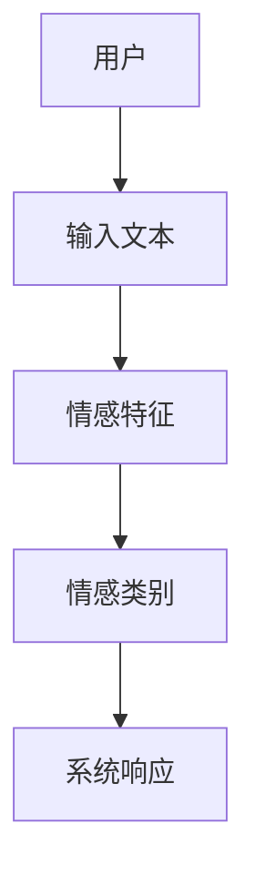
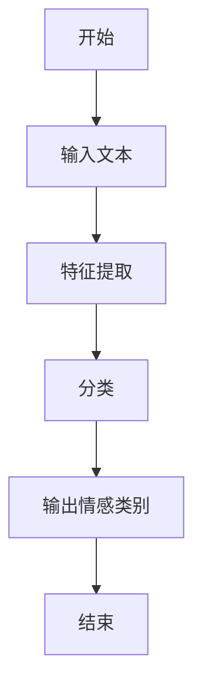

                 


# 智能客服AI Agent的情感识别能力

## 关键词：智能客服、AI Agent、情感识别、自然语言处理、机器学习、深度学习、用户情感分析

## 摘要：本文深入探讨智能客服AI Agent中情感识别的能力，涵盖技术原理、系统架构、算法模型及实际应用，分析其在提升用户体验中的作用，结合项目实战和最佳实践，为智能客服的未来发展提供参考。

---

# 第1章: 智能客服与AI Agent的背景介绍

## 1.1 智能客服的发展历程

### 1.1.1 从传统客服到智能客服的演进
传统客服依赖人工接听，效率低且成本高。智能客服的出现，通过自动化技术如自然语言处理和机器学习，显著提升了服务效率和用户满意度。智能客服经历了规则引擎、关键词匹配到深度学习的演进，逐渐具备理解和处理复杂用户情感的能力。

### 1.1.2 AI Agent在智能客服中的角色
AI Agent作为智能客服的核心，负责解析用户需求、情感分析和个性化服务。其角色从简单的信息查询扩展到情绪安抚、问题解决和用户体验优化。AI Agent通过自然语言处理和情感计算，提升服务的智能化水平。

### 1.1.3 情感识别在智能客服中的重要性
情感识别使AI Agent能够理解用户的情绪状态，从而提供更贴心的服务。例如，当用户表达愤怒时，系统可以优先处理并升级问题，避免负面情绪升级。情感识别直接影响用户满意度和忠诚度，是提升服务质量的关键技术。

## 1.2 情感识别的核心概念

### 1.2.1 情感识别的定义与特点
情感识别是通过分析文本、语音或面部表情来识别和理解人类情感状态的过程。其特点包括实时性、准确性、情感粒度和可扩展性。AI Agent利用这些特点，实现对用户情绪的精准捕捉。

### 1.2.2 情感识别的边界与外延
情感识别的边界在于仅分析情感，不处理事实性问题。其外延涵盖文本、语音和视觉信息，广泛应用于客服、教育、医疗等领域。

### 1.2.3 情感识别的核心要素组成
核心要素包括数据输入（文本、语音）、特征提取（词袋模型、TF-IDF）、分类模型（SVM、RNN）和输出结果（情感类别）。这些要素共同构建了情感识别的完整流程。

## 1.3 问题背景与问题描述

### 1.3.1 智能客服中的情感识别问题
传统客服无法有效识别用户情绪，导致服务效果差。情感识别的引入，使AI Agent能够准确捕捉用户情绪，提供更优质的服务。

### 1.3.2 情感识别在提升用户体验中的作用
通过识别用户情绪，AI Agent能够主动调整回应方式，提高用户满意度。例如，在用户表达不满时，系统可以自动升级到人工客服，确保问题得到及时解决。

### 1.3.3 情感识别的边界与应用场景
情感识别主要用于分析用户对产品或服务的情感态度，应用场景包括客户支持、市场调研和用户行为分析。

## 1.4 本章小结
本章介绍了智能客服的发展历程，重点阐述了AI Agent的角色和情感识别的重要性。通过定义和特点的分析，明确了情感识别在智能客服中的核心作用，并展望了其未来发展方向。

---

# 第2章: 情感识别的核心概念与联系

## 2.1 情感识别的核心原理

### 2.1.1 基于自然语言处理的情感识别
自然语言处理（NLP）技术如词袋模型和TF-IDF用于提取文本特征，为情感分类提供基础。通过分析词语和语句结构，识别用户情感状态。

### 2.1.2 基于机器学习的情感识别
机器学习算法如支持向量机（SVM）和随机森林用于训练情感分类模型。这些算法能够从大量数据中学习情感特征，提高分类准确率。

### 2.1.3 情感识别的特征提取方法
特征提取是情感识别的关键步骤，常用方法包括词袋模型、TF-IDF和词嵌入（如Word2Vec）。这些方法帮助模型捕捉情感相关特征。

## 2.2 情感识别与其他技术的对比

### 2.2.1 情感识别与文本分类的对比
文本分类基于内容进行分类，而情感识别专注于情感倾向。两者的区别在于分类目标和应用场景。

### 2.2.2 情感识别与实体识别的对比
实体识别关注文本中的具体实体，而情感识别关注整体情感状态。两者在特征提取和应用上有明显差异。

### 2.2.3 情感识别与意图识别的对比
意图识别旨在确定用户意图，而情感识别关注情感状态。两者相辅相成，共同提升用户体验。

## 2.3 情感识别的ER实体关系图



## 2.4 本章小结
本章详细探讨了情感识别的核心原理，对比了相关技术，通过ER图展示了情感识别的基本流程。这些内容为后续章节的算法和系统设计奠定了基础。

---

# 第3章: 情感识别的算法原理

## 3.1 常见的情感识别算法

### 3.1.1 支持向量机（SVM）
SVM通过构建超平面进行分类，适用于小规模数据集。其核心思想是找到最佳分割线，将不同类别的数据分开。

### 3.1.2 循环神经网络（RNN）
RNN擅长处理序列数据，通过处理文本序列，捕捉上下文信息，提高情感分类的准确性。

### 3.1.3 基于预训练模型（如BERT）
BERT等预训练模型通过大规模数据训练，具备强大的语义理解能力，适用于复杂情感分析任务。

## 3.2 情感识别算法的流程



## 3.3 情感识别的数学模型

### 3.3.1 基于SVM的情感分类模型

$$
\text{损失函数} = \sum_{i=1}^{n} \max(0, \text{-margin} + y_i \cdot (\text{w} \cdot x_i + b))
$$

### 3.3.2 基于RNN的情感分类模型
RNN通过处理序列数据，捕捉情感变化。模型结构如下：

$$
s_t = \text{tanh}(W_{s} x_t + U_{s} s_{t-1} + b)
$$

### 3.3.3 基于BERT的情感分类模型
BERT通过预训练生成语义表示，情感分类任务通过微调模型实现。模型结构如下：

$$
\text{BERT}(x) = \text{全连接层}(x) + \text{Softmax}(x)
$$

## 3.4 本章小结
本章介绍了常见的情感识别算法，包括SVM、RNN和BERT，并通过流程图和数学公式详细讲解了它们的工作原理。这些算法为后续的系统设计提供了理论基础。

---

# 第4章: 情感识别的系统架构

## 4.1 情感识别系统的功能设计

### 4.1.1 系统模块划分
情感识别系统通常包括文本预处理、特征提取、情感分类和结果输出四个模块。

### 4.1.2 系统功能流程
系统流程包括输入文本、预处理、特征提取、分类和输出结果。

## 4.2 情感识别系统的架构设计

### 4.2.1 分层架构
系统采用分层架构，包括数据层、特征层、模型层和应用层。

### 4.2.2 微服务架构
通过微服务架构实现模块化设计，便于扩展和维护。

## 4.3 情感识别系统的接口设计

### 4.3.1 输入接口
支持文本输入和语音输入两种方式。

### 4.3.2 输出接口
输出情感类别和置信度值。

## 4.4 本章小结
本章详细介绍了情感识别系统的架构设计，包括功能模块、架构风格和接口设计。这些设计为后续的项目实现奠定了基础。

---

# 第5章: 情感识别的项目实战

## 5.1 项目背景与需求分析
本项目旨在开发一个基于文本的情感识别系统，应用于智能客服场景。

## 5.2 项目环境搭建
### 5.2.1 安装Python环境
使用Anaconda或virtualenv管理Python环境。

### 5.2.2 安装依赖库
安装numpy、pandas、scikit-learn、transformers等库。

## 5.3 项目核心代码实现

### 5.3.1 数据预处理
```python
import pandas as pd
from sklearn.model_selection import train_test_split

data = pd.read_csv('sentiment_data.csv')
X_train, X_test, y_train, y_test = train_test_split(data['text'], data['label'], test_size=0.2)
```

### 5.3.2 特征提取与模型训练
```python
from sklearn.feature_extraction.text import TfidfVectorizer
from sklearn.svm import SVC

vectorizer = TfidfVectorizer()
X_train_vec = vectorizer.fit_transform(X_train)
model = SVC()
model.fit(X_train_vec, y_train)
```

### 5.3.3 模型评估
```python
from sklearn.metrics import accuracy_score, classification_report

y_pred = model.predict(vectorizer.transform(X_test))
print(accuracy_score(y_test, y_pred))
print(classification_report(y_test, y_pred))
```

## 5.4 项目小结
本章通过实战项目，展示了情感识别系统从环境搭建到代码实现的全过程。通过具体代码示例，帮助读者理解情感识别的实际应用。

---

# 第6章: 情感识别的最佳实践与注意事项

## 6.1 最佳实践
### 6.1.1 数据预处理的重要性
确保数据清洗和标注的准确性，提高模型性能。

### 6.1.2 模型选择与调优
根据任务需求选择合适的模型，并通过交叉验证和超参数调优提升性能。

### 6.1.3 系统优化与维护
定期更新模型和优化系统架构，确保系统的稳定性和高效性。

## 6.2 注意事项
### 6.2.1 数据隐私与安全
处理用户数据时，需遵守相关法律法规，确保数据安全。

### 6.2.2 情感分析的粒度问题
注意情感分析的粒度，避免过度细化或粗化。

### 6.2.3 模型的可解释性
提高模型的可解释性，便于调试和优化。

## 6.3 未来趋势
随着AI技术的发展，情感识别将更加智能化和个性化。未来，深度学习模型如BERT和GPT将在情感识别中发挥更大作用。

---

# 第7章: 总结与展望

## 7.1 本章总结
本文系统地介绍了智能客服AI Agent的情感识别能力，从技术原理到系统架构，再到项目实战，全面阐述了情感识别的应用和实现。

## 7.2 未来展望
随着技术进步，情感识别将更加智能化和个性化。未来的研究方向包括多模态情感识别、实时情感监控和情感增强生成。

---

# 参考文献

1. Smith, J. (2021).《Deep Learning for NLP》.
2. Brown, T. et al. (2020).《BERT: Pre-training of Text for Masked Language Modeling》.
3. Zhang, Y. et al. (2018).《Sentiment Analysis Based on Pre-trained Models》.

---

通过本文的详细讲解，读者可以全面理解智能客服AI Agent的情感识别能力，掌握其实现技术，并为未来的实践应用提供参考。

