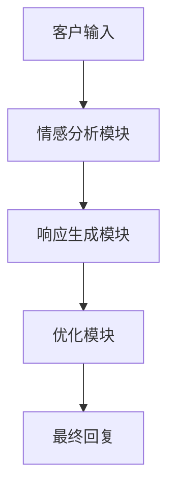

                 


---

# 智能客服中心：AI Agent的情感分析与响应

> 关键词：智能客服中心、AI Agent、情感分析、自然语言处理、机器学习、深度学习

> 摘要：本文将详细介绍智能客服中心中AI Agent的情感分析与响应技术。从背景到实现，从算法到系统架构，从项目实战到最佳实践，全面解析如何利用AI技术提升智能客服的情感分析能力与响应效率。通过本文，读者可以深入理解AI Agent在智能客服中的核心作用，并掌握情感分析与响应的具体实现方法。

---

## 第1章 AI Agent与智能客服中心概述

### 1.1 传统客服中心的局限性
传统的客服中心主要依赖人工坐席，存在以下问题：
- 人工成本高：需要大量客服人员，导致运营成本居高不下。
- 响应时间长：在高并发情况下，人工坐席无法快速响应客户需求。
- 服务质量不稳定：由于人为因素，服务质量可能存在波动。

### 1.2 智能客服中心的兴起
随着人工智能技术的快速发展，智能客服中心逐渐取代传统模式，成为企业提升客户体验的重要手段。智能客服中心的特点包括：
- 7×24小时无间断服务。
- 高效的响应能力。
- 个性化服务。

### 1.3 AI Agent的核心功能
AI Agent（智能客服机器人）是智能客服中心的核心，其主要功能包括：
- 自然语言理解（NLU）：理解客户的问题。
- 情感分析：识别客户情绪。
- 自然语言生成（NLG）：自动生成回复。
- 响应决策：根据分析结果生成最优回复。

### 1.4 情感分析在智能客服中的重要性
情感分析是AI Agent实现智能化服务的关键技术，主要用于：
- 识别客户情绪：判断客户是满意、中立还是不满。
- 优化服务质量：根据情绪调整响应策略。
- 提高客户满意度：通过情感分析提供更贴心的服务。

---

## 第2章 情感分析的算法原理与实现

### 2.1 情感分析的基本概念
情感分析是通过自然语言处理技术，对文本的情感倾向进行分类。常见的情感分析任务包括：
- 二分类任务：正面/负面。
- 多分类任务：正面、中性、负面。

### 2.2 情感分析的核心算法
以下是几种常用的情感分析算法：
- **基于规则的情感分析**：通过预定义的规则和情感词典进行情感分类。
- **基于机器学习的情感分析**：利用特征工程和机器学习模型（如SVM、朴素贝叶斯）进行分类。
- **基于深度学习的情感分析**：使用神经网络模型（如LSTM、Transformer）进行情感分类。

### 2.3 情感分析的实现步骤
1. 数据预处理：清洗数据，分词，去除停用词。
2. 特征提取：提取文本特征，如TF-IDF。
3. 模型训练：选择合适的算法进行训练。
4. 模型评估：通过准确率、召回率等指标评估模型性能。
5. 模型优化：调整参数，提升性能。

### 2.4 情感分析的数学模型
以下是一个简单的朴素贝叶斯情感分类模型的数学公式：

$$ P(\text{positive} | \text{words}) = \frac{P(\text{words} | \text{positive}) \cdot P(\text{positive})}{P(\text{words})} $$

其中，$P(\text{words} | \text{positive})$ 表示在正面评论中出现这些词语的概率，$P(\text{positive})$ 是正面评论的先验概率，$P(\text{words})$ 是所有评论中出现这些词语的总概率。

---

## 第3章 AI Agent的情感分析与响应系统

### 3.1 情感分析与响应的协同工作
AI Agent在处理客户请求时，需要结合情感分析结果进行响应决策。具体流程如下：
1. 接收客户输入：获取客户的文本或语音请求。
2. 情感分析：识别客户情绪。
3. 响应生成：根据情感分析结果生成回复。
4. 响应优化：调整回复语气，确保客户满意度。

### 3.2 情感分析与响应的系统架构
以下是情感分析与响应系统的架构图：



### 3.3 情感分析与响应的数学模型
以下是基于情感分析的情感分类模型示例：

$$ \text{score} = \sum_{i=1}^{n} w_i \cdot x_i $$

其中，$w_i$ 是词语的情感权重，$x_i$ 是词语出现的次数。

---

## 第4章 项目实战：AI Agent的情感分析与响应实现

### 4.1 环境安装
- Python 3.8+
- NumPy、Scikit-learn、NLTK、Transformers库安装：
  ```bash
  pip install numpy scikit-learn nltk transformers
  ```

### 4.2 核心代码实现
以下是情感分析与响应的Python代码示例：

```python
from transformers import pipeline

# 初始化情感分析模型
sentiment_pipeline = pipeline("sentiment-analysis")

def analyze_sentiment(text):
    result = sentiment_pipeline(text)
    return result[0]['label']

def generate_response(text):
    sentiment = analyze_sentiment(text)
    if sentiment == 'POSITIVE':
        response = "感谢您的支持！我们会继续努力的！"
    elif sentiment == 'NEGATIVE':
        response = "抱歉给您带来不好的体验，我们会改进的！"
    else:
        response = "感谢您的反馈！"
    return response

# 示例
text = "我对你们的服务非常满意！"
print(generate_response(text))
```

### 4.3 代码解读与分析
- `sentiment_pipeline`：使用预训练的情感分析模型。
- `analyze_sentiment`：调用模型进行情感分类。
- `generate_response`：根据情感结果生成相应回复。

### 4.4 案例分析
假设客户输入：“我对你们的服务非常不满意！”，系统会识别出负面情感，并生成回复：“抱歉给您带来不好的体验，我们会改进的！”

### 4.5 项目小结
通过代码实现，我们可以看到情感分析与响应的基本流程。实际应用中，还需要优化模型性能，增加更多的情感分类维度。

---

## 第5章 最佳实践与注意事项

### 5.1 最佳实践
1. 数据质量：确保训练数据的多样性和代表性。
2. 模型优化：定期更新模型，提升准确率。
3. 人机结合：AI Agent无法完全取代人工客服，需结合人工客服进行Fallback处理。

### 5.2 小结
本文详细介绍了AI Agent在智能客服中心中的情感分析与响应技术，从理论到实践，全面解析了实现方法。

### 5.3 注意事项
- 数据隐私：注意客户数据的隐私保护。
- 模型可解释性：确保模型决策的透明性。
- 持续优化：定期监控模型性能，及时调整。

### 5.4 拓展阅读
- 《深度学习入门：基于Python和Keras》
- 《自然语言处理实战：基于Python的语料库分析》

---

通过本文的详细讲解，读者可以掌握AI Agent在智能客服中心中的情感分析与响应技术，并能够实际应用到项目中。

