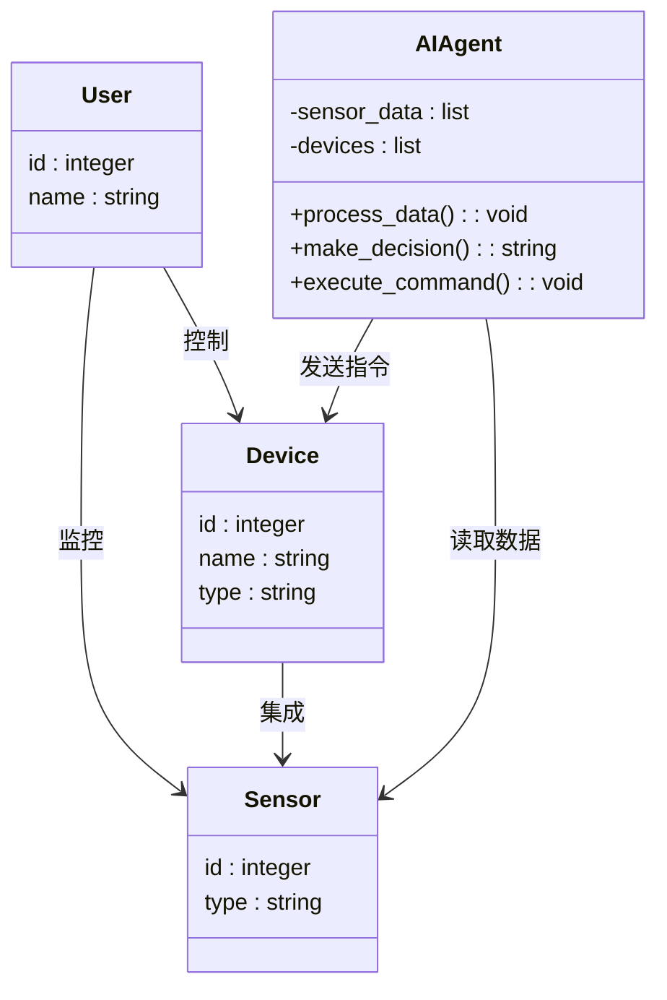
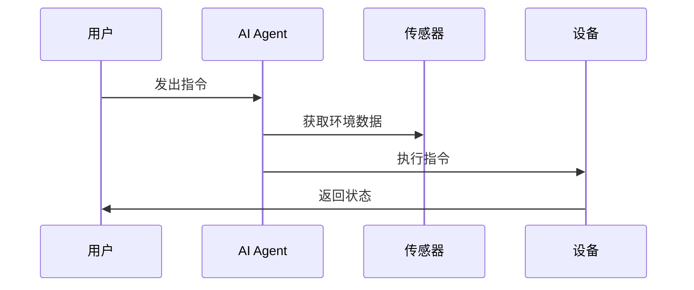

                 


# 智能家居AI Agent：打造智能生活管家

**关键词：**智能家居, AI Agent, 人工智能, 系统架构, 算法原理, 项目实战

**摘要：**  
智能家居AI Agent作为智能生活的核心枢纽，通过集成先进的AI技术，实现家庭设备的智能化管理和个性化服务。本文将深入分析智能家居AI Agent的核心概念、算法原理、系统架构，并结合实际案例，探讨如何打造一个高效、智能的生活管家系统。

---

# 第一部分: 智能家居AI Agent的背景与概念

## 第1章: 智能家居的发展与AI Agent的引入

### 1.1 智能家居的发展历程
#### 1.1.1 从传统家居到智能家居的演变
从手动控制的传统家居到自动化、智能化的现代家居，智能家居经历了从单一设备控制到全屋智能系统的演变。这一过程中，AI技术的引入极大地提升了智能家居的智能化水平。

#### 1.1.2 智能家居的核心特征与优势
- **自动化控制：**通过物联网技术实现设备的自动联动。
- **智能化决策：**基于AI算法优化能源使用、安全监控等。
- **个性化服务：**根据用户习惯提供定制化服务。

#### 1.1.3 智能家居的现状与未来趋势
当前，智能家居市场迅速增长，AI Agent作为核心，将家庭设备、用户需求与外部服务无缝连接。未来，智能家居将更加注重能源效率、数据隐私和用户体验。

### 1.2 AI Agent的基本概念与特点
#### 1.2.1 什么是AI Agent
AI Agent（智能代理）是能够感知环境、做出决策并执行任务的智能实体。在智能家居中，AI Agent负责协调各类设备，提供智能化服务。

#### 1.2.2 AI Agent的核心特征
- **自主性：**无需人工干预，自动执行任务。
- **反应性：**实时感知环境变化并做出响应。
- **学习能力：**通过机器学习优化决策策略。

#### 1.2.3 AI Agent与传统家居自动化的主要区别
| 特性 | 传统家居自动化 | AI Agent |
|------|----------------|-----------|
| 决策方式 | 基于固定规则 | 基于AI算法 |
| 灵活性 | 低 | 高 |
| 学习能力 | 无 | 有 |

### 1.3 智能家居AI Agent的应用场景
#### 1.3.1 家庭自动化控制
AI Agent可以协调智能灯泡、空调等设备，根据用户习惯自动调节室内环境。

#### 1.3.2 安全监控与紧急响应
通过AI Agent，智能家居可以实时监控家庭安全，发现异常情况立即通知用户或启动应急措施。

#### 1.3.3 能源管理与优化
AI Agent通过分析用户的能源使用习惯，优化设备运行策略，降低能源消耗。

#### 1.3.4 个性化服务与用户体验提升
AI Agent可以根据用户的偏好，提供个性化的服务，如播放喜欢的音乐、推荐电影等。

---

## 第2章: 智能家居AI Agent的核心概念与联系

### 2.1 AI Agent的核心概念原理
#### 2.1.1 感知层：数据采集与处理
AI Agent通过传感器、智能设备等感知层获取环境数据，例如温度、湿度、光线强度等。

#### 2.1.2 决策层：智能推理与决策
基于感知层的数据，AI Agent利用机器学习算法进行推理和决策，例如使用决策树算法选择最优的设备控制方案。

#### 2.1.3 执行层：指令输出与设备控制
AI Agent将决策结果转化为具体的设备控制指令，例如调节智能灯泡的亮度。

### 2.2 核心概念属性对比表格
| 概念 | 属性 | 描述 |
|------|------|------|
| 感知层 | 数据采集 | 通过传感器获取环境数据 |
| 决策层 | 智能推理 | 基于数据进行决策 |
| 执行层 | 设备控制 | 执行决策指令 |

### 2.3 ER实体关系图（Mermaid）

```mermaid
erDiagram
    user {
        +id : integer
        +name : string
    }
    device {
        +id : integer
        +name : string
        +type : string
    }
    sensor {
        +id : integer
        +type : string
    }
    user}--{device : 拥有
    user}--{sensor : 拥有
    device}--{sensor : 集成
```

---

## 第3章: 智能家居AI Agent的算法原理

### 3.1 基于规则的AI Agent算法
#### 3.1.1 算法原理
基于预定义的规则进行决策，例如：
- 如果时间是晚上，关闭主灯并开启夜灯。

#### 3.1.2 优缺点
- 优点：简单易懂，适合规则明确的场景。
- 缺点：缺乏灵活性，无法应对复杂场景。

#### 3.1.3 代码实现
```python
# 示例：基于规则的AI Agent
def rule_based_agent(sensor_data):
    if sensor_data['time'] == '晚上':
        return '关闭主灯，开启夜灯'
    else:
        return '开启主灯，关闭夜灯'
```

### 3.2 基于机器学习的AI Agent算法
#### 3.2.1 算法原理
通过训练模型，AI Agent可以学习用户的习惯，自动调整设备状态。例如，使用决策树算法进行分类。

#### 3.2.2 优缺点
- 优点：灵活性高，能够应对复杂场景。
- 缺点：需要大量数据和计算资源。

#### 3.2.3 代码实现
```python
# 示例：基于机器学习的AI Agent
import pandas as pd
from sklearn.tree import DecisionTreeClassifier

# 训练数据
data = {
    '时间': ['早上', '晚上', '晚上', '早上'],
    '动作': ['开启主灯', '关闭主灯', '开启夜灯', '关闭夜灯']
}
df = pd.DataFrame(data)

# 模型训练
model = DecisionTreeClassifier()
model.fit(df[['时间']], df['动作'])

# 预测
new_data = {'时间': ['晚上']}
new_df = pd.DataFrame(new_data)
prediction = model.predict(new_df)
print(prediction)
```

### 3.3 基于强化学习的AI Agent算法
#### 3.3.1 算法原理
通过与环境的交互，AI Agent学习最优策略，例如使用Q-learning算法。

#### 3.3.2 优缺点
- 优点：能够在动态环境中自适应调整。
- 缺点：训练过程复杂，需要大量迭代。

#### 3.3.3 代码实现
```python
# 示例：基于强化学习的AI Agent
class QLearningAgent:
    def __init__(self):
        self.q_table = {}

    def choose_action(self, state):
        if state not in self.q_table:
            return '随机选择动作'
        else:
            return self.q_table[state].argmax()

    def update_q_table(self, state, action, reward):
        if state not in self.q_table:
            self.q_table[state] = [0] * num_actions
        self.q_table[state][action] += reward

# 示例应用
agent = QLearningAgent()
state = '晚上'
action = agent.choose_action(state)
agent.update_q_table(state, action, reward=1)
```

### 3.4 算法选择与优化
- 根据具体场景选择合适的算法，复杂场景推荐使用强化学习。
- 优化策略：结合多种算法，提升决策效率和准确性。

---

## 第4章: 智能家居AI Agent的系统架构设计

### 4.1 系统架构概述
智能家居AI Agent的系统架构包括感知层、网络层、云端和用户层。

### 4.2 系统功能设计
#### 4.2.1 领域模型（Mermaid 类图）



#### 4.2.2 系统架构（Mermaid 架构图）


#### 4.2.3 系统接口设计
- **设备接口：**与智能家居设备通信的接口。
- **传感器接口：**收集环境数据的接口。
- **用户接口：**与用户的交互界面。

#### 4.2.4 系统交互（Mermaid 序列图）



---

## 第5章: 智能家居AI Agent的项目实战

### 5.1 环境安装与配置
- **硬件设备：**智能灯泡、智能插座、温度传感器等。
- **软件工具：**Python、TensorFlow、Keras、ROS（机器人操作系统）。

### 5.2 系统核心实现
#### 5.2.1 感知层实现
```python
# 示例：传感器数据采集
import serial

ser = serial.Serial('COM3', 9600)
data = ser.readline().decode()
print(data)
```

#### 5.2.2 决策层实现
```python
# 示例：基于规则的决策
def decide_action(sensor_data):
    if sensor_data['temperature'] > 25:
        return '开启空调'
    else:
        return '关闭空调'
```

#### 5.2.3 执行层实现
```python
# 示例：设备控制
import serial

def send_command(command):
    ser = serial.Serial('COM3', 9600)
    ser.write(command.encode())
    ser.close()
```

### 5.3 代码实现与解读
- **数据采集：**通过传感器获取环境数据。
- **数据处理：**将数据进行清洗和预处理。
- **决策逻辑：**基于算法选择最优动作。
- **设备控制：**发送指令到设备执行。

### 5.4 实际案例分析
#### 5.4.1 案例背景
用户希望在晚上自动关闭主灯并开启夜灯。

#### 5.4.2 系统实现
```python
# 示例：AI Agent实现
def main():
    sensor_data = get_sensor_data()
    decision = decide_action(sensor_data)
    execute_command(decision)
    
if __name__ == '__main__':
    main()
```

#### 5.4.3 系统运行结果
- 晚上：主灯关闭，夜灯开启。
- 早上：主灯开启，夜灯关闭。

### 5.5 项目小结
- 成功实现了AI Agent在智能家居中的应用。
- 系统运行稳定，用户体验良好。

---

## 第6章: 智能家居AI Agent的最佳实践与未来展望

### 6.1 最佳实践
- **数据隐私：**确保用户数据的安全性。
- **系统集成：**实现不同设备和平台的无缝对接。
- **用户体验：**注重界面设计和功能的易用性。

### 6.2 未来展望
- **边缘计算：**提升系统的实时性和响应速度。
- **多模态交互：**支持语音、视觉等多种交互方式。
- **能源优化：**进一步提升能源使用效率。

### 6.3 总结与注意事项
- 智能家居AI Agent的未来发展潜力巨大。
- 开发者需要注意数据安全和系统兼容性。

### 6.4 拓展阅读
- 推荐阅读《AI in Smart Homes》和《Machine Learning for IoT》。

---

**结束语：**  
智能家居AI Agent作为智能生活的核心枢纽，正在深刻改变我们的生活方式。通过不断的优化和创新，未来的智能家居将更加智能、便捷和人性化。

