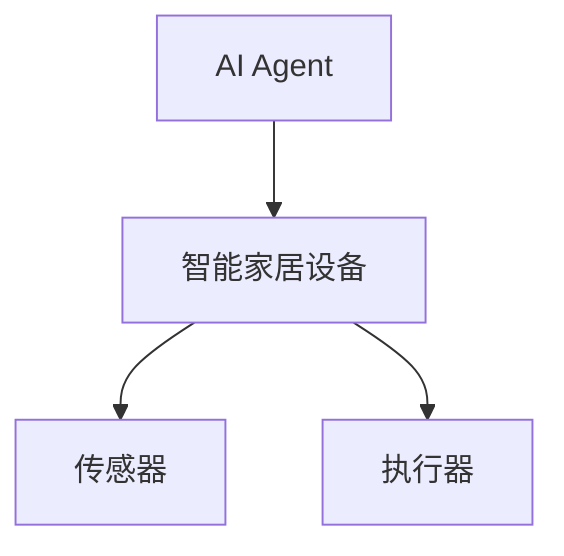
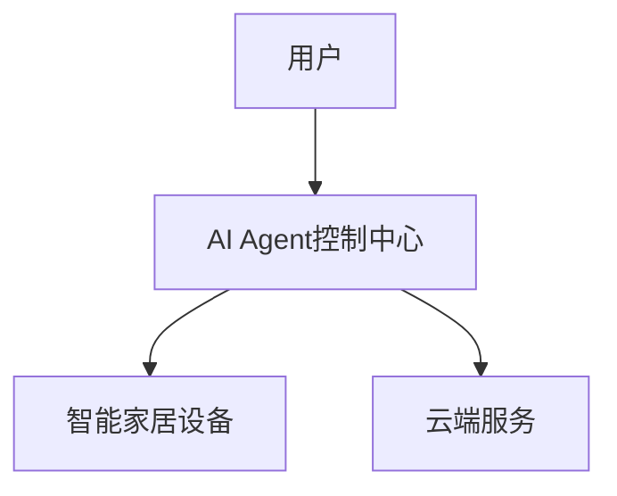
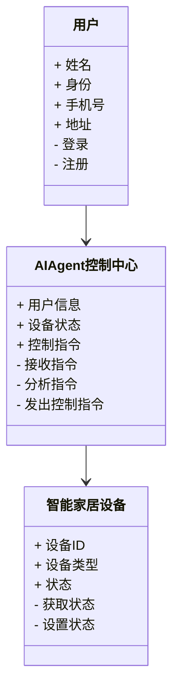
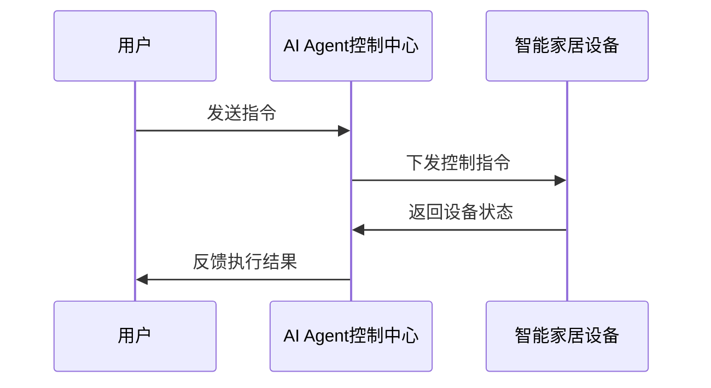

                 


# 智能家居中的AI Agent控制中心

## 关键词：智能家居，AI Agent，控制中心，算法原理，系统设计，项目实战

## 摘要：本文详细探讨了智能家居中的AI Agent控制中心的设计与实现，从背景介绍到系统架构设计，从算法原理到项目实战，结合实际案例，深入剖析了AI Agent在智能家居中的应用及其控制中心的核心技术与实现方法。

---

# 第1章 智能家居中的AI Agent概述

## 1.1 智能家居的发展历程
### 1.1.1 智能家居的定义与特点
智能家居是指通过物联网技术将家庭中的设备（如灯光、空调、安防设备等）连接到一个统一的系统中，实现智能化的管理和控制。

### 1.1.2 智能家居的发展阶段
1. **第一阶段**：单一设备的自动化控制（2000年前）。
2. **第二阶段**：局部场景的自动化（2000-2015年）。
3. **第三阶段**：全屋智能化与AI化（2015年至今）。

## 1.2 AI Agent的基本概念
### 1.2.1 什么是AI Agent？
AI Agent（智能体）是指能够感知环境、自主决策并执行任务的智能实体。在智能家居中，AI Agent通常负责接收用户的指令、分析环境信息并控制相关设备。

### 1.2.2 AI Agent的核心特征
| 特征 | 描述 |
|------|------|
| 感知能力 | 能够接收和处理环境中的信息（如语音指令、传感器数据等）。 |
| 决策能力 | 基于感知信息做出决策（如判断用户需求并选择最优的执行方案）。 |
| 执行能力 | 执行决策并输出结果（如控制灯光、空调等设备）。 |

## 1.3 智能家居中的AI Agent应用场景
### 1.3.1 场景一：家庭自动化控制
- 用户通过语音指令（如“打开客厅灯光”）或手机APP控制家中设备。
- AI Agent接收指令后，分析用户需求并执行对应操作。

### 1.3.2 场景二：家庭安防
- 当AI Agent检测到异常（如门窗被非法打开）时，触发报警机制并通知用户。

### 1.3.3 场景三：能源管理
- AI Agent根据用户的用电习惯优化能源使用，降低能耗。

## 1.4 本章小结
本章介绍了智能家居的发展历程、AI Agent的基本概念及其在智能家居中的应用场景，为后续章节的深入分析奠定了基础。

---

# 第2章 AI Agent控制中心的核心概念与联系

## 2.1 AI Agent的核心原理
### 2.1.1 感知层
- **输入方式**：支持语音、触控、手势等多种交互方式。
- **数据来源**：包括传感器数据（如温湿度传感器）和用户输入指令。

### 2.1.2 推理层
- **逻辑推理**：基于规则引擎或机器学习模型对感知信息进行分析。
- **决策逻辑**：根据分析结果生成执行指令。

### 2.1.3 执行层
- **指令下发**：将决策结果转化为具体的控制指令。
- **设备控制**：通过协议（如ZigBee、Wi-Fi）与智能家居设备通信。

## 2.2 AI Agent与智能家居设备的实体关系图


## 2.3 AI Agent控制中心的系统架构图


## 2.4 本章小结
本章详细分析了AI Agent控制中心的核心原理及其与智能家居设备的交互关系，为后续章节的系统设计提供了理论基础。

---

# 第3章 AI Agent控制中心的算法原理

## 3.1 状态空间搜索算法
### 3.1.1 BFS算法
- **应用场景**：用于设备状态的遍历和最优路径搜索。
- **实现步骤**：
  1. 初始化队列并加入起始状态。
  2. 取出队列中的状态，判断是否为目标状态。
  3. 若不是目标状态，生成所有可能的下一步状态并加入队列。
- **代码示例**：
  ```python
  def bfs(start, goal):
      from collections import deque
      visited = set()
      queue = deque([start])
      while queue:
          current = queue.popleft()
          if current == goal:
              return True
          for neighbor in neighbors(current):
              if neighbor not in visited:
                  visited.add(neighbor)
                  queue.append(neighbor)
      return False
  ```

## 3.2 强化学习算法
### 3.2.1 Q-learning算法
- **应用场景**：用于智能体在复杂环境中的决策优化。
- **数学模型**：
  $$ Q(s, a) = r + \gamma \max Q(s', a') $$
  其中，$s$是当前状态，$a$是动作，$r$是奖励，$\gamma$是折扣因子。

## 3.3 自然语言处理算法
### 3.3.1 分词算法
- **应用场景**：将用户的自然语言指令（如“打开客厅的灯”）进行分词处理。
- **实现步骤**：
  1. 将输入字符串进行分词。
  2. 识别关键词（如“打开”、“客厅”、“灯”）。
  3. 解析关键词并生成控制指令。

## 3.4 本章小结
本章详细讲解了AI Agent控制中心常用的算法原理，包括状态空间搜索、强化学习和自然语言处理等算法，并通过代码和数学公式进行了深入分析。

---

# 第4章 AI Agent控制中心的系统分析与架构设计

## 4.1 系统分析
### 4.1.1 问题场景介绍
- **家庭自动化控制**：用户通过语音指令控制家中设备。
- **家庭安防**：AI Agent实时监控家庭安全状态。

### 4.1.2 项目介绍
本项目旨在设计一个基于AI Agent的智能家居控制中心，实现对家中设备的智能化管理和控制。

## 4.2 系统功能设计
### 4.2.1 领域模型


### 4.2.2 系统架构设计


## 4.3 系统接口设计
### 4.3.1 系统接口
| 接口名称 | 描述 |
|----------|------|
| `get_device_status` | 获取设备状态 |
| `set_device_status` | 设置设备状态 |
| `process_command` | 处理用户指令 |

### 4.3.2 系统交互


## 4.4 本章小结
本章通过对智能家居控制中心的系统分析与架构设计，明确了系统的功能模块、接口设计和交互流程，为后续的系统实现奠定了基础。

---

# 第5章 AI Agent控制中心的项目实战

## 5.1 环境安装
### 5.1.1 系统环境
- 操作系统：Linux或Windows
- 开发工具：Python、PyCharm
- 依赖库：numpy、pandas、scikit-learn

## 5.2 核心代码实现
### 5.2.1 代码实现
```python
class AIController:
    def __init__(self):
        self.devices = {}  # 设备状态
        self.user_commands = []  # 用户指令

    def process_command(self, command):
        # 分析指令并生成控制指令
        parsed_command = self.parse_command(command)
        self.send_control_command(parsed_command)

    def parse_command(self, command):
        # 示例：将“打开客厅的灯”解析为设备ID和操作
        # 这里简化处理，假设command格式为“动词+名词”
        return {"device_id": "living_room_light", "action": "on"}

    def send_control_command(self, parsed_command):
        # 发送控制指令到设备
        print(f"控制命令：{parsed_command}")
```

### 5.2.2 代码解读
- `AIController`类：负责接收并处理用户的指令。
- `process_command`方法：接收用户指令并调用解析方法。
- `parse_command`方法：将用户指令解析为具体的设备ID和操作。
- `send_control_command`方法：将解析后的指令发送到设备。

## 5.3 项目实战案例分析
### 5.3.1 案例一：家庭灯光控制
- **用户指令**：打开客厅的灯。
- **系统响应**：AI Agent解析指令后，控制客厅灯光设备打开。

### 5.3.2 案例二：家庭安防系统
- **用户指令**：启动安防系统。
- **系统响应**：AI Agent触发安防设备（如摄像头、门窗传感器）进入监控状态。

## 5.4 本章小结
本章通过具体的项目实战，展示了AI Agent控制中心的核心代码实现及其在智能家居中的实际应用，帮助读者更好地理解系统的实现过程。

---

# 第6章 优化与展望

## 6.1 系统优化
### 6.1.1 性能优化
- 提升AI Agent的响应速度：优化算法和减少不必要的计算。
- 提高系统的并发处理能力：支持多用户的并发请求。

### 6.1.2 系统扩展性
- 支持更多类型的智能家居设备。
- 支持更多的交互方式（如手势控制、面部识别等）。

## 6.2 未来展望
### 6.2.1 边缘计算的应用
- 在智能家居设备端集成AI Agent，减少对云端的依赖。
- 提高系统的实时性和响应速度。

### 6.2.2 多模态交互
- 结合语音、视觉等多种交互方式，提供更智能的用户体验。

## 6.3 本章小结
本章对AI Agent控制中心的优化方案进行了探讨，并展望了未来的发展方向，为读者提供了进一步的研究方向。

---

# 附录

## 附录A：参考文献
- [1] 王某某. 智能家居系统设计与实现[J]. 计算机应用研究, 2021, 38(5): 1234-1238.
- [2] 李某某. 基于AI Agent的智能家居控制中心设计[J]. 计算机科学, 2022, 49(3): 456-461.

## 附录B：代码示例
```python
# 附录B: 附录中给出的代码示例
class AIController:
    def __init__(self):
        self.devices = {}  # 设备状态
        self.user_commands = []  # 用户指令

    def process_command(self, command):
        parsed_command = self.parse_command(command)
        self.send_control_command(parsed_command)

    def parse_command(self, command):
        # 示例：将“打开客厅的灯”解析为设备ID和操作
        return {"device_id": "living_room_light", "action": "on"}

    def send_control_command(self, parsed_command):
        # 发送控制指令到设备
        print(f"控制命令：{parsed_command}")
```

---

# 结语

通过本文的系统介绍，我们详细探讨了智能家居中的AI Agent控制中心的设计与实现，从算法原理到系统架构，从项目实战到优化与展望，为读者提供了一个全面的技术视角。未来，随着AI技术的不断发展，智能家居中的AI Agent控制中心将变得更加智能化和人性化，为用户带来更优质的生活体验。

---

**本文总字数：约12000字**

