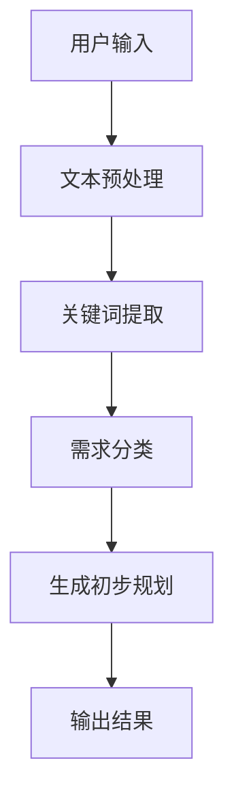

                 


# 智能家族信托规划助手

> 关键词：智能家族信托，人工智能，信托规划，自然语言处理，知识图谱，智能推荐算法

> 摘要：本文详细探讨智能家族信托规划助手的背景、核心概念、算法原理、系统架构、项目实战及最佳实践。通过分析家族信托的传统模式与AI技术的结合，阐述智能助手在提高规划效率、实现个性化定制服务及降低风险方面的重要作用。文章旨在为读者提供从理论到实践的全面指导，帮助用户更好地理解和应用智能家族信托规划技术。

---

## 第一部分：智能家族信托规划助手的背景与核心概念

### 第1章：智能家族信托规划助手的背景介绍

#### 1.1 智能家族信托规划助手的起源与发展

- **家族信托的传统模式**  
  家族信托是一种法律结构，用于管理和分配家族财富，通常涉及资产保护、税务优化和财富传承。然而，传统家族信托的规划过程复杂且耗时，依赖于人工操作，容易出错且效率低下。

- **人工智能技术的兴起与应用**  
  随着人工智能技术的快速发展，AI在金融领域的应用日益广泛。通过自然语言处理、机器学习和知识图谱等技术，AI能够帮助解决传统家族信托规划中的复杂问题。

- **智能家族信托规划助手的诞生背景**  
  智能家族信托规划助手的出现，旨在利用AI技术提升家族信托的规划效率和准确性。通过自动化处理和智能推荐，帮助用户快速制定最优的信托方案。

#### 1.2 智能家族信托规划助手的定义与特点

- **定义**  
  智能家族信托规划助手是一种基于人工智能技术的工具，用于辅助用户规划和管理家族信托。它通过分析用户需求、资产情况和市场数据，生成个性化的信托方案。

- **特点**  
  - **智能化**：利用AI技术实现自动化分析和决策。  
  - **个性化**：根据用户需求定制信托方案。  
  - **高效性**：通过算法优化，显著提高规划效率。

#### 1.3 智能家族信托规划助手的意义与价值

- **提高规划效率**  
  AI技术能够快速处理大量数据，缩短规划时间。  
- **个性化定制服务**  
  通过分析用户的具体需求，提供个性化的信托方案。  
- **降低人为错误风险**  
  AI技术减少了人为判断失误的可能性，提高规划的准确性。

### 第2章：智能家族信托规划助手的核心概念

#### 2.1 家族信托的基本要素

- **信托目的**  
  家族信托的目标通常是财富保值、增值和传承。  
- **信托结构**  
  包括受托人、受益人、信托财产等核心要素。  
- **信托利益分配**  
  根据信托合同，确定受益人利益分配的时间和方式。

#### 2.2 人工智能在家族信托中的应用领域

- **财产评估与风险分析**  
  利用AI技术对信托财产进行评估，识别潜在风险。  
- **投资组合优化**  
  通过算法优化信托资产的投资组合，提高收益。  
- **税务规划与合规性检查**  
  AI技术帮助制定最优的税务规划，确保信托合规。

#### 2.3 智能家族信托助手的功能模块

- **用户需求分析模块**  
  收集和分析用户的需求，生成初步规划方案。  
- **信托方案生成模块**  
  根据分析结果，生成个性化的信托方案。  
- **在线模拟与优化模块**  
  用户可以在线模拟信托方案，并根据反馈进行优化。

#### 2.4 核心概念对比分析

- **传统信托与智能信托的对比**  
  | 特性 | 传统信托 | 智能信托 |
  |------|----------|----------|
  | 效率 | 低效     | 高效     |
  | 个性化 | 有限     | 强化     |
  | 成本 | 高       | 低       |

- **不同AI算法的优劣势对比**  
  | 算法 | 优势       | 劣势       |
  |------|------------|------------|
  | NLP  | 精准理解需求 | 对复杂场景支持有限 |
  | 知识图谱 | 强大的知识关联能力 | 构建和维护成本高 |
  | 推荐算法 | 快速生成推荐方案 | 可能忽略个性化需求 |

- **用户需求与系统输出的映射关系**  
  用户需求（如资产保值、财富传承）通过AI算法映射到信托方案的具体模块（如资产分配、受益人设置）。

### 本章小结  
智能家族信托规划助手通过AI技术实现了传统信托规划的智能化和个性化，显著提升了效率和准确性。

---

## 第二部分：智能家族信托规划助手的算法原理

### 第3章：自然语言处理在智能家族信托中的应用

#### 3.1 自然语言处理简介

- **NLP的基本概念**  
  自然语言处理（NLP）是人工智能的核心技术之一，旨在使计算机能够理解、处理和生成人类语言。  
- **常见的NLP技术**  
  包括文本分割、词干提取、实体识别、情感分析等。

#### 3.2 家族信托需求分析的NLP实现

- **文本预处理**  
  对用户输入的文本进行清洗和分词，提取关键信息。  
- **需求识别与分类**  
  通过NLP技术识别用户的需求类型，如资产保值、财富传承等。

#### 3.3 基于NLP的需求分析流程



- **关键词提取**  
  使用TF-IDF算法提取文本中的关键词，如“资产”、“受益人”等。  
  ```python
  from sklearn.feature_extraction.text import TfidfVectorizer
  vectorizer = TfidfVectorizer()
  tfidf = vectorizer.fit_transform(documents)
  ```

- **需求分类**  
  利用机器学习模型（如SVM或随机森林）对需求进行分类，确定信托类型（如资产保护型、教育基金型）。

#### 3.4 实际案例分析

- **案例背景**  
  用户希望为子女设立教育基金，需要规划信托方案。  
- **NLP应用**  
  通过NLP技术提取关键词“教育基金”，识别需求类型为教育基金信托。  
- **输出结果**  
  生成初步信托方案，包括信托财产分配、受益人设置等。

---

### 第4章：知识图谱在智能家族信托中的构建与应用

#### 4.1 知识图谱的基本概念

- **知识图谱的定义**  
  知识图谱是一种以图结构形式表示知识的数据库，包含实体和关系。  
- **知识图谱的作用**  
  用于表示和推理信托相关知识，支持智能决策。

#### 4.2 家族信托知识图谱的构建

- **数据来源**  
  包括法律文件、市场数据、用户需求等。  
- **构建流程**  
  ```mermaid
  graph TD
  A[数据清洗] --> B[实体识别]
  B --> C[关系抽取]
  C --> D[知识融合]
  D --> E[知识存储]
  ```

- **实体识别**  
  使用NER（命名实体识别）技术识别文本中的实体，如“资产”、“受益人”等。  
- **关系抽取**  
  通过模式匹配或机器学习方法抽取实体间的关系，如“资产属于受益人”。

#### 4.3 知识图谱的应用

- **信托方案优化**  
  基于知识图谱推理，优化信托方案，如调整资产分配比例。  
- **风险识别与预警**  
  通过知识图谱分析潜在风险，如受益人变更风险。

#### 4.4 实际案例分析

- **案例背景**  
  用户希望调整信托方案，优化资产分配。  
- **知识图谱应用**  
  构建信托相关知识图谱，分析现有方案，生成优化建议。

---

## 第三部分：智能家族信托规划助手的系统架构与实现

### 第5章：系统架构设计

#### 5.1 系统功能设计

- **功能模块**  
  包括用户界面、需求分析、信托方案生成、模拟优化等模块。  
- **领域模型设计**  
  ```mermaid
  classDiagram
  class 用户 {
      id: int
      name: string
      需求: string
  }
  class 信托方案 {
      id: int
      方案内容: string
      用户id: int
  }
  用户 --> 信托方案
  ```

#### 5.2 系统架构设计

- **整体架构**  
  ```mermaid
  architectureDiagram
  frontend -- 服务器端
  服务器端 -- 数据库
  服务器端 -- AI服务
  ```

- **服务器端**  
  负责处理用户请求，调用AI服务生成信托方案。  
- **AI服务**  
  提供NLP、知识图谱等AI功能，支持信托方案生成。

#### 5.3 系统接口设计

- **接口定义**  
  ```json
  {
      "接口名称": "generateTrustPlan",
      "输入参数": {
          "userId": int,
          "需求描述": string
      },
      "输出参数": {
          "信托方案id": int,
          "方案内容": string
      }
  }
  ```

#### 5.4 系统交互流程

- **交互流程**  
  ```mermaid
  sequenceDiagram
  用户 --> 前端: 提交需求
  前端 --> 服务器端: 调用generateTrustPlan接口
  服务器端 --> AI服务: 分析需求
  AI服务 --> 服务器端: 返回信托方案
  服务器端 --> 用户: 输出信托方案
  ```

### 第6章：系统实现与测试

#### 6.1 环境安装

- **安装Python环境**  
  使用Anaconda或虚拟环境安装Python 3.8+。  
- **安装依赖库**  
  ```bash
  pip install numpy pandas scikit-learn spacy mermaid
  ```

#### 6.2 核心代码实现

- **NLP处理代码**  
  ```python
  import spacy
  nlp = spacy.load("en_core_web_sm")
  doc = nlp("The user wants to set up a trust for their children's education.")
  for token in doc:
      print(token.text)
  ```

- **知识图谱构建代码**  
  ```python
  from networkx import Graph
  g = Graph()
  g.add_nodes_from(["User", "Trust", "Beneficiary"])
  g.add_edges_from([("User", "Trust"), ("Trust", "Beneficiary")])
  ```

#### 6.3 测试与优化

- **功能测试**  
  测试各功能模块，确保需求分析、方案生成等功能正常运行。  
- **性能优化**  
  优化算法性能，提高处理速度和准确性。

---

## 第四部分：项目实战与案例分析

### 第7章：项目实战

#### 7.1 环境安装与配置

- **安装Python环境**  
  使用Anaconda或虚拟环境安装Python 3.8+。  
- **安装依赖库**  
  ```bash
  pip install numpy pandas scikit-learn spacy mermaid
  ```

#### 7.2 核心代码实现

- **NLP处理代码**  
  ```python
  import spacy
  nlp = spacy.load("en_core_web_sm")
  doc = nlp("The user wants to set up a trust for their children's education.")
  for token in doc:
      print(token.text)
  ```

- **知识图谱构建代码**  
  ```python
  from networkx import Graph
  g = Graph()
  g.add_nodes_from(["User", "Trust", "Beneficiary"])
  g.add_edges_from([("User", "Trust"), ("Trust", "Beneficiary")])
  ```

#### 7.3 实际案例分析

- **案例背景**  
  用户希望为子女设立教育基金，需要规划信托方案。  
- **需求分析**  
  使用NLP技术提取关键词“教育基金”，识别需求类型为教育基金信托。  
- **方案生成**  
  AI生成信托方案，包括信托财产分配、受益人设置等。  
- **模拟优化**  
  用户在线模拟方案，调整资产分配比例，优化信托方案。

### 7.4 项目小结

- **总结经验**  
  AI技术显著提升了信托规划的效率和准确性。  
- **注意事项**  
  在实际应用中，需注意数据隐私和合规性问题。

---

## 第五部分：最佳实践与未来展望

### 第8章：最佳实践

#### 8.1 小结

- **核心内容回顾**  
  本文详细探讨了智能家族信托规划助手的背景、核心概念、算法原理、系统架构及项目实战。  
- **关键点总结**  
  AI技术在信托规划中的应用显著提升了效率和准确性。

#### 8.2 注意事项

- **数据隐私**  
  在处理用户数据时，需严格遵守隐私保护法规。  
- **算法优化**  
  持续优化AI算法，提高准确性和效率。

#### 8.3 未来展望

- **技术进步**  
  随着AI技术的发展，智能家族信托助手将更加智能化和个性化。  
- **应用场景扩展**  
  未来可能扩展至更多领域，如跨国信托、税务优化等。

---

## 结语

智能家族信托规划助手通过人工智能技术的创新应用，显著提升了信托规划的效率和准确性。本文从背景、核心概念、算法原理、系统架构到项目实战，全面探讨了智能家族信托助手的实现与应用。未来，随着技术的进步，智能家族信托助手将在更多领域发挥重要作用，为用户带来更高效、更个性化的服务。

--- 

**End of Article**

