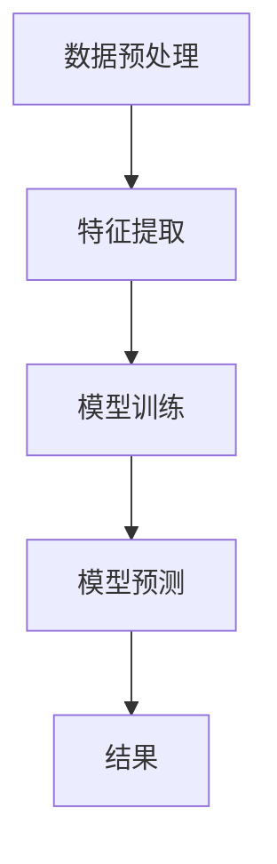

                 


# 智能家族财富传承规划助手

## 关键词
智能家族财富传承，规划助手，人工智能，风险管理，系统架构，Python实现

## 摘要
智能家族财富传承规划助手是一款结合人工智能技术的财富管理工具，旨在通过智能化的算法和系统架构，帮助用户实现家族财富的科学规划与传承。本文从背景、核心概念、算法原理、系统架构、项目实战等多个方面进行详细阐述，结合实际案例和代码示例，为读者提供全面的技术解读。

---

## 第一部分：智能家族财富传承规划助手的背景与概念

### 第1章：智能家族财富传承规划助手的背景介绍

#### 1.1 家族财富传承的定义与重要性
- **1.1.1 家族财富传承的定义**
  家族财富传承是指通过法律、税务、投资等多种手段，将家族资产合理分配给后代或其他受益人，确保财富的持续性和稳定性。

- **1.1.2 家族财富传承的重要性**
  - 确保家族资产的安全性与稳定性。
  - 避免家族内部矛盾，减少财富流失。
  - 实现财富的可持续性发展。

- **1.1.3 家族财富传承的挑战与问题**
  - 财富分配的公平性问题。
  - 税务规划的复杂性。
  - 经济环境的不确定性。

#### 1.2 智能化技术在财富传承中的应用
- **1.2.1 人工智能技术的基本概念**
  人工智能（AI）是指通过计算机模拟人类智能的技术，包括机器学习、自然语言处理、计算机视觉等。

- **1.2.2 智能化技术在财富管理中的优势**
  - 数据分析能力强，能够处理海量数据。
  - 可以实时跟踪市场变化，提供精准的投资建议。
  - 能够通过机器学习模型预测财富传承中的潜在风险。

- **1.2.3 智能家族财富传承规划助手的必要性**
  - 帮助用户制定科学的财富传承计划。
  - 提供个性化的风险管理方案。
  - 实现财富的智能化管理与优化。

#### 1.3 家族财富传承规划助手的核心概念
- **1.3.1 核心概念的定义**
  智能家族财富传承规划助手通过AI技术，结合法律、税务、投资等多方面的知识，为用户提供智能化的财富传承规划方案。

- **1.3.2 核心概念的属性特征**
  - 智能化：通过AI算法实现自动化分析与预测。
  - 个性化：根据用户需求定制财富传承方案。
  - 风险控制：通过模型识别潜在风险并提供解决方案。

- **1.3.3 核心概念的ER实体关系图（使用mermaid）**

```mermaid
erDiagram
    actor 用户
    actor 系统
    actor 数据源
    用户 --> 系统 : 提交需求
    系统 --> 数据源 : 获取数据
    用户 <-- 系统 : 返回结果
```

---

## 第二部分：智能家族财富传承规划助手的核心概念与联系

### 第2章：智能家族财富传承规划助手的核心概念与联系

#### 2.1 核心概念的原理
- **2.1.1 AI技术在财富传承中的应用原理**
  - 数据收集：通过用户输入或外部数据源获取财富相关信息。
  - 数据分析：利用机器学习算法对数据进行建模与分析。
  - 预测与优化：根据分析结果生成财富传承方案。

- **2.1.2 数据分析与预测的原理**
  - 数据预处理：清洗、归一化、特征提取。
  - 模型训练：使用机器学习算法（如线性回归、决策树）进行训练。
  - 预测与优化：基于模型结果生成最优财富传承方案。

- **2.1.3 系统化规划的原理**
  - 系统化规划是指通过系统的方法，将财富传承的各个因素进行综合考虑。
  - 包括法律、税务、投资等多个维度的规划。

#### 2.2 核心概念的属性特征对比表
| 特性         | 传统财富传承 | 智能化财富传承 |
|--------------|--------------|----------------|
| 数据处理方式 | 人工处理     | 自动化处理     |
| 风险控制     | 依赖经验     | 数据驱动       |
| 效率         | 低           | 高             |

#### 2.3 ER实体关系图（使用mermaid）
```mermaid
erDiagram
    用户 {
        <属性>
        用户ID
        用户名称
        用户资产
    }
    财富方案 {
        <属性>
        方案ID
        方案名称
        方案详情
    }
    用户 --> 财富方案 : 提交需求
    财富方案 --> 系统 : 返回结果
```

---

## 第三部分：智能家族财富传承规划助手的算法原理

### 第3章：智能家族财富传承规划助手的算法原理

#### 3.1 算法原理概述
- **3.1.1 算法的基本原理**
  通过机器学习算法对财富传承数据进行建模与分析，生成最优财富传承方案。

- **3.1.2 算法的核心思想**
  - 数据驱动：基于大量数据进行建模与预测。
  - 智能优化：通过算法优化财富传承方案。

- **3.1.3 算法的实现步骤**
  1. 数据预处理。
  2. 特征提取。
  3. 模型训练。
  4. 模型预测。

#### 3.2 算法的数学模型与公式
- **3.2.1 数学模型的建立**
  使用线性回归模型进行财富预测：
  $$ y = \beta_0 + \beta_1x_1 + \beta_2x_2 + \dots + \beta_nx_n $$

- **3.2.2 关键公式推导**
  - 损失函数：$$ L = \sum_{i=1}^{m}(y_i - \hat{y_i})^2 $$
  - 优化目标：最小化损失函数。

- **3.2.3 公式的实际应用**
  例如，使用线性回归模型预测用户的财富增长趋势。

#### 3.3 算法的实现流程（使用mermaid）


---

## 第四部分：智能家族财富传承规划助手的系统分析与架构设计

### 第4章：智能家族财富传承规划助手的系统分析与架构设计

#### 4.1 系统分析
- **4.1.1 问题场景介绍**
  用户需要一个智能化的财富传承规划工具，帮助其制定科学的财富传承方案。

- **4.1.2 项目介绍**
  开发一款基于AI的财富传承规划助手，提供个性化的财富管理服务。

- **4.1.3 系统功能设计（领域模型）**
  ```mermaid
  classDiagram
      class 用户 {
          用户ID
          用户资产
          用户需求
      }
      class 财富方案 {
          方案ID
          方案详情
      }
      用户 --> 财富方案 : 提交需求
  ```

- **4.1.4 系统架构设计（使用mermaid）**
  ```mermaid
  architecture
      客户端 --> 服务端
      服务端 --> 数据库
      服务端 --> AI算法
  ```

- **4.1.5 系统接口设计**
  - 用户接口：提交需求。
  - 系统接口：返回财富传承方案。

- **4.1.6 系统交互设计（使用mermaid）**
  ```mermaid
  sequenceDiagram
      用户 -> 系统 : 提交需求
      系统 -> 数据库 : 查询数据
      数据库 --> 系统 : 返回数据
      系统 -> AI算法 : 进行预测
      AI算法 --> 系统 : 返回结果
      系统 -> 用户 : 返回财富传承方案
  ```

---

## 第五部分：智能家族财富传承规划助手的项目实战

### 第5章：智能家族财富传承规划助手的项目实战

#### 5.1 环境安装
- 安装Python、机器学习库（如scikit-learn）和数据分析库（如Pandas）。

#### 5.2 系统核心实现源代码
```python
# 导入库
from sklearn.linear_model import LinearRegression
import pandas as pd

# 数据加载
data = pd.read_csv('wealth_data.csv')

# 特征提取
X = data[['资产', '收入']]
y = data['财富增长']

# 模型训练
model = LinearRegression()
model.fit(X, y)

# 模型预测
new_data = pd.DataFrame({'资产': [1000000], '收入': [100000]})
prediction = model.predict(new_data)
print(prediction)
```

#### 5.3 代码应用解读与分析
- 数据加载：从CSV文件中加载财富数据。
- 特征提取：选择“资产”和“收入”作为特征变量。
- 模型训练：使用线性回归模型进行训练。
- 模型预测：预测新数据的财富增长。

#### 5.4 实际案例分析
- 案例背景：某用户希望制定财富传承方案。
- 数据分析：通过模型预测用户的财富增长趋势。
- 方案制定：根据模型结果生成财富传承方案。

#### 5.5 项目小结
- 项目实现步骤总结。
- 代码实现的关键点分析。
- 项目的优势与不足。

---

## 第六部分：智能家族财富传承规划助手的最佳实践

### 第6章：智能家族财富传承规划助手的最佳实践

#### 6.1 最佳实践 Tips
- 数据质量是模型准确性的重要保障。
- 定期更新模型，适应市场变化。
- 结合专业财富管理顾问的意见。

#### 6.2 小结
- 本文详细介绍了智能家族财富传承规划助手的背景、核心概念、算法原理、系统架构和项目实战。
- 通过实际案例和代码示例，帮助读者理解如何利用AI技术实现财富传承的智能化管理。

#### 6.3 注意事项
- 数据隐私保护。
- 模型的可解释性。
- 系统的稳定性与安全性。

#### 6.4 拓展阅读
- 推荐相关书籍和论文。
- 提供进一步学习的资源。

---

通过以上内容，读者可以全面了解智能家族财富传承规划助手的技术实现与应用，掌握如何利用AI技术优化财富传承方案。

