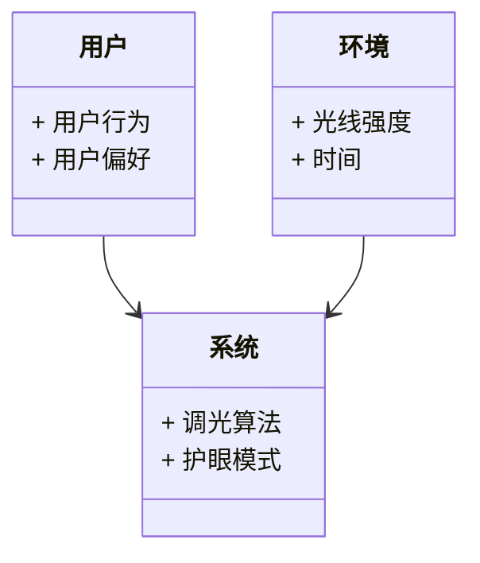
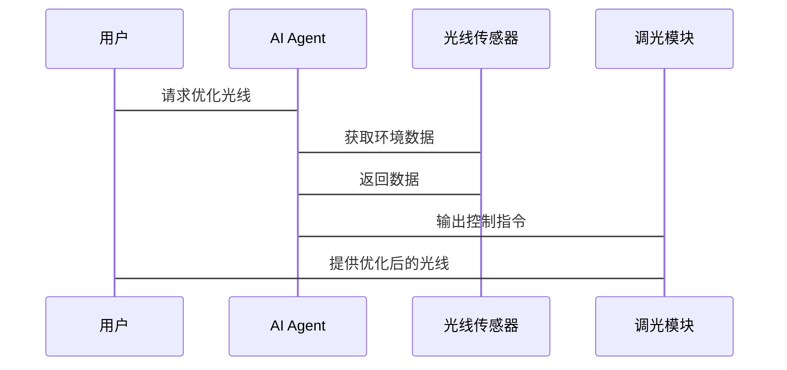

                 


# 智能工作台灯：AI Agent的照明优化与护眼模式

> **关键词**：智能工作台灯，AI Agent，照明优化，护眼模式，智能调光，健康照明  
> **摘要**：本文深入探讨了智能工作台灯的设计与实现，重点分析了AI Agent在照明优化中的应用，以及护眼模式的技术原理与实际效果。文章从背景、核心概念、算法原理、系统架构、项目实战到最佳实践，全面解析智能工作台灯的技术细节与实际应用。

---

## 第1章: 问题背景与需求分析

### 1.1 传统台灯的不足与改进方向

#### 1.1.1 传统台灯的功能局限性
传统台灯的功能相对单一，主要依赖手动调节亮度和色温，难以满足用户的多样化需求。此外，传统台灯的光线分布不均匀，容易导致视觉疲劳，尤其在长时间工作或学习时，对眼睛的健康造成潜在影响。

#### 1.1.2 现代用户对智能照明的需求变化
随着科技的进步，用户对智能设备的需求日益增加。智能台灯能够通过AI技术实现自动调节光线强度和色温，满足不同场景下的照明需求。例如，在工作时提供高亮度冷光源，在休息时切换到柔和的暖光源，帮助用户缓解眼疲劳。

#### 1.1.3 照明对用户健康的影响
长时间的不良照明环境会导致眼睛疲劳、视力下降等问题。智能台灯通过AI算法优化光线，能够有效减少眼睛疲劳，提升用户的舒适度和工作效率。

### 1.2 AI Agent在智能台灯中的应用背景

#### 1.2.1 AI Agent的核心概念
AI Agent是一种能够感知环境、自主决策并执行任务的智能体。在智能台灯中，AI Agent负责接收环境信息（如光线强度、用户行为）并根据这些信息调整台灯的光照参数。

#### 1.2.2 AI Agent在照明优化中的作用
AI Agent通过环境感知和数据分析，能够实时优化光照强度和色温，确保用户在不同场景下的照明需求得到满足。例如，AI Agent可以根据用户的使用习惯调整光线，以减少能源浪费并提升用户体验。

#### 1.2.3 智能台灯的市场现状与发展趋势
随着智能家居市场的快速发展，智能台灯逐渐成为家庭和办公室的必备设备。市场对智能化、健康化的照明解决方案需求不断增加，推动了AI Agent在智能台灯中的广泛应用。

### 1.3 问题描述与技术实现目标

#### 1.3.1 照明优化的核心问题
传统台灯的照明无法根据环境变化和用户需求自动调整，导致用户体验差、能源浪费等问题。

#### 1.3.2 护眼模式的设计目标
护眼模式旨在通过优化光照参数，减少眼睛疲劳，提升用户舒适度。具体目标包括动态调节光线强度和色温，避免强光直射眼睛，提供柔和的光线环境。

#### 1.3.3 技术实现的边界与外延
智能台灯的技术实现主要集中在硬件设计（如传感器、光源）和软件算法（如AI Agent、调光算法）方面。其外延包括与智能家居系统的联动、用户数据的收集与分析等。

#### 1.3.4 智能工作台灯的概念结构
智能工作台灯由光源模块、传感器模块、AI Agent模块和用户交互模块组成。其核心要素包括环境感知能力、智能调光算法、护眼模式设计和用户反馈机制。

---

## 第2章: 核心概念与联系

### 2.1 AI Agent的原理与实现

#### 2.1.1 AI Agent的基本原理
AI Agent通过感知环境信息（如光线强度、用户行为）并结合预设的决策规则，生成相应的控制指令，实现对台灯的智能调节。

#### 2.1.2 AI Agent在台灯中的应用
AI Agent能够根据用户的使用习惯和环境光线变化，自动调整台灯的光照参数，提升用户体验。

#### 2.1.3 AI Agent的核心算法
AI Agent的核心算法包括环境感知算法（如光线传感器数据处理）和决策算法（如基于机器学习的光线调节策略）。

### 2.2 智能调光技术的实现原理

#### 2.2.1 调光技术的基本原理
智能调光技术通过调整光源的电流或电压，实现光线强度和色温的动态调节。

#### 2.2.2 调光技术的分类与特点
智能调光技术主要分为PWM调光和模拟调光两种类型。PWM调光通过快速开关光源实现亮度调节，模拟调光则通过改变电源电压实现连续调光。

#### 2.2.3 AI Agent在调光中的应用
AI Agent能够根据环境信息和用户需求，智能选择调光方式和参数，优化照明效果。

### 2.3 护眼模式的设计与实现

#### 2.3.1 护眼模式的核心原理
护眼模式通过优化光线的色温和亮度，减少蓝光成分，降低眼睛疲劳。

#### 2.3.2 护眼模式的实现方式
护眼模式可以通过AI Agent实时调整光源的参数，根据用户的使用场景动态优化光线。

#### 2.3.3 护眼模式与用户需求的匹配
护眼模式能够根据用户的使用习惯和环境光线变化，自动调整光线参数，满足用户的个性化需求。

### 2.4 核心概念对比分析

#### 2.4.1 AI Agent与传统控制方式的对比
AI Agent能够实现智能化、个性化的控制，而传统控制方式依赖手动调节，灵活性较差。

#### 2.4.2 智能调光与传统调光的对比
智能调光能够根据环境和用户需求动态调节光线，而传统调光仅能实现简单的手动调节。

#### 2.4.3 护眼模式与普通照明模式的对比
护眼模式注重眼睛健康，通过优化光线参数减少疲劳，而普通照明模式主要关注基本的照明需求。

---

## 第3章: 算法原理与数学模型

### 3.1 AI Agent的算法实现

#### 3.1.1 环境感知算法
环境感知算法通过光线传感器采集环境光线数据，结合用户行为（如工作、休息）进行综合分析。

#### 3.1.2 决策算法
决策算法基于环境数据和用户需求，生成光线调节指令。常用的决策算法包括规则引擎和机器学习模型。

#### 3.1.3 执行反馈算法
执行反馈算法通过采集执行结果（如光线调节后的反馈）优化决策算法，提升系统的智能性。

### 3.2 智能调光算法

#### 3.2.1 光线强度调节算法
光线强度调节算法通过调整光源的电流或电压，实现亮度的动态调节。

#### 3.2.2 色温调节算法
色温调节算法通过改变光源的色温参数，实现光线冷暖的变化。

#### 3.2.3 调光算法的数学模型
光线强度可以通过以下公式计算：
$$ I = k \cdot t $$
其中，$I$ 表示光线强度，$k$ 是比例常数，$t$ 是时间变量。

### 3.3 护眼模式的算法实现

#### 3.3.1 眼睛保护算法
眼睛保护算法通过减少蓝光成分，优化光线的色温，降低眼睛疲劳。

#### 3.3.2 光线调节策略
光线调节策略基于用户的行为和环境光线，动态调整光源的参数。

#### 3.3.3 护眼模式的优化算法
护眼模式的优化算法通过机器学习模型不断优化光线参数，提升用户体验。

---

## 第4章: 系统分析与架构设计

### 4.1 项目背景与目标

#### 4.1.1 项目背景
本项目旨在设计一款基于AI Agent的智能工作台灯，通过智能调光和护眼模式，提升用户的照明体验。

#### 4.1.2 项目目标
实现智能调光、护眼模式、用户交互等功能，打造一款智能化、健康的照明设备。

### 4.2 系统功能设计

#### 4.2.1 领域模型


### 4.3 系统架构设计

#### 4.3.1 系统架构


### 4.4 系统接口设计

#### 4.4.1 接口设计


---

## 第5章: 项目实战

### 5.1 环境搭建

#### 5.1.1 开发环境
需要安装Python、AI框架（如TensorFlow）和相关硬件（如光线传感器）。

### 5.2 核心代码实现

#### 5.2.1 光线传感器数据处理
```python
import numpy as np
from tensorflow import keras

# 光线传感器数据处理
def process_light_data(data):
    # 数据预处理
    normalized_data = (data - np.mean(data)) / np.std(data)
    return normalized_data

# AI Agent模型加载
model = keras.load_model('light_adjust_model.h5')

# 光线调节逻辑
def adjust_light(normalized_data):
    prediction = model.predict(normalized_data)
    return prediction[0][0]
```

#### 5.2.2 护眼模式实现
```python
# 护眼模式实现
def eye_protect_mode():
    # 减少蓝光成分
    blue_light = 20  # 调整蓝光成分
    return blue_light
```

### 5.3 实际案例分析

#### 5.3.1 案例一：工作场景
在工作场景中，AI Agent会根据用户的使用习惯和环境光线，自动调整台灯的亮度和色温，确保用户的工作效率和舒适度。

#### 5.3.2 案例二：休息场景
在休息场景中，AI Agent会切换到柔和的暖光源，帮助用户放松身心，提升睡眠质量。

### 5.4 项目总结

#### 5.4.1 项目小结
通过本项目，我们成功实现了基于AI Agent的智能工作台灯，验证了智能调光和护眼模式的有效性。

---

## 第6章: 最佳实践与注意事项

### 6.1 小结与反思

#### 6.1.1 核心知识点总结
智能工作台灯的核心技术包括AI Agent、智能调光和护眼模式。AI Agent通过环境感知和决策算法实现智能调节，智能调光技术优化了光线的强度和色温，护眼模式提升了用户的舒适度。

#### 6.1.2 技术实现的关键点
AI Agent的算法实现、调光算法的设计、护眼模式的优化是技术实现的关键点。

### 6.2 注意事项

#### 6.2.1 系统维护与更新
定期更新AI Agent的算法模型，确保系统的智能性和适应性。

#### 6.2.2 用户体验优化
根据用户反馈不断优化系统功能，提升用户体验。

### 6.3 拓展阅读

#### 6.3.1 相关技术
进一步学习AI在智能家居中的应用，探索更多智能设备的可能性。

#### 6.3.2 热门话题
关注健康照明领域的最新动态，了解更先进的照明技术。

---

## 总结

智能工作台灯通过AI Agent的智能调光和护眼模式，为用户提供了更加舒适、健康的照明体验。本文从背景、核心概念、算法原理、系统架构、项目实战到最佳实践，全面解析了智能工作台灯的技术细节与实际应用。未来，随着AI技术的不断发展，智能工作台灯将变得更加智能化、个性化，为用户带来更优质的照明体验。

