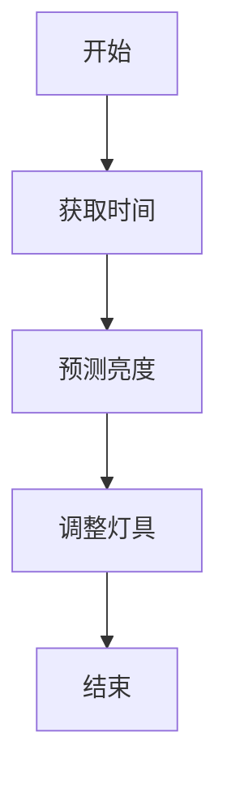
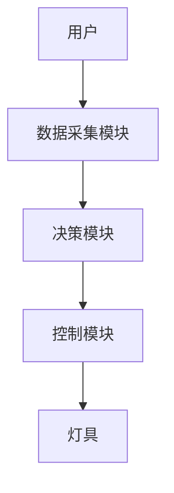

                 


---

# 智能工作灯：AI Agent的照明优化系统

> **关键词：** AI Agent，智能工作灯，照明优化，智能照明，自动化控制

> **摘要：**  
> 本文深入探讨了智能工作灯与AI Agent结合的照明优化系统。通过分析AI Agent在智能照明中的核心作用，详细阐述了系统的算法原理、架构设计、项目实现及实际应用。文章从背景介绍、核心概念、算法实现、系统架构到项目实战，逐步展开，为读者提供了全面的技术解读。通过本文，读者将全面了解AI Agent如何赋能智能工作灯，实现高效、智能的照明优化。

---

# 第一部分: 智能工作灯与AI Agent的背景介绍

---

# 第1章: 智能工作灯与AI Agent概述

## 1.1 智能工作灯的概念与特点

### 1.1.1 智能工作灯的定义

智能工作灯是一种结合了人工智能（AI）技术的照明设备，能够根据环境条件、用户需求和实时数据自动调节光照强度、色温和其他参数，以提供最佳的照明体验。与传统灯具不同，智能工作灯通过AI Agent（智能代理）实现自主决策和优化控制。

### 1.1.2 智能工作灯的核心特点

- **智能化**：基于AI算法，能够感知环境并做出决策。
- **自动化**：无需人工干预，自动调节光照参数。
- **节能高效**：通过优化控制减少能源浪费。
- **个性化**：根据用户需求提供定制化的照明方案。

### 1.1.3 智能工作灯与传统照明的区别

| 特性                | 智能工作灯                | 传统照明                |
|---------------------|--------------------------|-------------------------|
| 控制方式            | 自动化、智能化            | 手动或简单自动化        |
| 能源效率            | 高效节能                | 较低                   |
| 个性化支持          | 支持定制化需求            | 无法满足个性化需求      |
| 数据处理能力        | 强大的数据处理能力        | 无数据处理能力          |

---

## 1.2 AI Agent的基本概念

### 1.2.1 什么是AI Agent

AI Agent（智能代理）是一种能够感知环境、自主决策并执行任务的智能实体。它可以基于传感器数据、用户输入和历史信息，通过机器学习算法优化决策过程。

### 1.2.2 AI Agent的核心功能

- **感知环境**：通过传感器获取光照、温度、湿度等数据。
- **决策与优化**：基于感知数据和目标函数，优化照明参数。
- **执行操作**：通过控制模块调整灯具的光照参数。

### 1.2.3 AI Agent与传统自动化的区别

| 特性                | AI Agent                 | 传统自动化              |
|---------------------|--------------------------|-------------------------|
| 决策方式            | 基于机器学习算法         | 基于预设规则            |
| 灵活性              | 高度灵活，适应变化        | 较低，固定规则          |
| 学习能力            | 具备学习能力              | 无学习能力              |

---

## 1.3 智能工作灯与AI Agent的结合

### 1.3.1 智能工作灯中AI Agent的作用

AI Agent在智能工作灯中主要负责数据采集、决策优化和系统控制。例如，AI Agent可以根据室内光照强度、用户位置和时间信息，动态调整灯具的亮度和色温。

### 1.3.2 AI Agent在照明优化中的应用

- **动态调节**：根据环境光线变化自动调整灯具亮度。
- **节能优化**：通过优化算法减少能源消耗。
- **用户偏好**：基于用户习惯提供个性化照明方案。

### 1.3.3 智能工作灯与AI Agent的系统组成

- **硬件部分**：灯具、传感器（光照、温度、湿度等）、通信模块。
- **软件部分**：AI Agent算法、数据处理模块、用户界面。

---

## 1.4 本章小结

本章介绍了智能工作灯和AI Agent的基本概念，并分析了它们在照明优化中的作用和区别。通过对比分析，读者可以清晰理解AI Agent在智能工作灯中的核心地位。

---

# 第二部分: 智能工作灯与AI Agent的核心概念与联系

---

# 第2章: AI Agent与智能照明的核心概念

## 2.1 AI Agent的核心原理

### 2.1.1 AI Agent的感知与决策机制

AI Agent通过传感器获取环境数据，结合历史数据和用户需求，利用机器学习算法生成最优决策。例如，基于时间序列的光照强度预测算法。

### 2.1.2 AI Agent的学习与优化算法

常用的算法包括监督学习（如线性回归）、无监督学习（如聚类分析）和强化学习（如Q-Learning）。

### 2.1.3 AI Agent的执行与反馈机制

AI Agent根据决策结果执行操作，并通过反馈机制不断优化决策模型。

---

## 2.2 智能照明系统的组成与功能

### 2.2.1 照明系统的硬件组成

- **灯具**：LED灯泡、智能灯泡。
- **传感器**：光照传感器、温度传感器、湿度传感器。
- **通信模块**：Wi-Fi、蓝牙、ZigBee。

### 2.2.2 照明系统的软件架构

- **数据采集层**：采集环境数据。
- **决策层**：AI Agent进行数据分析和决策。
- **控制层**：执行决策并调整灯具参数。

### 2.2.3 照明系统的功能模块

- **数据采集模块**：采集光照、温度等数据。
- **决策模块**：基于数据生成优化方案。
- **控制模块**：调整灯具参数。

---

## 2.3 AI Agent与智能照明的关系

### 2.3.1 AI Agent在智能照明中的角色

AI Agent是智能照明系统的核心，负责数据处理、决策优化和系统控制。

### 2.3.2 AI Agent与智能照明系统的交互流程

1. 传感器采集环境数据。
2. AI Agent接收数据并分析。
3. AI Agent生成优化方案。
4. 控制模块执行决策。

---

## 2.4 核心概念对比分析

### 2.4.1 AI Agent与传统自动化的对比

| 特性                | AI Agent                 | 传统自动化              |
|---------------------|--------------------------|-------------------------|
| 决策方式            | 基于机器学习算法         | 基于预设规则            |
| 灵活性              | 高度灵活，适应变化        | 较低，固定规则          |
| 学习能力            | 具备学习能力              | 无学习能力              |

### 2.4.2 智能照明与传统照明的对比

| 特性                | 智能照明                 | 传统照明                |
|---------------------|--------------------------|-------------------------|
| 控制方式            | 自动化、智能化            | 手动或简单自动化        |
| 能源效率            | 高效节能                | 较低                   |
| 个性化支持          | 支持定制化需求            | 无法满足个性化需求      |

---

## 2.5 本章小结

本章详细分析了AI Agent与智能照明的核心概念，通过对比分析，明确了AI Agent在智能照明系统中的关键作用。

---

# 第三部分: 智能工作灯与AI Agent的算法原理

---

# 第3章: AI Agent的算法原理

## 3.1 AI Agent的核心算法

### 3.1.1 基于规则的AI Agent算法

基于预设规则的简单决策算法，适用于场景简单的情况。

### 3.1.2 基于机器学习的AI Agent算法

通过训练模型实现复杂决策，例如基于神经网络的预测模型。

### 3.1.3 基于强化学习的AI Agent算法

通过奖励机制优化决策策略。

---

## 3.2 算法实现与代码示例

### 3.2.1 基于时间的亮度调整算法

```python
import numpy as np

def predict_brightness(time_of_day):
    # 根据时间预测亮度
    if time_of_day < 6:
        return 100  # 低亮度
    elif 6 <= time_of_day < 12:
        return 200  # 中等亮度
    else:
        return 50   # 高亮度

# 示例调用
print(predict_brightness(8))  # 输出 200
```

---

## 3.3 数学模型与公式

### 3.3.1 亮度预测模型

$$ \text{亮度} = a \times \text{时间} + b $$

其中，$a$ 是斜率，$b$ 是截距。

---

## 3.4 算法流程图



---

## 3.5 本章小结

本章详细介绍了AI Agent的核心算法，包括基于规则的算法、机器学习算法和强化学习算法，并通过代码示例和流程图进行了直观展示。

---

# 第四部分: 智能工作灯与AI Agent的系统分析与架构设计

---

# 第4章: 系统分析与架构设计

## 4.1 项目背景与需求分析

### 4.1.1 项目背景

随着能源危机和环保需求的增加，智能照明系统逐渐成为主流。

### 4.1.2 用户需求

- 用户希望灯具能够自动调节亮度和色温。
- 用户希望系统能够节能高效。

---

## 4.2 系统功能设计

### 4.2.1 功能模块划分

- **数据采集模块**：采集环境数据。
- **决策模块**：生成优化方案。
- **控制模块**：调整灯具参数。

---

## 4.3 系统架构设计

### 4.3.1 分层架构



### 4.3.2 接口设计

- 用户界面：手机APP、网页。
- 传感器接口：I2C、SPI。
- 通信接口：Wi-Fi、蓝牙。

---

## 4.4 系统交互流程图


---

## 4.5 本章小结

本章通过系统分析和架构设计，明确了智能工作灯与AI Agent的系统结构和交互流程。

---

# 第五部分: 智能工作灯与AI Agent的项目实战

---

# 第5章: 项目实战与实现

## 5.1 环境搭建与安装

### 5.1.1 环境要求

- 操作系统：Windows/Mac/Linux
- 开发工具：Python、Jupyter Notebook
- 库依赖：numpy、pandas、scikit-learn

### 5.1.2 安装依赖

```bash
pip install numpy pandas scikit-learn
```

---

## 5.2 核心代码实现

### 5.2.1 数据采集与处理

```python
import pandas as pd

# 示例数据
data = {'时间': [1, 2, 3, 4, 5], '亮度': [100, 150, 200, 180, 120]}
df = pd.DataFrame(data)
print(df)
```

### 5.2.2 AI Agent算法实现

```python
from sklearn.linear_model import LinearRegression

# 训练模型
model = LinearRegression()
model.fit(df[['时间']], df['亮度'])

# 预测
new_data = pd.DataFrame({'时间': [6]})
predicted_brightness = model.predict(new_data)
print(predicted_brightness)
```

---

## 5.3 代码解读与分析

- **数据采集**：从传感器获取光照数据。
- **模型训练**：利用历史数据训练AI Agent的决策模型。
- **预测与调整**：基于模型预测结果调整灯具参数。

---

## 5.4 实际案例分析

### 5.4.1 办公室场景

在办公室场景中，AI Agent可以根据工作时间动态调整亮度，减少能源消耗。

### 5.4.2 家庭场景

在家庭场景中，AI Agent可以根据用户的作息习惯提供个性化的照明方案。

---

## 5.5 项目小结

本章通过实际案例分析和代码实现，展示了AI Agent在智能工作灯中的具体应用。

---

# 第六部分: 智能工作灯与AI Agent的优化与扩展

---

# 第6章: 最佳实践与未来发展

## 6.1 设计原则与优化技巧

- **模块化设计**：便于维护和扩展。
- **数据隐私保护**：确保用户数据安全。
- **系统兼容性**：支持多种通信协议。

---

## 6.2 未来发展方向

- **多模态感知**：结合更多传感器数据。
- **边缘计算**：提升系统的实时性和安全性。
- **用户个性化**：提供更加个性化的照明体验。

---

## 6.3 注意事项

- **数据质量**：确保传感器数据的准确性和实时性。
- **系统稳定性**：避免因网络中断导致系统崩溃。
- **用户隐私**：严格保护用户的隐私数据。

---

## 6.4 拓展阅读

- 推荐阅读《机器学习实战》、《深度学习入门》等书籍。

---

# 结语

智能工作灯与AI Agent的结合为照明系统带来了全新的可能性。通过本文的详细讲解，读者可以深入了解AI Agent在智能照明中的应用，并通过实际案例掌握系统的实现方法。未来，随着技术的进步，智能工作灯将更加智能化、个性化，为人们的生活带来更多的便利。

---

